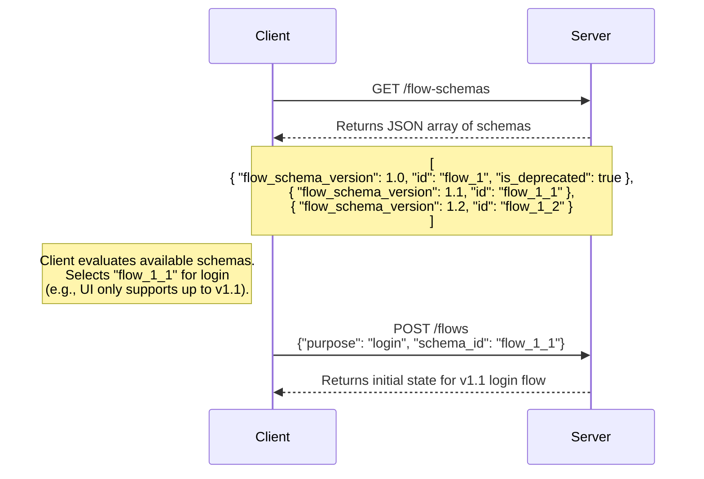

# Client/SDKs + API Version Compatibility
> **Status:** Draft

## Problem Statement
When a Flow Engine dictates which UI components should be rendered, version mismatches often occur: the Flow Engine API might be on a higher version than the Client/SDK can support, or vice versa. Left unhandled, this leads to a poor user experience, such as the UI rendering a blank screen (if the API requests an unknown state) or the API returning unhelpful error messages (if the Client/SDK requests a feature the server doesn’t yet support).

## Proposal - Bidirectional Capability Handshake/Exchange

**Scenario 1: The Client/SDK is at a higher version than the Server.**
In this case, an initial capability handshake reveals the schema versions the server currently supports. This informs the newer Client/SDK to gracefully downgrade and initiate its flow using a version the older server understands.

**Scenario 2: The Server (Flow Engine) is at a higher version than the Client/SDK.**
Here, the server responds to the initial handshake with a list of all supported schema versions alongside their deprecation statuses. This allows the older Client/SDK to select the highest version it is still capable of handling, or alerts it to upgrade if its version is fully deprecated.

**Pros:**
* **Graceful Upgrades:** When the Server expands its capabilities, older Clients/SDKs can handle the mismatch gracefully, preventing breaking changes and forced updates.
* **Graceful Downgrades:** Likewise, when the Server is on an older version than the Client/SDK, the client can downgrade its UI to match the server’s older schema.
* **Clear Deprecation Path:** Sharing deprecation statuses gives Client and SDK teams advance notice and a predictable timeline to upgrade their code.
* **Predictable Flow:** By setting the `schema_id` in the initial request, the Server knows exactly what the client is capable of for the remainder of the session and can route the flow accordingly.

**Cons:**
* **Increased Latency:** The required initial network call to exchange capabilities adds latency before the actual flow can begin.
* **Client-Side Complexity:** The frontend takes on the added computational burden of parsing an array of schemas and evaluating which one to choose.
* **Backend Maintenance:** The backend team incurs technical debt, as they must support older schema versions
* **Security Concerns:** If a schema upgrade fixes a vulnerability or adds a security step (like MFA), deprecated schemas bypass those security measures. 