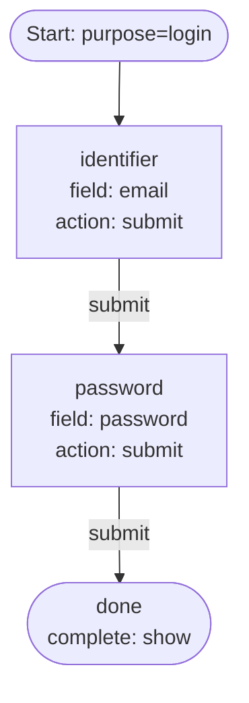

# 01 — Password Login

The minimal login flow. Collect an identifier, then a password, then complete.

## Capabilities exercised

- Single-purpose definition (`login` only — no flip-table coverage required).
- Identifier-shaped field (`email` is `x-unique` in the user schema) drives
  implicit identifier dispatch on submit.
- Password-shaped field (`password` is `x-password`) drives implicit password
  verification on submit.
- Terminal `complete: show` — the frontend renders a success screen and the
  flow handoff token is returned alongside the terminal step.

## Graph

## Walk-through

1. `POST /flow` with `purpose: login` → engine resolves this definition, mints
   an auth attempt, and returns the `identifier` step.
2. The user submits `email`. The engine resolves the identifier against the
   user schema's `x-unique` index. If found, it transitions on `submit` to
   `password`. If not found, the engine emits `user_not_found`; this step does
   not wire that outcome, so the submit fails with an error (the step
   re-renders with `Error` set).
3. The user submits `password`. The engine verifies against the stored
   credential. On success, it transitions to `done` and issues a handoff
   token on the terminal `FlowStepResult`.

## Notes

- No `user_not_found` route means unknown identifiers fail loudly rather than
  routing to a register branch. That is the engine's documented behavior for
  solo-purpose login flows. To route unknown users into a registration
  sub-flow, add `register` as a purpose and wire `user_not_found` — see
  example 05.
- The identifier and password steps are separate, so submitted fields are
  validated in two rounds. Putting both fields on a single step is allowed
  but only useful for `create_user` registration (example 02).
