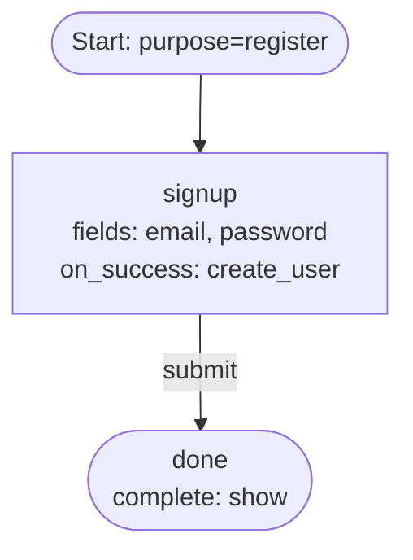

# 02 — Password Register

Single-step password signup with `on_success: create_user`. The user submits
identifier and password together; the engine creates the user row and the
credential atomically, marks the new user as verified on the auth attempt,
then completes.

## Capabilities exercised

- Single-purpose definition (`register` only).
- `on_success: create_user` writer — hashes the password (argon2id), creates
  the user, persists the password credential, then registers the new user on
  the auth attempt so the terminal handoff issues.
- Writer-manifest validation: `create_user`'s manifest is
  `[identifier, password]`; both kinds are collected on this step, so the
  validator accepts the definition.
- Terminal `complete: show`.

## Graph

## Walk-through

1. `POST /flow` with `purpose: register` → engine returns the `signup` step.
2. The user submits `email` and `password`. Field validation runs against the
   user schema (email format, password min length, uniqueness lookup).
3. `on_success: create_user` fires before the transition: user row + password
   credential are written in one transaction; the auth attempt is marked as
   having a registered user.
4. The `submit` transition routes to `done`. The terminal step issues the
   handoff token.

## Notes

- Multi-step password signup (collect identifier on one step, password on the
  next, then `on_success: create_user`) is supported through the
  ancestor-chain manifest pattern — the validator walks reverse adjacency
  from the `on_success` step and accepts identifier collection on any
  upstream step. Example 05 uses this pattern.
- Adding a `user_already_exists` transition is optional here. Without it, a
  duplicate email errors loudly on `email`'s uniqueness check.
