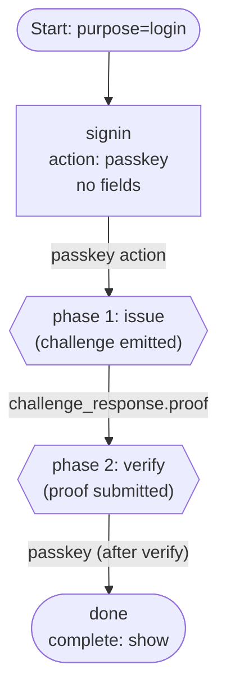

# 03 — Passkey Login (Discoverable)

A single-step passkey login. The user is identified entirely through the
WebAuthn assertion — no identifier is collected up front, so the engine issues
the assertion challenge with an empty `allowCredentials` list and the
authenticator picks a credential it holds for the relying party.

## Capabilities exercised

- Action-driven dispatch: the `passkey` action is engine-handled. Selecting
  it triggers the two-phase ceremony rather than a field-shaped submit.
- **Phase 1 (issue)** — the step re-renders with a `challenge` payload
  (`method`, `challenge_id`, `options`) and the state cookie rotates.
- **Phase 2 (verify)** — the user submits the assertion `proof`. The engine
  verifies via `auth-attempt.SubmitPasskey`, resolves the user from the
  credential, marks the attempt verified, then routes through the `passkey`
  transition.
- Terminal `complete: show`.

## Graph

## Walk-through

1. `POST /flow` with `purpose: login` → engine returns the `signin` step with
   the `passkey` action.
2. The user picks `passkey`. The engine calls
   `auth-attempt.IssuePasskeyChallenge`; the step re-renders with the
   assertion options. `allowCredentials` is empty because no user is
   identified — discoverable credentials only.
3. The browser produces an assertion. The frontend re-submits with
   `challenge_response.{challenge_id, proof, method}`. The engine verifies,
   resolves the user, and transitions on `passkey` to `done`.
4. The terminal step issues the handoff token.

## Notes

- To support **non-discoverable** credentials (passkeys not stored in a
  resident key), add an identifier field on a prior step so the engine can
  populate `allowCredentials` with the resolved user's credential IDs before
  issuing the assertion. Example 06 illustrates this pattern (identifier step
  exposes both `submit` and `passkey` actions).
- RPID is derived per-request from `WithRequestHostMiddleware` so same-origin
  fetches without an `Origin` header still work.
- The state cookie rotates on every step transition, including the issue and
  verify legs of the ceremony.
