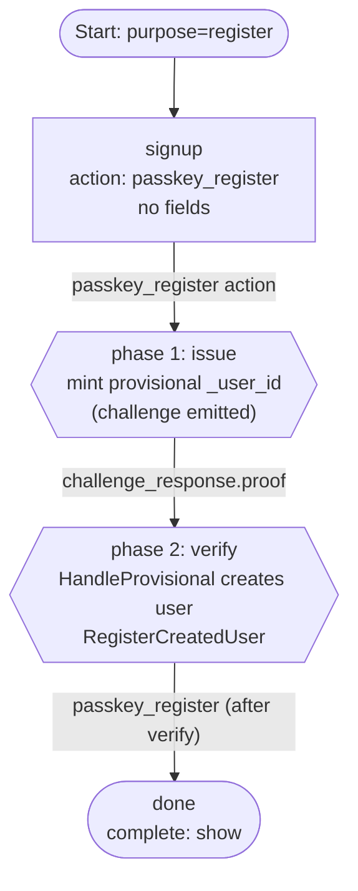

# 04 — Passkey Register (Usernameless)

Usernameless passkey signup. The user is not asked for an email or any other
identifier up front. The engine mints a provisional user ID for the WebAuthn
ceremony and materializes the user row only when the credential is
successfully attested.

## Capabilities exercised

- Action-driven dispatch via the engine-handled `passkey_register` action.
- **Provisional user pattern**:
  - On the issue leg, the engine calls `GenerateUserID()` and stashes the
    result in `CollectedData["_user_id"]`, plus a `_passkey_provisional`
    marker so the verify leg knows to finalize the user.
  - On the verify leg, `HandleProvisional` creates the user row **inside the
    same DB transaction** that persists the credential. If verification
    fails, neither row is written.
  - After verify, `RegisterCreatedUser` marks the user as verified on the
    auth attempt so the terminal handoff issues.
- No `on_success: create_user` is needed — and would not even pass the
  validator, since this step collects no fields, so the
  `[identifier, password]` manifest could not be satisfied.

## Graph

## Walk-through

1. `POST /flow` with `purpose: register` → engine returns the `signup` step
   with the `passkey_register` action.
2. The user picks `passkey_register`. The engine mints a provisional
   `_user_id`, calls `passkey-registration.IssuePasskeyRegistrationChallenge`,
   and the step re-renders with the creation `options`.
3. The browser produces an attestation. The frontend re-submits with
   `challenge_response.{challenge_id, proof, method}`.
4. The engine sees the `_passkey_provisional` marker and calls
   `HandleProvisional` to write the user row, then
   `SubmitPasskeyRegistration` to persist the credential — all within one
   transaction. Finally `RegisterCreatedUser` is called against the auth
   attempt.
5. The `passkey_register` transition routes to `done`; the terminal step
   issues the handoff token.

## Notes

- The WebAuthn `user.id` is the provisional `_user_id`, kept stable across
  phase 1 and phase 2.
- Collecting additional non-identifier profile fields (e.g. `name`) on the
  same step is allowed; they end up in `CollectedData` but their values are
  not used by `HandleProvisional` today — the WebAuthn `username` and
  `displayName` are placeholders pinned to `_user_id` (MVP).
- To require an identifier alongside the passkey (e.g. an email captured for
  notification purposes), collect it on a prior step. The engine then uses
  the resolved `_user_id` (set by identifier dispatch) instead of generating
  a provisional one, and skips `HandleProvisional` on verify.
