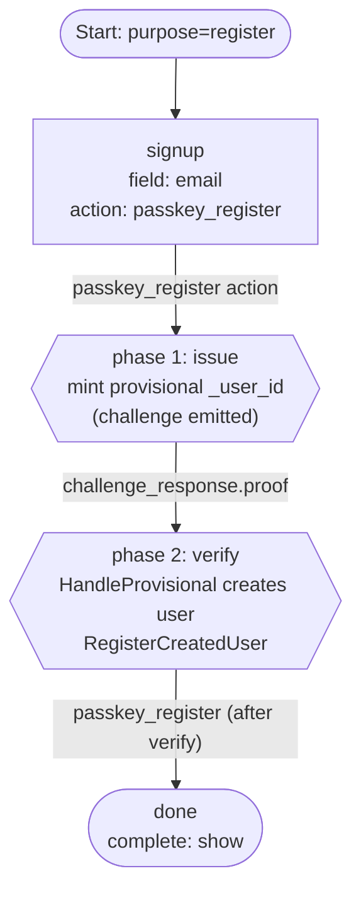

# 04 — Passkey Register

Identifier-first passkey signup. The user submits an email, then the WebAuthn
ceremony runs; the engine creates the user row in the same transaction that
persists the credential.

## Capabilities exercised

- Action-driven dispatch via the engine-handled `passkey_register` action.
- Field validation runs on the submitted `email` (format + uniqueness)
  before the ceremony begins; a duplicate fails loudly on the field rather
  than after challenge issue.
- **Provisional user pattern**:
  - On the issue leg, the engine calls `GenerateUserID()` and stashes the
    result in `CollectedData["_user_id"]`, plus a `_passkey_provisional`
    marker so the verify leg knows to finalize the user.
  - On the verify leg, `HandleProvisional` writes the user row (with `email`
    as the identifier attribute) **inside the same DB transaction** that
    persists the credential. If verification fails, neither row is written.
  - After verify, `RegisterCreatedUser` marks the user as verified on the
    auth attempt so the terminal handoff issues.
- No `on_success: create_user` — its writer manifest is
  `[identifier, password]`, and this flow collects no password. The
  provisional pattern handles user creation instead.

## Graph

## Walk-through

1. `POST /flow` with `purpose: register` → engine returns the `signup` step
   with the `email` field and `passkey_register` action.
2. The user enters `email` and picks `passkey_register`. The engine validates
   `email` against the schema, merges it into collected data, mints a
   provisional `_user_id`, calls
   `passkey-registration.IssuePasskeyRegistrationChallenge`, and re-renders
   the step with the creation `options`.
3. The browser produces an attestation. The frontend re-submits with
   `challenge_response.{challenge_id, proof, method}`.
4. The engine sees the `_passkey_provisional` marker and calls
   `HandleProvisional` to write the user row (with `email` as the identifier
   attribute), then `SubmitPasskeyRegistration` to persist the credential —
   all within one transaction. Finally `RegisterCreatedUser` is called against
   the auth attempt.
5. The `passkey_register` transition routes to `done`; the terminal step
   issues the handoff token.

## Notes

- The `passkey_register` action short-circuits the field-shaped identifier
  dispatch — `user_not_found` is not emitted on submit, so a register-only
  flow does not need to wire it. Field validation (format, uniqueness) still
  runs on the email before the ceremony begins.
- The WebAuthn `user.id` is the provisional `_user_id`, kept stable across
  phase 1 and phase 2.
