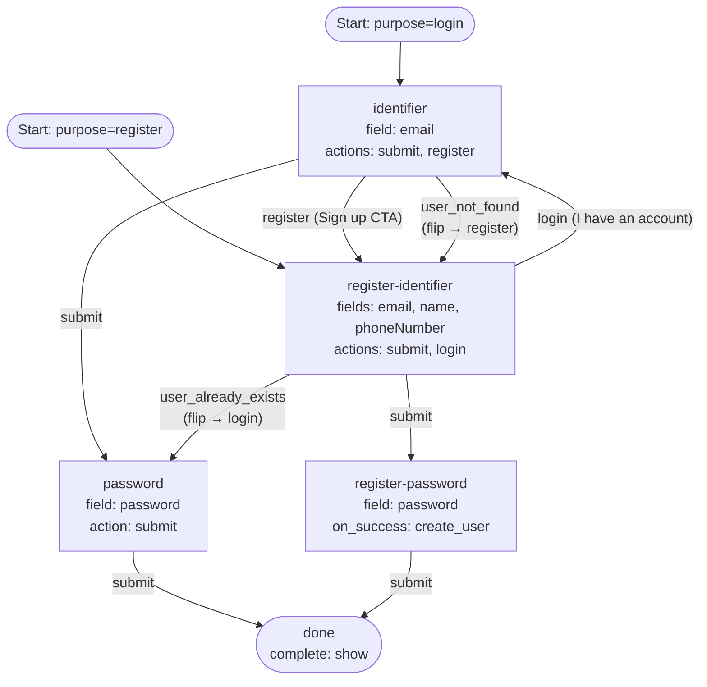

# 05 — Combined Login + Register (Password)

A single definition that serves both `login` and `register` purposes. The
login and register entry steps look superficially "duplicated" — both collect
an email — but they're distinct steps with distinct field sets, distinct
actions, and distinct downstream behavior. The flip outcomes
(`user_not_found` / `user_already_exists`) bridge the two sub-flows when a
user enters via the wrong purpose; explicit navigation CTAs (`register` /
`login`) let users hop sub-flows by intent.

## Capabilities exercised

- **Multi-purpose definition.** `purposes` maps `login` and `register` to
  distinct entry steps in the same definition.
- **Flip-table coverage.** Because both purposes are served, the validator
  requires:
  - Login entry (`identifier`) to wire `user_not_found`.
  - Register entry (`register-identifier`) to wire `user_already_exists`.
- **Purpose flip.** When the engine emits one of these outcomes, it flips
  `state.CurrentPurpose` so dispatch on subsequent steps follows the other
  sub-flow's semantics (password verify vs. password create).
- **Navigation CTAs.** `identifier` exposes a `register` action that routes
  directly to `register-identifier`; `register-identifier` exposes a `login`
  action that routes to `identifier`. These are plain step transitions —
  `register` and `login` are not reserved outcomes, just action names. They
  let a user pick a sub-flow without first typing an email and triggering a
  flip.
- **Profile field collection.** `register-identifier` collects
  `email + name + phoneNumber`; the `create_user` writer persists every
  non-password attribute from `state.CollectedData` onto the new user
  (the `create_user` on-success handling in `internal/domain/flow_on_success.go`), so `name` and `phoneNumber` land on
  the user record even though they're collected one step before the writer
  fires.
- **Ancestor-chain `create_user` manifest.** `register-password` declares
  `on_success: create_user` but only collects `password`. The manifest
  `[identifier, password]` is satisfied because `register-identifier` (an
  ancestor in the transition graph) collects `email`. The validator walks
  reverse adjacency to confirm this.

## Step differences

The four non-terminal steps look like two login/register pairs. The actual
distinctions:

| Step | Fields | Primary CTA target | Why it's distinct |
|---|---|---|---|
| `identifier` | `email` | `password` (verify) | Resolves an existing identity. |
| `register-identifier` | `email`, `name`, `phoneNumber` | `register-password` (create) | Collects new user profile data. |
| `password` | `password` | `done` | Implicit password verify against the resolved user. |
| `register-password` | `password` | `done` (via `on_success: create_user`) | Hashes + creates the user, persists every upstream attribute. |

## Graph

## Walk-through

### Path A — known user logs in
1. `POST /flow` with `purpose: login` → `identifier` step.
2. Submit `email`. Engine resolves the user, transitions to `password`.
3. Submit `password`. Engine verifies, transitions to `done`, issues handoff.

### Path B — explicit "Sign up" from login entry
1. Same start. User clicks `register` without typing an email.
2. Field validation passes (`Validate` iterates submitted values; empty input
   is empty iteration). Identifier dispatch is skipped (no value to dispatch).
   The action's transition fires → `register-identifier`.
3. User fills email + name + phoneNumber, submits → `register-password`.
4. Submit password. `on_success: create_user` writes the user with every
   collected attribute, transitions to `done`.

### Path C — unknown user routed via flip
1. Login entry. Submit an unknown `email`.
2. Engine emits `user_not_found`, flips `CurrentPurpose` to `register`, routes
   to `register-identifier`. The email is pre-filled from `CollectedData`.
3. User fills the remaining profile fields and continues as Path B.

### Path D — known user starts register, gets routed to login
1. `POST /flow` with `purpose: register` → `register-identifier` step.
2. Submit an `email` that exists. Engine emits `user_already_exists`, flips
   to `login`, routes to `password`.
3. User enters their existing password and completes.

## Notes

- **Action override edge case.** Identifier dispatch runs *before* the action's
  transition resolves (action-kind routing in `internal/domain/flow_state_machine.go`). If a user types an
  email *and* clicks `register`, dispatch runs first; in login mode, finding
  the user resolves it and the `register` action still fires (no flip), so
  the flow routes to `register-identifier` with `_user_id` already pinned —
  and a follow-up `register-password` submit will fail with a
  `user_already_exists` step error from `create_user`. In practice users
  click navigation CTAs *before* typing; if you author this pattern, surface
  the CTAs visibly so the click-then-type case stays rare.
- The "ancestor-chain" manifest pattern unlocks multi-step register flows
  with password credentials. The validator pass that enforces it is
  `validateOnSuccessManifests`.
- The flip table is `purposeFlipTargets` in the validator. It mirrors the
  engine's runtime flip behavior.
- Both terminal paths feed the same `done` step. Multiple terminal nodes are
  also fine; the engine doesn't care about layout, only that every
  non-terminal step has a path to one.
