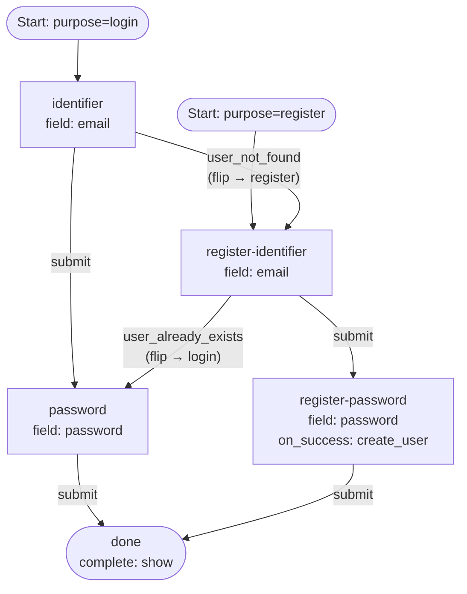

# 05 — Combined Login + Register (Password)

A single definition that serves both `login` and `register` purposes, with
the engine routing between sub-flows on identifier outcomes. No passkey paths
(see example 06 for that).

## Capabilities exercised

- **Multi-purpose definition.** `purposes` maps `login` and `register` to
  distinct entry steps in the same definition.
- **Flip-table coverage.** Because both purposes are served, the validator
  requires:
  - Login entry (`identifier`) to wire `user_not_found`.
  - Register entry (`register-identifier`) to wire `user_already_exists`.
- **Purpose flip.** When the engine emits one of these outcomes, it flips
  `state.CurrentPurpose` so dispatch on subsequent steps follows the other
  sub-flow's semantics (e.g. password verify vs. password create).
- **Ancestor-chain `create_user` manifest.** `register-password` declares
  `on_success: create_user` but only collects `password`. The manifest
  `[identifier, password]` is still satisfied because `register-identifier`
  (an ancestor in the transition graph) collects `email`. The validator walks
  reverse adjacency to confirm this.

## Graph

## Walk-through

### Path A — known user logs in
1. `POST /flow` with `purpose: login` → `identifier` step.
2. Submit `email`. Engine resolves the user, transitions to `password`.
3. Submit `password`. Engine verifies, transitions to `done`, issues handoff.

### Path B — new user enters via login, gets routed to register
1. Same start. Submit an unknown `email` on `identifier`.
2. Engine emits `user_not_found`, flips `CurrentPurpose` to `register`, routes
   to `register-identifier`.
3. The frontend re-renders the register entry. The user submits an `email`
   (the same one or a different one).
4. If new → routes to `register-password`. Submit `password` → `on_success:
   create_user` writes user + credential, transitions to `done`.

### Path C — user starts register but already has an account
1. `POST /flow` with `purpose: register` → `register-identifier` step.
2. Submit an `email` that exists. Engine emits `user_already_exists`, flips
   `CurrentPurpose` to `login`, routes to `password`.
3. The user enters their existing password. Engine verifies, transitions to
   `done`.

## Notes

- The "ancestor-chain" manifest pattern unlocks multi-step register flows
  with password credentials. The validator pass that enforces it is
  `validateOnSuccessManifests` — it traverses reverse adjacency from each
  `on_success` step and asserts every required `FlowFieldChallenge` is
  collected on some reachable ancestor.
- The flip table is `purposeFlipTargets` in the validator. It mirrors the
  engine's runtime flip behavior and is the source of truth for which
  outcomes a multi-purpose entry step must wire.
- Both terminal paths feed the same `done` step. Multiple terminal nodes are
  also fine; the engine doesn't care about layout, only that every
  non-terminal step has a path to one.
