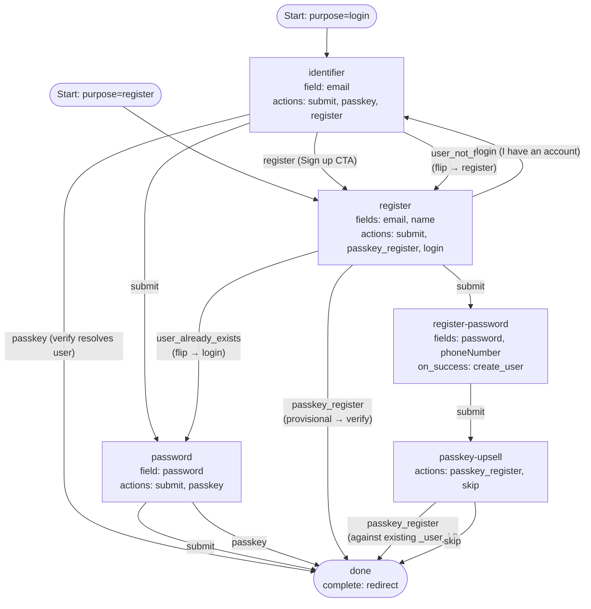

# 06 — Combined Password + Passkey + Upsell

Combined login + register with both password and passkey methods on both
purposes, plus a post-signup passkey upsell and a terminal `redirect` for
OIDC-style hand-back. Mirrors the server's embedded default flow
(`packages/config/defaults/default-login.json`) with a redirect terminal in
place of `show`, additional user-schema fields on the register branch, and
explicit navigation CTAs between sub-flows.

This is the most feature-rich example *today*; as new methods land (OTP,
magic-link, SSO, …) they will live in their own examples rather than getting
folded in here.

## Capabilities exercised

- Everything in examples 01–05, plus:
- **Allow-list passkey login.** The `identifier` step exposes both `submit`
  (password path) and `passkey` (passkey path). When the user picks
  `passkey` after the engine has already resolved the user via identifier
  dispatch, `IssuePasskeyChallenge` populates `allowCredentials` with the
  resolved user's credential IDs — non-discoverable passkeys work.
- **Mid-step passkey login.** The `password` step *also* exposes the
  `passkey` action. A user who reached the password step can still pivot to
  a passkey assertion without going back.
- **Branching register entry.** The `register` step offers a password branch
  (`submit` → `register-password` with `on_success: create_user`), a passkey
  branch (`passkey_register` → `done`, with provisional-user finalization on
  verify), and a navigation CTA (`login` → `identifier`).
- **Navigation CTAs.** `identifier` adds `register`, `register` adds `login`.
  Plain step transitions — neither is a reserved outcome — that let users hop
  sub-flows by intent rather than via the flip table.
- **Profile field collection on the password branch.** `register` collects
  `email + name`; `register-password` collects `password + phoneNumber`. The
  `create_user` writer iterates `state.CollectedData` and persists every
  non-password attribute (the `create_user` on-success handling in `internal/domain/flow_on_success.go`), so the new
  user record carries `email`, `name`, and `phoneNumber`.
- **Passkey upsell after password signup.** Once `create_user` runs on
  `register-password`, the user is identified. The `passkey-upsell` step
  invites them to enroll a passkey against the **existing** `_user_id` —
  `_passkey_provisional` is *not* set, so the verify leg skips
  `HandleProvisional` and `RegisterCreatedUser`. `skip` is a plain transition
  action that just routes through.
- **Terminal `redirect`.** The frontend navigates to `redirect_uri` after
  consuming the handoff token. (`redirect_uri` is captured at `Start` from
  the create-flow request; the OIDC handshake itself is out of scope.)

## Step differences

The two entry steps (`identifier`, `register`) look like duplicates. The
actual distinctions:

| Step | Fields | Primary CTA target | Secondary actions | Why it's distinct |
|---|---|---|---|---|
| `identifier` | `email` | `password` (verify) | `passkey`, `register` | Resolves an existing identity; offers discoverable-by-allow-list passkey login on the same step. |
| `register` | `email`, `name` | `register-password` (create) | `passkey_register`, `login` | Collects new user profile data; offers usernameless-ish passkey registration as a parallel branch. |
| `password` | `password` | `done` (verify) | `passkey` | Implicit password verify against the resolved user. |
| `register-password` | `password`, `phoneNumber` | `done` (via `on_success: create_user`) | — | Hashes + creates the user, persists every upstream attribute. |

## Graph

## Walk-through highlights

- **Allow-list passkey from `identifier`.** Submitting `email` triggers
  identifier dispatch *before* the action handler runs. By the time
  `processPasskey` issues the challenge, the user is resolved and
  `allowCredentials` is populated.
- **Discoverable passkey from `identifier` with no email.** Not supported by
  this definition because identifier dispatch runs first on a step with an
  identifier field. For discoverable, model passkey on its own step (example
  03) or as a sibling step without an identifier field.
- **Passkey upsell skip.** `skip` has no engine semantics — it's just an
  action name with a `done` target. The terminal step still issues the
  handoff because the user was registered on the attempt by
  `register-password`'s `on_success`.

## Notes

- **`HandleProvisional` only persists the identifier.** The passkey-register
  path (`register: passkey_register → done`) finalizes the user via
  `HandleProvisional`, which writes *only* the identifier attribute
  (the `create_user` on-success handling in `internal/domain/flow_on_success.go`). Any non-identifier fields
  collected on `register` — `name` here — are silently dropped on this path.
  The password path goes through `Handle`, which persists everything. If you
  need profile data on the passkey path, collect it post-handoff or extend
  `HandleProvisional`.
- **Action override edge case.** Identifier dispatch runs *before* the
  action's transition resolves (action-kind routing in `internal/domain/flow_state_machine.go`). If a user
  types an email *and* clicks `register`, dispatch in login mode resolves the
  user and the `register` action still fires (no flip), routing to `register`
  with `_user_id` pinned — a follow-up `register-password` submit then fails
  with a `user_already_exists` step error from `create_user`. In practice
  users click navigation CTAs *before* typing.
- The default project flow embedded in the server
  (`packages/config/defaults/default-login.json`) is similar but with
  `complete: show`, no profile fields, and no navigation CTAs.
- For a redirect-terminal flow to actually navigate, the caller must supply
  `redirect_uri` on `POST /flow`. Without it, the terminal step still
  classifies as `redirect`, but the frontend has nowhere to send the user.
