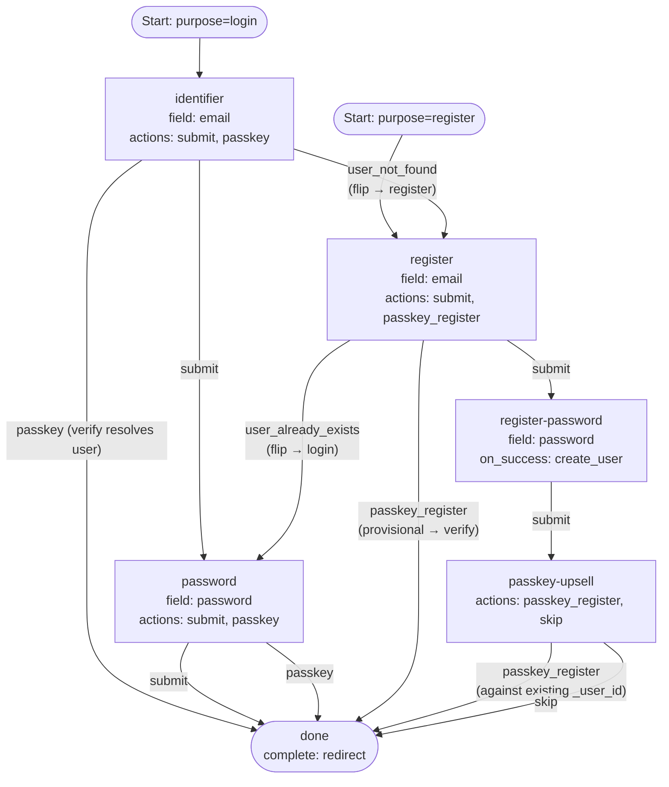

# 06 — Combined Password + Passkey + Upsell

Combined login + register with both password and passkey methods on both
purposes, plus a post-signup passkey upsell and a terminal `redirect` for
OIDC-style hand-back. Mirrors the shipped `default-login-flow-definition.json`
with a redirect terminal in place of `show`.

This is the most feature-rich example *today*; as new methods land (OTP,
magic-link, SSO, …) they will live in their own examples rather than getting
folded in here.

## Capabilities exercised

- Everything in examples 01–05, plus:
- **Allow-list passkey login.** The `identifier` step exposes both `submit`
  (password path) and `passkey` (passkey path). When the user picks
  `passkey` after the engine has already resolved the user via identifier
  dispatch, `IssuePasskeyChallenge` populates `allowCredentials` with the
  resolved user's credential IDs — non-discoverable passkeys work.
- **Mid-step passkey login.** The `password` step *also* exposes the
  `passkey` action. A user who reached the password step can still pivot to
  a passkey assertion without going back.
- **Branching register entry.** The `register` step offers both a password
  branch (`submit` → `register-password` with `on_success: create_user`) and
  a passkey branch (`passkey_register` → `done`, with provisional-user
  finalization on verify).
- **Passkey upsell after password signup.** Once `create_user` runs on
  `register-password`, the user is identified. The `passkey-upsell` step then
  invites them to enroll a passkey against the **existing** `_user_id` —
  `_passkey_provisional` is *not* set, so the verify leg skips
  `HandleProvisional` and `RegisterCreatedUser` (the user is already
  registered on the attempt). `skip` is a plain transition action that just
  routes through.
- **Terminal `redirect`.** The frontend navigates to `redirect_uri` after
  consuming the handoff token. (`redirect_uri` is captured at `Start` from
  the create-flow request; the OIDC handshake itself is out of scope.)

## Graph

## Walk-through highlights

- **Allow-list passkey from `identifier`.** Submitting `email` triggers
  identifier dispatch *before* the action handler runs. By the time
  `processPasskey` issues the challenge, the user is resolved and
  `allowCredentials` is populated.
- **Discoverable passkey from `identifier` with no email.** Not supported by
  this definition because identifier dispatch runs first on a step with an
  identifier field. For discoverable, model passkey on its own step (example
  03) or as a sibling step without an identifier field.
- **Passkey upsell skip.** `skip` has no engine semantics — it's just an
  action name with a `done` target. The terminal step still issues the
  handoff because the user was registered on the attempt by
  `register-password`'s `on_success`.

## Notes

- The default project flow embedded in the server
  (`default-login-flow-definition.json`) is nearly this definition but with
  `complete: show` and a `register-password` step that also wires
  `user_already_exists` → `password`. The extra wire is defensive; the
  engine never emits `user_already_exists` on `register-password` because no
  identifier field is collected there.
- For a redirect-terminal flow to actually navigate, the caller must supply
  `redirect_uri` on `POST /flow`. Without it, the terminal step still
  classifies as `redirect`, but the frontend has nowhere to send the user.
