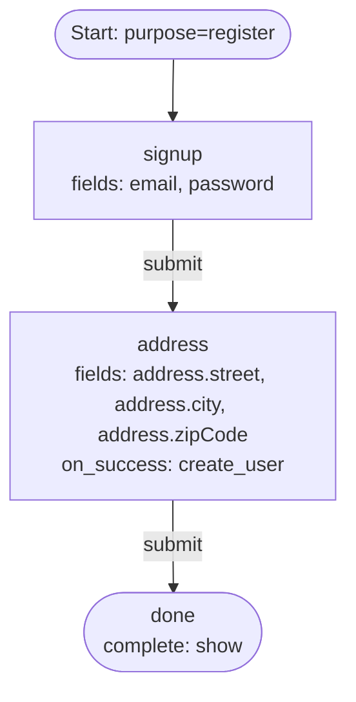

# 07 — Nested Profile Fields

Two-step signup that collects an object-typed schema property one leaf at a
time. Credentials land on the first step, the `address` leaves on the second,
and `on_success: create_user` writes the whole document at the end.

## Capabilities exercised

- **Nested properties by dotted path.** `address.street` addresses the `street`
  property of the object-typed `address` property. The engine walks one
  `properties` level per segment.
- Ancestor-chain manifest: `create_user`'s manifest is `[identifier, password]`
  and both are collected on `signup`, an upstream step, so the validator accepts
  the writer on `address`.
- Terminal `complete: show`.

## Graph



## Walk-through

1. `POST /flow` with `purpose: register` → engine returns the `signup` step.
2. The user submits `email` and `password`.
3. The `address` step renders **three ordinary text inputs**, named
   `address.street`, `address.city`, and `address.zipCode`. A nested leaf is a
   scalar, so it needs no new field type — the dotted name is the only
   difference.
4. The client submits them flat, keyed by those same names. The engine merges
   them into a nested document:

   ```json
   { "email": "…", "address": { "street": "…", "city": "…", "zipCode": "…" } }
   ```

5. `on_success: create_user` validates that document against the user schema —
   including `address`'s own `properties` — then stores one attribute per leaf,
   keyed `address.street`, `address.city`, `address.zipCode`. Reading the user
   back returns `address` as a nested object.

## Notes

- **The field path and the attribute key are the same string.** That is the
  point of the dotted spelling: a step's `fields` entry, the wire field `name`,
  the submitted key, and the stored attribute key never diverge.
- **A field's `required` flag is conjunctive over the chain.** A leaf is marked
  required only when every object above it is required too. `address` is
  optional at the root of the example schema, so all three inputs render
  optional.
- **Collecting into an optional object still brings its own `required` into
  force.** The object appears in the submitted document only because a step
  collected something beneath it, and from there the document has to satisfy
  the rest of its `required` list. `address` lists `street` and `city`, so this
  definition has to collect both: dropping `address.street` is rejected when the
  definition is saved, with `required fields [address.street] in user schema are
  missing in the flow definition steps`. A step collecting nothing under
  `address` is fine — the object never materializes, so it demands nothing.
- **Requiring `address` at the root demands its leaves unconditionally.**
  `address.street` and `address.city` then have to be collected whether or not
  any step touches the object, because the document cannot omit `address` at
  all.
- **Name a leaf, never the object.** `"fields": ["address"]` is rejected when
  the definition is saved: an object has no field-shaped input. The same holds
  for an array-typed property.
- A nested leaf may carry `x-unique`, which makes it an identifier field and
  contributes the `user_not_found` / `user_already_exists` outcomes exactly as a
  top-level one would. This example keeps its leaves plain so the graph stays
  about nesting.
