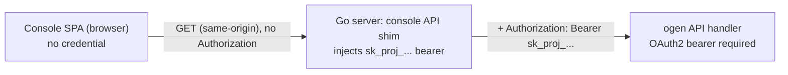

# Console ADR 0002: API access and auth interceptors

> **Status:** Accepted
> **Date:** 2026-06-29 (accepted 2026-06-30)
> **Scope:** `apps/console` only. See [`apps/console/AGENTS.md`](../../AGENTS.md).
> **Context:** Console shell layout, navigation, and resource list pages
> (issue [#440](https://github.com/zitadel/nextgen/issues/440)).

## Context

The console needs to call the Zitadel API to render its resource pages
(users, sessions, flow definitions, …). Issue #440's task 3 sketches this as:

> Create a typed API client (`src/api/client.ts`) that reads the project
> secret from config/env and attaches `Authorization: Bearer <projectSecret>`
> to requests.

There are two problems with implementing that literally.

### Problem 1 — the only credential today is a project secret, and it must not reach the browser

The API authenticates **every** request with an OAuth2 bearer that is the
project secret (labelled `sk_proj_...` when minted). See
[`internal/api/security.go`](../../../../internal/api/security.go): the
security handler passes the bearer to the token verifier, which decrypts it
and yields the project id. There is **no console-user session** yet — #440
lists console authentication, RBAC, and a user menu as explicit non-goals.

Putting that secret in the browser bundle (env-inlined at build time, or
fetched into client memory) directly violates
[root ADR 005: Public Runtime and Private Credentials](../../../../docs/adrs/005-public-runtime-private-credentials.md),
which states the browser receives only public runtime metadata and that
secrets stay in the CLI, server, or a secret store. A project secret is a
project-wide credential; shipping it to every console visitor is the exact
failure mode ADR 005 exists to prevent.

The console is served **same-origin** with the API: the Go mux in
[`cmd/server/server.go`](../../../../cmd/server/server.go) `buildHTTPMux`
mounts the static console SPA under its configured deployment prefix and the
API handler at `/` on the same server. That co-location is what makes a
server-side solution cheap.

### Problem 2 — `src/api/client.ts` would re-implement an interceptor we already have

The generated `@zitadel/api` package already centralizes exactly the concerns
#440 wants a client for:

- [`packages/api/src/runtime/fetch.ts`](../../../../packages/api/src/runtime/fetch.ts)
  `customFetch` is the single request interceptor: it attaches the bearer
  token, parses the body, and throws a typed `ApiError` (carrying `status`,
  `url`, and the parsed error envelope) on any non-2xx.
- [`packages/api/src/runtime/config.ts`](../../../../packages/api/src/runtime/config.ts)
  `configureZitadel()` / `getApi()` is the write-once configuration + typed
  client factory described in
  [root ADR 016: Global SDK Configuration](../../../../docs/adrs/016-global-api-initializer.md).

A hand-rolled `src/api/client.ts` would duplicate the fetch/error/auth layer
the SDK already owns, and drift from the generated request/response types.

## Decision

### 1. Server-side proxy: the console holds no credential

The console **never** holds or sends the project secret. It issues
same-origin API requests; a thin server-side step on the Go server attaches
the project-secret bearer before the request reaches the API handler. The
browser bundle contains no `sk_proj_...` value, upholding
[ADR 005](../../../../docs/adrs/005-public-runtime-private-credentials.md).



The console's contract is therefore: **call the API at a same-origin base path
with no `Authorization` header, and assume the platform authenticates the
request.** This mirrors how the browser auth flow already works elsewhere —
components authenticated by the platform send no client token (see the
`createApi` / no-token path in
[`packages/api/src/runtime/api-factory.ts`](../../../../packages/api/src/runtime/api-factory.ts)).

The Go-side injection (a middleware/proxy step in `buildHTTPMux`, or a
dedicated console API mount) is a **referenced dependency, owned by a
follow-up server change**, not by this console-scoped ADR. What this ADR fixes
is that the console assumes it and never embeds the secret itself.

### 2. Reuse `configureZitadel()` + `getApi()`, not a bespoke `src/api/client.ts`

The console configures the SDK once at startup and derives the typed client,
instead of writing its own fetch wrapper:

```ts
// src/api/zitadel.ts — imported once
import { configureZitadel, getApi } from "@zitadel/api/config";

const project = configureZitadel({
  proxyPath: import.meta.env.VITE_CONSOLE_API_BASE ?? "/api", // same-origin API base
  projectId: import.meta.env.VITE_CONSOLE_PROJECT_ID ?? "",
});

export const api = getApi(project);
```

Route loaders ([Console ADR 0001](0001-console-routing.md)) call `api.*`
methods. This keeps the console on the generated request/response types and on
the shared `customFetch` interceptor — no parallel client to maintain.

The "client" #440 asks for is this `getApi(project)` handle, not a new
`src/api/client.ts` re-implementation.

### 3. Interceptor responsibilities, scoped to today

The single interceptor is the SDK's `customFetch`. For the console its
responsibilities are deliberately narrow:

- **Base-URL binding** — requests target the same-origin proxy base
  (`getApi` binds it; no per-call URLs).
- **No client token** — the console sets no bearer; `customFetch` leaves the
  `Authorization` header alone when no token is configured, and the
  server-side shim supplies it.
- **Error mapping** — non-2xx throws `ApiError`; loaders let it propagate to
  the route `errorComponent`. `ApiError.status` drives status-specific copy
  (e.g. a `401`/`403` "you don't have access" surface once auth lands).

The console does **not** add token storage, refresh, or retry logic now —
there is no console-user credential to manage yet.

### 4. Dev story keeps the same shape as production

In production the console and API are same-origin, so a relative API base
(`/api` by default) reaches the console API shim, which injects the secret
before the ogen handler. In dev the console runs on `:5174` (Vite) and the
API on `:8080`; to keep request shape identical the console talks to a
**same-origin `/api` path that the Vite dev server proxies** to the Go
server, rather than calling the API host directly with a browser-held token:

```ts
// vite.config.mts (dev only) — illustrative
server: {
  proxy: {
    // Vite proxy injects the project-secret bearer, then forwards to the Go API
    "/api": { target: "http://localhost:8080", changeOrigin: true },
  },
},
```

So dev and prod differ only in *where* the proxy lives (Vite dev server vs Go
shim), never in whether the browser holds a secret — it never does. The
default API base is `/api` (overridable via `VITE_CONSOLE_API_BASE`); the rule
is fixed: **same-origin, no browser-held credential, in every environment.**

### 5. Forward-looking slot for console-user auth

When console-user authentication arrives (a separate issue), it slots into
this interceptor without re-architecting it:

- A console-user **session cookie** rides along automatically on the
  same-origin requests; the server-side shim can exchange/augment it. No
  console code change needed for the cookie to flow.
- If a per-user **token** is ever needed client-side, it is set through the
  SDK's existing token mechanism (the `token` option on the client factory in
  [`api-factory.ts`](../../../../packages/api/src/runtime/api-factory.ts)),
  which `customFetch` already reads — still no bespoke client.
- The `401`/`403` handling from §3 becomes the "redirect to console login"
  trigger.

The point of recording this now is that #440 can ship with zero console auth
while guaranteeing the auth-later work is an extension, not a rewrite.

## Consequences

- **Secret stays server-side.** The browser bundle never contains
  `sk_proj_...`; ADR 005 holds. This is the single most important outcome and
  the reason #440 task 3's "read the secret in the browser" wording is
  superseded here.
- **No duplicate client.** The console reaches for `getApi(project)` and the
  shared `customFetch` interceptor; request/response types stay generated and
  the error taxonomy (`ApiError`) is shared with the CLI and SDKs.
- **Loaders get typed data + typed errors.** ADR 0001 loaders call `api.*` and
  rely on `ApiError.status` for boundary copy.
- **Dev mirrors prod.** Same-origin, secret-free requests in both; only the
  proxy's location changes.
- **Auth-later is additive.** Session cookie / token slots into the existing
  interceptor; no console rewrite.
- **Dependency to track:** the console is now coupled to a server-side
  inject/proxy step that does not exist yet. Until that Go change lands, the
  console cannot reach a protected API in a deployed build without it — this
  is an intentional, recorded dependency, not an oversight. The implementation
  PR must land the Go shim (or a documented dev proxy) alongside the first
  real data fetch.

## Related work

- Issue [#440](https://github.com/zitadel/nextgen/issues/440) — supersedes its
  task 3 "read the project secret in the browser" instruction.
- [Console ADR 0001: Routing](0001-console-routing.md) — loaders that consume
  this client.
- Root [ADR 005: Public Runtime and Private Credentials](../../../../docs/adrs/005-public-runtime-private-credentials.md).
- Root [ADR 016: Global SDK Configuration](../../../../docs/adrs/016-global-api-initializer.md).
- [`packages/api/src/runtime/fetch.ts`](../../../../packages/api/src/runtime/fetch.ts),
  [`packages/api/src/runtime/config.ts`](../../../../packages/api/src/runtime/config.ts),
  [`packages/api/src/runtime/api-factory.ts`](../../../../packages/api/src/runtime/api-factory.ts).
- [`internal/api/security.go`](../../../../internal/api/security.go),
  [`cmd/server/server.go`](../../../../cmd/server/server.go) `buildHTTPMux`.
