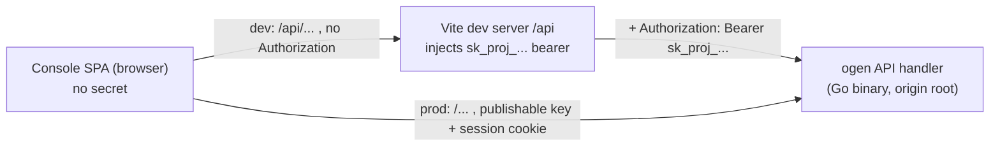

# Console ADR 0002: API access and auth interceptors

> **Status:** Accepted
> **Date:** 2026-06-29 (accepted 2026-06-30; revised 2026-08-12 — §1/§4: the
> Go-side `/api` shim is withdrawn, the production API base is the origin
> root; revised 2026-08-13 — the first-party session cookie is the embedded
> Console's operator credential)
> **Scope:** `apps/console` only. See [`apps/console/AGENTS.md`](../../AGENTS.md).
> **Context:** Console shell layout, navigation, and resource list pages
> (issue [#440](https://github.com/zitadel/nextgen/issues/440)).

## Context

The console needs to call the Zitadel API to render its resource pages
(users, sessions, flow definitions, …). Issue #440's task 3 sketches this as:

> Create a typed API client (`src/api/client.ts`) that reads the project
> secret from config/env and attaches `Authorization: Bearer <projectSecret>`
> to requests.

There are two problems with implementing that literally.

### Problem 1 — the only credential today is a project secret, and it must not reach the browser

The API authenticates **every** request with an OAuth2 bearer that is the
project secret (labelled `sk_proj_...` when minted). See
[`internal/api/security.go`](../../../../internal/api/security.go): the
security handler passes the bearer to the token verifier, which decrypts it
and yields the project id. There is **no console-user session** yet — #440
lists console authentication, RBAC, and a user menu as explicit non-goals.

Putting that secret in the browser bundle (env-inlined at build time, or
fetched into client memory) directly violates
[root ADR 005: Public Runtime and Private Credentials](../../../../docs/adrs/005-public-runtime-private-credentials.md),
which states the browser receives only public runtime metadata and that
secrets stay in the CLI, server, or a secret store. A project secret is a
project-wide credential; shipping it to every console visitor is the exact
failure mode ADR 005 exists to prevent.

The console is served **same-origin** with the API: the Go mux in
[`cmd/server/server.go`](../../../../cmd/server/server.go) `buildHTTPMux`
mounts the static console SPA under its configured deployment prefix and the
API handler at `/` on the same server. That co-location is what makes a
server-side solution cheap.

### Problem 2 — `src/api/client.ts` would re-implement an interceptor we already have

The generated `@zitadel/api` package already centralizes exactly the concerns
#440 wants a client for:

- [`packages/api/src/runtime/fetch.ts`](../../../../packages/api/src/runtime/fetch.ts)
  `customFetch` is the single request interceptor: it attaches the bearer
  token, parses the body, and throws a typed `ApiError` (carrying `status`,
  `url`, and the parsed error envelope) on any non-2xx.
- [`packages/api/src/runtime/config.ts`](../../../../packages/api/src/runtime/config.ts)
  `configureZitadel()` / `getApi()` is the write-once configuration + typed
  client factory described in
  [root ADR 016: Global SDK Configuration](../../../../docs/adrs/016-global-api-initializer.md).

A hand-rolled `src/api/client.ts` would duplicate the fetch/error/auth layer
the SDK already owns, and drift from the generated request/response types.

## Decision

### 1. The Console holds no script-readable credential

The Console **never** holds or sends a project secret. The embedded Console
issues same-origin API requests carrying its HttpOnly first-party
`__nextgen_session` cookie. Browser JavaScript cannot read that credential.
The API resolves the human principal and target-project permissions from the
session as specified by root
[ADR 053](../../../../docs/adrs/053-cross-project-principals.md). The browser
bundle contains no `sk_proj_...` value, upholding
[ADR 005](../../../../docs/adrs/005-public-runtime-private-credentials.md).

The Vite development proxy may temporarily inject a project-secret bearer
until the session-derived management path is implemented. That is a
development compatibility mechanism, not the embedded deployment contract.

The diagram below is the shape as revised in 2026-08-12 (see the note under
it): one rule, two same-origin paths, and no browser-held secret on either.



The console's contract is therefore: **call the API at a same-origin base path
with no `Authorization` header; the browser carries the HttpOnly first-party
session cookie.** This mirrors how the browser auth flow already works
elsewhere — components authenticated by the platform send no client token (see the
`createApi` / no-token path in
[`packages/api/src/runtime/api-factory.ts`](../../../../packages/api/src/runtime/api-factory.ts)).

> **Revised 2026-08-12 — the Go-side shim is withdrawn, not deferred.** This
> section recorded the injection step (a middleware in `buildHTTPMux` or a
> dedicated console API mount) as a referenced dependency owned by a
> follow-up server change. That change was never made, and the console
> meanwhile stopped needing it: the sign-in path carries root
> [ADR 036](../../../../docs/adrs/036-api-credential-planes.md)'s
> **publishable key** (browser-safe by construction, served to the console in
> `runtime.json` — ADR 0004 §3) and the signed-in path carries the
> `__nextgen_session` cookie, which rides same-origin requests on its own. A
> shim at `/api` would have no secret left to inject; it would be a bare
> prefix strip republishing the entire ogen surface under a second path. The
> `/api` base is therefore **dev-server-only**, and the deployed console
> calls the API at the origin root — see §4.
>
> The shipped bug this fixes: the embedded console called `/api/*` against a
> mux that mounts only `/ui/login`, `/ui/console`, `/console/runtime.json`,
> and `/`, so every call 404'd and `/ui/console/` rendered
> "POST /api/flow returned 404". It survived because no test lane served the
> console the way the Go binary does — closed by `console-e2e:e2e-embedded`.

### 2. Reuse `configureZitadel()` + `getApi()`, not a bespoke `src/api/client.ts`

The console configures the SDK once at startup and derives the typed client,
instead of writing its own fetch wrapper:

```ts
// src/api/zitadel.ts — imported once
import { configureZitadel, getApi } from "@zitadel/api/config";

const project = configureZitadel({
  proxyPath: import.meta.env.VITE_CONSOLE_API_BASE ?? "/api", // same-origin API base
  projectId: import.meta.env.VITE_CONSOLE_PROJECT_ID ?? "",
});

export const api = getApi(project);
```

Route loaders ([Console ADR 0001](0001-console-routing.md)) call `api.*`
methods. This keeps the console on the generated request/response types and on
the shared `customFetch` interceptor — no parallel client to maintain.

The "client" #440 asks for is this `getApi(project)` handle, not a new
`src/api/client.ts` re-implementation.

### 3. Interceptor responsibilities, scoped to today

The single interceptor is the SDK's `customFetch`. For the console its
responsibilities are deliberately narrow:

- **Base-URL binding** — requests target the same-origin proxy base
  (`getApi` binds it; no per-call URLs).
- **No client token for management** — the app-wide client sets no bearer;
  `customFetch` leaves the `Authorization` header alone when no token is
  configured. The browser's HttpOnly first-party cookie is the management
  credential in the embedded topology; the dev proxy temporarily supplies a
  project-secret bearer until that path lands. The login screen's per-element
  handle is the one exception: it carries the runtime-discovered publishable
  key from ADR 036.
- **Error mapping** — non-2xx throws `ApiError`; loaders let it propagate to
  the route `errorComponent`. `ApiError.status` drives status-specific copy
  (e.g. a `401`/`403` "you don't have access" surface once auth lands).

The console does **not** add token storage, refresh, or retry logic. The
first-party session credential is browser-managed and not script-readable.

### 4. Dev story keeps the same shape as production

_Revised 2026-08-12; the original text assumed the §1 shim._

The invariant is **same-origin, no browser-held secret, in every
environment**. What differs is only _where on that origin_ the API sits, and
that follows from who serves the console:

- **Production** — the built console is embedded in the Go binary, which
  serves the ogen API at the origin **root**. The base is `""`: the console
  calls `/flow`, `/sessions/me`, … directly. Nothing is mounted at `/api`
  and nothing needs to be (§1).
- **Dev** — Vite serves the console on `:5174`, the API is on `:8080`. The
  console calls a same-origin `/api` path that the Vite dev server proxies
  to the Go server, so the browser still holds no project secret or
  script-readable bearer:

```ts
// vite.config.mts (dev only) — illustrative
server: {
  proxy: {
    // Vite proxy injects the project-secret bearer, then forwards to the Go API
    "/api": { target: "http://localhost:8080", changeOrigin: true },
  },
},
```

So dev and prod differ only in whether a proxy sits in front of the API, never
in whether the browser holds a secret — it never does. The base resolves in
`src/api/zitadel.ts` as `VITE_CONSOLE_API_BASE ?? (DEV ? "/api" : "")`: the
env var is the escape hatch for a deployment that mounts the API elsewhere,
`/api` is the dev-proxy path, and root is what the embedded build talks to.
`vite preview` deliberately proxies nothing, so it cannot be mistaken for the
production path — which also means it cannot _prove_ it; that job belongs to
the embedded lane (`console-e2e:e2e-embedded`), which serves the console from
the Go binary.

### 5. Console-user authentication uses the existing slot

Console-user authentication slots into this interceptor without
re-architecting it:

- A console-user **session cookie** rides along automatically on the
  same-origin requests — in production straight to the API handler, in dev
  through the Vite proxy, which forwards it untouched. No console code
  change needed for the cookie to flow. _(This landed as Console ADR 0003.)_
- A script-readable per-user bearer is not part of the Console contract. If a
  future non-browser client needs one, it uses the SDK's existing token
  mechanism rather than changing the first-party browser path.
- The `401`/`403` handling from §3 becomes the "redirect to console login"
  trigger.

Identity is already carried by the cookie. Root
[ADR 053](../../../../docs/adrs/053-cross-project-principals.md) supplies both
the missing target-project authorization contract (§§1–3) and the CSRF
requirements for unsafe cookie-authenticated requests (§5). ADR 046 concluded
the opposite — that SameSite alone is sufficient and no CSRF token is needed —
and ADR 053 amends it; cite 053, not 046, for the CSRF contract.

## Consequences

- **Secret stays server-side.** The browser bundle never contains
  `sk_proj_...`; ADR 005 holds. This is the single most important outcome and
  the reason #440 task 3's "read the secret in the browser" wording is
  superseded here.
- **No duplicate client.** The console reaches for `getApi(project)` and the
  shared `customFetch` interceptor; request/response types stay generated and
  the error taxonomy (`ApiError`) is shared with the CLI and SDKs.
- **Loaders get typed data + typed errors.** ADR 0001 loaders call `api.*` and
  rely on `ApiError.status` for boundary copy.
- **Dev mirrors prod.** Same-origin, secret-free requests in both; only
  whether a proxy fronts the API changes (§4).
- **Session authorization is additive.** The cookie already flows through the
  existing interceptor; target-project authorization lands server-side with no
  console credential rewrite.
- **~~Dependency to track:~~ resolved 2026-08-12 by withdrawal.** This bullet
  recorded a coupling to a server-side inject/proxy step that did not exist
  yet, and warned that a deployed build could not reach the API without it.
  The warning was accurate and the dependency was never discharged — the
  embedded console shipped calling a path nothing served. It is closed by
  removing the coupling rather than by building the shim (§1): the deployed
  console targets the origin root and authenticates with the publishable key
  and the session cookie. The lesson worth keeping is the second half — a
  recorded cross-surface dependency needs a _test_ that fails while it is
  open, not only a note.
- **Management calls are fail-closed until the cookie is authorized.** The
  dev proxy's secret is what carries `user.read` and friends today; the
  publishable key is deliberately refused for them (`internal/api/user.go`).
  Root ADRs 032/033/053's session-derived target permissions make the embedded
  Console's list screens work without a proxy.

## Related work

- Issue [#440](https://github.com/zitadel/nextgen/issues/440) — supersedes its
  task 3 "read the project secret in the browser" instruction.
- [Console ADR 0001: Routing](0001-console-routing.md) — loaders that consume
  this client.
- Root [ADR 005: Public Runtime and Private Credentials](../../../../docs/adrs/005-public-runtime-private-credentials.md).
- Root [ADR 016: Global SDK Configuration](../../../../docs/adrs/016-global-api-initializer.md).
- [`packages/api/src/runtime/fetch.ts`](../../../../packages/api/src/runtime/fetch.ts),
  [`packages/api/src/runtime/config.ts`](../../../../packages/api/src/runtime/config.ts),
  [`packages/api/src/runtime/api-factory.ts`](../../../../packages/api/src/runtime/api-factory.ts).
- [`internal/api/security.go`](../../../../internal/api/security.go),
  [`cmd/server/server.go`](../../../../cmd/server/server.go) `buildHTTPMux`.
