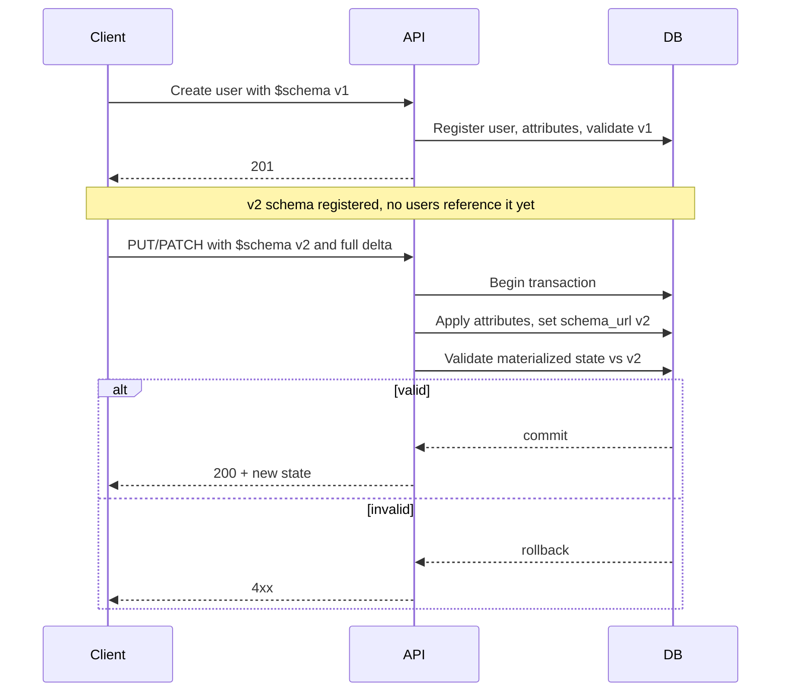

# ADR 009: User JSON Schema Validation

> **Status:** Proposed
> **Date:** 2026-04-30
> **Context:** Dynamic users and schema-driven validation

## Context

Users are dynamic objects stored in the EAV model described in [ADR 008](008-users-eav-store.md). Attribute payloads must be validated so writes remain coherent with tenant-defined structure and constraints.

JSON Schema is the validation mechanism. The server resolves schemas per instance from persisted definitions and applies them when user data is created or updated. HTTP user APIs are not implemented yet; this ADR records the contract and migration expectations for when they are.

**Why not automatic schema migration:** Moving a user from schema A to B is not a generic server concern. New schemas may introduce required fields the system cannot invent, change uniqueness or org-scoped rules, or require business logic only the customer controls. The product therefore does not offer automatic cross-schema transformation.

## Decision

### 1. `$schema` on create and update

When users are created or updated over the API, the request body includes a **`$schema`** property: a URL string that references a JSON Schema **already registered** for the instance (a row in `json_schemas`, same URL as the `url` column).

The API value maps to the persisted user header: `users.schema_url` references `json_schemas (instance_id, url)` (see database migration). It is the same identifier, not a parallel field.

### 2. Immutability and URL-based versioning

Schemas stored at a given URL are **immutable**. To ship breaking or additive changes, register a **new** URL (for example `https://acme.com/schemas/user/v2/users.json`). Customers define their own URL layout and manage how they roll out breaking changes.

This matches domain storage semantics: schemas are created and not updated in place; multiple versions coexist as distinct URLs.

### 3. Trust boundary for resolution

**Runtime validation** uses schemas loaded for the instance from storage (for example via `JSONSchemaResolver` without treating remote URLs as an authority for validation). Fetching a schema over HTTP is an **ingestion** path to populate the repository, not a substitute for trusting only instance-stored definitions at validation time.

### 4. Upgrading to a new schema (explicit, transactional)

No background or automatic migration from schema v1 to v2. The intended flow:

1. User exists and was validated against v1.
2. v2 is added to storage; no users reference it yet.
3. The client sends a **self-contained** update (PUT and/or PATCH) that sets **`$schema`** to the v2 URL and includes all attribute additions, updates, and removals required to satisfy v2 in **one request**.
4. The server applies changes in a **single transaction**, materializes the new user state, **validates it against the v2 schema before commit**, and returns the new state. Validation failure aborts the transaction.

SQL-oriented put/patch contracts under `internal/storage/v2/dialect/postgres/migration/004_users/example/` already reflect single-transaction user updates; HTTP APIs should preserve that atomicity.

## Consequences

### Positive

- **Clear ownership:** Customers control versioning and upgrade timing via URL choice and client-driven updates.
- **Consistent storage:** `schema_url` and `json_schemas` stay aligned with API `$schema`.
- **Safe upgrades:** Validation-before-commit prevents half-applied schema switches.

### Negative / Risks

- **Client burden:** Every schema upgrade is an explicit, correctly shaped request.
- **No silver-bullet migration:** Operators cannot rely on the product to rewrite arbitrary user graphs between schemas.

## Non-goals

- Exact REST paths, full request body shape beyond `$schema`, or OpenAPI changes are deferred to API implementation work.
