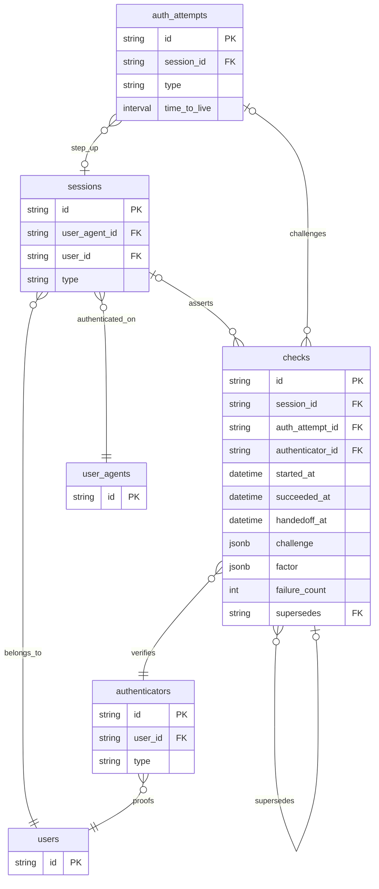

# ADR 010: Session, Auth Attempt, and Check Persistence

> **Status:** Proposed
> **Date:** 2026-05-12
> **Context:** Interactive authentication persistence for nextgen

## Context

Interactive sign-in and step-up flows need durable state for:

* A **stable session** anchored to a **user** and **user agent**.
* A **mutable auth attempt** that groups verifier challenges before a session exists (first login) or while **re-authenticating** an existing session (step-up).
* **Check** rows that record each concrete verification (password, OTP, WebAuthn, and so on), including challenge material, outcomes, and superseded attempts.
* **Authenticators** as the user’s registered proof methods; checks always bind to a specific authenticator row.

Handoff from a completed attempt to a session, and step-up merges, require **coordinated writes** across `AUTH_ATTEMPT`, `SESSION`, and many `CHECK` rows. Splitting ownership across repositories makes atomicity and ordering easy to get wrong.

We also need a place to record **per-challenge failure counts** (wrong password, bad OTP) without duplicating counters on `AUTHENTICATOR`, while still allowing policy that looks across checks when needed.

## Decision

### 1. Relational model

We persist the following entities and relationships (logical names; physical table names may differ by schema conventions).

| Entity | Purpose |
|--------|---------|
| **USER** | Identity anchor (`id` PK). |
| **USER_AGENT** | Client or device surface (`id` PK). |
| **SESSION** | Long-lived session for a user on a user agent (`id`, `user_id`, `user_agent_id`, `type` enum). |
| **AUTHENTICATOR** | A user’s registered verifier (`id`, `user_id`, `type` enum). |
| **AUTH_ATTEMPT** | A bundle of checks for one flow (`id` PK, optional `session_id` FK for step-up, `type` enum, `time_to_live` interval for abandonment). |
| **CHECK** | One verifier interaction (`id`, `session_id`, `auth_attempt_id`, `authenticator_id`, `started_at`, `succeeded_at`, `handedoff_at`, `challenge` and `factor` as `jsonb`, `failure_count`, optional `supersedes` self-FK to another check). |

Relationships:

* A **SESSION** belongs to exactly one **USER** and one **USER_AGENT**.
* An **AUTH_ATTEMPT** has many **CHECK** rows; a **SESSION** has many **CHECK** rows after handoff.
* An **AUTH_ATTEMPT** optionally references **SESSION** (`session_id` null for first login until handoff; set for step-up / re-auth on an existing session).
* A **CHECK** references one **AUTHENTICATOR** and may reference zero or one **AUTH_ATTEMPT** and zero or one **SESSION**, depending on lifecycle: before handoff `session_id` may be null; after handoff `auth_attempt_id` may be cleared.
* Each **AUTHENTICATOR** belongs to one **USER**.
* **CHECK** may reference another **CHECK** via **`supersedes`**: the newer row points at the older row it replaces (abandoned or retried flow). Queries for “current” checks exclude superseded rows or use time ordering, depending on the read path.

### 2. Lifecycles

1. **Auth attempt before a session**  
   Insert **AUTH_ATTEMPT** with `session_id` null. All new **CHECK** rows reference `auth_attempt_id`. `session_id` on checks may be null until handoff.

2. **Successful handoff**  
   In one transactional unit of work: set `session_id` (and `handedoff_at` where used) on succeeded checks; clear **`auth_attempt_id`** on those rows (or otherwise drop the FK to the attempt) so the **AUTH_ATTEMPT** row can be deleted; delete the **AUTH_ATTEMPT** row.

3. **At most one check per authenticator per session (after handoff)**  
   When promoting step-up results or replacing stale proof, **delete** (or later **archive**) older **CHECK** rows for the same `(session_id, authenticator_id)` so the live session view stays small and unambiguous.

4. **Step-up / re-auth**  
   Insert **AUTH_ATTEMPT** with **`session_id`** set. Accumulate checks as usual. On successful handoff, merge into the session using the same delete/replace rule per authenticator.

5. **TTL and cleanup**  
   Use **`time_to_live`** on **AUTH_ATTEMPT** and a sweeper job to remove abandoned attempts and dependent checks that never completed handoff.

### 3. Failure counters on **CHECK**

* Store **`failure_count`** on **CHECK**, not on **AUTHENTICATOR**.
* Policy that needs a broader signal (for example across recent attempts) uses **aggregates** (`SUM(failure_count)`, time-bounded filters) over **CHECK** rows. We accept that cost on the assumption that the number of failed checks per authenticator / window stays **bounded** in normal operation.
* Mitigate growth with attempt TTL, pruning superseded rows where policy allows, and **indexes** aligned to real query paths (for example `(auth_attempt_id)`, `(session_id)`, `(authenticator_id, started_at)` depending on lockout and analytics queries).

### 4. Merged session and auth-attempt repository (application layer)

* **Merge** the **auth attempt** and **session** persistence repositories (or equivalent storage boundaries) into **one module** that owns both aggregates.
* **`SESSION`** and **`AUTH_ATTEMPT`** remain **separate tables**; the decision is **code organization and transactional ownership**, not collapsing entities into one table.
* **Rationale:** handoff and step-up require a single coherent transaction boundary (promote checks, null out `auth_attempt_id`, delete attempt rows, delete or replace session checks per authenticator). One repository avoids split transactions, fragile call ordering, and circular dependencies between two packages that must always evolve together.

## Consequences

### Positive

* Clear split between **durable session** and **ephemeral attempt bundle** at the data model, without two competing write APIs for the same transaction.
* **CHECK** rows give an audit-friendly timeline of challenges, outcomes, and supersession.
* **Per-check `failure_count`** keeps authenticator rows stable and ties failures to a concrete challenge lifecycle.
* **Merged repository** aligns implementation with required atomicity for handoff and step-up.

### Negative / Risks

* **Handoff correctness** depends on disciplined transactions and FK ordering; partial failure modes must be specified and tested (for example handoff interrupted after some updates).
* **Deletion vs audit:** aggressive deletion of old checks and attempts improves read performance but may reduce forensic history unless a separate archive is introduced later.
* **Aggregate lockout queries** can grow costly if abuse generates many failed checks; revisit with stronger retention policy, materialized abuse counters, or rate limiting at the edge.
* **Merged module surface** may grow; mitigate with internal packages or private types rather than a single unstructured “god” type.
* **Indexing:** define indexes when concrete query paths exist; avoid speculative GIN on `jsonb` unless queries require it.
