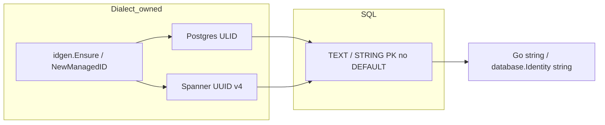

# ADR 011: Resource Identifier Strategy

> **Status:** Accepted  
> **Date:** 2026-05-15  
> **Updated:** 2026-08-03  
> **Context:** Multi-dialect storage (PostgreSQL and Spanner) for nextgen  
> **Amended by:** [ADR 047](047-dialect-id-generation.md) (dialect ownership, generators)

## Context

nextgen persists many resource types (users, projects, sessions, auth attempts,
tokens, credential rows, …). Alpha chooses **one** identifier strategy for every
primary key: a dialect-minted prefixed opaque string. There is no integer
`IDENTITY` class and no unprefixed surrogate exception.

[ADR 010](010-session-auth-attempt-check-model.md) entity relationships remain;
this ADR owns identifier typing only. HTTP shape details live in
[ADR 012](012-ephemeral-id-api-representation.md) and [ADR 047](047-dialect-id-generation.md).

## Decision

### 1. One identifier class



- Domain defines **prefix constants** only (no minting).
- Dialects mint `prefix_<opaque>` on create when the ID is empty.
- HTTP create does not accept client resource PKs ([ADR 047](047-dialect-id-generation.md)).
- “Ephemeral” means short-lived **lifecycle**, not a different ID mechanism.

### 2. Dialect DDL

PostgreSQL:

```sql
id TEXT COLLATE "C" NOT NULL CHECK (id <> '')
```

Spanner:

```sql
id STRING(MAX) NOT NULL
```

Prefer composite keys `(project_id, id)` where the resource is project-scoped.

### 3. Go type: `database.Identity`

[`database.Identity`](../internal/storage/database/identity.go) is a string
alias used at the storage boundary. After the alpha cutover it binds and scans
as string only (no decimal→`int64` coercion for resource PKs).

### 4. Package roles

| Package | Role |
|---------|------|
| `internal/domain` | Prefix constants and validation — no ID minting |
| `internal/storage/database` | `Identity` string bind/scan helpers |
| `internal/storage/dialect/idgen` | Shared `Generator`, `Ensure`, ULID + UUID implementations |
| `internal/storage/dialect/{postgres,spanner}` | Choose generator; call `Ensure` / `NewManagedID` on create |

## Consequences

- One mental model for agents and reviewers.
- Spanner write distribution uses UUID v4 bodies; Postgres keeps ULIDs.
- Breaking for alpha: existing BIGINT identity tables are rewritten in place.
