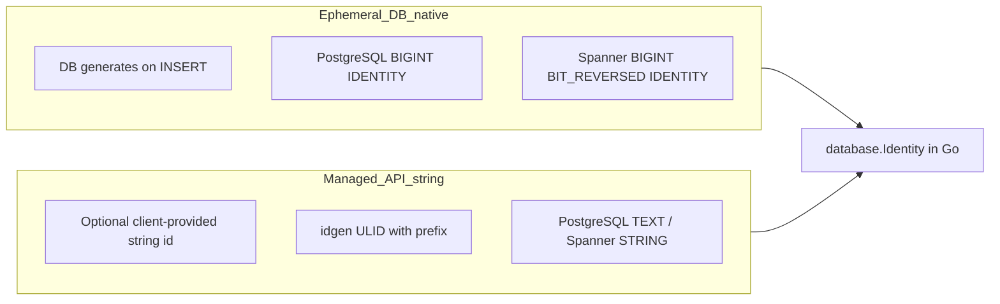

# ADR 011: Resource Identifier Strategy

> **Status:** Accepted  
> **Date:** 2026-05-15  
> **Context:** Multi-dialect storage (PostgreSQL and Spanner) for nextgen

## Context

nextgen persists two broad classes of resources:

1. **Ephemeral** rows tied to authentication flows, protocol sessions, and token lifecycle. They are created frequently, live for a bounded time, and are never assigned by API clients as primary keys.
2. **Managed** durable resources (users, teams, apps, IdPs) exposed through the API, often with an optional client-provided `id` and a server-generated fallback.

Today, migrations and repositories are inconsistent: managed resources already use string primary keys, while `auth_attempts` used `TEXT` ids. Credential tables use `BIGINT GENERATED BY DEFAULT AS IDENTITY` for **internal surrogate** keys only — those are not the same as ephemeral **resource** identifiers.

We need one storage-layer story that works on PostgreSQL and Spanner without `interface{}` in every repository, and a clear split from [`internal/domain/idgen`](../internal/domain/idgen/generator.go) (managed resources only).

[ADR 010](010-session-auth-attempt-check-model.md) models sessions, auth attempts, and checks but described their ids as strings. This ADR supersedes that **identifier typing** only; the entity relationships and merged-repository decision in ADR 010 remain.

**Out of scope for this ADR:** HTTP/OpenAPI external representation of ephemeral integer ids (see [ADR 012](012-ephemeral-id-api-representation.md)).

## Decision

### 1. Two identifier classes



#### Ephemeral (database-generated integers)

These identifiers are **never** supplied by clients on insert. The database generates the primary key; the application reads it back (for example via `RETURNING id`).

| Identifier | Typical store |
|------------|----------------|
| `session_id` | `sessions` (when introduced) |
| `oidc_session_id` | OIDC protocol session |
| `saml_session_id` | SAML protocol session |
| `token_id` | Token issuance / revocation |
| `idp_intent_id` | IdP redirect / intent correlation |
| `auth_attempt_id` | `auth_attempts` |
| `check_id` | `checks` (when introduced per ADR 010) |

**Go canonical form:** decimal string (for example `"3458764513820540928"`), carried as [`database.Identity`](../internal/storage/database/identity.go). Not prefixed ULIDs.

**Excluded:** `BIGINT` surrogate keys on credential rows (`user_passwords.id`, and similar) remain internal-only and are not ephemeral resource identifiers.

#### Managed (API strings)

Always stored as string columns. If the create request omits `id`, the server generates one via `idgen.Generator` (for example `user_<ulid>`).

| Identifier | Column type |
|------------|-------------|
| `user_id` | string |
| `idp_id` | string |
| `app_id` | string |
| `team_id` | string |

Managed ids **must** use the required API prefixes (`user_`, and so on) so they never collide with the numeric heuristic in `database.Identity.Value`.

### 2. Dialect-specific DDL

#### PostgreSQL

Ephemeral primary key and foreign keys to other ephemeral ids:

```sql
id BIGINT GENERATED ALWAYS AS IDENTITY
-- session_id BIGINT  (nullable FK when sessions exist)
```

Use **`GENERATED ALWAYS`** so inserts cannot override the key. Monotonic identity is acceptable on PostgreSQL, especially with hash partitioning on `(project_id, …)` per [ADR 008](008-users-eav-store.md).

Managed resources (unchanged):

```sql
id TEXT COLLATE "C" NOT NULL CHECK (id <> '')
```

#### Spanner (GoogleSQL DDL)

Ephemeral columns:

```sql
id INT64 GENERATED BY DEFAULT AS IDENTITY (BIT_REVERSED_POSITIVE)
-- session_id INT64
```

Migrations under `internal/storage/database/dialect/spanner/` use GoogleSQL types (`INT64`, `STRING(MAX)`), not PostgreSQL `BIGINT`/`TEXT`.

**Rationale** ([Spanner primary key defaults](https://cloud.google.com/spanner/docs/primary-key-default-value)):

- Monotonic `INT64` / `bigint` keys cause **hotspots** on distributed nodes; Spanner does not provide MySQL-style monotonic `AUTO_INCREMENT`.
- `BIT_REVERSED_POSITIVE` on `IDENTITY` spreads writes across the key space.
- UUID defaults (`gen_random_uuid()`) are Spanner’s usual recommendation for new string-key apps but are **rejected here** so ephemeral ids stay **integer-aligned with PostgreSQL** and share one Go scanning path.

**Amendment (2026-07-22) — Spanner writes supply the id client-side.** The
`IDENTITY` DDL stays, but Spanner repositories generate the value themselves
via the dialect-owned
[`spanner.NewEphemeralID`](../../internal/storage/database/dialect/spanner/ephemeral_id.go)
(uniform random positive `INT64`) and insert it explicitly instead of reading a
database draw back through `THEN RETURN`:
[go-sql-spanner](https://github.com/googleapis/go-sql-spanner) retries aborted
read-write transactions by replaying their statements and comparing results,
and a replayed identity draw yields a different value, failing the whole
transaction with `ErrAbortedDueToConcurrentModification`. Uniform randomness
preserves the bit-reversed spread; uniqueness becomes probabilistic
(~2⁻⁶³ per insert). **Collision plan:** a collision surfaces as a key-conflict
error and fails the operation — retrying inside the same transaction would be
non-deterministic on replay again, so retries stay at the flow level, where
authentication operations are already retryable. Ownership of the strategy is
per [ADR 028](028-storage-v2-statements-and-dialects.md) (dialect layer, not `idgen`).
PostgreSQL is unaffected and keeps reading `RETURNING id`.

Managed resources (unchanged):

```sql
id STRING(MAX) NOT NULL
```

### 3. Go type: `database.Identity`

Defined in [`internal/storage/database/identity.go`](../internal/storage/database/identity.go):

```go
type Identity string
```

- Implements `sql.Scanner`, `driver.Valuer`, and `fmt.Stringer`.
- **Scan:** normalizes `int64`, `int`, `string`, `[]byte`, and `nil` to a decimal string (empty string for SQL `NULL`).
- **Value:** if the identity is a signed integer decimal, returns `int64` for `BIGINT` columns; otherwise returns `string` for `TEXT` / `STRING` columns.

Domain types may remain plain `string`; repositories convert at the storage boundary (`Identity(id)`, `id.String()`).

### 4. Package roles

| Package | Role |
|---------|------|
| `internal/domain/idgen` | Managed resource id generation only |
| `internal/storage/database` | `Identity` type and dialect-agnostic bind/scan |
| `internal/storage/database/repository` | Uses `Identity` for ephemeral columns; maps to domain `string` |

## Consequences

### Positive

- Smaller ephemeral keys and indexes; no client-chosen PK collisions on ephemeral tables.
- One Go type bridges PostgreSQL `BIGINT` and Spanner `INT64` without ad-hoc conversion in each repository.
- Clear ownership: the database generates ephemeral lifecycle ids; the product owns branded string ids for managed resources.

### Negative / Risks

- **Pre-release migration churn:** existing `TEXT` ids on `auth_attempts` change to `BIGINT` identity (see implementation in dialect migrations).
- **ADR 010 / OpenAPI drift** until [ADR 012](012-ephemeral-id-api-representation.md) defines external encoding; current OpenAPI `sess_` / `att_` patterns are not authoritative for storage.
- **`Identity.Value` heuristic:** managed ids must keep required prefixes; unprefixed numeric strings would bind as integers.
- Spanner teams using `SERIAL` / `AUTO_INCREMENT` elsewhere must set `default_sequence_kind = bit_reversed_positive` where applicable.

## Follow-ups

1. [ADR 012](012-ephemeral-id-api-representation.md): HTTP/OpenAPI representation for ephemeral ids.
2. Migrations and repositories for `sessions`, `checks`, OIDC/SAML sessions, tokens, and IdP intents when those tables are added.
3. Amend [ADR 010](010-session-auth-attempt-check-model.md) ER diagram when session/check tables land.
