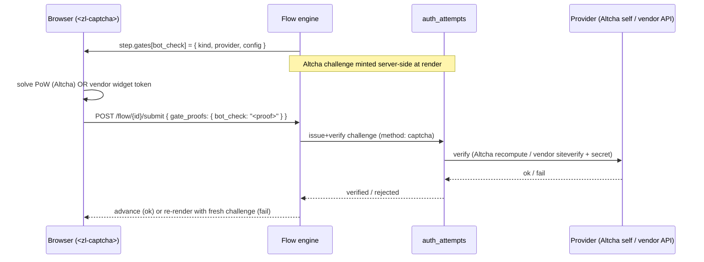
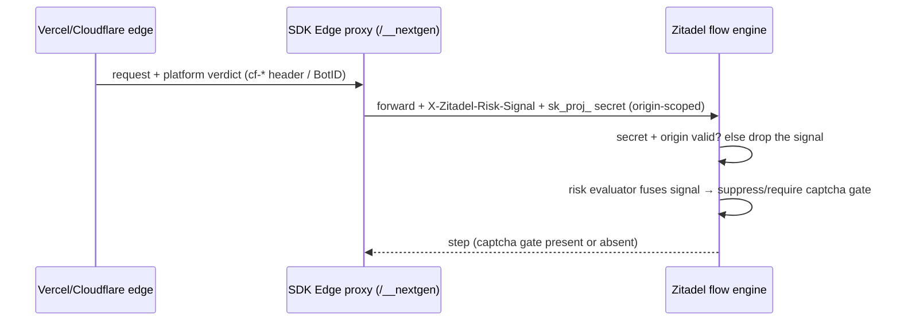

# ADR 016: Captcha Gate Contract & Bot-Detection Signals

> **Status:** Proposed
> **Date:** 2026-05-26
> **Context:** Flow engine gates, bot detection, captcha providers, edge/platform risk signals

## Decision

Captcha is the single gate kind ([ADR 013][adr013] fixed gates as captcha-only). This
ADR formalizes the captcha gate contract that ADR 013 deferred, and adds a second,
complementary bot-detection mechanism for apps deployed behind an edge platform.

Two mechanisms, one trust rule:

1. **In-flow captcha gate (#1).** A step carries a `captcha` gate. The engine issues a
   provider-specific challenge — the built-in **Altcha** proof-of-work (the one we bring
   along, self-hosted, no third-party account) or a **third-party** provider the customer
   already uses (Cloudflare Turnstile / hCaptcha / reCAPTCHA, with their own keys). The
   invisible `<zl-captcha>` component solves it, the proof returns via `gate_proofs`, and
   the engine verifies it through the existing `auth_attempts` challenge/verify path. The
   public `site_key` lives in the client-visible gate `config`; any third-party **secret**
   stays server-side in the project secret store ([ADR 005][adr005]).

2. **Edge/platform bot signal (#2).** When the app runs behind Vercel or Cloudflare,
   their edge bot-management already produces a server-side verdict (Vercel BotID,
   Cloudflare managed challenge / WAF) with **no widget**. The SDK Edge proxy reads that
   verdict server-side and stamps it as an authenticated inline header on the proxied flow
   request. The risk evaluator consumes it to **suppress** an otherwise-required captcha
   (the edge already cleared the request) or **inject** one (the edge flagged it).

**Trust boundary (shared rule).** Only server-injected, authenticated signals count;
browser-relayed signals never do. This is the same principle as [ADR 005][adr005]: the
browser carries public runtime only; anything trusted enters through a server-side,
credentialed channel.

### #1 — In-flow captcha gate

**Gate shape.** Already defined in [`gate.yaml`][gate]; no schema change:

```yaml
kind: captcha          # the only gate kind
provider: altcha       # altcha | turnstile | hcaptcha | recaptcha — sibling of config
config: { ... }        # provider-specific, opaque to the engine, CLIENT-VISIBLE
```

`config` is surfaced to the browser, so it carries **public values only**. Two provider
modes differ in what fills `config` and where verification credentials live:

- **Altcha (built-in — "we bring it along").** The engine generates the proof-of-work
  challenge at render time (salt, HMAC over a server-held key, a target number) and places
  the public challenge parameters in `config`:

  ```json
  { "kind": "captcha", "provider": "altcha",
    "config": { "algorithm": "SHA-256", "challenge": "abc…", "salt": "xyz…", "max_number": 100000 } }
  ```

  No third-party account, no per-customer secret. The HMAC key is a Zitadel-managed
  server secret. Difficulty scales with risk level (see bot-detection.md).

- **Third-party (BYO account).** Only the public `site_key` goes in `config`:

  ```json
  { "kind": "captcha", "provider": "turnstile", "config": { "site_key": "0x4AAA…" } }
  ```

  `<zl-captcha>` loads the vendor widget with that site key; the proof is the vendor token.
  The **secret key** is resolved server-side at verify time from the project secret store
  (see *Secret placement*) and is never serialized into `config`.

**Runtime surfacing.** `step.gates` is already required on the runtime step in
[`flow-step.yaml`][flowstep], but the Go runtime does not surface it yet — `FlowStep`
(`internal/domain/flow_state_machine.go:62`) has no gates field and `buildStep` (`:438`)
never emits one. This ADR makes surfacing gates a requirement.

**Proof submission.** Proofs return in `gate_proofs` (already in
`flow-submit-request.yaml`), a map keyed by gate name, collected from `<zl-captcha>`
events. No schema change.

**Verification placement.** Captcha verifies through the existing `auth_attempts`
challenge/verify model as a new `captcha` method, exactly mirroring passkey
([ADR 013][adr013] §Context):

- Issue: `POST /auth_attempts/{id}/challenges { "method": "captcha" }`
- Verify: `POST /auth_attempts/{id}/challenges/{cid}/verify { "captcha": { … } }`

The flow engine drives this internally — it does not require a separate client round-trip
to `auth_attempts`. Routing through `auth_attempts` means captcha behaves identically in
the flow path **and** for direct API clients (bot-detection.md principle 5). On failure the
engine re-renders the current step with an error and a fresh challenge; captcha is a
bot-detection gate and **does not** contribute to the session's `assurance_levels`.

**Secret placement.** A third-party provider's secret key is stored in the project secret
store keyed by project (and team), resolved server-side at verify. The gate `config`
carries only the public `site_key` ([ADR 005][adr005]; secret store per [secret.md][secret]).

**Frontend.** `<zl-captcha>` is an invisible, auto-submitting Lit component modeled on
`<zl-passkey>` ([ADR 013][adr013] §3). It dispatches on the gate's `provider`, and mounts
third-party vendor widgets in **light DOM** to avoid shadow-DOM and cross-origin iframe
friction (Turnstile tolerates shadow DOM; reCAPTCHA/hCaptcha do not). It declares
`satisfies_gate: "captcha"` in its manifest, and the `mandatory-gates` patcher gains a gate
branch that auto-injects it when a required gate has no matching consumer in the template.



### #2 — Edge / platform bot signal

**Motivation.** Many customers deploy to Vercel or Cloudflare, whose edge layers already
run bot management (Vercel BotID, Cloudflare managed challenge / WAF). The verdict is
server-side and widget-less. Reusing it avoids showing a redundant captcha to a request the
edge already cleared, and lets us require one when the edge is suspicious.

**Capture point.** The SDK Edge proxy (`proxyRequest` in
`packages/sdk-next/src/middleware.ts`, and the Nuxt equivalent). It already runs in the
customer's Vercel/Cloudflare deployment and rewrites the forwarded request. It reads the
platform verdict (a `cf-*` header, a `checkBotId()` result) **server-side** and stamps an
inline header **before** the upstream `fetch`.

**Contract.** A reserved request header `X-Zitadel-Risk-Signal` carries a compact verdict.
Use an RFC 8941 structured-field dictionary so it stays header-safe and debuggable:

```
X-Zitadel-Risk-Signal: provider=vercel-botid; level=clean; score=0.02
X-Zitadel-Risk-Signal: provider=cloudflare; level=suspicious; reasons="managed_challenge_failed"
```

Fields: `provider` (required), `level` ∈ `clean|suspicious|blocked` (required), `score`
(optional 0–1), `reasons` (optional token list). The engine treats unknown providers and
fields leniently — the signal is advisory input, not a hard gate.

**Trust.** Zitadel honors `X-Zitadel-Risk-Signal` **only** when the same request presents a
valid project / origin-scoped `sk_proj_` secret and the request origin matches that secret's
patterns ([secret.md][secret] already enforces this with a 403 on mismatch). The
origin-scoped secret is the one the setup CLI already provisions into the deploy platform's
env store (`ZITADEL_PREVIEW_SECRET` for Vercel / Netlify / Cloudflare). A risk-signal header
that arrives **without** that server-side credential — i.e. relayed from a browser or sent by
an arbitrary client — is **ignored**, never trusted.

This closes a real gap: today the flow-path proxy hop is unauthenticated (it strips
`x-nextgen-auth-token` and adds no upstream credential). For the signal to be trustworthy,
the proxy must attach the project secret on the flow hop and add `X-Zitadel-Risk-Signal` to
its forward allowlist.

**Channel.** Inline on the proxied get-step / submit request (synchronous). The engine reads
the signal when deciding whether to inject or suppress the captcha gate for the current step
— `gate.yaml` already states the engine "may inject gates at runtime based on policy or risk
evaluation." A `clean` verdict can suppress a declared captcha; a `suspicious`/`blocked`
verdict can inject one the definition did not declare.



**Risk evaluator.** The edge signal is one input among many (captcha result, fingerprint,
rate-limit state, request context); it never affects session `assurance_levels`.

## Context

[ADR 013][adr013] established that gates are captcha-only (passkey is an action, not a gate)
but explicitly did not specify the captcha gate contract. The captcha design lives in
[bot-detection.md][botdetection], which is marked **Preliminary** and covers providers and
the risk-evaluator model but neither the edge/platform-signal mechanism nor its trust model.
Prior proof-of-concept work is recorded in the oxidel POC ADRs 021 (Bot Detection &
Telemetry) and 024 (Risk Evaluation) referenced from bot-detection.md.

The contract surfaces captcha needs already exist: `gate.yaml`, `flow-step.yaml` `gates`,
`flow-submit-request.yaml` `gate_proofs`, and the `auth_attempts` challenge/verify endpoints.
What is missing is the decision record tying them together and the runtime wiring — which
this ADR provides for review.

## Consequences

This list doubles as the implementation checklist for the follow-up PRs.

**Backend**
- `flow-step.yaml` — `gates` already present; **Go `FlowStep` + `buildStep` must surface
  gates** (`internal/domain/flow_state_machine.go:62`, `:438`).
- Flow state machine — `Process()` must stop returning `ErrUnsupported` for `gate_proofs`
  (`internal/domain/flow_state_machine.go:179`) and instead verify via `auth_attempts`.
- `auth_attempts` challenges — add a `captcha` method: `captcha-challenge-payload.yaml` and
  `captcha-proof.yaml` under `api/openapi/endpoints/auth_attempts/by_id/challenges/`, plus
  verify wiring (mirror the passkey payload files already there).
- Secret store — third-party captcha secret keyed by project/team ([secret.md][secret]).
- Risk evaluator — accept `X-Zitadel-Risk-Signal` as an input; gate suppress/inject decision.
- Signal trust — accept the header only with a valid origin-scoped `sk_proj_` secret.
- `gate.yaml` — unchanged; affirm `config` is public-only.
- `flow-submit-request.yaml` `gate_proofs` — unchanged.
- Session factors — unaffected (captcha is not an auth factor).

**Frontend**
- New `<zl-captcha>` component — invisible/auto-submit, dispatch on `provider`, third-party
  widgets in light DOM; manifest declares `satisfies_gate: "captcha"`.
- `mandatory-gates` patcher — add a gate branch to inject `<zl-captcha>` for a required gate
  with no consumer.
- SDK proxy (`sdk-next`, `sdk-nuxt` middleware) — read the platform verdict, stamp
  `X-Zitadel-Risk-Signal`, attach the project secret on the flow hop, extend the forward
  allowlist.

**Contract / docs**
- New reserved header `X-Zitadel-Risk-Signal`; document in
  `docs/design/api/security-and-origins.md` and the SDK middleware.
- `bot-detection.md` updated to point here and to add the edge-signal section.

## Reviewer split

- **Frontend engineers:** the `<zl-captcha>` component, provider dispatch and light-DOM
  mount, manifest + `mandatory-gates` injection, and the proxy header stamping.
- **Backend engineers:** runtime `FlowStep` gates, the `Process()` verify path, the
  `auth_attempts` captcha method, the secret store, risk-signal trust + header acceptance,
  and risk-evaluator consumption.

## Future work

- **Risk-based difficulty and dynamic injection** depend on the policy engine; this ADR
  fixes the contract so they can land without a contract change.
- **Fingerprint / behavioral telemetry** continue to flow through `/flow/{id}/event`
  (observation-only); only the synchronous edge verdict uses the inline header.

[adr005]: 005-public-runtime-private-credentials.md
[adr013]: 013-passkey-gate-contract.md
[botdetection]: ../design/flowengine/bot-detection.md
[secret]: ../design/platform/secret.md
[gate]: ../../api/openapi/components/flows/gate.yaml
[flowstep]: ../../api/openapi/components/flows/flow-step.yaml
