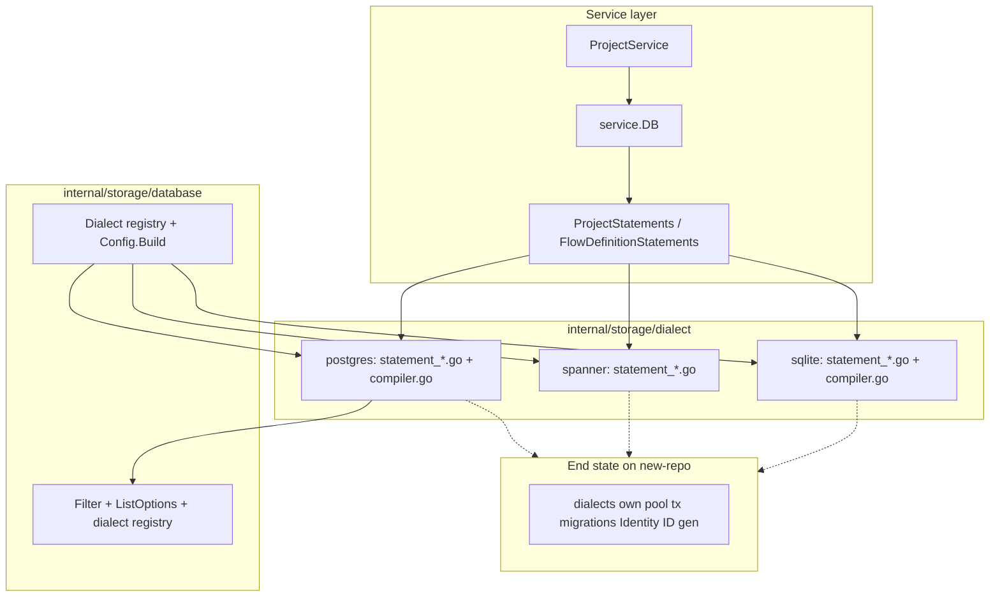
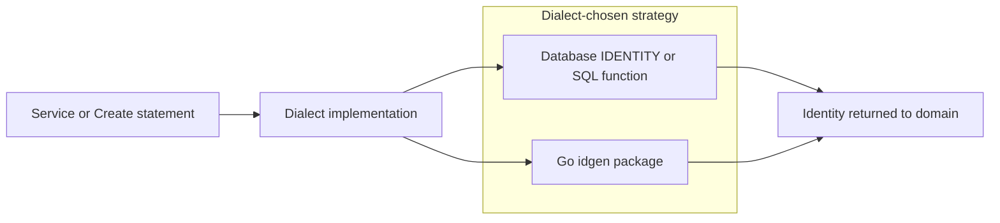

# ADR 028: Storage v2 — Typed Statements and Per-Dialect SQL

> **Status:** Implemented — 2026-08-11 (originally Proposed 2026-06-23)
> **Date:** 2026-06-23
> **Updated:** 2026-08-12
> **Context:** Multi-dialect SQL storage for nextgen (PostgreSQL, Spanner, and SQLite)
> **Supersedes:** docs/design/storage-v2.md (removed sketch)
>
> **Amendment (2026-08-11):** the `new-repo` merge landed, storage v1 was
> removed, and the `internal/storage/v2/` tree was flattened into
> `internal/storage/` (#790). Path references below have been repointed to the
> flattened layout; where the text says "storage v2" it names this
> architecture, which is now simply the storage layer. SQLite joined
> PostgreSQL and Spanner as a third dialect after this ADR was written.

## Context

nextgen storage is SQL-first and must work on PostgreSQL, Spanner, and SQLite.
PostgreSQL and Spanner are production peers; SQLite is the zero-config local /
homelab default. The
historical v1 stack under `internal/storage/database/` used generic CRUD helpers
(`getOne`, `updateOne`, `deleteOne`) with repository metadata structs, shared
`Condition`/`QueryOpts` writers, and dialect type switches inside repository
constructors. That pattern made entity SQL hard to review and hid dialect
differences across the codebase.

`internal/storage/` hosts the replacement storage architecture (the "v2"
statements model). **Entity persistence is fully on v2 statements**
(`AllStatements`); the historical v1 repository stack (generic CRUD helpers,
dialect type switches inside constructors, query-builder, aliases) has been
removed. Remaining interim work is infrastructure tracked on the ADR 028
checklist (notably ID generation).

See also:

- [ADR 008](008-users-eav-store.md) — user EAV storage model
- [ADR 027](027-cursor-based-pagination.md) — cursor pagination contract
- [ADR 011](011-resource-identifiers.md) — ephemeral vs managed identifiers

## Decision

### 1. Statement methods over repository CRUD helpers

Dialect `statement_<entity>.go` files implement [`service.*Statements`](../../internal/service/statement.go)
methods directly. Each method takes `context.Context` and returns `(result, error)` or
`error` immediately — there are no intermediate deferred execution objects.

Example signatures:

- `CreateProject(ctx, *domain.Project) error`
- `GetProjectByID(ctx, id) (*domain.Project, error)`
- `ListProjects(ctx, *ListOptions) (*ListResult[*domain.Project], error)`

Entity SQL lives in per-dialect `statement_<entity>.go` files rather than generic
repository helpers.

### 2. Service-owned statement interfaces

[`internal/service/statement.go`](../../internal/service/statement.go) defines
the service↔storage contract:

- `ProjectStatements`, `FlowDefinitionStatements`, composed into `AllStatements`
- This is the primary storage surface for ported entities (not domain
  `*Repository` interfaces)

[`internal/service/database.go`](../../internal/service/database.go) wraps a v2
pool with `Pool`, `Statementer`, and `Transactioner`.

### 3. Entity SQL co-located per dialect

Each dialect package owns hand-written SQL for each entity:

```
internal/storage/dialect/postgres/statement_project.go
internal/storage/dialect/spanner/statement_project.go
```

Dynamic reads on PostgreSQL append `WHERE`, keyset pagination, `ORDER BY`, and
`LIMIT` via [`compiler.go`](../../internal/storage/dialect/postgres/compiler.go)
from a static `SELECT` base.

### 4. Portable filter AST

[`Filter[F]`](../../internal/storage/database/filter.go) is a sealed generic
interface tree (`And`, `Or`, `Equal`, `GreaterThan`, `LessThan`, `CompareGreater`,
`CompareLess`, `StringEqual`, `StringContains`, …) parameterized by a domain
field enum (`F ~uint8`). [`Column[F]`](../../internal/storage/database/column.go)
wraps that enum via `database.Col(domain.ProjectFieldID)` so filters, order-by,
and cursors cannot mix fields across entities at compile time.

Single-column equality uses `Equal(col, value)`. Tuple comparisons for keyset
pagination use explicit `CompareTerm` pairs:

```go
database.CompareGreater(
    database.Term(database.Col(domain.ProjectFieldCreatedAt), createdAt),
    database.Term(database.Col(domain.ProjectFieldID), id),
)
```

String matching (`StringEqual`, `StringStartsWith`, `StringContains`,
`StringEndsWith`, and `*Fold` ignore-case variants) lives in
[`filter_string.go`](../../internal/storage/database/filter_string.go).

[`Schema[F, T]`](../../internal/storage/database/schema.go) maps each field to
a SQL column name and entity accessor. Dialect `schema_<entity>.go` files define
per-entity bindings; the postgres compiler resolves `Column[F]` through the schema
passed into `compileRead`.

### 5. Keyset pagination at the storage layer

[`ListOptions[F]`](../../internal/storage/database/list.go) and
[`pagination.Cursor[F]`](../../internal/storage/dialect/pagination/cursor.go) implement the
storage side of [ADR 027](027-cursor-based-pagination.md). The postgres compiler
turns `Page.Cursor` into a keyset predicate plus `ORDER BY` and `LIMIT`. API
token signing and opaqueness stay upstream of storage.

### 6. Unified dialect target (end state on `new-repo`)

v2 dialect implementations
(`internal/storage/dialect/postgres`, `internal/storage/dialect/spanner`,
`internal/storage/dialect/sqlite`)
must eventually own pool, migrations, Identity, and ID generation alongside
statement execution. Entity and application paths already use statements only;
v2 transactions are `Statementer`-only and no longer implement v1
`database.QueryExecutor`.

Production startup connects a **single v2 pool** (connect → migrate → close).
A v1 pool is no longer created for production, and the v1 dialect tree has been
retired (C6). The goal is a **single v2 dialect layer**, not permanent dual
dialect code. When no `database:` dialect is configured, startup uses SQLite
under `server.data_dir`.



### 7. Error continuity during migration

v2 postgres wraps driver errors into existing v1 storage error types via
[`error.go`](../../internal/storage/dialect/postgres/error.go). Error types
move with the dialect layer into v2 before `new-repo` merge; no parallel error
taxonomy during transition.

### 8. Storage-owned ID generation (dialect decides mechanism)

ID generation moves into the v2 storage layer. Each dialect chooses **how** ids
are produced for the identifier classes in [ADR 011](011-resource-identifiers.md):

| Class | Storage responsibility | Dialect may use |
|---|---|---|
| **All resource PKs** (users, sessions, auth attempts, tokens, credential rows, …) | Generate on create when ID is empty; HTTP create does not accept client PKs ([ADR 047](047-dialect-id-generation.md)) | Dialect `idgen` (Postgres/SQLite ULID; Spanner UUID v4); SQL supplies no DEFAULT/IDENTITY |

The **dialect** owns the generation strategy per class — not
domain or service code. Domain keeps prefix rules and
validation; storage executes generation and returns
[`Identity`](../../internal/storage/database/identity.go).

PostgreSQL and Spanner already diverge on ephemeral key generation (monotonic
identity vs bit-reversed identity per ADR 011). Colocating generation with the
dialect avoids leaking engine-specific choices into domain or repository layers.

This ADR refines [ADR 011](011-resource-identifiers.md) § Package roles:
managed ID generation lives under `internal/storage/dialect/idgen` (or is
inlined into dialect packages), not a domain-layer concern at call sites.
Concrete mechanisms are recorded in [ADR 047](047-dialect-id-generation.md).



### 9. What moved to v2 before `new-repo` merge

These previously lived under v1 and are now owned by v2 (C3–C6):

- Migrations (postgres + spanner DDL) — **done**
- Test DSN bring-up — **done** (`testdb` + `dbtest`; Postgres/Spanner emulator via testcontainers, or env-provided DSNs / real Spanner instance)
- Zero-config local SQLite — **done** (`dialect/sqlite`; file under `server.data_dir`)
- [`database.Identity`](../../internal/storage/database/identity.go) (ADR 011) — **done**
- Dialect-specific integrity error types — **done** (`database/integrity_errors.go`)
- Single pool at production startup — **done** (C5)
- Retire v1 dialect tree — **done** (C6)
- Retire leftover v1 query-builder / aliases package — **done** (C6)

ID generation (ephemeral + managed) per dialect is complete — see
[ADR 047](047-dialect-id-generation.md).

**Specialized storage that may keep distinct patterns:** EAV user storage (ADR
008) — ported to v2 statements but may retain EAV-specific SQL structure.
Permission checks and complex conditions (LIKE, JSON paths, EXISTS) are
capabilities to add to the v2 filter/compiler.

### 10. Generics roadmap

Commented Go 1.27 scaffolding in
[`internal/service/database.go`](../../internal/service/database.go) prepares
typed `Statementer[ProjectStatements]`. Current code uses `AllStatements`
everywhere until generics land.

### 11. SQLite as zero-config local default

When `database:` is omitted, the server uses **SQLite** at
`<server.data_dir>/zitadel.db` via pure-Go [`modernc.org/sqlite`](https://pkg.go.dev/modernc.org/sqlite).
PostgreSQL and Spanner remain the production peers (`database.postgres` /
`database.spanner`). SQLite is the local and small-homelab default — not a
Spanner or multi-writer production substitute.

**Driver constraint — no CGO.** The product default path uses `modernc.org/sqlite`
so `@zitadel/server` and contributor binaries stay cross-compile and CI-friendly
without a C toolchain or libc sqlite. CGO-backed sqlite drivers are rejected for
this default path.

**Why not keep embedded Postgres for local.** The previous local path ran an
in-process embedded Postgres alongside the server. That added a second process
lifecycle (start / stop / reap / self-heal), port binding races under parallel
`zitadel start` and journey load, and a heavier footprint for a CLI path that
must not require Docker or a managed database. Local bring-up should exercise a
real in-tree dialect package under `internal/storage/dialect/sqlite`, not a
parallel embedded-engine path outside the statement dialect model. Postgres
remains available explicitly when production-Postgres parity matters (config,
Compose, or testcontainers).

**Non-goals.** Single-writer pool (one open connection). `IgnoreCase` filters
use SQLite `LOWER()`, which folds ASCII only — non-ASCII case folding can
diverge from Postgres.

**UX and DevX impact.**

| Audience | Impact |
| -------- | ------ |
| **App-dev UX** (`zitadel start`) | Fewer prerequisites: no Docker, no Postgres install, no embedded Postgres binary/port. Same commands; faster/simpler ready path (one process + file DB). Data still under `.zitadel/local/nextgen-data`. Reset/stop semantics unchanged. Users do not pick a dialect for the happy path. |
| **Operator / prod UX** | Unchanged — still configure Postgres or Spanner. |
| **Contributor DevX** | No embedded Postgres binary/port management for default server runs; dialect work and `server:test-sqlite` cover the local engine. Need Postgres/Spanner only for production-parity or tagged integration tests. Tradeoff: local concurrent-writer behavior and some SQL edge cases differ from Postgres — document, do not hide. |

## Package layout

```
internal/storage/
  database/           # Dialect registry, Filter, ListOptions, ListResult
  dialect/
    all/              # Blank-import registration (postgres + spanner + sqlite)
    pagination/       # Cursor marshal/unmarshal for keyset pagination
    postgres/         # Production peer: pool, tx, compiler, statement_*.go
    spanner/          # Production peer: native @param SQL, statements
    sqlite/           # Local / homelab default: pool, tx, compiler, statement_*.go
```

Service wiring lives outside v2:

- [`internal/service/database.go`](../../internal/service/database.go) — `Pool`,
  `Statementer`, `Transactioner`, `DB` wrapper
- [`internal/service/statement.go`](../../internal/service/statement.go) — entity
  statement interfaces

## Implementation status

| Area | Status |
|---|---|
| Dialect registry + config decode | Postgres, Spanner, and SQLite registered; omit `database:` → SQLite default |
| Entity statements | All product entities on `AllStatements` (projects, flows, schemas, teams, sessions, users/auth factors, branding, …) in postgres, spanner, and sqlite |
| v1 package (`internal/storage/database/`) | Removed (repositories, dialects, query-builder, aliases) |
| Production usage | Services use `service.DB` / statements; startup owns a single v2 pool |
| Tests | Service-layer mocks; dialect integration tests; API harness builds v2 pool |

## Worked example: Projects

Service call path:

```go
err = s.v2Pool.Transaction(ctx, func(ctx context.Context, tx Statementer[AllStatements]) error {
    if err := tx.Statements().CreateProject(ctx, project); err != nil {
        return err
    }
    return nil
})
project, err := s.v2Pool.Statements().GetProjectByID(ctx, id)
```

Dialect read compilation:

```go
compiler.compileRead(projectQuery, &database.ListOptions{
    Filter: database.Equal(database.Col(domain.ProjectFieldID), id),
})
```

## Migration path (current → single v2 dialect layer)

1. **Interim dual pools** — **done (C5).** Production startup builds and connects
   only a v2 dialect/pool (`buildDatabaseDialect` → `Connect` → `Migrate`).
2. **Expand v2 dialect surface** — each v2 dialect package grows to cover v1
   pool/tx/migration/Identity/ID generation alongside statement execution.
3. **Entity-by-entity port** — **done.** Entity SQL lives in per-dialect
   statement files; `AllStatements` covers product entities; v1 entity
   repository package removed.
4. **Hybrid transactions** — **done.** App callers and bootstrap use statements
   only; v2 tx no longer exposes v1 `QueryExecutor`.
5. **Retire v1 dialect layer and leftover v1 package** — **done (C6).** Deleted
   `internal/storage/database/` (dialects, dbtest, query-builder, mocks, and
   Identity/error aliases) after v2 dialects satisfied pool, migrations,
   Identity, and errors. Local zero-config uses SQLite; integration bring-up
   uses testcontainers (or env DSNs), not an in-process embedded Postgres.
6. **Single pool at startup** — **done (C5).** Server connects through v2
   dialect only; no second pool.

**End state:** one dialect implementation per engine under
`internal/storage/dialect/`, owning connections, transactions, migrations,
Identity binding, ID generation, and all entity statements. PostgreSQL and
Spanner remain production targets; **SQLite** is the zero-config local/homelab
default (`dialect/sqlite`, file under `server.data_dir`) and is not a Spanner
production peer. Postgres/Spanner integration tests bring up a **Postgres
testcontainer** or a **Spanner emulator testcontainer** by default
(`testdb`); override with `ZITADEL_TEST_POSTGRES_URL` /
`ZITADEL_TEST_SPANNER_URL`, or a real Spanner instance via
`ZITADEL_TEST_SPANNER_INSTANCE` (kept but unwired — CI is emulator-only so
aborts stay visible, see #788; removal tracked in #793).

## Pre-merge checklist

These items track remaining infrastructure work after the entity port. Check
items off as work lands; remove completed entries when no longer useful.

- [x] `compileColumnName()` is no longer a required implementation: v2 compilers derive SQL column names from the schema `SQLName` bindings.
- [x] `AndFilter`/`OrFilter` value vs pointer handling in the postgres compiler is already implemented and covered by compiler tests.
- [x] Spanner statement execution and dialect registration are in place; remaining Spanner work is migrate/dbtest parity under v2.
- [x] Move migrations from v1 to v2 dialect packages (postgres + spanner)
- [x] Retire in-process embedded Postgres; local default is SQLite; Postgres/Spanner integration uses testcontainers (or env / real Spanner instance)
- [x] Move `database.Identity` bind/scan to v2 core
- [x] Move ID generation into v2 dialects (all resource PKs via dialect-chosen Go package; Postgres/SQLite ULID / Spanner UUID v4); retire domain-layer `idgen` and SQL IDENTITY — see [ADR 047](047-dialect-id-generation.md)
- [x] Add [`internal/storage/AGENTS.md`](../../internal/storage/AGENTS.md) with storage conventions (including multi-write `withTransaction` rules)
- [x] Port remaining entities and remove v1 entity repository package
- [x] Drop QueryExecutor bridge from app callers and v2 transactions
- [x] Single v2 pool at production startup (C5)
- [x] Retire v1 dialect implementations (`internal/storage/database/dialect/`) once no remaining consumers remain (C6)
- [x] Delete leftover `internal/storage/database/` query-builder, mocks, and aliases (C6)

## Related ADRs

| ADR | Relationship |
|---|---|
| [027 Cursor-Based Pagination](027-cursor-based-pagination.md) | v2 `ListOptions`/`Page.Cursor` + `pagination.Cursor` is the storage implementation |
| [011 Resource Identifiers](011-resource-identifiers.md) | ADR 027 refines § Package roles: `Identity` + ID generation move to v2 dialects |
| [008 Users EAV Store](008-users-eav-store.md) | EAV SQL may remain specialized; port to v2 statements |
| [010 Session/Auth Attempt](010-session-auth-attempt-check-model.md) | Session/auth-attempt entity SQL lives in v2 statements; model still authoritative |
| [048 Wide Events](048-wide-events-internal-audit-primitive.md) | Event emission on `AllStatements` mutations; `EventStatements.InsertEvent` |

## Consequences

### Positive

- Entity SQL is explicit and reviewable per dialect
- Dialect differences isolated to `dialect/<engine>/` instead of repository switches
- Keyset pagination is a first-class storage concern (ADR 027)
- ID generation colocated with dialect-specific DDL and insert semantics (ADR 011)
- Incremental migration without big-bang rewrite
- SQLite local default (no CGO, no embedded Postgres) cuts CLI/contributor prerequisites while keeping Postgres/Spanner as production peers (§11)

### Negative / Risks (during transition only)

- Spanner still needs per-entity hand-written SQL alongside the shared compiler; acceptable trade-off for dialect clarity
- SQLite single-writer and ASCII `LOWER()` mean local DevX is not a full Postgres fidelity substitute; use tagged Postgres/Spanner tests when parity matters

### Resolved at merge

Pre-merge checklist items (compiler gaps, migrations, Identity, ID generation,
v1 dialect removal) are blockers for completing the v2 dialect takeover, not
permanent architectural debt. ID generation ownership is recorded in
[ADR 047](047-dialect-id-generation.md).
