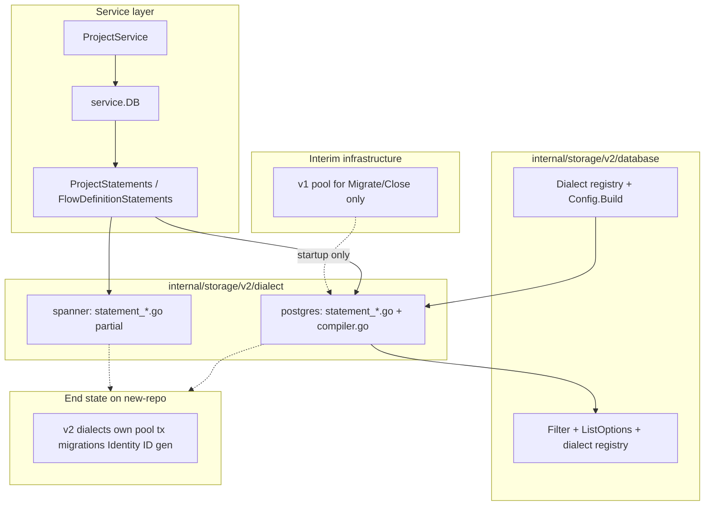
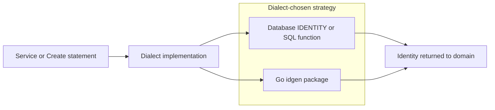

# ADR 028: Storage v2 — Typed Statements and Per-Dialect SQL

> **Status:** Proposed (partially implemented; pre-merge checklist tracks remaining work on `new-repo`)
> **Date:** 2026-06-23
> **Context:** Multi-dialect SQL storage for nextgen (PostgreSQL and Spanner)
> **Supersedes:** docs/design/storage-v2.md (removed sketch)

## Context

nextgen storage is SQL-first and must work on PostgreSQL and Spanner. The
historical v1 stack under `internal/storage/database/` used generic CRUD helpers
(`getOne`, `updateOne`, `deleteOne`) with repository metadata structs, shared
`Condition`/`QueryOpts` writers, and dialect type switches inside repository
constructors. That pattern made entity SQL hard to review and hid dialect
differences across the codebase.

`internal/storage/v2/` is the replacement storage architecture. **Entity
persistence is fully on v2 statements** (`AllStatements`); the v1 entity
repository package has been removed. Remaining interim work is infrastructure:
dual pools, v1 dialect ownership of migrations/embedded bring-up, `Identity`,
and related ADR 028 checklist items.

See also:

- [ADR 008](008-users-eav-store.md) — user EAV storage model
- [ADR 027](027-cursor-based-pagination.md) — cursor pagination contract
- [ADR 011](011-resource-identifiers.md) — ephemeral vs managed identifiers

## Decision

### 1. Statement methods over repository CRUD helpers

Dialect `statement_<entity>.go` files implement [`service.*Statements`](../../internal/service/statement.go)
methods directly. Each method takes `context.Context` and returns `(result, error)` or
`error` immediately — there are no intermediate deferred execution objects.

Example signatures:

- `CreateProject(ctx, *domain.Project) error`
- `GetProjectByID(ctx, id) (*domain.Project, error)`
- `ListProjects(ctx, *ListOptions) (*ListResult[*domain.Project], error)`

Entity SQL lives in per-dialect `statement_<entity>.go` files rather than generic
repository helpers.

### 2. Service-owned statement interfaces

[`internal/service/statement.go`](../../internal/service/statement.go) defines
the service↔storage contract:

- `ProjectStatements`, `FlowDefinitionStatements`, composed into `AllStatements`
- This is the primary storage surface for ported entities (not domain
  `*Repository` interfaces)

[`internal/service/database.go`](../../internal/service/database.go) wraps a v2
pool with `Pool`, `Statementer`, and `Transactioner`.

### 3. Entity SQL co-located per dialect

Each dialect package owns hand-written SQL for each entity:

```
internal/storage/v2/dialect/postgres/statement_project.go
internal/storage/v2/dialect/spanner/statement_project.go
```

Dynamic reads on PostgreSQL append `WHERE`, keyset pagination, `ORDER BY`, and
`LIMIT` via [`compiler.go`](../../internal/storage/v2/dialect/postgres/compiler.go)
from a static `SELECT` base.

### 4. Portable filter AST

[`Filter[F]`](../../internal/storage/v2/database/filter.go) is a sealed generic
interface tree (`And`, `Or`, `Equal`, `GreaterThan`, `LessThan`, `CompareGreater`,
`CompareLess`, `StringEqual`, `StringContains`, …) parameterized by a domain
field enum (`F ~uint8`). [`Column[F]`](../../internal/storage/v2/database/column.go)
wraps that enum via `database.Col(domain.ProjectFieldID)` so filters, order-by,
and cursors cannot mix fields across entities at compile time.

Single-column equality uses `Equal(col, value)`. Tuple comparisons for keyset
pagination use explicit `CompareTerm` pairs:

```go
database.CompareGreater(
    database.Term(database.Col(domain.ProjectFieldCreatedAt), createdAt),
    database.Term(database.Col(domain.ProjectFieldID), id),
)
```

String matching (`StringEqual`, `StringStartsWith`, `StringContains`,
`StringEndsWith`, and `*Fold` ignore-case variants) lives in
[`filter_string.go`](../../internal/storage/v2/database/filter_string.go).

[`Schema[F, T]`](../../internal/storage/v2/database/schema.go) maps each field to
a SQL column name and entity accessor. Dialect `schema_<entity>.go` files define
per-entity bindings; the postgres compiler resolves `Column[F]` through the schema
passed into `compileRead`.

### 5. Keyset pagination at the storage layer

[`ListOptions[F]`](../../internal/storage/v2/database/list.go) and
[`pagination.Cursor[F]`](../../internal/storage/v2/dialect/pagination/cursor.go) implement the
storage side of [ADR 027](027-cursor-based-pagination.md). The postgres compiler
turns `Page.Cursor` into a keyset predicate plus `ORDER BY` and `LIMIT`. API
token signing and opaqueness stay upstream of storage.

### 6. Unified dialect target (end state on `new-repo`)

v2 dialect implementations
(`internal/storage/v2/dialect/postgres`, `internal/storage/v2/dialect/spanner`)
must eventually own pool, migrations, Identity, and ID generation alongside
statement execution. Entity and application paths already use statements only;
v2 transactions are `Statementer`-only and no longer implement v1
`database.QueryExecutor`.

A long-lived v1 pool remains at startup solely for `Migrate` / `Close` until
migrations move into v2. That is infrastructure leftover, not an app-layer
bridge. The goal is a **single v2 dialect layer**, not permanent dual dialect
code.



### 7. Error continuity during migration

v2 postgres wraps driver errors into existing v1 storage error types via
[`error.go`](../../internal/storage/v2/dialect/postgres/error.go). Error types
move with the dialect layer into v2 before `new-repo` merge; no parallel error
taxonomy during transition.

### 8. Storage-owned ID generation (dialect decides mechanism)

ID generation moves into the v2 storage layer. Each dialect chooses **how** ids
are produced for the identifier classes in [ADR 011](011-resource-identifiers.md):

| Class | Storage responsibility | Dialect may use |
|---|---|---|
| **Ephemeral** (sessions, auth attempts, checks, tokens, …) | Generate on insert; read back via `RETURNING` or equivalent | Database `IDENTITY` / `BIT_REVERSED_POSITIVE` (current ADR 011 DDL), or a dialect-specific DB function |
| **Managed** (users, teams, apps, …) | Generate fallback when API omits `id`; validate client-provided ids | Go package (e.g. ULID via `idgen`), database function, or hybrid |

The **dialect** owns the generation strategy per class — not
`internal/domain/idgen` or service code. Domain keeps prefix rules and
validation; storage executes generation and returns
[`Identity`](../../internal/storage/database/identity.go) (moving to v2 core).

PostgreSQL and Spanner already diverge on ephemeral key generation (monotonic
identity vs bit-reversed identity per ADR 011). Colocating generation with the
dialect avoids leaking engine-specific choices into domain or repository layers.

This ADR refines [ADR 011](011-resource-identifiers.md) § Package roles:
`internal/domain/idgen` becomes a dialect implementation detail (or is inlined
into v2 dialect packages), not a domain-layer concern at call sites.



### 9. What moves to v2 before `new-repo` merge

The following currently live under v1 but are **in scope for v2 dialect
ownership**, not permanent v1 retention:

- Migrations (postgres + spanner DDL)
- Embedded postgres startup
- [`database.Identity`](../../internal/storage/database/identity.go) (ADR 011)
- ID generation (ephemeral + managed fallback) per dialect
- Dialect-specific error mapping (already partially in v2 postgres)

**Specialized storage that may keep distinct patterns:** EAV user storage (ADR
008) — port to v2 statements but may retain EAV-specific SQL structure.
Permission checks and complex conditions (LIKE, JSON paths, EXISTS) are
capabilities to add to the v2 filter/compiler, not reasons to keep v1 dialects.

### 10. Generics roadmap

Commented Go 1.27 scaffolding in
[`internal/service/database.go`](../../internal/service/database.go) prepares
typed `Statementer[ProjectStatements]`. Current code uses `AllStatements`
everywhere until generics land.

## Package layout

```
internal/storage/v2/
  database/           # Dialect registry, Filter, ListOptions, ListResult
  dialect/
    all/              # Blank-import registration (postgres + spanner)
    pagination/       # Cursor marshal/unmarshal for keyset pagination
    postgres/         # Working reference: pool, tx, compiler, statement_*.go
    spanner/          # Early stub: native @param SQL, partial execution
```

Service wiring lives outside v2:

- [`internal/service/database.go`](../../internal/service/database.go) — `Pool`,
  `Statementer`, `Transactioner`, `DB` wrapper
- [`internal/service/statement.go`](../../internal/service/statement.go) — entity
  statement interfaces

## Implementation status

| Area | Status |
|---|---|
| Dialect registry + config decode | Postgres and Spanner registered for v2 connect paths |
| Entity statements | All product entities on `AllStatements` (projects, flows, schemas, teams, sessions, users/auth factors, branding, …) in postgres + spanner |
| v1 entity repositories | Removed (`internal/storage/database/repository/` deleted) |
| Production usage | Services use `service.DB` / statements; startup still dual-pools (v1 connector for embedded bring-up; v2 pool for statements + migrations) |
| Tests | Service-layer mocks; dialect integration tests; API harness builds v2 pool |

## Worked example: Projects

Service call path:

```go
err = s.v2Pool.Transaction(ctx, func(ctx context.Context, tx Statementer[AllStatements]) error {
    if err := tx.Statements().CreateProject(ctx, project); err != nil {
        return err
    }
    return nil
})
project, err := s.v2Pool.Statements().GetProjectByID(ctx, id)
```

Dialect read compilation:

```go
compiler.compileRead(projectQuery, &database.ListOptions{
    Filter: database.Equal(database.Col(domain.ProjectFieldID), id),
})
```

## Migration path (current → single v2 dialect layer)

1. **Interim dual pools** — same config drives v1 connector + v2 dialect
   ([`buildDatabaseConnector`](../../cmd/server/server.go)) while infrastructure
   moves.
2. **Expand v2 dialect surface** — each v2 dialect package grows to cover v1
   pool/tx/migration/Identity/ID generation alongside statement execution.
3. **Entity-by-entity port** — **done.** Entity SQL lives in per-dialect
   statement files; `AllStatements` covers product entities; v1 entity
   repository package removed.
4. **Hybrid transactions** — **done.** App callers and bootstrap use statements
   only; v2 tx no longer exposes v1 `QueryExecutor`.
5. **Retire v1 dialect layer** — delete
   `internal/storage/database/dialect/` once v2 dialects satisfy all contracts
   (migrations, embedded bring-up, Identity, errors).
6. **Single pool at startup** — server connects through v2 dialect only; no
   second pool.

**End state:** one dialect implementation per engine under
`internal/storage/v2/dialect/`, owning connections, transactions, migrations,
embedded postgres, Identity binding, ID generation, and all entity statements.

## Pre-merge checklist

These items track remaining infrastructure work after the entity port. Check
items off as work lands; remove completed entries when no longer useful.

- [x] `compileColumnName()` is no longer a required implementation: v2 compilers derive SQL column names from the schema `SQLName` bindings.
- [x] `AndFilter`/`OrFilter` value vs pointer handling in the postgres compiler is already implemented and covered by compiler tests.
- [x] Spanner statement execution and dialect registration are in place; remaining Spanner work is migrate/embedded/dbtest parity under v2.
- [x] Move migrations from v1 to v2 dialect packages (postgres + spanner)
- [ ] Move embedded postgres startup to v2 postgres dialect
- [ ] Move `database.Identity` bind/scan to v2 core
- [ ] Move ID generation into v2 dialects (ephemeral via DB identity/function; managed fallback via dialect-chosen Go package or DB function); retire domain-layer `idgen` call sites at storage boundary
- [x] Add `internal/storage/v2/AGENTS.md` with v2 conventions (including multi-write `withTransaction` rules)
- [x] Port remaining entities and remove v1 entity repository package
- [x] Drop QueryExecutor bridge from app callers and v2 transactions
- [ ] Retire v1 dialect implementations (`internal/storage/database/dialect/`) once migrations/embedded/Identity live in v2

## Related ADRs

| ADR | Relationship |
|---|---|
| [027 Cursor-Based Pagination](027-cursor-based-pagination.md) | v2 `ListOptions`/`Page.Cursor` + `pagination.Cursor` is the storage implementation |
| [011 Resource Identifiers](011-resource-identifiers.md) | ADR 027 refines § Package roles: `Identity` + ID generation move to v2 dialects |
| [008 Users EAV Store](008-users-eav-store.md) | EAV SQL may remain specialized; port to v2 statements |
| [010 Session/Auth Attempt](010-session-auth-attempt-check-model.md) | Session/auth-attempt entity SQL lives in v2 statements; model still authoritative |

## Consequences

### Positive

- Entity SQL is explicit and reviewable per dialect
- Dialect differences isolated to `dialect/<engine>/` instead of repository switches
- Keyset pagination is a first-class storage concern (ADR 027)
- ID generation colocated with dialect-specific DDL and insert semantics (ADR 011)
- Incremental migration without big-bang rewrite

### Negative / Risks (during transition only)

- Temporary dual-pool complexity at startup (v1 connector for embedded bring-up; v2 pool for migrations) until the v1 dialect layer is fully retired
- Spanner still needs per-entity hand-written SQL alongside the shared compiler; acceptable trade-off for dialect clarity

### Resolved at merge

Pre-merge checklist items (compiler gaps, migrations, Identity, ID generation,
v1 dialect removal) are blockers for completing the v2 dialect takeover, not
permanent architectural debt.
