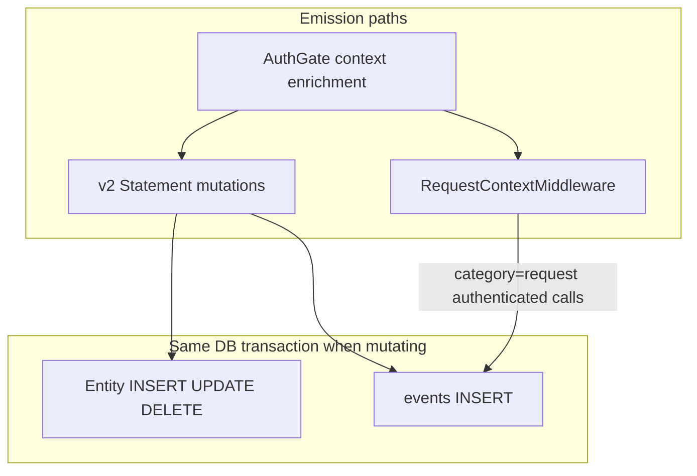

# ADR 029: Wide Events as Internal Audit Primitive

> **Status:** Proposed
> **Date:** 2026-07-03
> **Context:** Audit logging for nextgen relational storage
> **Builds on:** [ADR 028](028-storage-v2-statements-and-dialects.md), [ADR 010](010-session-auth-attempt-check-model.md), [ADR 011](011-resource-identifiers.md), [ADR 008](008-users-eav-store.md)
> **Related:** [ADR 030](030-events-api-retention-export.md) (API, retention, export)

## Context

Classic ZITADEL stores every mutation as an immutable event in an eventstore; the
audit trail and application state are the same stream. nextgen deliberately uses
**relational tables as the source of truth** instead. That removes projection
complexity and improves read performance, but it also removes the built-in audit
stream unless we add one back.

Operators, compliance reviewers, and incident responders need to answer questions
like:

- Which AI agent accessed user X's data using a delegated token?
- What did application Z do in the last hour?
- Reconstruct the full timeline for this login flow.
- Which admin changed this flow definition?

OpenTelemetry distributed tracing solves **latency debugging across services**,
not business-dimension queries. Operational logs via [`zlog`](../../internal/instrumentation/zlog/)
are ephemeral and not tenant-queryable. We need a first-class, append-only,
queryable audit stream stored in the database.

**Scope boundary:** Event emission is defined for **v2 statements only**
([`internal/storage/v2/`](../../internal/storage/v2/),
[`internal/service/statement.go`](../../internal/service/statement.go)). v1
repositories under [`internal/storage/database/repository/`](../../internal/storage/database/repository/)
remain until ported per [ADR 028](028-storage-v2-statements-and-dialects.md).
There is **no dual emission** during migration — entities emit events only after
their v2 statement port lands.

**Pre-claim policy:** Per [claim-flow](../design/platform/claim-flow.md), a
project begins emitting auditable events only after claim. Pre-claim activity is
not retroactively audited. This is product policy, not a technical limitation of
the storage model.

This ADR adapts the wide-event model from oxidel ADR-023 for nextgen tenancy
(`project_id` instead of `org_id`).

## Decision

### 1. One `events` table (wide event model)

All audit categories share a single append-only table. A wide event is a flat
record with all relevant context attached at write time — no joins required for
common queries.

```sql
CREATE TABLE zitadel_nextgen.events (
    -- Identity
    project_id          TEXT        NOT NULL
    , id                BIGINT      GENERATED ALWAYS AS IDENTITY
    , event_type        TEXT        NOT NULL       -- 'user.deactivated', 'request.api', etc.
    , category          TEXT        NOT NULL       -- 'request', 'auth', 'session', 'admin', 'entity', 'signal'
    , sequence          BIGINT      NOT NULL       -- per-project monotonic ordering
    , created_at        TIMESTAMPTZ NOT NULL DEFAULT now()

    -- WHO
    , actor_id          TEXT
    , actor_type        TEXT                    -- 'human', 'service', 'system'

    -- WHAT
    , aggregate_id      TEXT
    , aggregate_type    TEXT                    -- 'user', 'session', 'project', etc.
    , resource_type     TEXT

    -- HOW (delegation context)
    , client_id         TEXT        NOT NULL DEFAULT ''
    , token_id          TEXT        NOT NULL DEFAULT ''
    , delegation_type   TEXT        NOT NULL DEFAULT ''   -- 'direct', 'delegated', 'pat_shared', 'exchanged'

    -- WHERE (device context)
    , fingerprint       TEXT        NOT NULL DEFAULT ''

    -- SDK (informational only)
    , sdk_name          TEXT        NOT NULL DEFAULT ''
    , sdk_version       TEXT        NOT NULL DEFAULT ''

    -- WHEN (correlation scopes)
    , request_id        TEXT
    , session_id        TEXT
    , flow_id           TEXT

    -- Arbitrary data
    , payload           JSONB       NOT NULL DEFAULT '{}'
    , metadata          JSONB       NOT NULL DEFAULT '{}'

    -- Export lifecycle (see ADR 030)
    , shipped_at        TIMESTAMPTZ

    , PRIMARY KEY (project_id, id)
);
```

**Indexes** (define when query paths are concrete):

- `(project_id, created_at, id)` — keyset list pagination ([ADR 027](027-cursor-based-pagination.md))
- Partial indexes on high-cardinality filter columns: `category`, `actor_id`,
  `client_id`, `session_id`, `request_id`, `event_type`

**Per-project sequence:** Assign `sequence` inside the same transaction as the
event INSERT (e.g. `SELECT COALESCE(MAX(sequence), 0) + 1 FROM events WHERE
project_id = $1 FOR UPDATE` or a dedicated counter row). Sequence gives stable
ordering within a project independent of clock skew on `created_at`.

### 2. Six orthogonal correlation scopes

Every event participates in up to six independent grouping dimensions plus
tenancy:

| Scope | Column | Groups |
|-------|--------|--------|
| **Tenancy** | `project_id` | All events within a project |
| **Request** | `request_id` | All events from a single HTTP request |
| **Session** | `session_id` | All events from a user session |
| **Flow** | `flow_id` | All events from a login flow |
| **Device** | `fingerprint` | All events from a device |
| **App** | `client_id` | All events from an application or AI agent |
| **User** | `actor_id` | All events by a user |

Admin and forensic queries use these scopes directly:

```sql
-- What did the AI agent do?
SELECT * FROM events
WHERE project_id = $1 AND client_id = 'agent_copilot'
ORDER BY created_at;

-- All delegated access for user X
SELECT * FROM events
WHERE project_id = $1 AND actor_id = 'user_123' AND delegation_type != 'direct';

-- Everything in this login flow
SELECT * FROM events
WHERE project_id = $1 AND flow_id = 'flow_xyz'
ORDER BY created_at;
```

### 3. Event categories

| `category` | When emitted | Sampling |
|------------|--------------|----------|
| `request` | Every **authenticated** API call (wide event at request end) | None |
| `auth` | Token issue/revoke/exchange, login outcomes, MFA decisions | None |
| `session` | Session create/end, step-up, handoff | None |
| `admin` | Team, API key, config push, RBAC mutations | None (mutations only) |
| `entity` | User/project lifecycle semantic events | None |
| `signal` | Platform bot/abuse signals ([ADR 019](019-captcha-gate-and-bot-signals.md)) | None |

Unauthenticated routes (public login widget, health checks) emit **no**
`request` events unless explicitly listed as security-relevant in a future ADR.

### 4. Two emission paths (Go code, not database triggers)

Emission is implemented in Go application code. Database triggers and CDC are
explicitly rejected — Spanner does not support triggers, and CDC loses semantic
event names.



#### Path A — Request-wide events (authenticated API)

Extend the existing request-ID middleware
([`internal/api/middleware/request_id.go`](../../internal/api/middleware/request_id.go))
into a **RequestContext** middleware:

- Extract or generate `request_id` (W3C traceparent-compatible 128-bit hex).
- Stash optional `session_id`, `flow_id`, `fingerprint`, `X-SDK-Name`, and
  `X-SDK-Version` from request headers into context.
- After the handler completes, if the request was **authenticated**, insert one
  `category=request` wide event containing: `operation_id`, HTTP method, route
  template, status code, duration, and actor/delegation dimensions from context.
- Response header `X-Request-Id` echoes the assigned `request_id`.

Request events use a **separate INSERT** outside the handler's entity
transaction (fire-and-forget after response). Domain mutations co-locate their
event with entity SQL (Path B).

#### Path B — Domain events on v2 statement mutations

Add to [`internal/service/statement.go`](../../internal/service/statement.go):

```go
type EventStatements interface {
    InsertEvent(ctx context.Context, event *domain.Event) error
}
```

`EventStatements` is composed into `AllStatements` alongside entity statement
interfaces.

- `InsertEvent` executes on the same `queryExecutor` / transaction as entity SQL
  ([`internal/storage/v2/dialect/postgres/tx.go`](../../internal/storage/v2/dialect/postgres/tx.go)).
- Each v2 `statement_<entity>.go` method that **mutates state** calls
  `InsertEvent` with a **semantic** `event_type` (e.g. `project.created`,
  `user.deactivated`) — not row diffs or generic `UPDATE` mirrors.
- The service layer constructs the `domain.Event` struct (payload, correlation
  context); the statement layer persists it in-TX.

Example event types (non-exhaustive; full catalog grows with entity ports):

| `event_type` | `category` | Trigger |
|--------------|------------|---------|
| `request.api` | `request` | Authenticated HTTP handler completes |
| `project.created` | `entity` | `CreateProject` statement |
| `user.created` | `entity` | User create statement (v2 port) |
| `user.updated` | `entity` | User patch statement (v2 port) |
| `user.deactivated` | `entity` | User lifecycle statement |
| `auth.token.issued` | `auth` | Token create statement |
| `auth.token.revoked` | `auth` | Token revoke statement |
| `auth.check.failed` | `auth` | Check verification failure |
| `session.established` | `session` | Auth attempt handoff |
| `admin.config.pushed` | `admin` | Config upload statement |
| `admin.api_key.created` | `admin` | API key create statement |

### 5. AuthGate enriches delegation context

After token resolution (AuthGate / auth middleware), inject delegation dimensions
into request context:

| Dimension | Source | Validation |
|-----------|--------|------------|
| `client_id` | Token record (`tokens.application_id` or equivalent) | Guaranteed by token issuance |
| `actor_id` | Token record (`tokens.user_id`) | Guaranteed by token issuance |
| `token_id` | Token record | Guaranteed by token issuance |
| `delegation_type` | Inferred from token structure | Automatic |
| `sdk_name`, `sdk_version` | `X-SDK-Name` / `X-SDK-Version` headers | Informational only; not trusted for authz |

The SDK's `X-Client-Id` header is **ignored** — the server resolves `client_id`
from the token itself to prevent spoofing.

`InsertEvent` and request middleware read all dimensions from context — no
per-handler duplication.

**Delegation models** (same semantics as oxidel):

| Mechanism | `delegation_type` | `client_id` source | `actor_id` source |
|-----------|-------------------|-------------------|-------------------|
| OIDC with `act` claim | `delegated` | Token application ID | `act.sub` claim |
| PAT shared with agent | `pat_shared` | Token `on_behalf_of_app` | Token user ID |
| Token Exchange (RFC 8693) | `exchanged` | Requesting client ID | Original subject token user |
| Direct (no delegation) | `direct` | Token application ID | Token user ID |

### 6. Relationship to `checks` (ADR 010)

[`checks`](010-session-auth-attempt-check-model.md) remain the **deep forensic
store** for challenge material, failure counts, and supersession timelines.

Events store **references only**:

- `check_id`, `session_id`, `authenticator_id`, `check_type`, outcome enums
- Never `challenge_payload` or `factor_payload`

Event types like `auth.check.failed` point investigators to the `checks` table
for detail. This avoids duplicating high-volume JSONB while preserving an
audit-friendly summary at the event layer.

### 7. EAV users (ADR 008)

User mutations through the header/data/registry model
([ADR 008](008-users-eav-store.md)) require special emit rules when ported to v2
statements:

| Operation | Event | Payload |
|-----------|-------|---------|
| Create user | `user.created` | `user_id`, schema ref — no attribute values |
| Patch attributes | `user.updated` | `changed_keys[]` only |
| Unique violation | `user.create.failed` | key name — not value |
| Deactivate | `user.deactivated` | `user_id`, lifecycle reason enum |

No generic auto-diff of `user_attributes` JSON. Attribute values appear in event
payloads only when explicitly allowlisted (see §8).

### 8. PII policy — deny-by-default

Opt-in blocklists (`x-sensitive: true` on every field) do not scale. Event
payloads use a **deny-by-default** model:

1. **Default:** payloads contain resource IDs, enums, key names, counts, and
   timestamps — never raw user attribute strings.
2. **Allowlist:** new schema annotation `x-audit: true` (or `x-audit:
   "identifier"`) marks fields explicitly safe to include in audit payloads
   (e.g. email as a correlation identifier). Fields without `x-audit` are omitted.
3. **Go enforcement:** typed event payload structs and an `audit.Marshal` helper
   at emit time apply schema allowlist rules for user-derived data. Handlers
   cannot accidentally dump a full user object into an event.
4. **Supersedes `x-sensitive`:** the `x-sensitive` annotation in user schemas
   is deprecated for audit purposes. See
   [user-schema.md](../design/flowengine/user-schema.md).

Secrets, passwords, challenge material, and token values are **never** included
regardless of annotation.

### 9. OTEL is Tier 3 export only

OpenTelemetry remains an **export format** for forwarding to an operator's
collector (Splunk, Datadog, Grafana, etc.). ZITADEL never reads audit truth
from OTEL.

```
Wide Event (internal)  ──→  OTEL Span (Tier 3 export)
                              └─ Customer collector → their tools
```

- Internal model uses `request_id`, not `trace_id`.
- `span_id` and `parent_span_id` live in `metadata` JSON for OTEL export
  projection only.
- [`zlog`](../../internal/instrumentation/zlog/) and
  [`zotel`](../../internal/instrumentation/zotel/) remain operational telemetry
  separate from the audit stream.

When exporting to OTEL, the projector maps: `request_id → trace_id`,
`event.id → span_id`, `metadata.parent_span_id → parent_span_id`.

## Non-goals

- v1 repository event emission (wait for v2 port).
- Database triggers or CDC as the primary audit mechanism.
- Full unauthenticated/public request logging.
- Retroactive pre-claim audit.
- Built-in threat-detection rules engine (external consumers; see
  [ADR 030](030-events-api-retention-export.md)).

## Consequences

### Positive

- Business-dimension queries work with simple WHERE clauses — no trace tree
  traversal.
- AI agent and delegated access activity is visible via `client_id` and
  `delegation_type`.
- Transactional co-commit for domain events prevents "state changed but no log"
  races.
- Spanner-safe: no triggers; Go-defined emission on v2 statements.
- Deny-by-default PII policy scales without per-field opt-out annotations.

### Negative / Risks

- **Volume:** one `request` event per authenticated API call adds write
  amplification. Mitigate with async batching for request events if needed;
  domain events stay in-TX.
- **Migration gap:** entities still on v1 repositories have no event emission
  until ported — document coverage gaps during transition.
- **Pre-claim blind spot:** forensic history starts at claim; operators must
  accept this or adjust product policy.
- **Sequence contention:** per-project sequence assignment serializes event
  inserts per project; acceptable at expected scale but worth monitoring.
- **Request vs domain correlation:** request events are outside entity
  transactions; cross-correlate via `request_id` when investigating.

## Related ADRs

| ADR | Relationship |
|-----|--------------|
| [030 Events API, Retention, and Export](030-events-api-retention-export.md) | HTTP surface, `shipped_at`, retention purge, external consumers |
| [028 Storage v2 Statements](028-storage-v2-statements-and-dialects.md) | v2 statement port is the emission boundary |
| [010 Session/Auth Attempt](010-session-auth-attempt-check-model.md) | Checks table is deep forensic store; events reference by ID |
| [027 Cursor-Based Pagination](027-cursor-based-pagination.md) | List API pagination over events |
| [008 Users EAV Store](008-users-eav-store.md) | User event payload rules |
| [019 Captcha Gate](019-captcha-gate-and-bot-signals.md) | `signal` category alignment |
