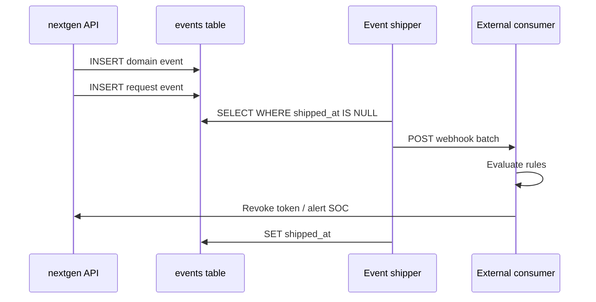

# ADR 030: Events API, Retention, and External Export

> **Status:** Proposed
> **Date:** 2026-07-03
> **Context:** Operator and integrator access to the wide event audit stream
> **Builds on:** [ADR 029](029-wide-events-internal-audit-primitive.md), [ADR 027](027-cursor-based-pagination.md)
> **Related:** [resource-map](../design/api/resource-map.md)

## Context

[ADR 029](029-wide-events-internal-audit-primitive.md) defines the internal wide
event model: one `events` table, two Go emission paths, and deny-by-default PII
policy. Operators and external systems also need:

- A **query API** for incident response and regulatory review.
- **Reliable export** before local retention purges rows.
- A documented integration pattern for **threat detection** — external systems
  that consume the event stream and act on it (e.g. revoke a token, block a
  device fingerprint).

Classic ZITADEL exposes events via the Event API and supports SIEM streaming.
nextgen consolidates identity events and admin/configuration changes into a
**single `/events` endpoint** filtered by `category`, replacing the earlier
split between `/events` and `/audit_events` in the resource map sketch.

## Decision

### 1. Unified `/events` API

One list endpoint and one get-by-id endpoint cover all event categories.

```http
GET /events?project_id=…
         &category=…
         &event_type=…
         &actor_id=…
         &client_id=…
         &session_id=…
         &flow_id=…
         &request_id=…
         &fingerprint=…
         &aggregate_type=…
         &aggregate_id=…
         &created_after=…
         &created_before=…
         &page_token=…

GET /events/{id}
```

**Filter semantics:**

| Parameter | Type | Notes |
|-----------|------|-------|
| `project_id` | required (implicit from credential scope) | Tenancy boundary |
| `category` | enum, repeatable | `request`, `auth`, `session`, `admin`, `entity`, `signal` |
| `event_type` | string, repeatable | Exact match; prefix filter (`user.`) is a future extension |
| `actor_id` | string | Who triggered the event |
| `client_id` | string | Application or agent |
| `session_id` | string | Session correlation |
| `flow_id` | string | Login flow correlation |
| `request_id` | string | HTTP request correlation |
| `fingerprint` | string | Device correlation |
| `aggregate_type` | string | Resource type affected |
| `aggregate_id` | string | Resource ID affected |
| `created_after` | RFC 3339 timestamp | Inclusive lower bound |
| `created_before` | RFC 3339 timestamp | Exclusive upper bound |
| `page_token` | opaque string | [ADR 027](027-cursor-based-pagination.md) cursor |

**Response shape** (single event, list items identical):

```json
{
  "id": "123456789",
  "project_id": "proj_abc",
  "event_type": "auth.token.issued",
  "category": "auth",
  "sequence": 42,
  "created_at": "2026-07-03T12:00:00Z",
  "actor_id": "user_xyz",
  "actor_type": "human",
  "aggregate_id": "987654321",
  "aggregate_type": "token",
  "resource_type": "oidc_access_token",
  "client_id": "app_dashboard",
  "token_id": "tok_abc",
  "delegation_type": "direct",
  "fingerprint": "fp_device123",
  "sdk_name": "zitadel-js",
  "sdk_version": "1.4.0",
  "request_id": "req_128bit_hex",
  "session_id": "sess_456",
  "flow_id": "",
  "payload": { "scope": ["openid", "profile"] },
  "metadata": {},
  "shipped_at": "2026-07-03T12:00:05Z"
}
```

- `payload` and `metadata` are returned **as stored** — already redacted at emit
  time per [ADR 029 §8](029-wide-events-internal-audit-primitive.md).
- `shipped_at` is included so operators can verify export coverage.
- List response wraps items in `{ "data": [...], "next_page_token": "..." }` per
  [ADR 027](027-cursor-based-pagination.md). No total count.

**Pagination:** Keyset cursor on `(created_at, id)` within `project_id`,
consistent with [ADR 027](027-cursor-based-pagination.md) and v2 storage list
options.

**Permissions:** Callers require an `events.read` permission (exact RBAC shape
TBD — reference platform authz when specified). Team-scoped credentials may
restrict list results to events where `actor_id` or affected resources belong
to the credential's team.

**OpenAPI:** A design sketch may live under `docs/design/api/` until the
endpoint is added to `api/openapi/`. Implementation is out of scope for this ADR.

**Removed:** `/audit_events` and `/audit_events/{id}`. Admin and configuration
events use `category=admin` on `/events`.

### 2. Retention and immutability

Events are append-only within their retention window.

**Application DB role:**

- `INSERT` and `SELECT` on `events` — no `UPDATE` or `DELETE` from application
  code during normal operation.
- The retention background job uses a dedicated role with `DELETE` permission.

**Retention policy:**

- Configurable per deployment via server config (suggested default: **30 days**).
- Background job deletes rows matching:

```sql
DELETE FROM zitadel_nextgen.events
WHERE project_id = $1
  AND shipped_at IS NOT NULL
  AND created_at < now() - $retention_interval
```

- Rows with `shipped_at IS NULL` are **never purged** — unshipped events remain
  until export succeeds. This prevents data loss when the shipper is down.
- Long-term compliance archive is the **operator's responsibility** once events
  are exported to SIEM, object storage, or another durable sink.

**Immutability scope:** Events are immutable for the duration they remain in the
database. Retention purge is an explicit, scheduled operation — not an
application UPDATE that alters event content.

Link to [ADR 024](024-user-team-lifecycle-ownership.md): user/team lifecycle
purge policies are separate from event retention; this ADR does not define
user-data purge windows.

### 3. External export (`shipped_at`)

A background **shipper** process delivers events to configured external sinks
before retention deletes them.

**Shipper loop:**

1. Poll: `SELECT ... FROM events WHERE shipped_at IS NULL ORDER BY created_at, id LIMIT $batch_size`
2. Deliver batch to configured sink.
3. On successful delivery: `UPDATE events SET shipped_at = now() WHERE (project_id, id) IN (...)`

The shipper's `UPDATE` on `shipped_at` is the **only** permitted mutation on
event rows. It is performed by the shipper role, not application handlers.

**Delivery semantics:**

- At-least-once delivery. Consumers must be **idempotent** on `event.id`.
- Shipper retries on transient failure without setting `shipped_at`.
- Duplicate external delivery is acceptable; missing delivery is not.

**Supported sink patterns (v1 minimum):**

| Sink | Use case |
|------|----------|
| **Webhook** (HTTPS POST) | SIEM, SOAR, custom threat-detection service |
| **Stdout JSON** | Sidecar log collectors (self-hosted default) |

Future sinks (Pub/Sub, S3, Kafka) follow the same shipper interface without
changing the event schema.

**Configuration sketch:**

```yaml
events:
  retention: 720h          # 30 days
  shipper:
    enabled: true
    batch_size: 500
    interval: 10s
    sinks:
      - type: webhook
        url: https://siem.example.com/zitadel/events
        headers:
          Authorization: "Bearer ${SIEM_TOKEN}"
      - type: stdout
```

### 4. Threat detection integration pattern

The server **emits facts**; policy execution stays **external** in v1. There is
no built-in rules engine.



**Example consumer reactions:**

| Event pattern | External action |
|---------------|-----------------|
| `delegation_type=delegated` + high-volume reads | Alert SOC |
| `auth.check.failed` + `failure_count > N` | Temporary IP block |
| `client_id=agent_*` + sensitive aggregate access | Revoke `token_id` via Admin API |
| `fingerprint` seen across many `actor_id` values | Flag device for review |

Consumers subscribe via webhook or poll `/events` with time-bounded filters.
Webhook delivery is preferred for near-real-time threat response.

**Idempotency contract:** External systems key reactions on `(project_id,
event.id)`. Re-processing the same event must not double-revoke or
double-alert.

### 5. Pre-claim and export

Per [claim-flow](../design/platform/claim-flow.md) and
[ADR 029](029-wide-events-internal-audit-primitive.md), pre-claim projects emit
no events. The shipper and `/events` API return empty results for unclaimed
projects. No retroactive backfill.

## Non-goals

- Built-in threat-detection rules engine or automatic token revocation.
- Event mutation API (corrections are new events, not updates).
- Real-time push subscriptions (webhook shipper is pull-based batching; SSE
  is a future extension).
- Cross-project event search (always scoped to `project_id`).

## Consequences

### Positive

- Single API surface simplifies SDK and SIEM integration vs split
  `/events` + `/audit_events`.
- `shipped_at` + retention purge gives operators a clear contract: export
  before purge, or lose local copy.
- External threat detection integrates without server-side policy complexity.
- Category filter maps directly to compliance use cases (auth vs admin vs
  entity).

### Negative / Risks

- **Webhook reliability:** at-least-once delivery requires consumer idempotency;
  document clearly.
- **Unshipped backlog:** if shipper is down, events accumulate and are not
  purged — disk growth until shipper recovers.
- **Request event volume:** high-traffic projects generate large `/events` result
  sets when filtering `category=request`; operators should prefer SIEM export
  over repeated full scans.
- **Permissions TBD:** `events.read` RBAC shape must align with platform authz
  before the API ships.
- **`shipped_at` UPDATE exception:** the shipper role is the only writer;
  misconfiguration could allow application code to mutate events if roles are
  not separated.

## Related ADRs

| ADR | Relationship |
|-----|--------------|
| [029 Wide Events Internal Model](029-wide-events-internal-audit-primitive.md) | Table schema, categories, emission, PII |
| [027 Cursor-Based Pagination](027-cursor-based-pagination.md) | List pagination contract |
| [024 User/Team Lifecycle](024-user-team-lifecycle-ownership.md) | Lifecycle purge vs event retention |
| [028 Storage v2 Statements](028-storage-v2-statements-and-dialects.md) | v2 port required before events exist for an entity |
