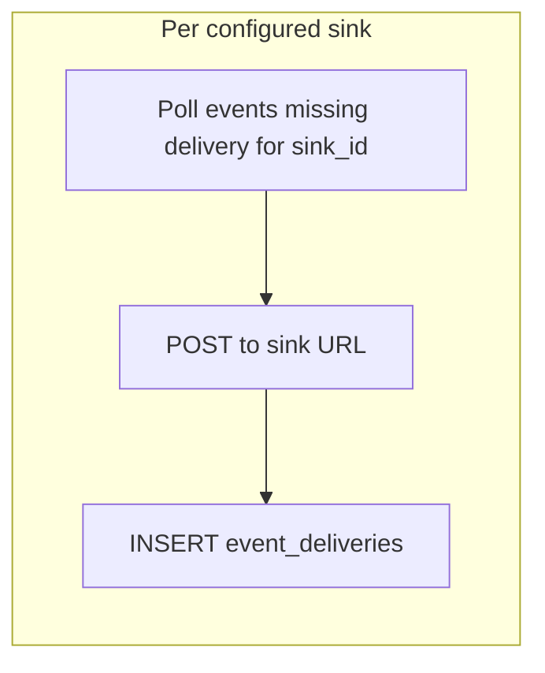

# ADR 030: Events API, Retention, and External Export

> **Status:** Proposed
> **Date:** 2026-07-03
> **Context:** Operator and integrator access to the wide event audit stream
> **Builds on:** [ADR 029](029-wide-events-internal-audit-primitive.md), [ADR 027](027-cursor-based-pagination.md)
> **Related:** [resource-map](../design/api/resource-map.md)

## Context

[ADR 029](029-wide-events-internal-audit-primitive.md) defines the internal wide
event model: one `events` table, two Go emission paths, and deny-by-default PII
policy. Operators and external systems also need:

- A **query API** for incident response and regulatory review.
- **Reliable export** to one or more external sinks before local retention purges
  rows.

Classic ZITADEL exposes events via the Event API and supports SIEM streaming.
nextgen consolidates identity events and admin/configuration changes into a
**single `/events` endpoint** filtered by `category`, replacing the earlier
split between `/events` and `/audit_events` in the resource map sketch.

## Decision

### 1. Unified `/events` API

One list endpoint and one get-by-id endpoint cover all event categories.

```http
GET /events?project_id=…
         &category=…
         &event_type=…
         &actor_id=…
         &client_id=…
         &session_id=…
         &flow_id=…
         &request_id=…
         &fingerprint=…
         &entity_type=…
         &entity_id=…
         &created_after=…
         &created_before=…
         &page_token=…

GET /events/{id}
```

**Filter semantics:**

| Parameter | Type | Notes |
|-----------|------|-------|
| `project_id` | required (implicit from credential scope) | Tenancy boundary |
| `category` | enum, repeatable | `request`, `auth`, `session`, `admin`, `entity`, `signal` |
| `event_type` | string, repeatable | Exact match; prefix filter (`user.`) is a future extension |
| `actor_id` | string | Who triggered the event |
| `client_id` | string | Application or agent |
| `session_id` | string | Session correlation |
| `flow_id` | string | Login flow correlation |
| `request_id` | string | HTTP request correlation |
| `fingerprint` | string | Device correlation |
| `entity_type` | string | Resource type affected |
| `entity_id` | string | Resource ID affected |
| `created_after` | RFC 3339 timestamp | Inclusive lower bound |
| `created_before` | RFC 3339 timestamp | Exclusive upper bound |
| `page_token` | opaque string | [ADR 027](027-cursor-based-pagination.md) cursor |

**Response shape** (list items):

```json
{
  "id": "123456789",
  "project_id": "proj_abc",
  "event_type": "auth.token.issued",
  "category": "auth",
  "created_at": "2026-07-03T12:00:00Z",
  "actor_id": "user_xyz",
  "actor_type": "human",
  "entity_type": "token",
  "entity_id": "987654321",
  "client_id": "app_dashboard",
  "token_id": "tok_abc",
  "delegation_type": "direct",
  "fingerprint": "fp_device123",
  "request_id": "req_128bit_hex",
  "session_id": "sess_456",
  "flow_id": "",
  "payload": { "scope": ["openid", "profile"] },
  "metadata": {}
}
```

`GET /events/{id}` may additionally include delivery status (RECOMMENDED):

```json
{
  "deliveries": [
    { "sink_id": "siem", "delivered_at": "2026-07-03T12:00:05Z" },
    { "sink_id": "local-collector", "delivered_at": "2026-07-03T12:00:05Z" }
  ]
}
```

- `payload` and `metadata` are returned **as stored** — already redacted at emit
  time per [ADR 029 §8](029-wide-events-internal-audit-primitive.md).
- List response wraps items in `{ "data": [...], "next_page_token": "..." }` per
  [ADR 027](027-cursor-based-pagination.md). No total count. List omits
  `deliveries` to keep payloads small.

**Pagination:** Keyset cursor on `(created_at, id)` within `project_id`,
consistent with [ADR 027](027-cursor-based-pagination.md) and v2 storage list
options.

**Permissions:** Callers require an `events.read` permission (exact RBAC shape
TBD — reference platform authz when specified). Team-scoped credentials may
restrict list results to events where `actor_id` or affected resources belong
to the credential's team.

**OpenAPI:** A design sketch may live under `docs/design/api/` until the
endpoint is added to `api/openapi/`. Implementation is out of scope for this ADR.

**Removed:** `/audit_events` and `/audit_events/{id}`. Admin and configuration
events use `category=admin` on `/events`.

### 2. Retention and immutability

Events are append-only within their retention window.

**Application DB role:**

- `INSERT` and `SELECT` on `events` — no `UPDATE` or `DELETE` from application
  code during normal operation.
- `INSERT` on `event_deliveries` — shipper only.
- The retention background job uses a dedicated role with `DELETE` permission on
  `events` and `event_deliveries`.

**Retention policy:**

- Configurable per deployment via server config (suggested default: **30 days**).
- Background job deletes event rows only when **every enabled sink** has a
  delivery record and the retention window has elapsed:

```sql
DELETE FROM zitadel_nextgen.events e
WHERE e.project_id = $1
  AND e.created_at < now() - $retention_interval
  AND NOT EXISTS (
    SELECT 1 FROM configured_sinks s
    WHERE NOT EXISTS (
      SELECT 1 FROM zitadel_nextgen.event_deliveries d
      WHERE d.project_id = e.project_id
        AND d.event_id = e.id
        AND d.sink_id = s.id
    )
  );
```

(`configured_sinks` is the in-memory set of enabled sink IDs from server config;
disabled or removed sinks do not block retention.)

- Events missing delivery to any enabled sink are **never purged** — this
  prevents data loss when a shipper is down or a sink is misconfigured.
- Long-term compliance archive is the **operator's responsibility** once events
  are exported to SIEM, object storage, or another durable sink.

**Immutability scope:** Event content is immutable for the duration rows remain
in the database. Retention purge is an explicit, scheduled operation — not an
application UPDATE that alters event content.

Link to [ADR 024](024-user-team-lifecycle-ownership.md): user/team lifecycle
purge policies are separate from event retention; this ADR does not define
user-data purge windows.

### 3. External export (per-sink delivery)

A background **shipper** delivers events to configured external sinks before
retention deletes them. Delivery is tracked per sink in a companion table:

```sql
CREATE TABLE zitadel_nextgen.event_deliveries (
    project_id      TEXT        NOT NULL
    , event_id      BIGINT      NOT NULL
    , sink_id       TEXT        NOT NULL   -- config name, e.g. "siem", "local-collector"
    , delivered_at  TIMESTAMPTZ NOT NULL DEFAULT now()
    , PRIMARY KEY (project_id, event_id, sink_id)
    , FOREIGN KEY (project_id, event_id)
        REFERENCES zitadel_nextgen.events (project_id, id)
);
```



**Shipper behavior:**

- One shipper loop **per configured sink** (or one loop iterating sinks).
- Poll: events with no `event_deliveries` row for that `sink_id`.
- Deliver batch to the sink (webhook POST or stdout JSON).
- On success: `INSERT INTO event_deliveries ...` (idempotent via primary key).

**Delivery semantics:**

- At-least-once delivery. Consumers must be **idempotent** on `event.id`.
- Shipper retries on transient failure without inserting a delivery row.
- Duplicate external delivery is acceptable; missing delivery is not.
- Duplicate `INSERT` into `event_deliveries` conflicts on the primary key and is
  a no-op.

**Supported sink patterns (v1 minimum):**

| Sink | Use case |
|------|----------|
| **Webhook** (HTTPS POST) | SIEM, SOAR, custom integrators |
| **Stdout JSON** | Sidecar log collectors (self-hosted default) |

Future sinks (Pub/Sub, S3, Kafka) follow the same shipper interface without
changing the event schema.

**Configuration sketch:**

```yaml
events:
  retention: 720h          # 30 days
  shipper:
    enabled: true
    batch_size: 500
    interval: 10s
    sinks:
      - id: siem
        type: webhook
        url: https://siem.example.com/zitadel/events
        headers:
          Authorization: "Bearer ${SIEM_TOKEN}"
      - id: local-collector
        type: stdout
```

Each sink's `id` is the `sink_id` stored in `event_deliveries`.

### 4. Pre-claim and export

Per [claim-flow](../design/platform/claim-flow.md) and
[ADR 029](029-wide-events-internal-audit-primitive.md), pre-claim projects emit
no events. The shipper and `/events` API return empty results for unclaimed
projects. No retroactive backfill.

## Non-goals

- Event mutation API (corrections are new events, not updates).
- Real-time push subscriptions (webhook shipper is pull-based batching; SSE
  is a future extension).
- Cross-project event search (always scoped to `project_id`).

## Consequences

### Positive

- Single API surface simplifies SDK and SIEM integration vs split
  `/events` + `/audit_events`.
- Per-sink `event_deliveries` supports multiple subscribers without a single
  `shipped_at` timestamp.
- Retention gated on all enabled sinks prevents premature purge while any
  subscriber is behind.
- Category filter maps directly to compliance use cases (auth vs admin vs
  entity).

### Negative / Risks

- **Webhook reliability:** at-least-once delivery requires consumer idempotency;
  document clearly.
- **Undelivered backlog:** if any shipper is down, events accumulate and are not
  purged — disk growth until all sinks catch up.
- **Request event volume:** high-traffic projects generate large `/events` result
  sets when filtering `category=request`; operators should prefer SIEM export
  over repeated full scans.
- **Permissions TBD:** `events.read` RBAC shape must align with platform authz
  before the API ships.
- **Retention SQL complexity:** purge must account for the current enabled-sink
  set; removing a sink from config should not strand undeliverable events
  indefinitely (implementation should treat removed sinks as non-blocking).

## Related ADRs

| ADR | Relationship |
|-----|--------------|
| [029 Wide Events Internal Model](029-wide-events-internal-audit-primitive.md) | Table schema, categories, emission, PII |
| [027 Cursor-Based Pagination](027-cursor-based-pagination.md) | List pagination contract |
| [024 User/Team Lifecycle](024-user-team-lifecycle-ownership.md) | Lifecycle purge vs event retention |
| [028 Storage v2 Statements](028-storage-v2-statements-and-dialects.md) | v2 port required before events exist for an entity |
