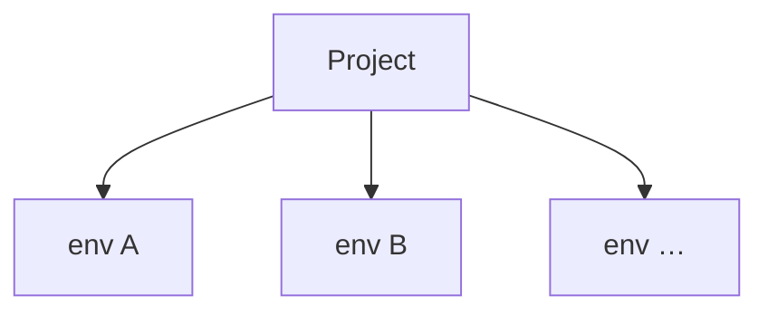

# ADR 031: Environment Releases for Configuration Resources

> **Status:** Draft
> **Date:** 2026-07-07
> **Context:** Multi-environment lifecycle for source-controlled configuration

## Status quo

Today the platform has no notion of environments. A project is a single flat scope, and every configuration change applies directly on the one running instance of that project.

Configurable resources: user schemas, flow definitions, (future) IdPs, branding, apps, policies, each have their own CRUD APIs. User schemas already have a revisions mechanism (server-assigned opaque ids, grouped by `objectType`), and other kinds will grow their own as the need arises. Each resource is versioned in isolation; there is no cross-resource notion of "the state of the project at some point in time."

Cross-resource references are stored as concrete ids on the referencing side. A flow definition's `user_schema` field carries an opaque schema id like `sch_01KWHF…`. 

```json
// flow definition
{
  "name": "default-login",
  "user_schema": "sch_01KX2QE1K0YJKP0JTN428A6DPB" // points to a revision of object-type: human-user
  // ...
}
```

When the user edits the schema, the server allocates a new id. The flow file keeps pointing at the previous one, there is no way to write "the current `human-user` schema" in the flow, only "this specific revision." Adopting the new schema is a two-step change: edit and apply the schema, then edit the flow file to substitute the new id and apply it again.


`zitadel apply` is a client-side orchestrator over those per-resource APIs. It walks `.zitadel/`, computes what changed, and issues one API call per changed resource (e.g. `POST /schemas`). There is no atomicity: a run that fails halfway through leaves the server holding a partially updated state.

## Decision

Configuration changes are bundled as immutable **releases**. A release pins a specific revision of every resource it includes. **Environments** are runtime slots on a project, each running one release at a time, the same release can be deployed to any number of environments unchanged.


The three subsections below define each concept: what an environment is, what a release is, and how the two relate. Concrete surfaces (CLI, API, release bundle format) follow further down.

### Environments

An environment is a runtime slot of a project. Each environment has its own currently applied release. A project has one or more environments; every environment belongs to exactly one project.



> **Scope note.** This ADR treats environments as opaque runtime slots that consume releases. Environment internals are not this ADR's concern:
>
> - naming and count;
> - lifecycle (creation, retirement, auto-collection);
> - per-environment values (base URLs, secrets, custom domains);
> - security semantics of specific environment classes (see [`docs/design/api/security-and-origins.md`](../design/api/security-and-origins.md));
> - promotion mechanics to protected environments.
>
> All of these are specified elsewhere or in follow-up ADRs.

### Releases

Every configurable resource must be revisioned. A content change produces a new immutable revision; previous revisions stay addressable indefinitely. User schemas already work this way (#456); other kinds must adopt the same model before they can participate in a release.

A release is a snapshot of the project's configuration. It records exactly which revision of each resource is included, so activating the release on any environment produces a known, self-consistent runtime state.

For example, release `rel_2026-07-08_14:22` might contain:

| Kind      | Handle                       | Revision                   |
|---        |---                           |---                         |
| schema    | `objectType` = `human-user`  | `sch_01KWHF18816ZQE…`      |
| flow      | `name` = `default-login`     | `flowdef_01KWHG09JXA…`     |
| idp       | `name` = `google`            | `idp_01KWH3B72K7M…`        |
| branding  | `name` = `default`           | `brand_01KWH1P4MYS…`       |
| app       | `name` = `web`               | `app_01KWJC2B78ZQ…`        |
| policy    | `name` = `password`          | `pol_01KWHF3XY6RN…`        |

The "handle" is the field each resource kind uses as its stable identifier across revisions. For example, schemas use `objectType`.

**A release is a closed boundary.** An environment sees only what is inside its currently activated release: resources outside the release are invisible, and drafted revisions on the server that never made it into a release do not exist at runtime. Per-resource CRUD (`POST /schemas`, `PUT /flow_definitions/:id`, …) operates outside any release.

> Exception: users carry their own user-schema revision. A user record persists the sch_… id of the user-schema revision it was created against.

That boundary is what lets resources inside a release reference each other by their stable **handle** instead of by a concrete revision id. A flow definition inside a release writes:

```json
{
  "name": "default-login",
  "user_schema": "human-user",
  "steps": [ /* ... */ ]
}
```

There is no ambiguity about which `human-user` schema this points to: it's whichever revision of the `human-user` schema this same release contains.

This also removes the two-step change problem from the status quo. A schema edit and its dependent flow now travel in the same release, referring to each other by handle.

Releases are project-scoped and immutable. They exist on their own, and are not tied to an environment at construction time.

### Environments and releases

TBD: what is the best terminology? 1: environment **activates** a release, 2: release is **applied** to an environment, 3: a release is **deployed** to an environment, 4: a release is **runs** on an environment

- An environment runs exactly one release at any moment. Assigning a release atomically replaces the previous one.
- A release can run on any number of environments at the same time. Releases are project-scoped artifacts, not environment-scoped. Activating the same release id on dev, staging, and prod is normal; each environment holds an independent pointer to the same release.

Workflows:

- **Promotion** — activating a release that already runs on one environment onto another (e.g. dev → staging → prod). No new release is created.
- **Rollback** — activating a prior release on the same environment. No new release is created; the environment's pointer moves back to a release that ran there earlier.

Every activation is recorded per environment. The log is exposed via `GET /releases?env=<env>`.

---

The sections that follow specify the concrete surfaces: how the CLI orchestrates `apply`, what the API endpoints look like, and the release bundle format on the wire.

## Release lifecycle

### CLI

- `zitadel apply [--env <env>]`: packages `.zitadel/` and creates a release (`POST /configuration-releases`).
  - With `--env`, the CLI then activates the release on that environment (`PATCH /environments/{env}`). `--env` is required in non-interactive mode;
  - without it, the CLI lists environments (`GET /environments`) and prompts the user to pick one or defer activation.
- `zitadel promote --env <env> --from <release-id>`: activate an existing release on a different environment.
- `zitadel rollback --env <env> --to <release-id>`: activate a prior release on the current environment.
- `zitadel releases list`: releases in the project, newest first.
- `zitadel env list`: environments and each one's currently activated release.

### API

Three groupings, in order of layering: `releases` (primary resource), `environments` (runtime slots), and `configuration-releases` (CLI orchestrator entry point).

#### `releases`

The canonical resource. A release is project-scoped and immutable; these endpoints construct and read them.

| Endpoint                       | Purpose                                                                                                                                                                     |
|---                             |---                                                                                                                                                                          |
| `POST /releases`               | Assemble a release from existing revision ids. Payload is a list of `(kind, handle, revision_id)` tuples. No new revisions minted. Validates handle references and templates. |
| `GET /releases`                | List releases in the project, newest first.                                                                                                                                 |
| `GET /releases?env=<env>`      | List releases activated on `<env>`, newest first. The first row is the currently active release; the rest is the audit log.                                                 |
| `GET /releases/{release_id}`   | Read one release.                                                                                                                                                           |

#### `environments`

Environments hold a pointer to the release they currently run. Activation is expressed as an update on the environment.

| Endpoint                       | Purpose                                                                                                                                                    |
|---                             |---                                                                                                                                                         |
| `GET /environments`            | List every environment with its currently activated release id. Used by `zitadel apply` in interactive mode to prompt for an activation target.            |
| `GET /environments/{env}`      | Read one environment.                                                                                                                                      |
| `PATCH /environments/{env}`    | Update the environment. Setting `current_release_id` activates that release; server resolves `${env.X}` and `${secrets.Y}` templates before applying.      |

#### `configuration-releases` — CLI orchestrator entry point

A single endpoint that backs `zitadel apply`. It accepts a source-content bundle (the contents of `.zitadel/`), allocates a new revision for every changed resource, resolves handle references, and constructs a release, all in one **transaction**.

| Endpoint                          | Purpose                                                                                                                                                                    |
|---                                |---                                                                                                                                                                         |
| `POST /configuration-releases`\*  | Build a release from a source-content bundle in one transaction. Allocates revisions, resolves handle references, validates, creates the release. Important: this endpoint does not activate the release in any environments. |

TODO: Which endpoint would be used when a new release is created via the UI?

\* Endpoint name is a placeholder; a shorter form may replace it.

Direct per-resource CRUD (`POST /schemas`, `PUT /flow_definitions/:id`, …) remains available and creates a new revision on write. It does not touch any environment's activated release.

## Release bundle

`zitadel apply` serializes the contents of `.zitadel/` into a single JSON bundle, one key per resource kind, and submits it to `POST /configuration-releases`:

```json
{
  "schemas":  [ { "objectType": "human-user", "content": { /* JSON Schema */ } } ],
  "flows":    [ { "name": "default-login", "user_schema": "human-user", "content": { /* flow definition */ } } ],
  "idps":     [ ],
  "brandings":[ ],
  "apps":     [ ],
  "policies": [ ]
}
```

Kinds not present in the local project are sent as empty arrays. Each entry carries the resource's stable handle and its content. Cross-resource references are by handle, for example, the flow's `user_schema` field carries `"human-user"`, not a concrete `sch_…` id.

### Endpoint responsibilities

`POST /configuration-releases` runs the whole construction in one transaction:

- allocate a new immutable revision for every changed resource in the bundle,
- resolve cross-resource references (by handle) to the newly allocated revision ids (TBD),
- validate the release as a closed set,
- create the release,
- return `{ release_id, revision_ids[] }`.

Either the whole bundle is commited and a release exists, or nothing changes on the server. That is the atomicity guarantee the current per-resource orchestration cannot offer.

`POST /releases` skips the revision-allocation step: the caller supplies revision ids drafted through other paths. Same validation, same output shape. It exists because a release is fundamentally a snapshot of revision ids; content is only in the picture when the caller is source of truth.

Neither endpoint activates the release. Activation is a separate `PATCH /environments/{env}` call with `{ current_release_id: <returned> }`, preserving the decision that releases exist on their own, the same release can later be promoted unchanged. The CLI's `zitadel apply` orchestrates the two calls internally.

An environment either runs the previous release or the new one, never a mixture. A partial failure (release constructed, activation refused) leaves the environment unchanged and the release available for a later attempt.

## CLI and drift

Direct writes to the per-resource CRUD APIs remain available. Editing a resource through the dashboard, MCP, or a direct API call produces a new immutable revision but leaves every environment's activated release unchanged. The change is saved, not live. To make it live, the user constructs a new release that includes the drafted revision and activates it, the same pattern as Vercel's "you edited env vars, redeploy to apply."

The CLI is source of truth for release construction. `zitadel apply` packages `.zitadel/` as-is; drafts made outside the CLI are not incorporated and become superseded by the next apply. `zitadel plan` compares the local bundle against server-side drafts and surfaces any drafts not represented locally, so the user can pull them into `.zitadel/` before applying — or deliberately overwrite them.

## Out of scope

- **Approval mechanics for release activation.** Whether some environments require reviewer approval before a release is activated, and the concrete approval surface (who can approve, how a pending activation is represented, notification/UI shape), is a separate ADR alongside the RBAC/identity model.
- **Retention policy** for superseded releases and their revisions.
