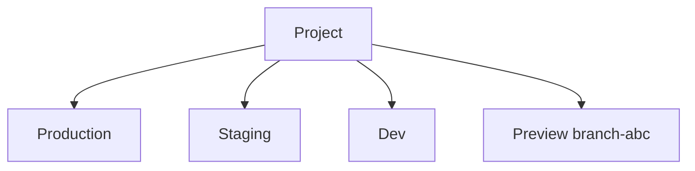

# ADR 031: Configuration Environments

> **Status:** Draft
> **Date:** 2026-07-07
> **Context:** Multi-environment lifecycle for source-controlled configuration

## Status quo

Today the platform has no notion of environments. A project is a single flat scope, and every configuration change lands directly on the one running instance of that project.

Configurable resources — user schemas, flow definitions, IdPs, branding, apps, policies — each have their own CRUD APIs. Where lifecycle matters, they carry it individually: user schemas already have a revisions mechanism (server-assigned opaque ids, grouped by `objectType`), and other kinds will grow their own as the need arises. Each resource is versioned in isolation; there is no cross-resource notion of "the state of the project at some point in time."

Cross-resource references are stored as concrete ids on the referencing side. A flow definition's `user_schema` field carries an opaque schema id like `sch_01KWHF…`. When the user edits the schema, the server allocates a new id, but the flow file keeps pointing at the previous one — there is no way to say "the current `human-user` schema" in the flow, only "this specific revision." Adopting the new schema is therefore a two-step change: first edit and apply the schema (the CLI prints the new id), then edit the flow file to substitute the new id and apply again. Editing a schema without touching its flows means the flows silently keep validating against the old revision.

`zitadel apply` is a client-side orchestrator over those per-resource APIs. It walks `.zitadel/`, computes what changed, and issues one API call per changed resource. There is no atomicity: a run that fails halfway through leaves the server holding a partially updated state, and the CLI's local `state.json` has to reconcile on the next run. The server has no visibility into which changes moved together — it sees N independent writes.

## Environments

An environment is a named runtime slot of a project that carries its own applied configuration and its own environment-specific values (base URLs, secret references, custom domain). A project can have any number of environments; every environment belongs to exactly one project. Names are project-scoped and chosen by the team.



Two lifecycles share the same underlying model:

- **Named-stable environments** — `production`, `staging`, `dev`, or any name the team chooses. Long-lived, created explicitly by the user, listed and inspected via CLI or dashboard.
- **Preview environments** — short-lived, typically one per PR branch. Auto-created on first apply against an unknown environment name; auto-collected after an idle window.

Both categories support the same operations. The difference is operational (approval requirements, retention, garbage collection), not structural.

> **Scope note.** This ADR names environments as a concept and fixes their relationship to releases (below). It does **not** specify the environment data model (schema, storage layout), the environment lifecycle (creation, retirement, auto-collection rules), or the mechanics of release promotion to protected environments (approval flow, notifications, propagation). Those are separate follow-up ADRs.

## Releases

Every configurable resource is revisioned. A content change produces a new immutable revision; previous revisions stay addressable indefinitely.

A release is a snapshot of the project's configuration at one point in time. It records exactly which revision of each resource is included, so activating the release on any environment gives that environment a known, self-consistent configuration to run.

For example, release `rel_2026-07-08_14:22` might contain:

| Kind      | Handle                       | Revision                   |
|---        |---                           |---                         |
| schema    | `objectType` = `human-user`  | `sch_01KWHF18816ZQE…`      |
| flow      | `name` = `default-login`     | `flowdef_01KWHG09JXA…`     |
| idp       | `name` = `google`            | `idp_01KWH3B72K7M…`        |
| branding  | `name` = `default`           | `brand_01KWH1P4MYS…`       |
| app       | `name` = `web`               | `app_01KWJC2B78ZQ…`        |
| policy    | `name` = `password`          | `pol_01KWHF3XY6RN…`        |

The "handle" is the field each resource kind uses as its stable identifier across revisions — the customer-chosen `objectType` for schemas, `name` for the others. Renaming a handle is a breaking change; the platform correlates a resource's revision history by it.

The release also validates cross-resource references: the flow's `user_schema` points at the schema revision in the same release, and both were checked to be structurally compatible when the release was constructed.

Releases are project-scoped and immutable. They exist on their own — created once, referenced anywhere — and are not tied to an environment at construction time.

## Environments and releases

An environment activates a release. Activation is a separate operation from release creation — a release must exist before it can be applied, and one release can be activated on any number of environments.

- **Apply** — construct a new release from `.zitadel/` and activate it on one environment. Atomic.
- **Promotion** — activate an existing release on another environment. No new revisions minted; no new release created. Dev and prod share the same release identity end-to-end.
- **Rollback** — activate a prior release on the current environment. The release log does not grow.

## CLI and drift

Direct writes to the per-resource CRUD APIs remain available. Editing a resource through the dashboard, MCP, or a direct API call produces a new immutable revision but leaves the environment's currently-activated release unchanged. The change is saved, not live. To make it live, the user constructs a new release containing the drafted revision and activates it — the same pattern as Vercel's "you edited env vars, redeploy to apply."

The CLI is source of truth for release construction. `zitadel apply` packages `.zitadel/` as-is; drafted revisions made outside the CLI are not merged and become superseded by the next apply. `zitadel plan` compares the local bundle against server-side drafts and surfaces any drafted revisions not represented locally, so the user can pull them into `.zitadel/` before applying or deliberately overwrite them.

## Release lifecycle

### CLI

- `zitadel apply --env <env>` — packages `.zitadel/`, creates a new release in one transaction (`POST /apply`), then activates it on the target env (`PATCH /environments/{env}`). Two API calls, but the environment is only ever running one release at a time — if activation fails, the previous release keeps running and the newly created release remains available to activate later. Replaces today's per-resource orchestrator.
- `zitadel promote --env <env> --from <release-id>` — activates an existing release on a different environment.
- `zitadel rollback --env <env> --to <release-id>` — activates a prior release on the current environment.
- `zitadel releases list` — project-scoped list of releases, most recent first.
- `zitadel env list` — per-project list of environments and each one's currently activated release.

### API

Project scope is derived from the caller's project secret (as on the existing endpoints), so no `project_id` appears in the URL path. Resources are kept top-level: releases and environments are addressed at `/releases` and `/environments/{env}` respectively, not nested under each other.

- `POST /apply` — construct a release from a source-content bundle in one transaction. Server allocates new revisions for changed resources, resolves cross-resource references by name, records dependency pins, validates structurally, and creates the release. Returns `{release_id, revision_ids[]}`. Payload shape and semantics detailed in [Release bundle](#release-bundle).
- `POST /releases` — construct a release from existing revision ids. Payload is a list of `(kind, name, revision_id)` tuples. Used when the revisions have already been drafted (dashboard edits, MCP calls, an earlier `POST /apply`) and the caller just wants to assemble them into a release. Server validates cross-resource references and structural closure; no revisions are created.
- `GET /releases` — list all releases in the project, most recent first.
- `GET /releases?env=<env>` — list releases activated on the environment, most recent first. The first row is the currently active release; the rest is the audit log.
- `GET /releases/{release_id}` — read a specific release.
- `GET /environments/{env}` — read the environment, including its currently activated release id and env values.
- `PATCH /environments/{env}` — update the environment. Setting `current_release_id` activates a release; server resolves env-value templates, checks that all `${env.X}` and `${secrets.Y}` references are satisfied, applies.

Direct per-resource CRUD (`POST /schemas`, `PUT /flow_definitions/:id`, …) remains available and creates a new revision on write. It does not touch any environment's activated release.

## Release bundle

`zitadel apply` serializes the contents of `.zitadel/` into a single JSON bundle, one key per resource kind, and submits it to `POST /apply`:

```json
{
  "schemas":  [ { "objectType": "human-user", "content": { /* JSON Schema */ } } ],
  "flows":    [ { "name": "default-login", "user_schema": "human-user", "content": { /* flow definition */ } } ],
  "idps":     [ ],
  "brandings":[ ],
  "apps":     [ ],
  "policies": [ ]
}
```

Kinds not present in the local project are sent as empty arrays. Each entry carries the resource's stable handle (`objectType` for schemas, `name` for the others) and the content the server should version. Cross-resource references are by name — the flow's `user_schema` field carries `"human-user"`, not a concrete `sch_…` id. The server resolves each reference to the revision it allocates within this same bundle.

### Endpoint responsibilities

`POST /apply` is the atomic-content path. In one transaction it:

- allocates a new immutable revision for every changed resource in the bundle,
- resolves cross-resource references to the newly allocated revision ids,
- records dependency pins on each dependent revision,
- validates the release structurally as a closed set (all references resolve; all `${env.X}` and `${secrets.Y}` templates are well-formed),
- creates the release,
- returns `{ release_id, revision_ids[] }`.

Either the whole bundle lands and a release exists, or nothing changes on the server. This is the atomicity guarantee the current per-resource orchestration cannot offer.

`POST /releases` is the same construction with the revision-allocation step skipped — the caller supplies revision ids that were drafted through other paths (dashboard edits, MCP calls, an earlier `POST /apply`). Same validation, same output shape. It exists because a release is fundamentally a snapshot of revision ids; content is only in the picture when the caller is source of truth.

Neither endpoint activates the release. The release is created independent of any environment; activating it is a separate `PATCH /environments/{env}` call with `{ current_release_id: <returned> }`. This preserves the design decision that releases exist on their own — the same release can later be promoted to other environments unchanged. The CLI's `zitadel apply` orchestrates the two-step "create + activate" internally; other clients (dashboard, CI pipelines) can compose the calls differently.

The env-level atomicity guarantee holds regardless: the environment either runs the previous release or the new one, never a mixture. A partial failure (release constructed, activation refused) leaves the environment unchanged and the release available for a later attempt.

## Out of scope

- **Production approval mechanics.** The rule that production activations require reviewer approval is asserted here, but the concrete approval surface (who can approve, how a pending activation is represented, notification/UI shape) is a separate ADR alongside the RBAC/identity model.
- **RBAC.** Who can create releases, who can activate them per environment, who can create/delete environments. Same follow-up ADR.
- **Preview environment auto-collection.** Idle window, per-project quota, delete-notification webhooks.
- **Retention policy** for superseded releases and their revisions.
- **Migration of existing configurations.** The project is pre-production; no backwards-compat shims are planned.
- **Dashboard-side release construction.** How the dashboard shows drift after direct writes, and how it offers to construct a release from the drafted revisions.
