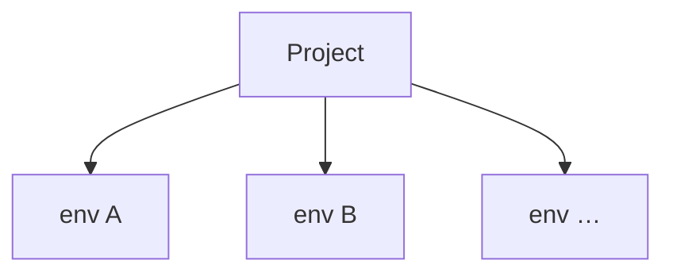
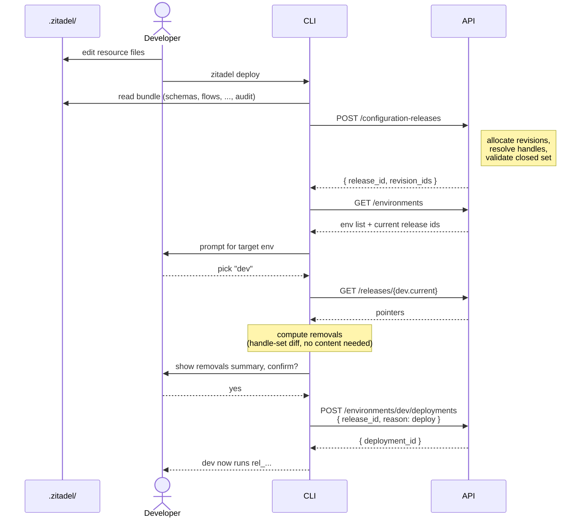
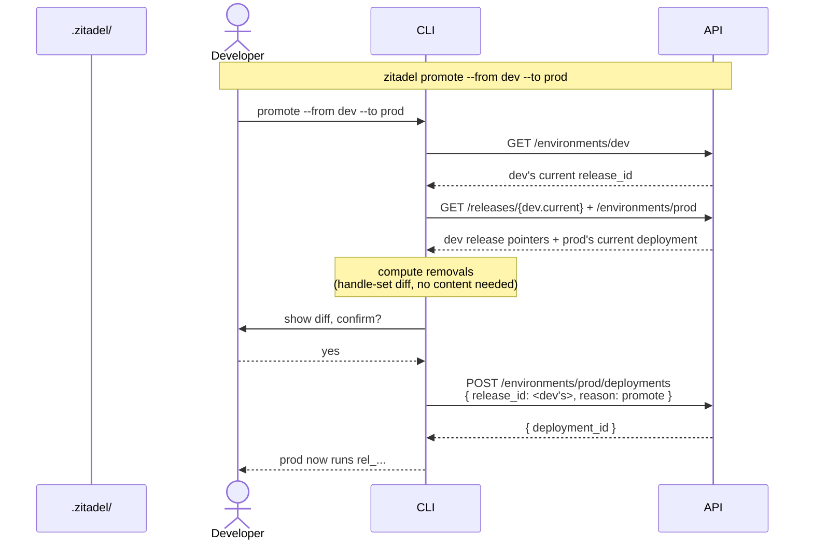
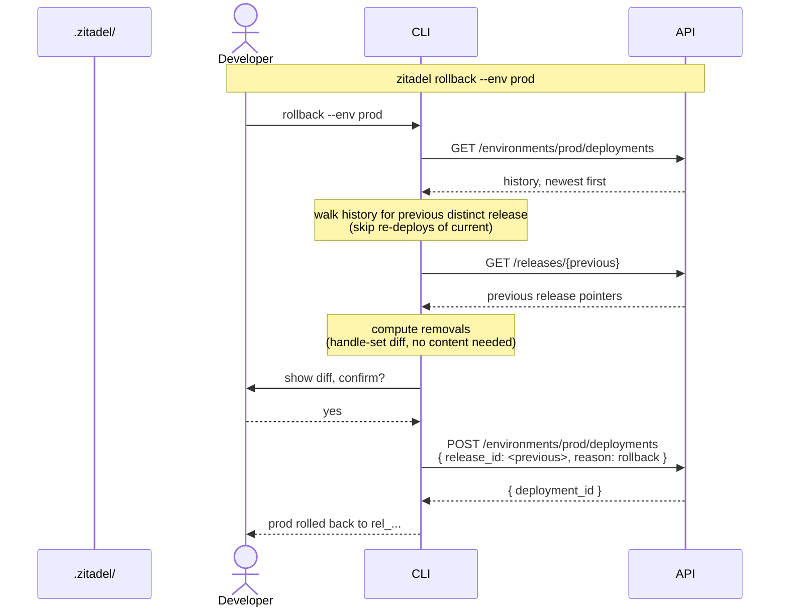
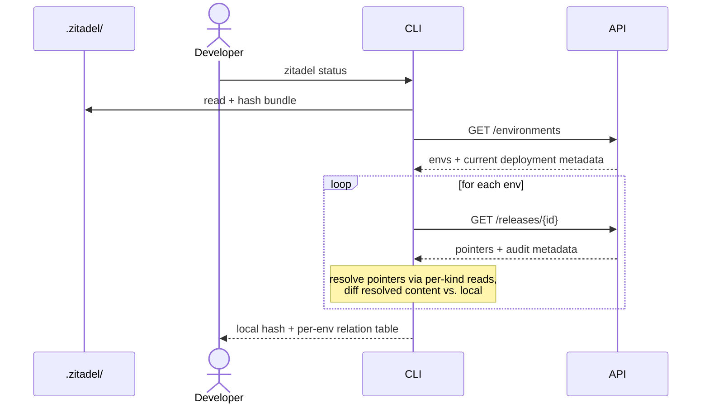
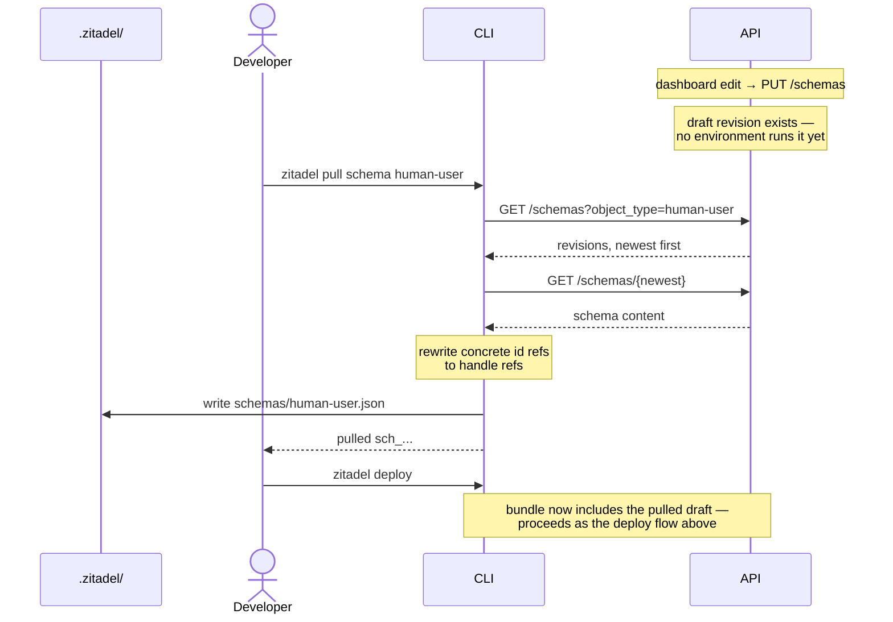

# ADR 035: Environment Releases for Configuration Resources

> **Status:** Accepted
> **Date:** 2026-07-07
> **Context:** Multi-environment lifecycle for source-controlled configuration

## Status quo

Today the platform has no notion of environments. A project is a single flat scope, and every configuration change applies directly on the one running instance of that project.

Configurable resources: user schemas, flow definitions, (future) IdPs, branding, apps, policies, each have their own CRUD APIs. User schemas already have a revisions mechanism (server-assigned opaque ids, grouped by `objectType`), and other kinds will grow their own as the need arises. Each resource is versioned in isolation; there is no cross-resource notion of "the state of the project at some point in time."

Cross-resource references are stored as concrete ids on the referencing side. A flow definition's `user_schema` field carries an opaque schema id like `sch_01KWHF…`. 

```json
// flow definition
{
  "name": "default-login",
  "user_schema": "sch_01KX2QE1K0YJKP0JTN428A6DPB" // points to a revision of object-type: human-user
  // ...
}
```

When the user edits the schema, the server allocates a new id. The flow file keeps pointing at the previous one, there is no way to write "the current `human-user` schema" in the flow, only "this specific revision." Adopting the new schema is a two-step change: edit and apply the schema, then edit the flow file to substitute the new id and apply it again.


`zitadel apply` is a client-side orchestrator over those per-resource APIs. It walks `.zitadel/`, computes what changed, and issues one API call per changed resource (e.g. `POST /schemas`). There is no atomicity: a run that fails halfway through leaves the server holding a partially updated state.

## Decision

Configuration changes are bundled as immutable **releases**. A release pins a specific revision of every resource it includes. **Environments** are runtime slots on a project; each runs one release at a time, and the same release can be deployed to any number of environments unchanged. A **deployment** is the record of a release being made live on an environment.


The three subsections below define each concept: what an environment is, what a release is, and how the two relate. Concrete surfaces (CLI, API, release bundle format) follow further down.

### Environments

An environment is a runtime slot of a project. Each environment runs the release from its latest deployment. A project has one or more environments; every environment belongs to exactly one project.



> **Scope note.** This ADR treats environments as opaque runtime slots that consume releases. Environment internals are not this ADR's concern:
>
> - naming and count;
> - lifecycle (creation, retirement, auto-collection);
> - per-environment values (base URLs, secrets, custom domains);
> - security semantics of specific environment classes (see [`docs/design/api/security-and-origins.md`](../design/api/security-and-origins.md));
> - promotion mechanics to protected environments.
>
> All of these are specified elsewhere or in follow-up ADRs.

### Releases

Every configurable resource must be revisioned. A content change produces a new immutable revision; previous revisions stay addressable indefinitely. User schemas already work this way (#456); other kinds must adopt the same model before they can participate in a release.

A release is a snapshot of the project's configuration. It records exactly which revision of each resource is included, so activating the release on any environment produces a known, self-consistent runtime state.

For example, release `rel_01KX3RG8A7F0N9WD3P2E4YM5C1` might contain:

| Kind      | Handle                       | Revision                   |
|---        |---                           |---                         |
| schema    | `objectType` = `human-user`  | `sch_01KWHF18816ZQE…`      |
| flow      | `name` = `default-login`     | `flowdef_01KWHG09JXA…`     |
| idp       | `name` = `google`            | `idp_01KWH3B72K7M…`        |
| branding  | `name` = `default`           | `brand_01KWH1P4MYS…`       |
| app       | `name` = `web`               | `app_01KWJC2B78ZQ…`        |
| policy    | `name` = `password`          | `pol_01KWHF3XY6RN…`        |

The "handle" is the field each resource kind uses as its stable identifier across revisions. For example, schemas use `objectType`.

Each release also records **audit metadata** — who created it, when, and from what source:

- `release_id` — opaque, immutable id assigned at construction time.
- `created_at`, `created_by` — timestamp and identity of the caller who assembled the release.
- `message` — a short caller-supplied summary, analogous to a git commit message. How the CLI sources it (git HEAD, `-m` flag, other) is a CLI-ergonomics follow-up.
- `git_sha` — the source commit the CLI was operating from, when the release was constructed via `POST /configuration-releases`. Enables `git diff <prev-release-sha>..HEAD -- .zitadel/` as an env-diff mechanism.
- `git_dirty` — boolean. `true` when the working tree had uncommitted changes at construction time; `git_sha` in that case points at HEAD but the release content does **not** correspond to that commit exactly. The CLI warns on dirty deploys; consumers of `git diff <sha>..<sha>` should skip the mechanism when either side is `git_dirty`.

These fields are set at construction time and never mutate.

**A release is a closed boundary.** An environment sees only what is inside its current release: resources outside the release are invisible, and drafted revisions on the server that never made it into a release do not exist at runtime. Per-resource CRUD (`POST /schemas`, `POST /flow_definitions`, …) operates outside any release.

> Exception: users carry their own user-schema revision. A user record persists the sch_… id of the user-schema revision it was created against.

That boundary is what lets resources inside a release reference each other by their stable **handle** instead of by a concrete revision id. A flow definition inside a release writes:

```json
{
  "name": "default-login",
  "user_schema": "human-user",
  "steps": [ /* ... */ ]
}
```

There is no ambiguity about which `human-user` schema this points to: it's whichever revision of the `human-user` schema this same release contains.

This also removes the two-step change problem from the status quo. A schema edit and its dependent flow now travel in the same release, referring to each other by handle.

Releases are project-scoped and immutable. They exist on their own, and are not tied to an environment at construction time.

### Environments and releases

Deploying a release to an environment creates a **deployment** — an immutable record linking a release to an environment at a moment in time. Every environment runs the release of its latest deployment.

- An environment runs exactly one release at any moment. Creating a new deployment atomically replaces the previous one.
- A release can be deployed to any number of environments at the same time. Releases are project-scoped artifacts; deploying the same release to dev, staging, and prod is normal, and each environment holds an independent deployment history referencing the same release.

Workflows:

- **Promotion** — deploying a release that already runs on one environment onto another (e.g. dev → staging → prod). No new release is created; a new deployment is recorded on the target environment.
- **Rollback** — deploying a prior release on the same environment. No new release is created; the new deployment references a release the environment ran earlier.

Every deployment is recorded per environment. The log is exposed via `GET /environments/{env}/deployments`.

---

The sections that follow specify the concrete surfaces: how the CLI orchestrates `deploy`, what the API endpoints look like, and the release bundle format on the wire.

## Release lifecycle

### API

Three groupings, in order of layering: `releases` (primary resource), `environments` and their `deployments` (runtime slots and their history), and `configuration-releases` (CLI orchestrator entry point).

#### `releases`

The canonical resource. A release is project-scoped and immutable; these endpoints construct and read them.

| Endpoint                       | Purpose                                                                                                                                                                     |
|---                             |---                                                                                                                                                                          |
| `POST /releases`               | Assemble a release from existing revision ids. Payload is a list of `(kind, handle, revision_id)` tuples. No new revisions minted. Validates handle references and templates. |
| `GET /releases`                | List releases in the project, newest first. Each entry carries audit metadata; pointer tuples are omitted (fetch via `GET /releases/{release_id}`).                         |
| `GET /releases/{release_id}`   | Read one release: audit metadata (`message`, `git_sha`, `created_at`, `created_by`) and the list of `(kind, handle, revision_id)` tuples it pins. Does **not** embed resource content — callers that need content resolve each `revision_id` via per-kind reads (`GET /schemas/{id}`, `GET /flow_definitions/{id}`, …). |

A release owns pointers and audit metadata, not content. Per-kind endpoints stay the single source of truth for resource bytes; a release is the immutable snapshot of *which* revisions belong together. Consumers that need content (e.g. `zitadel status` diffing against local, or a UI rendering a release preview) resolve each pointer themselves. This keeps releases lightweight and avoids duplicating resource storage.

#### `environments` and `deployments`

An environment holds a history of deployments; each deployment references a release. The environment's current release is the release of its newest deployment. Deploying is expressed as creating a deployment on the environment.

| Endpoint                                       | Purpose                                                                                                                                                                             |
|---                                             |---                                                                                                                                                                                  |
| `GET /environments`                            | List every environment with its current deployment (`id`, `release_id`, `deployed_at`, `reason`). Used by `zitadel deploy` in interactive mode to prompt for a deployment target.   |
| `GET /environments/{env}`                      | Read one environment: identity plus its current deployment (`id`, `release_id`, `deployed_at`, `reason`).                                                                            |
| `POST /environments/{env}/deployments`         | Deploy a release to this environment. Payload: `{ release_id, reason, source_environment?, rolled_back_from?, expected_current_deployment_id? }`. `reason` is `deploy` \| `promote` \| `rollback`. See notes below on the optional fields.                                              |
| `GET /environments/{env}/deployments`          | List deployments for this environment, newest first. The first row is the current deployment (whose release is live); the rest is the audit log.                                    |
| `GET /environments/{env}/deployments/{id}`     | Read one deployment: `{ id, release_id, reason, source_environment?, rolled_back_from?, deployed_at, deployed_by }`.                                                                 |

Optional payload fields on `POST .../deployments`:

- **`source_environment`** — set on `reason: promote`. Names the env the release was promoted from.
- **`rolled_back_from`** — set on `reason: rollback`. Points at the deployment id being rolled back from.
- **`expected_current_deployment_id`** — optional optimistic-concurrency check. When provided, the server verifies the env's current deployment matches this id before applying the pointer swap; a mismatch returns `409`. Not persisted; only used to guard against overwriting a deployment the caller didn't expect.

#### `configuration-releases` — CLI orchestrator entry point

Tailored for the CLI: a single endpoint that backs `zitadel deploy` (and `zitadel releases create`). It accepts a source-content bundle (the contents of `.zitadel/`), allocates a new revision for every changed resource, resolves handle references, and constructs a release, all in one **transaction**.

| Endpoint                          | Purpose                                                                                                                                                                    |
|---                                |---                                                                                                                                                                         |
| `POST /configuration-releases`\*  | Build a release from a source-content bundle in one transaction. Allocates revisions, resolves handle references, validates, creates the release. Important: this endpoint does not deploy the release to any environment. |

\* Endpoint name is a placeholder; a shorter form may replace it.

Direct per-resource CRUD (`POST /schemas`, `POST /flow_definitions`, …) remains available and creates a new revision on write. It does not touch any environment's current deployment.

### CLI

`zitadel apply` and `zitadel plan` from [ADR 007](007-gitops-configuration-surface.md) are removed. `deploy` replaces `apply`; `plan` has no replacement — under the release model, releases are immutable artifacts and deployments are atomic pointer swaps, so the Terraform-style plan-then-apply preview frame no longer fits. Removal warnings surface in `deploy`'s confirmation prompt; drift detection lives in `zitadel status`.

**Removal safety.** Before creating a deployment (via `deploy`, `promote`, or `rollback`), the CLI computes what would be removed from the target environment — resources present in its current release but absent from the incoming one — and prints them. In interactive mode the user confirms; in non-interactive mode an explicit `--confirm-removals` flag is required. Deleting `.zitadel/idps/` locally, for example, does not silently drop every idp on the next deploy: the removal is explicit and acknowledged. Local `.zitadel/` (and the incoming release generally) is authoritative, but deletions are never silent.

**Drift.** Two kinds can arise between local `.zitadel/` and the server:

1. **Local vs. an environment's current release.** Your local bundle differs from what an environment is actually running — either because you've edited files and haven't deployed, or because a colleague deployed something you don't have locally.
2. **Local vs. server-side draft revisions.** A dashboard, MCP, or direct-API caller wrote a resource revision that no environment runs. It exists on the server but is inert — invisible at runtime until a release includes it.

The first matters — it's what `zitadel status` reports and `zitadel deploy` reconciles. The second doesn't: a draft revision that never makes it into a release affects nothing. Local `.zitadel/` is source of truth for release construction; drafts made outside the CLI are not incorporated automatically and are effectively superseded by the next deploy. To fold a specific draft into local before deploying, import it with `zitadel pull <kind> <handle>` — that fetches the latest server-side revision of the resource, writes it into `.zitadel/`, and the next `zitadel deploy` includes it in the new release.

The subsections below cover each command's purpose, its wire flow (participants: local files under `.zitadel/`, developer, CLI, API), and an example.

#### `releases create` and `deploy`

Construction and deployment are separate commands so a release can be built once and rolled through multiple environments unchanged — the CI shape "build on merge, walk the same id through dev → staging → prod."

- `zitadel releases create` packages `.zitadel/` and posts to `POST /configuration-releases`. Prints the `release_id`. Does not touch any environment.
- `zitadel deploy --release <release_id> --env <env>` deploys an existing release to an env. No packaging, no construction.
- `zitadel deploy [--env <env>]` (no `--release`) is a convenience that does both: constructs from local, then deploys the returned id to the target env. Backward compatible with the earlier drafts of this ADR and the primary developer workflow.

`--env` is required in non-interactive mode; in interactive mode the CLI lists environments (`GET /environments`) and prompts the user to pick one or defer the deployment. There is no implicit default environment — every deploy explicitly names its target.

**Warn on dirty deploys.** If the working tree has uncommitted changes when `releases create` runs, the CLI prints a warning and records `git_dirty: true` on the release (see [audit metadata](#releases)). The release still constructs; `git_sha` still points at HEAD, but consumers of the "git diff between releases" mechanism should treat dirty releases as opaque.

**Same-content re-run.** `POST /configuration-releases` is idempotent on content — it returns the existing `release_id` when the bundle hashes to a prior release. `zitadel deploy` builds on that: if the target env already runs the release the CLI would deploy, the CLI skips the deployment entirely and prints "nothing to do." `--force` overrides to record a new deployment anyway (useful for future template-re-resolution flows, where the release contents are identical but per-env resolved values may differ).

Interactive path: read the bundle, construct a release atomically, pick a target environment, preview removals, deploy.



Non-interactive variant (`zitadel deploy --env dev`) skips the env-listing and prompt steps; `--confirm-removals` replaces the confirmation dialog.

```
$ zitadel deploy --env dev
Packaging .zitadel/  →  6 resources
POST /configuration-releases        ✓  rel_01KX4B2M8G...
POST /environments/dev/deployments  ✓  deployment_01KX4B2M8H...
dev now runs rel_01KX4B2M8G...
```

#### `promote` and `rollback`

`zitadel promote --from <env> --to <env>` deploys the release currently running on `<from>` to `<to>`. Optional `--release <release-id>` overrides which release to promote.

`zitadel rollback --env <env>` deploys the **previous distinct release** on `<env>` — the most recent release different from the current one, skipping past re-deploys of the current release. Optional `--to <release-id>` targets a specific prior release.

Both create a new deployment referencing an existing release — no construction, no revisions minted. Promote sources the release from another environment's current deployment; rollback sources it from the same environment's deployment history.

**Diff fidelity on promote.** Removal preview (handle-set diff) tells you what will disappear, not what will change. When both releases carry a `git_sha` and neither is `git_dirty`, the CLI additionally prints the exact command that reproduces the field-level diff locally:

```
git diff rel_from.git_sha..rel_to.git_sha -- .zitadel/
```

Optionally the CLI runs it inline if the repo is checked out at a superset commit. That's the moment the release audit metadata pays off — for prod promotions, "what actually changed" beats "what handles were touched."





#### `status`

`zitadel status` shows the local bundle summary plus each environment's currently deployed release and how it relates to local. Read-only, no writes anywhere.



Output aims for scannability: a compact `Local` header, one line per environment (state, running release + audit message, age), and a plain-English summary with next-step suggestions at the bottom.

**Relation states.** Comparing local against an env's current release yields one of four states, not two — the two directions are independent, so both can be non-zero at once:

- `in sync` — same handles, same content per handle.
- `ahead by N` — local has content the env doesn't (edited but not deployed).
- `behind by N` — the env's release has content local doesn't (colleague deployed something you don't have).
- `diverged (+A / -B)` — both directions non-empty. Some resources are ahead, others are behind. Example: you edited the human-user schema locally, and in the meantime a colleague deployed an idp change from their branch. `ahead by 1` and `behind by 1` are both true, and neither on its own tells the whole story.

Example — aligned state. Local matches every environment's current release:

```
$ zitadel status

Local
  main @ 4a5b6c7 (clean) · 6 resources

Environments
  dev       in sync   running rel_01KX3RG8... (2h ago)  "add phone_number to human-user"
  staging   in sync   running rel_01KX2ZJ4... (1d ago)  "initial import"
  prod      in sync   running rel_01KX2ZJ4... (3d ago)  "initial import"

All environments match local. Nothing to do.
```

Example — local ahead of every env. You've edited files but haven't deployed yet:

```
$ zitadel status

Local
  feature/phone-number @ 8d4e1a0 · 6 resources (2 modified)

Environments
  dev       ahead by 2 changes   running rel_01KX3RG8... (2h ago)  "initial import"
  staging   ahead by 2 changes   running rel_01KX2ZJ4... (1d ago)  "initial import"
  prod      ahead by 2 changes   running rel_01KX2ZJ4... (3d ago)  "initial import"

Your local .zitadel/ has 2 resource changes not deployed to any environment yet.
  → zitadel deploy --env dev
```

Example — mid-promotion. Dev is caught up to local; staging and prod haven't been promoted yet:

```
$ zitadel status

Local
  main @ e0f2b8c (clean) · 6 resources

Environments
  dev       in sync              running rel_01KX4B2M... (1h ago)  "add phone_number to human-user"
  staging   ahead by 1 change    running rel_01KX3RG8... (2d ago)  "initial import"
  prod      ahead by 3 changes   running rel_01KX2ZJ4... (5d ago)  "initial import"

Local matches dev. Staging and prod are running older releases.
  → zitadel promote --from dev --to staging
  → zitadel promote --from dev --to prod
```

Example — local behind. A colleague deployed something you don't have locally:

```
$ zitadel status

Local
  main @ 4a5b6c7 (clean) · 6 resources

Environments
  dev       behind by 1 change   running rel_01KX5N7C... (20m ago)  "swap google idp for corporate SSO"
  staging   in sync              running rel_01KX2ZJ4... (1d ago)   "initial import"
  prod      in sync              running rel_01KX2ZJ4... (3d ago)   "initial import"

dev is running content not in your local .zitadel/. This usually means a
colleague deployed from a branch you don't have, or the release was
assembled from server-drafted revisions (via UI or MCP).

  → git pull                          if the deploy came from a branch you don't have
  → zitadel pull <kind> <handle>      if the release was assembled from server drafts
```

Example — diverged. You edited the human-user schema locally; in the meantime a colleague deployed an idp swap:

```
$ zitadel status

Local
  feature/phone-number @ 8d4e1a0 · 6 resources (1 modified)

Environments
  dev       diverged (+1 / -1)   running rel_01KX5N7C... (25m ago)  "swap google idp for corporate SSO"
  staging   ahead by 1 change    running rel_01KX2ZJ4... (1d ago)   "initial import"
  prod      ahead by 1 change    running rel_01KX2ZJ4... (3d ago)   "initial import"

dev has content you don't (idps/google), and you have content dev doesn't
(schemas/human-user). Deploying now would revert dev's idp swap.

  → zitadel pull idp google     to fold dev's idp change into local
  → zitadel deploy --env dev    once local has everything you want in the next release
```

#### `pull`

`zitadel pull <kind> <handle>` fetches the newest server-side revision of a specific resource and writes it into `.zitadel/`. Use it when you knowingly edited a resource outside the CLI and want to fold the change into your local project before deploying. Targeted only; there is no bulk mode.

Composite flow: someone edits a resource via the dashboard (creating a server-side draft revision that no environment sees yet); the developer knows what they touched and pulls that specific resource, then deploys to fold it into a release.

> **Enumerating drafts is a follow-up.** Drafts are enumerable via the per-kind list endpoints (`GET /schemas?object_type=…`, etc.), so a discovery UX like `zitadel status --include-drafts` or `zitadel pull --list` is feasible. It's out of scope for this ADR because the primary drift the CLI must reconcile (local vs. env's current release) is inert-draft-free; enumerating drafts is a nice-to-have for onboarding onto an existing project that has been drifted-into. Lives with the CLI ergonomics follow-up.



Example — adopting a dashboard edit. A colleague added a `phone_number` property to the `human-user` schema through the dashboard. `status` cannot detect this on its own (drafts aren't enumerated), but you know it happened and want to fold the change into your local project before deploying:

```
$ zitadel pull schema human-user
Fetched sch_01KX4A1S9F... (created 15m ago).
Wrote .zitadel/schemas/human-user.json.

$ git diff .zitadel/schemas/human-user.json
+  "phone_number": { "type": "string" },
   "required": ["email", "phone_number"]

$ zitadel deploy --env dev
Packaging .zitadel/  →  6 resources
POST /configuration-releases        ✓  rel_01KX4B2M8G...
POST /environments/dev/deployments  ✓  deployment_01KX4B2M8H...
dev now runs rel_01KX4B2M8G...
```

The dashboard edit exists on the server as a draft revision, but no environment ran it until your `deploy` folded it into a new release. Your git history records the adoption.

#### Inspection commands

- `zitadel releases list` — releases in the project, newest first.
- `zitadel deployments list --env <env>` — deployment history for an environment, newest first.
- `zitadel env list` — environments and each one's current release.

## Release bundle

`zitadel deploy` serializes the contents of `.zitadel/` into a single JSON bundle, one key per resource kind, and submits it to `POST /configuration-releases`:

```json
{
  "audit": {
    "message": "add phone_number to human-user schema",
    "git_sha": "4a5b6c7d8e9f0a1b2c3d..."
  },
  "schemas":  [ { "objectType": "human-user", "$schema": "…", "properties": { /* … */ } } ],
  "flows":    [ { "name": "default-login", "user_schema": "human-user", "steps": [ /* … */ ] } ],
  "idps":     [ ],
  "brandings":[ ],
  "apps":     [ ],
  "policies": [ ]
}
```

`audit.message` and `audit.git_sha` are recorded on the release and surface in `zitadel releases list`. `created_by` is derived from the caller's auth context, not sent in the payload.

Each entry is the resource's own content as authored on disk — no bundle-specific envelope. The server extracts the handle from the per-kind field (`objectType` for schemas, `name` for the others). Cross-resource references are by handle, for example, the flow's `user_schema` field carries `"human-user"`, not a concrete `sch_…` id. Kinds not present in the local project are sent as empty arrays.

### Endpoint responsibilities

`POST /configuration-releases` runs the whole construction in one transaction:

- allocate a new immutable revision for every changed resource in the bundle,
- resolve cross-resource references (by handle) to the newly allocated revision ids (TBD),
- validate the release as a closed set,
- create the release,
- return `{ release_id, revision_ids[] }`.

Empty bundles are rejected — a release must contain at least one resource across all kinds. Removal safety (a release dropping resources that the target environment is currently running) is handled client-side by `zitadel deploy`'s confirmation prompt (see [CLI](#cli)); it is not enforced by the release constructor, because a release is env-agnostic and there is no natural "previous" release to compare against at construction time.

Either the whole bundle is committed and a release exists, or nothing changes on the server. That is the atomicity guarantee the current per-resource orchestration cannot offer.

**Idempotency.** If the bundle's resource content matches a prior release for this project (audit metadata excluded from the hash), the endpoint returns that release's id and skips allocation. Same-content re-runs of `zitadel deploy` do not create duplicate releases.

`POST /releases` skips the revision-allocation step: the caller supplies revision ids drafted through other paths. Same validation, same output shape. It exists because a release is fundamentally a snapshot of revision ids; content is only in the picture when the caller is source of truth.

Neither endpoint deploys the release. Deploying is a separate `POST /environments/{env}/deployments` call with `{ release_id: <returned> }`, preserving the decision that releases exist on their own, the same release can later be promoted unchanged. The CLI's `zitadel deploy` orchestrates the two calls internally.

An environment either runs the previous release or the new one, never a mixture. A partial failure (release constructed, deployment refused) leaves the environment unchanged and the release available for a later attempt.

## Out of scope

- **Approval mechanics for release deployment.** Whether some environments require reviewer approval before a release is deployed, and the concrete approval surface (who can approve, how a pending deployment is represented, notification/UI shape), is a separate ADR alongside the RBAC/identity model.
- **Retention policy** for superseded releases and their revisions.
- **Auto-deploy defaults for bare `zitadel deploy` (per #449).** Whether bare `deploy` should auto-target a designated non-prod environment (Vercel-style: implicit for preview, explicit for prod) depends on env-metadata this ADR treats as out of scope (which envs are production-class). Follow-up once env-classes are defined.
- **Environment lifecycle, values, and data isolation.** Environment creation, retirement, per-env value shape (base URLs, custom domains, template values referenced from releases), template resolution semantics on deployment, and cross-env data isolation (including the exception that users carry their own user-schema revision) are covered by a follow-up ADR.
- **Inner-loop semantics.** Whether every local save creates a release (Vercel-shaped local dev) or only explicit `zitadel deploy` does (Terraform-shaped) is a follow-up decision affecting local-dev ergonomics.
