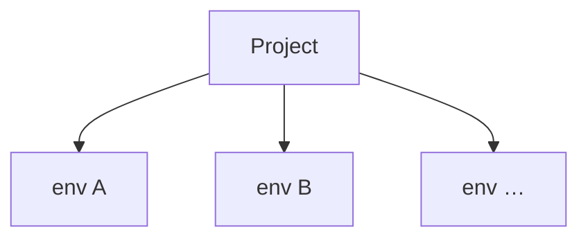

# ADR 035: Environment Releases for Configuration Resources

> **Status:** Draft
> **Date:** 2026-07-07
> **Context:** Multi-environment lifecycle for source-controlled configuration

## Status quo

Today the platform has no notion of environments. A project is a single flat scope, and every configuration change applies directly on the one running instance of that project.

Configurable resources: user schemas, flow definitions, (future) IdPs, branding, apps, policies, each have their own CRUD APIs. User schemas already have a revisions mechanism (server-assigned opaque ids, grouped by `objectType`), and other kinds will grow their own as the need arises. Each resource is versioned in isolation; there is no cross-resource notion of "the state of the project at some point in time."

Cross-resource references are stored as concrete ids on the referencing side. A flow definition's `user_schema` field carries an opaque schema id like `sch_01KWHF…`. 

```json
// flow definition
{
  "name": "default-login",
  "user_schema": "sch_01KX2QE1K0YJKP0JTN428A6DPB" // points to a revision of object-type: human-user
  // ...
}
```

When the user edits the schema, the server allocates a new id. The flow file keeps pointing at the previous one, there is no way to write "the current `human-user` schema" in the flow, only "this specific revision." Adopting the new schema is a two-step change: edit and apply the schema, then edit the flow file to substitute the new id and apply it again.


`zitadel apply` is a client-side orchestrator over those per-resource APIs. It walks `.zitadel/`, computes what changed, and issues one API call per changed resource (e.g. `POST /schemas`). There is no atomicity: a run that fails halfway through leaves the server holding a partially updated state.

## Decision

Configuration changes are bundled as immutable **releases**. A release pins a specific revision of every resource it includes. **Environments** are runtime slots on a project; each runs one release at a time, and the same release can be deployed to any number of environments unchanged. A **deployment** is the record of a release being made live on an environment.


The three subsections below define each concept: what an environment is, what a release is, and how the two relate. Concrete surfaces (CLI, API, release bundle format) follow further down.

### Environments

An environment is a runtime slot of a project. Each environment runs the release from its latest deployment. A project has one or more environments; every environment belongs to exactly one project.



> **Scope note.** This ADR treats environments as opaque runtime slots that consume releases. Environment internals are not this ADR's concern:
>
> - naming and count;
> - lifecycle (creation, retirement, auto-collection);
> - per-environment values (base URLs, secrets, custom domains);
> - security semantics of specific environment classes (see [`docs/design/api/security-and-origins.md`](../design/api/security-and-origins.md));
> - promotion mechanics to protected environments.
>
> All of these are specified elsewhere or in follow-up ADRs.

### Releases

Every configurable resource must be revisioned. A content change produces a new immutable revision; previous revisions stay addressable indefinitely. User schemas already work this way (#456); other kinds must adopt the same model before they can participate in a release.

A release is a snapshot of the project's configuration. It records exactly which revision of each resource is included, so activating the release on any environment produces a known, self-consistent runtime state.

For example, release `rel_01KX3RG8A7F0N9WD3P2E4YM5C1` might contain:

| Kind      | Handle                       | Revision                   |
|---        |---                           |---                         |
| schema    | `objectType` = `human-user`  | `sch_01KWHF18816ZQE…`      |
| flow      | `name` = `default-login`     | `flowdef_01KWHG09JXA…`     |
| idp       | `name` = `google`            | `idp_01KWH3B72K7M…`        |
| branding  | `name` = `default`           | `brand_01KWH1P4MYS…`       |
| app       | `name` = `web`               | `app_01KWJC2B78ZQ…`        |
| policy    | `name` = `password`          | `pol_01KWHF3XY6RN…`        |

The "handle" is the field each resource kind uses as its stable identifier across revisions. For example, schemas use `objectType`.

Each release also records **audit metadata** — who created it, when, and from what source:

- `release_id` — opaque, immutable id assigned at construction time.
- `created_at`, `created_by` — timestamp and identity of the caller who assembled the release.
- `message` — a short caller-supplied summary, analogous to a git commit message. How the CLI sources it (git HEAD, `-m` flag, other) is a CLI-ergonomics follow-up.
- `git_sha` — the source commit the CLI was operating from, when the release was constructed via `POST /configuration-releases`. Enables `git diff <prev-release-sha>..HEAD -- .zitadel/` as an env-diff mechanism.

These fields are set at construction time and never mutate.

**A release is a closed boundary.** An environment sees only what is inside its current release: resources outside the release are invisible, and drafted revisions on the server that never made it into a release do not exist at runtime. Per-resource CRUD (`POST /schemas`, `PUT /flow_definitions/:id`, …) operates outside any release.

> Exception: users carry their own user-schema revision. A user record persists the sch_… id of the user-schema revision it was created against.

That boundary is what lets resources inside a release reference each other by their stable **handle** instead of by a concrete revision id. A flow definition inside a release writes:

```json
{
  "name": "default-login",
  "user_schema": "human-user",
  "steps": [ /* ... */ ]
}
```

There is no ambiguity about which `human-user` schema this points to: it's whichever revision of the `human-user` schema this same release contains.

This also removes the two-step change problem from the status quo. A schema edit and its dependent flow now travel in the same release, referring to each other by handle.

Releases are project-scoped and immutable. They exist on their own, and are not tied to an environment at construction time.

### Environments and releases

Deploying a release to an environment creates a **deployment** — an immutable record linking a release to an environment at a moment in time. Every environment runs the release of its latest deployment.

- An environment runs exactly one release at any moment. Creating a new deployment atomically replaces the previous one.
- A release can be deployed to any number of environments at the same time. Releases are project-scoped artifacts; deploying the same release to dev, staging, and prod is normal, and each environment holds an independent deployment history referencing the same release.

Workflows:

- **Promotion** — deploying a release that already runs on one environment onto another (e.g. dev → staging → prod). No new release is created; a new deployment is recorded on the target environment.
- **Rollback** — deploying a prior release on the same environment. No new release is created; the new deployment references a release the environment ran earlier.

Every deployment is recorded per environment. The log is exposed via `GET /environments/{env}/deployments`.

---

The sections that follow specify the concrete surfaces: how the CLI orchestrates `deploy`, what the API endpoints look like, and the release bundle format on the wire.

## Release lifecycle

### CLI

- `zitadel deploy [--env <env>]`: packages `.zitadel/`, creates a release (`POST /configuration-releases`), and deploys it. `--env` is required in non-interactive mode; in interactive mode the CLI lists environments (`GET /environments`) and prompts the user to pick one or defer the deployment. There is no implicit default environment — every deploy explicitly names its target.
- `zitadel status`: local bundle summary, plus each environment's currently deployed release and how it relates to local.
- `zitadel pull <kind> <handle>`: fetch the newest server-side revision of a specific resource and write it into `.zitadel/`, so the next deploy incorporates it.
- `zitadel promote --env <env> --from <release-id>`: deploy an existing release to a different environment.
- `zitadel rollback --env <env> --to <release-id>`: deploy a prior release on the current environment.
- `zitadel releases list`: releases in the project, newest first.
- `zitadel deployments list --env <env>`: deployment history for an environment, newest first.
- `zitadel env list`: environments and each one's current release.

### API

Three groupings, in order of layering: `releases` (primary resource), `environments` and their `deployments` (runtime slots and their history), and `configuration-releases` (CLI orchestrator entry point).

#### `releases`

The canonical resource. A release is project-scoped and immutable; these endpoints construct and read them.

| Endpoint                       | Purpose                                                                                                                                                                     |
|---                             |---                                                                                                                                                                          |
| `POST /releases`               | Assemble a release from existing revision ids. Payload is a list of `(kind, handle, revision_id)` tuples. No new revisions minted. Validates handle references and templates. |
| `GET /releases`                | List releases in the project, newest first.                                                                                                                                 |
| `GET /releases/{release_id}`   | Read one release.                                                                                                                                                           |

#### `environments` and `deployments`

An environment holds a history of deployments; each deployment references a release. The environment's current release is the release of its newest deployment. Deploying is expressed as creating a deployment on the environment.

| Endpoint                                       | Purpose                                                                                                                                                                             |
|---                                             |---                                                                                                                                                                                  |
| `GET /environments`                            | List every environment with its current release id. Used by `zitadel deploy` in interactive mode to prompt for a deployment target.                                                 |
| `GET /environments/{env}`                      | Read one environment.                                                                                                                                                               |
| `POST /environments/{env}/deployments`         | Deploy a release to this environment. Payload: `{ release_id, reason }` where `reason` is `deploy` \| `promote` \| `rollback`.                                                       |
| `GET /environments/{env}/deployments`          | List deployments for this environment, newest first. The first row is the current deployment (whose release is live); the rest is the audit log.                                    |
| `GET /environments/{env}/deployments/{id}`     | Read one deployment.                                                                                                                                                                |

#### `configuration-releases` — CLI orchestrator entry point

A single endpoint that backs `zitadel deploy`. It accepts a source-content bundle (the contents of `.zitadel/`), allocates a new revision for every changed resource, resolves handle references, and constructs a release, all in one **transaction**. The UI does not use this endpoint — its workflows create deployments from existing releases (promotion, rollback); when the UI needs to construct a release from revision ids drafted through direct CRUD, it uses `POST /releases` instead.

| Endpoint                          | Purpose                                                                                                                                                                    |
|---                                |---                                                                                                                                                                         |
| `POST /configuration-releases`\*  | Build a release from a source-content bundle in one transaction. Allocates revisions, resolves handle references, validates, creates the release. Important: this endpoint does not deploy the release to any environment. |

\* Endpoint name is a placeholder; a shorter form may replace it.

Direct per-resource CRUD (`POST /schemas`, `PUT /flow_definitions/:id`, …) remains available and creates a new revision on write. It does not touch any environment's current deployment.

## Release bundle

`zitadel deploy` serializes the contents of `.zitadel/` into a single JSON bundle, one key per resource kind, and submits it to `POST /configuration-releases`:

```json
{
  "audit": {
    "message": "add phone_number to human-user schema",
    "git_sha": "4a5b6c7d8e9f0a1b2c3d..."
  },
  "schemas":  [ { "objectType": "human-user", "$schema": "…", "properties": { /* … */ } } ],
  "flows":    [ { "name": "default-login", "user_schema": "human-user", "steps": [ /* … */ ] } ],
  "idps":     [ ],
  "brandings":[ ],
  "apps":     [ ],
  "policies": [ ]
}
```

`audit.message` and `audit.git_sha` are recorded on the release and surface in `zitadel releases list`. `created_by` is derived from the caller's auth context, not sent in the payload.

Each entry is the resource's own content as authored on disk — no bundle-specific envelope. The server extracts the handle from the per-kind field (`objectType` for schemas, `name` for the others). Cross-resource references are by handle, for example, the flow's `user_schema` field carries `"human-user"`, not a concrete `sch_…` id. Kinds not present in the local project are sent as empty arrays.

### Endpoint responsibilities

`POST /configuration-releases` runs the whole construction in one transaction:

- allocate a new immutable revision for every changed resource in the bundle,
- resolve cross-resource references (by handle) to the newly allocated revision ids (TBD),
- validate the release as a closed set,
- create the release,
- return `{ release_id, revision_ids[] }`.

Either the whole bundle is committed and a release exists, or nothing changes on the server. That is the atomicity guarantee the current per-resource orchestration cannot offer.

`POST /releases` skips the revision-allocation step: the caller supplies revision ids drafted through other paths. Same validation, same output shape. It exists because a release is fundamentally a snapshot of revision ids; content is only in the picture when the caller is source of truth.

Neither endpoint deploys the release. Deploying is a separate `POST /environments/{env}/deployments` call with `{ release_id: <returned> }`, preserving the decision that releases exist on their own, the same release can later be promoted unchanged. The CLI's `zitadel deploy` orchestrates the two calls internally.

An environment either runs the previous release or the new one, never a mixture. A partial failure (release constructed, deployment refused) leaves the environment unchanged and the release available for a later attempt.

## CLI and drift

Direct writes to the per-resource CRUD APIs remain available. Editing a resource through the dashboard, MCP, or a direct API call produces a new immutable revision but leaves every environment's current release unchanged. The change is saved, not live. To make it live, the user constructs a new release that includes the drafted revision and deploys it, the same pattern as Vercel's "you edited env vars, redeploy to apply."

The CLI is source of truth for release construction. `zitadel deploy` packages `.zitadel/` as-is; drafts made outside the CLI are not incorporated and become superseded by the next deploy.

Two commands handle the "I edited something outside the CLI and want to keep it" case:

- `zitadel status` — reports the local bundle hash, plus each environment's currently deployed release and how it relates to local. Does not enumerate server-side drafts.
- `zitadel pull <kind> <handle>` — fetches the newest server-side revision of a specific resource and writes it into `.zitadel/`, so the next deploy incorporates it. Targeted only; there is no bulk mode.

Discovery of server-side drafts the user doesn't know about (bulk pull, draft-aware status) is a follow-up, not this ADR's concern.

## Out of scope

- **Approval mechanics for release deployment.** Whether some environments require reviewer approval before a release is deployed, and the concrete approval surface (who can approve, how a pending deployment is represented, notification/UI shape), is a separate ADR alongside the RBAC/identity model.
- **Retention policy** for superseded releases and their revisions.
- **Auto-deploy defaults for bare `zitadel deploy` (per #449).** Whether bare `deploy` should auto-target a designated non-prod environment (Vercel-style: implicit for preview, explicit for prod) depends on env-metadata this ADR treats as out of scope (which envs are production-class). Follow-up once env-classes are defined.
- **Environment lifecycle, values, and data isolation.** Environment creation, retirement, per-env value shape (base URLs, custom domains, template values referenced from releases), template resolution semantics on deployment, and cross-env data isolation (including the exception that users carry their own user-schema revision) are covered by a follow-up ADR.
- **Inner-loop semantics.** Whether every local save creates a release (Vercel-shaped local dev) or only explicit `zitadel deploy` does (Terraform-shaped) is a follow-up decision affecting local-dev ergonomics.
