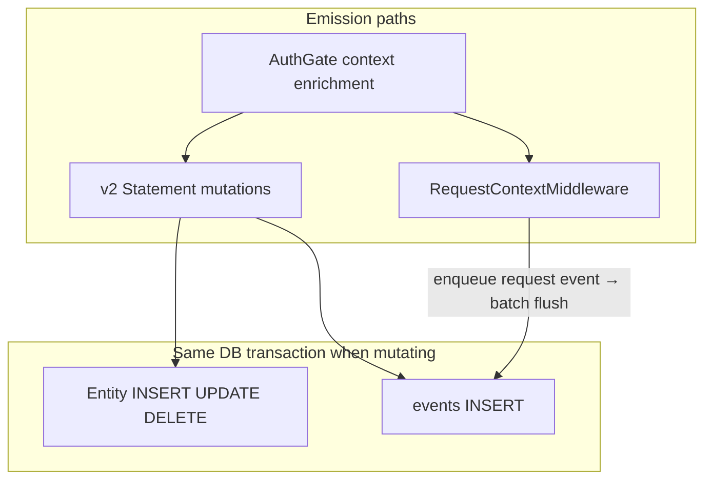

# ADR 048: Wide Events as Internal Audit Primitive

> **Status:** Proposed
> **Date:** 2026-07-03
> **Context:** Audit logging for nextgen relational storage
> **Builds on:** [ADR 028](028-storage-v2-statements-and-dialects.md), [ADR 010](010-session-auth-attempt-check-model.md), [ADR 011](011-resource-identifiers.md), [ADR 047](047-dialect-id-generation.md), [ADR 008](008-users-eav-store.md), [ADR 033](033-internal-permission-management.md), [ADR 046](046-claim-lifecycle-v2.md), [oxidel ADR-023](https://github.com/zitadel/oxidel/blob/main/docs/adr/023-wide-events.md)
> **Related:** [ADR 049](049-events-api-retention-export.md) (API, retention, export)

## Context

Classic ZITADEL stores every mutation as an immutable event in an eventstore; the
audit trail and application state are the same stream. nextgen deliberately uses
**relational tables as the source of truth** instead. That removes projection
complexity and improves read performance, but it also removes the built-in audit
stream unless we add one back.

Operators, compliance reviewers, and incident responders need to answer questions
like:

- Which AI agent accessed user X's data using a delegated token?
- What did application Z do in the last hour?
- Reconstruct the full timeline for this login flow.
- Which admin changed this flow definition?

OpenTelemetry distributed tracing solves **latency debugging across services**,
not business-dimension queries. Operational logs via [`zlog`](../../internal/instrumentation/zlog/)
are ephemeral and not tenant-queryable. We need a first-class, append-only,
queryable audit stream stored in the database.

**Scope boundary:** Event emission is defined on **v2 `AllStatements` / statement
TX only** ([`internal/storage/`](../../internal/storage/),
[`internal/service/statement.go`](../../internal/service/statement.go)). The v1
repository and dialect tree under `internal/storage/database/` is **retired**
([ADR 028](028-storage-v2-statements-and-dialects.md)). Product persistence is
fully on `AllStatements`. Mutating statement methods that need an audit record
call `InsertEvent` in the same transaction once `EventStatements` exists.
Operational request middleware logs ([ADR 030](030-error-model-mapping-and-reporting.md)
MaskConfig / `zlog`) are **not** the audit source of truth.

**Pre-claim policy:** Per [ADR 046](046-claim-lifecycle-v2.md) (and
[claim-flow](../design/platform/claim-flow.md)), events are **emitted and stored
from project creation onward**, including the pre-claim window (`CreateProject`,
config push, claim init/complete, unclaimed-mode agent work). **List, get, and
export** stay gated until claim — operators and shippers cannot read or forward
unclaimed-project events (see [ADR 049](049-events-api-retention-export.md)).
No retroactive backfill is required: history already exists in `events` when
claim succeeds. This is product policy for visibility, not a storage limitation.

This ADR adapts the wide-event model from
[oxidel ADR-023](https://github.com/zitadel/oxidel/blob/main/docs/adr/023-wide-events.md)
for nextgen tenancy (`project_id` instead of `org_id`).

## Decision

### 1. One `events` table (wide event model)

All audit categories share a single append-only table. A wide event is a flat
record with all relevant context attached at write time — no joins required for
common queries.

```sql
CREATE TABLE zitadel_nextgen.events (
    -- Identity (dialect-minted managed ID per ADR 047; e.g. evt_<opaque>)
    project_id          TEXT        NOT NULL
    , id                TEXT        NOT NULL
    , event_type        TEXT        NOT NULL       -- 'user.deactivated', 'request.api', etc.
    , category          TEXT        NOT NULL       -- 'request', 'auth', 'session', 'admin', 'entity', 'signal'
    , occurred_at       TIMESTAMPTZ NOT NULL       -- when the action happened (DB clock; see §4)
    , created_at        TIMESTAMPTZ NOT NULL DEFAULT now()  -- when the row was inserted (DB clock)

    -- Authorization scope captured at emit time (immutable)
    , team_id           TEXT                    -- NULL = project-scoped; set for team-scoped credential context

    -- WHO
    , actor_id          TEXT
    , actor_type        TEXT                    -- 'human', 'service', 'system', 'agent'

    -- WHAT
    , entity_type       TEXT                    -- 'user', 'session', 'token', 'project', etc.
    , entity_id         TEXT

    -- HOW (delegation / grant provenance; see ADR 033 §5)
    , client_id         TEXT        NOT NULL DEFAULT ''
    , token_id          TEXT        NOT NULL DEFAULT ''
    , delegation_type   TEXT        NOT NULL DEFAULT ''   -- 'direct', 'delegated', 'pat_shared', 'exchanged'
    , delegation_id     TEXT        NOT NULL DEFAULT ''   -- explicit agent delegation id when applicable
    , grantor           TEXT        NOT NULL DEFAULT ''   -- principal that granted the delegation

    -- WHERE (device context; server-authoritative when set)
    , fingerprint       TEXT        NOT NULL DEFAULT ''

    -- WHEN (correlation scopes; server-authoritative)
    , request_id        TEXT
    , session_id        TEXT
    , flow_id           TEXT

    -- Arbitrary data
    , payload           JSONB       NOT NULL DEFAULT '{}'
    , metadata          JSONB       NOT NULL DEFAULT '{}'

    , PRIMARY KEY (project_id, id)
);
```

**Nullability convention:** correlation / identity dimensions that may be
absent (`team_id`, WHO/WHAT/`request_id`/`session_id`/`flow_id`) are
**nullable** (`NULL` = not applicable). Delegation and device dimensions
(`client_id`, `token_id`, `delegation_*`, `grantor`, `fingerprint`) are
`NOT NULL DEFAULT ''` (`''` = resolved, possibly empty).

Event row `id` is a dialect-minted managed identifier
([ADR 047](047-dialect-id-generation.md)): Go `NewManagedID` / statement helper
supplies the PK on INSERT (no SQL `IDENTITY` / client-supplied resource PK).

At emit time, capture `project_id` and optional `team_id` from the resolved
credential scope (`ScopeContext` per
[url-architecture.md](../design/api/url-architecture.md)). Team-scoped list/get
filters use the **stored** `team_id`, not recomputed membership. See
[ADR 049](049-events-api-retention-export.md) for API authorization rules.

Events are **not** registered in `resource_scope_index`. That table stays a
small map for durable globally-addressable resources
([ADR 033](033-internal-permission-management.md),
[url-architecture.md](../design/api/url-architecture.md)); high-volume TTL audit
rows do not belong there. `GET /events/{id}` is **project-scoped** (see ADR 049).

Per-sink export delivery is tracked with per-(sink, project) watermark cursors;
see [ADR 049 §3](049-events-api-retention-export.md).

**Indexes:**

- **Required now:** `(project_id, created_at, id)` for list/export keyset
  pagination ([ADR 027](027-cursor-based-pagination.md)). The keyset predicate
  is `WHERE (created_at, id) > ($1, $2) ORDER BY created_at, id`. Including
  `id` is required: many events share the same `created_at` (same millisecond),
  and without the tie-breaker column cursors are unstable and the planner cannot
  satisfy the tuple predicate as an efficient index range scan.
- **Deferred:** Additional indexes when concrete query paths and predicates are
  measured. Avoid speculative partial indexes on `NOT NULL DEFAULT ''` columns
  unless predicates exclude empty strings.

**Ordering:** List and export use keyset pagination on `(created_at, id)` within
`project_id` per [ADR 027](027-cursor-based-pagination.md). Forensic "when did
it happen" uses `occurred_at`.

### 2. Correlation scopes (six dimensions plus tenancy)

Every event participates in up to six independent grouping dimensions plus
tenancy. Primary correlation columns are **server-authoritative** (see §4).

| Scope | Column | Groups |
|-------|--------|--------|
| **Tenancy** | `project_id` | All events within a project |
| **Team** | `team_id` | Events emitted under a team-scoped credential |
| **Request** | `request_id` | All events from a single HTTP request |
| **Session** | `session_id` | All events from a user session |
| **Flow** | `flow_id` | All events from a login flow |
| **Device** | `fingerprint` | All events from a device |
| **App** | `client_id` | All events from an application or AI agent |
| **User** | `actor_id` | All events by a user |

Admin and forensic queries use these scopes directly:

```sql
-- What did the AI agent do?
SELECT * FROM events
WHERE project_id = $1 AND client_id = 'agent_copilot'
ORDER BY created_at, id;

-- All delegated access for user X
SELECT * FROM events
WHERE project_id = $1 AND actor_id = 'user_123' AND delegation_type != 'direct'
ORDER BY created_at, id;

-- Everything in this login flow
SELECT * FROM events
WHERE project_id = $1 AND flow_id = 'flow_xyz'
ORDER BY created_at, id;
```

Client-supplied correlation hints (if accepted at all) live in
`metadata.client_hints` and are marked **untrusted**. They are not primary
audit filter dimensions and are not indexed for forensic queries.

### 3. Event categories

| `category` | When emitted | Emission path → durability | Sampling |
|------------|--------------|----------------------------|----------|
| `request` | HTTP handler completed **and** `project_id` is known (authenticated API or public login/flow) | Path A → batched flush (N/T); visibility ≤ T; bounded crash-loss / drop-on-overflow (§4) | None |
| `auth` | Token issue/revoke/exchange, login outcomes, MFA decisions | Path B → in-TX with the mutating statement; no loss | None |
| `session` | Session create/end, step-up, handoff | Path B → in-TX with the mutating statement; no loss | None |
| `admin` | Team, API key, config push, RBAC mutations | Path B → in-TX with the mutating statement; no loss | None (mutations only) |
| `entity` | User/project lifecycle semantic events | Path B → in-TX with the mutating statement; no loss | None |
| `signal` | Platform bot/abuse signals ([ADR 019](019-captcha-gate-and-bot-signals.md)) | Path B → in-TX with the auth-attempt/check mutation | None |

Public login/flow HTTP emits `request` when the handler stamps `project_id`
(actor/token stay empty). Health/ready/live probes have no project and emit
**no** `request` event.

**Durability bars differ by path:** Path B categories are **transactional audit**
(co-committed with the mutation). Path A `request` events are **best-effort
access telemetry** (batched; may be lost on crash before drain or on bounded
overflow). Compliance readers must not treat them as the same guarantee.

### 4. Two emission paths (Go code, not database triggers)

Emission is implemented in Go application code. Database triggers and CDC are
explicitly rejected — Spanner does not support triggers, and CDC loses semantic
event names.



#### Path A — Request-wide events (`project_id` known)

Extend the existing request-ID middleware
([`internal/api/middleware/request_id.go`](../../internal/api/middleware/request_id.go))
into a **RequestContext** middleware:

- Extract or generate `request_id` (W3C traceparent-compatible 128-bit hex).
- Resolve correlation fields from **server state**, not client headers:
  - `session_id` — authenticated token / server session record
  - `flow_id` — active auth attempt or flow engine context
  - `fingerprint` — server-derived device binding when available; otherwise omit
    (empty string)
- Optional `X-SDK-Name` and `X-SDK-Version` headers may be read for operational
  logging ([`zlog`](../../internal/instrumentation/zlog/)) and OTEL Tier 3
  export — they are **not persisted** on audit event rows.
- Client headers named `session_id`, `flow_id`, or `fingerprint`, if accepted at
  all, go into `metadata.client_hints` as untrusted hints only.
- After the handler completes, if **`project_id` is known**, enqueue one
  `category=request` wide event containing: `operation_id`, HTTP method, route
  template, status code, duration, and actor/delegation dimensions from context
  (including `delegation_id` / `grantor` when acting under an agent delegation
  per [ADR 033 §5](033-internal-permission-management.md)). Public login/flow
  stamps `project_id` without a token (`Authenticated` stays false). `POST /projects`
  stamps the minted `project_id` after create succeeds. `createFlow` mints
  `flow_id` and stamps the actor slot **before** the state machine starts, so
  Path B `auth.attempt.created` shares `flow_id` with Path A `request.api`.
  Path B `FromContext` copies `request_id` from the HTTP middleware even when
  AuthGate did not run. Probes (`healthz` / `readyz` / `livez`) leave
  `project_id` empty and are skipped.
- Response header `X-Request-Id` echoes the assigned `request_id`.

**Durability (batched insert, DB clock):** Request-wide events are **not**
inserted synchronously per API call. Middleware enqueues into an **in-process
bounded durable-intent buffer** (not per-request awaited INSERT).

1. Each buffered item stores payload fields, `startedAt` (HTTP middleware
   entry — forensic `occurred_at`), and `enqueuedAt` (buffer residency / MaxAge
   only). Go clocks compute `wait`; they are **not** wall-clock stamps written
   to the row.
2. A flusher writes batches when either:
   - batch size reaches **N** (suggested default **100**), or
   - **T** elapsed since the oldest buffered event (suggested default **1s**).
3. Timestamps use the **database `now()` as the single time server**:

```sql
-- $wait_interval = time.Since(startedAt) at successful insert
INSERT INTO zitadel_nextgen.events (..., occurred_at, created_at, ...)
VALUES (..., now() - $wait_interval, now(), ...);
```

   - `occurred_at` — when the request **started** (`now() - wait`), so
     `request.api` sorts first among events sharing `request_id`
   - `created_at` — when the row was written (`now()` / `DEFAULT now()`)
   - Payload `duration_ms` / `status` describe completion; they are not used
     as the sort timestamp
   - Recompute `wait` at the **successful** insert (including after retries) so
     `occurred_at` stays honest.
   - Dialect note: Postgres `now()` is transaction-start time (all rows in one
     flush TX can share `created_at` — `(created_at, id)` tie-break is
     load-bearing). Spanner `CURRENT_TIMESTAMP()` is statement-eval time; commit
     timestamps have read-back restrictions — statement helpers abstract this.
4. List/export keyset pagination stays on `(created_at, id)`; forensic timing
   uses `occurred_at`.
5. **Bounded buffer:** when full, **drop the new enqueue** (preserve older
   buffered events) and increment a metric. Do not block the request path.
6. **Flush failure:** retry with backoff; on give-up, drop the batch and
   metric/alert. Not silently ignored.
7. On process shutdown: **drain** the buffer (flush remaining events) before
   exit.
8. Domain events (Path B) stay **in-TX with the mutation** — only
   `category=request` is batched.

[`zlog`](../../internal/instrumentation/zlog/) masking
([ADR 030](030-error-model-mapping-and-reporting.md)) remains acceptable for
operational logs only — not for audit durability. A durable outbox + worker is
a future optimization beyond this in-process buffer.

#### Path B — Domain events on statement mutations

Add to [`internal/service/statement.go`](../../internal/service/statement.go):

```go
type EventStatements interface {
    InsertEvent(ctx context.Context, event *domain.Event) error
}
```

`EventStatements` is composed into `AllStatements` alongside entity statement
interfaces.

- `InsertEvent` executes on the same `queryExecutor` / transaction as entity SQL
  ([`internal/storage/dialect/postgres/tx.go`](../../internal/storage/dialect/postgres/tx.go)).
- Each `statement_<entity>.go` method that **mutates state** and needs an audit
  record calls `InsertEvent` with a **semantic** `event_type` (e.g.
  `project.created`, `user.deactivated`) — not row diffs or generic `UPDATE`
  mirrors.
- The service layer constructs the `domain.Event` struct (payload, correlation
  context); the statement layer persists it in-TX.
- For Path B, `occurred_at` and `created_at` are both DB `now()` at INSERT
  (wait ≈ 0); no separate wait parameter is required.
- Event `id` is minted via dialect `NewManagedID` before insert
  ([ADR 047](047-dialect-id-generation.md)).

Example event types (non-exhaustive samples). The living operation →
`event_type` → payload catalog is
[events-catalog.md](../design/api/events-catalog.md):

| `event_type` | `category` | Trigger |
|--------------|------------|---------|
| `request.api` | `request` | Authenticated HTTP handler completes |
| `project.created` | `entity` | `CreateProject` statement (including pre-claim) |
| `user.created` | `entity` | User create statement |
| `session.deleted` | `session` | Explicit session delete |
| `session.expired` | `session` | Session reaper / TTL cleanup |

Passive session expiry has no user-triggered mutation: the cleanup/reaper
statement that marks or deletes the expired session is the Path B emission
point for `session.expired` (distinct from explicit `session.deleted`).

**Path A buffer refinement:** flush also when the in-process buffer reaches
~80% of capacity `C` (with `C ≫ N`), in addition to batch size **N** and age
**T**. Drop only when the buffer is full.

### 5. AuthGate enriches delegation context

After token resolution (AuthGate / auth middleware), inject delegation dimensions
into request context:

| Dimension | Source | Validation |
|-----------|--------|------------|
| `client_id` | Token record (`tokens.application_id` or equivalent) | Guaranteed by token issuance |
| `actor_id` | Token record (`tokens.user_id`) | Guaranteed by token issuance |
| `token_id` | Token record | Guaranteed by token issuance |
| `delegation_type` | Inferred from token structure | Automatic |
| `delegation_id` | Explicit agent delegation when present ([ADR 033](033-internal-permission-management.md) §5) | Guaranteed by grant check |
| `grantor` | Principal that granted the delegation | Guaranteed by grant check |
| `project_id`, `team_id` | Resolved credential `ScopeContext` | Guaranteed by auth middleware |

The SDK's `X-Client-Id` header is **ignored** — the server resolves `client_id`
from the token itself to prevent spoofing.

`InsertEvent` and request middleware read delegation and scope dimensions from
context — no per-handler duplication. Grant check and audit record share the
same code path ([ADR 033 §5](033-internal-permission-management.md)).

**Delegation models** (same semantics as oxidel, plus explicit agent delegation):

| Mechanism | `delegation_type` | `client_id` source | `actor_id` source |
|-----------|-------------------|-------------------|-------------------|
| OIDC with `act` claim | `delegated` | Token application ID | `act.sub` claim |
| PAT shared with agent | `pat_shared` | Token `on_behalf_of_app` | Token user ID |
| Token Exchange (RFC 8693) | `exchanged` | Requesting client ID | Original subject token user |
| Agent delegation (ADR 033) | `delegated` | Agent principal / client | Acting agent; `grantor` + `delegation_id` set |
| Direct (no delegation) | `direct` | Token application ID | Token user ID |

### 6. Relationship to `checks` (ADR 010)

[`checks`](010-session-auth-attempt-check-model.md) remain the **deep forensic
store** for challenge material, failure counts, and supersession timelines.

Events store **references only**:

- `check_id`, `session_id`, `authenticator_id`, `check_type`, outcome enums
- Never `challenge_payload` or `factor_payload`

Event types like `auth.check.failed` point investigators to the `checks` table
for detail. This avoids duplicating high-volume JSONB while preserving an
audit-friendly summary at the event layer.

### 7. Event payload shapes

**Non-user resources** (project, team, flowdef, branding, …) use:

| Operation | Payload |
|-----------|---------|
| Create | Full **allowlisted snapshot** of fields the mutate API wrote |
| Update | **Delta with new values** — only changed allowlisted fields; absent = unchanged |
| Delete / simple state flip | Empty `{}` unless a reason enum is required |

Primary identity lives on the event envelope (`entity_id`, `session_id`, …),
not duplicated in payload. Secondary ids (e.g. `user_id` on a factor event,
`auth_attempt_id` on a check) are allowed. The living allowlist is
[events-catalog.md](../design/api/events-catalog.md).

#### EAV users (ADR 008)

User mutations through the header/data/registry model
([ADR 008](008-users-eav-store.md)) require special emit rules:

| Operation | Event | Payload |
|-----------|-------|---------|
| Create user | `user.created` | schema ref; **attribute keys** written; **values only** for `x-audit` fields — never primary `user_id` echo |
| Patch attributes | `user.updated` | keys touched + `x-audit` values for those keys (same rule as create) |
| Unique violation | `user.create.failed` | key name — not value |
| Deactivate | `user.deactivated` | lifecycle reason enum (identity on envelope) |

No generic auto-diff of `user_attributes` JSON. Attribute values appear in event
payloads only when explicitly allowlisted (see §8).

#### Failure events and aborted transactions

Any failure event emitted after a statement aborts (unique violation,
constraint failure, and future failure types such as some
`auth.check.failed` paths) needs a **dialect-specific** path — not only
`user.create.failed`:

| Dialect | Failure-event emission after aborted mutating TX |
|---------|--------------------------------------------------|
| **PostgreSQL** | Prefer **SAVEPOINT** before the risky statement; on failure, `ROLLBACK TO SAVEPOINT`, then `InsertEvent` in the remainder of the same TX, then commit. |
| **Spanner** | No savepoints. Abort/rollback the mutating TX, then emit the failure event in a **new short transaction**. That separate TX is inherently **weaker than co-commit** (at-most-once): a crash between rollback and the new TX loses the failure event. |

SAVEPOINT is preferred on Postgres because it keeps a single connection and
commit for the request, and `ROLLBACK TO SAVEPOINT` is cheaper than aborting
the whole TX and starting a new one.

Optional **preflight** uniqueness checks reduce how often the conflict path
runs (happy path stays one TX), but races still need the dialect-specific path
above.

**Not supported:** emitting a failure event inside an aborted transaction
without a savepoint (Postgres), or after Spanner abort without a new TX.

### 8. PII policy — deny-by-default

Opt-in blocklists (`x-sensitive: true` on every field) do not scale. Event
payloads use a **deny-by-default** model:

1. **Default:** payloads contain resource IDs, enums, key names, counts, and
   timestamps — never raw user attribute strings.
2. **Allowlist:** new schema annotation `x-audit: true` (or `x-audit:
   "identifier"`) marks fields explicitly safe to include in audit payloads
   (e.g. email as a correlation identifier). Fields without `x-audit` are omitted.
3. **Go enforcement:** typed event payload structs and an `audit.Marshal` helper
   at emit time apply schema allowlist rules for user-derived data. Handlers
   cannot accidentally dump a full user object into an event.
4. **`x-sensitive` and audit:** audit payloads do **not** use `x-sensitive`; they
   use deny-by-default + `x-audit`. The `x-sensitive` annotation remains for
   API/flow payload redaction (non-audit) — OpenAPI `user-property`, console
   input masking, and config normalize still use it. These mechanisms are
   complementary, not replacements. See
   [user-schema.md](../design/flowengine/user-schema.md).
5. **Not log masking:** [`zlog`](../../internal/instrumentation/zlog/) /
   [ADR 030](030-error-model-mapping-and-reporting.md) MaskConfig redacts
   operational log attributes; it does **not** define audit allowlists.

Secrets, passwords, challenge material, and token values are **never** included
regardless of annotation.

### Amendment (2026-08-14): `x-audit` is declared; `x-sensitive` is gone

`x-audit` is now part of the user-schema dialect
(`api/openapi/endpoints/schemas/user-property.json`), declared as `true` or the
string `"identifier"`. The emitter accepts any non-empty string other than
`"false"`, so the declaration is the narrower of the two: `x-audit: "no"` would
have enabled the value while reading as a refusal, and now fails validation at
push instead.

Point 4 above no longer holds. `x-sensitive` was removed from the dialect along
with `x-verify`, `x-editable`, and `x-mfa` — none had a consumer, and the three
surfaces that point named (OpenAPI `user-property`, console input masking,
config normalize) no longer reference it. `x-audit` is the only annotation
governing audit payloads. A value withheld from read responses is `writeOnly`,
native JSON Schema, declared in the dialect but not yet enforced by the read
API. The dialect keeps `additionalProperties: true`, so a document still
carrying `x-sensitive` validates and is ignored rather than rejected.

### 9. OTEL is Tier 3 export only

OpenTelemetry remains an **export format** for forwarding to an operator's
collector (Splunk, Datadog, Grafana, etc.). ZITADEL never reads audit truth
from OTEL.

```
Wide Event (internal)  ──→  OTEL Span (Tier 3 export)
                              └─ Customer collector → their tools
```

- Internal model uses `request_id`, not `trace_id`.
- `span_id` and `parent_span_id` live in `metadata` JSON for OTEL export
  projection only.
- [`zlog`](../../internal/instrumentation/zlog/) and
  [`zotel`](../../internal/instrumentation/zotel/) remain operational telemetry
  separate from the audit stream. SDK name/version headers may appear in
  operational logs but not in the `events` table.

When exporting to OTEL, the projector maps: `request_id → trace_id`,
`event.id → span_id`, `metadata.parent_span_id → parent_span_id`.

## Non-goals

- Database triggers or CDC as the primary audit mechanism.
- Unscoped public request logging (no `project_id`): probes, and flow
  requests that never resolve a project (invalid cookie).
- Retroactive fabrication of events that were never stored (pre-claim history
  is stored; visibility opens at claim — see Context).

## Consequences

### Positive

- Business-dimension queries work with simple WHERE clauses — no trace tree
  traversal.
- AI agent and delegated access activity is visible via `client_id`,
  `delegation_type`, `delegation_id`, and `grantor`.
- Transactional co-commit for domain events prevents "state changed but no log"
  races.
- Spanner-safe: no triggers; Go-defined emission on `AllStatements`.
- Deny-by-default PII policy scales without per-field opt-out annotations.
- No per-project sequence counter — parallel event inserts within a project.
- Immutable `team_id` at emit time avoids leaking historical events across team
  membership changes.
- Server-authoritative correlation fields prevent forged forensic timelines.
- Batched request events avoid per-call sync INSERT latency; DB `now()` keeps
  a single time server for `occurred_at` / `created_at`.
- Pre-claim forensic history is preserved for abuse investigations once claim
  unlocks visibility ([ADR 046](046-claim-lifecycle-v2.md)).
- `resource_scope_index` stays small; events do not inflate it.

### Negative / Risks

- **Volume:** one `request` event per in-scope API call (authenticated plus
  public login/flow) adds write amplification (amortized by batch flush).
- **Delayed visibility:** request events may appear up to ~T after the action
  (batch age); forensic queries should prefer `occurred_at` when timing matters.
- **Best-effort Path A:** crash before drain, overflow drop, or flush give-up
  can lose `request` events; Path B remains TX-safe. Metrics and alerts are
  required.
- **No live project FK on `events`:** `project_id` is an opaque tenancy scope.
  Hard-deleting a project leaves audit rows (including `project.deleted`) for
  retention to purge. The shipper iterates **live claimed projects**, so
  post-delete rows are not re-exported after the project disappears (v1).
- **Missing InsertEvent:** statement methods that mutate state but forget
  `InsertEvent` create coverage gaps — catch via review and
  [`stmttest`](041-storage-statement-contract-tests.md) contract coverage when
  implemented.
- **Pre-claim visibility gate:** stored events exist before claim but
  list/export stay closed until claim ([ADR 049](049-events-api-retention-export.md)).
- **Request vs domain correlation:** request events use a separate short TX
  from entity mutations; cross-correlate via `request_id` when investigating.
- **Dialect divergence:** failure-event emission uses SAVEPOINT on Postgres and
  a new TX on Spanner (at-most-once on Spanner) — statement helpers must
  abstract this.

## Related ADRs

| ADR | Relationship |
|-----|--------------|
| [049 Events API, Retention, and Export](049-events-api-retention-export.md) | HTTP surface, sink cursors, retention purge, external export; project-scoped get |
| [028 Storage v2 Statements](028-storage-v2-statements-and-dialects.md) | `AllStatements` / `EventStatements` is the emission boundary |
| [041 Storage Statement Contract Tests](041-storage-statement-contract-tests.md) | `InsertEvent` coverage belongs in `stmttest` when implemented |
| [033 Internal Permission Management](033-internal-permission-management.md) | Actor/delegation metadata; `resource_scope_index` is **not** used for events |
| [046 Claim Lifecycle v2](046-claim-lifecycle-v2.md) | Pre-claim: store always; visibility/export gated until claim |
| [047 Dialect-Owned ID Generation](047-dialect-id-generation.md) | Event `id` is dialect-minted managed ID |
| [030 Error Model](030-error-model-mapping-and-reporting.md) | `zlog` masking ≠ audit `x-audit` allowlist |
| [010 Session/Auth Attempt](010-session-auth-attempt-check-model.md) | Checks table is deep forensic store; events reference by ID |
| [027 Cursor-Based Pagination](027-cursor-based-pagination.md) | List API pagination over events |
| [008 Users EAV Store](008-users-eav-store.md) | User event payload rules |
| [019 Captcha Gate](019-captcha-gate-and-bot-signals.md) | `signal` category alignment |
