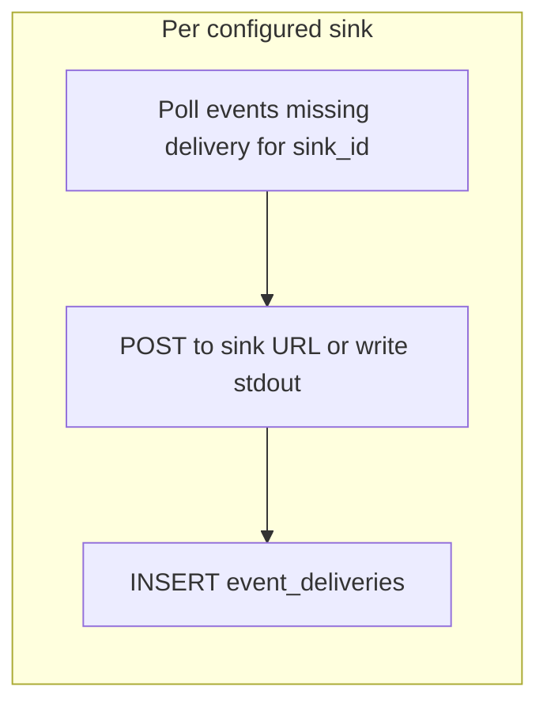

# ADR 049: Events API, Retention, and External Export

> **Status:** Proposed
> **Date:** 2026-07-03
> **Context:** Operator and integrator access to the wide event audit stream
> **Builds on:** [ADR 048](048-wide-events-internal-audit-primitive.md), [ADR 027](027-cursor-based-pagination.md), [ADR 033](033-internal-permission-management.md), [ADR 036](036-api-credential-planes.md), [ADR 046](046-claim-lifecycle-v2.md)
> **Related:** [resource-map](../design/api/resource-map.md)

## Context

[ADR 048](048-wide-events-internal-audit-primitive.md) defines the internal wide
event model: one `events` table, two Go emission paths, and deny-by-default PII
policy. Operators and external systems also need:

- A **query API** for incident response and regulatory review.
- **Reliable export** to external sinks before local retention purges rows.

Classic ZITADEL exposes events via the Event API and supports SIEM streaming.
nextgen consolidates identity events and admin/configuration changes into a
**single `/events` endpoint** filtered by `category`, replacing the earlier
split between `/events` and `/audit_events` in the resource map sketch.

## Decision

### 1. Unified `/events` API

One list endpoint and one get-by-id endpoint cover all event categories.

```http
GET /events?project_id=…
         &category=…
         &event_type=…
         &actor_id=…
         &client_id=…
         &session_id=…
         &flow_id=…
         &request_id=…
         &fingerprint=…
         &entity_type=…
         &entity_id=…
         &team_id=…
         &created_after=…
         &created_before=…
         &page_token=…

GET /events/{id}
```

**Filter semantics:**

| Parameter | Type | Notes |
|-----------|------|-------|
| `project_id` | required (implicit from credential scope) | Tenancy boundary |
| `category` | enum, repeatable | `request`, `auth`, `session`, `admin`, `entity`, `signal` |
| `event_type` | string, repeatable | Exact match; prefix filter (`user.`) is a future extension |
| `actor_id` | string | Who triggered the event |
| `client_id` | string | Application or agent |
| `session_id` | string | Session correlation |
| `flow_id` | string | Login flow correlation |
| `request_id` | string | HTTP request correlation |
| `fingerprint` | string | Device correlation |
| `entity_type` | string | Resource type affected |
| `entity_id` | string | Resource ID affected |
| `team_id` | string | Filter by emit-time team scope |
| `created_after` | RFC 3339 timestamp | Inclusive lower bound on `created_at` |
| `created_before` | RFC 3339 timestamp | Exclusive upper bound on `created_at` |
| `page_token` | opaque string | [ADR 027](027-cursor-based-pagination.md) cursor |

**Response shape** (list items):

```json
{
  "id": "evt_01HZY…",
  "project_id": "proj_abc",
  "team_id": "team_xyz",
  "event_type": "auth.token.issued",
  "category": "auth",
  "occurred_at": "2026-07-03T12:00:00Z",
  "created_at": "2026-07-03T12:00:00.050Z",
  "actor_id": "user_xyz",
  "actor_type": "human",
  "entity_type": "token",
  "entity_id": "tok_987",
  "client_id": "app_dashboard",
  "token_id": "tok_abc",
  "delegation_type": "direct",
  "delegation_id": "",
  "grantor": "",
  "fingerprint": "fp_device123",
  "request_id": "req_128bit_hex",
  "session_id": "sess_456",
  "flow_id": "",
  "payload": { "scope": ["openid", "profile"] },
  "metadata": {}
}
```

`GET /events/{id}` may additionally include delivery status (RECOMMENDED):

```json
{
  "deliveries": [
    { "sink_id": "stdout", "delivered_at": "2026-07-03T12:00:05Z" },
    { "sink_id": "webhook", "delivered_at": "2026-07-03T12:00:05Z" }
  ]
}
```

- `payload` and `metadata` are returned **as stored** — already redacted at emit
  time per [ADR 048 §8](048-wide-events-internal-audit-primitive.md).
- List response wraps items in `{ "data": [...], "next_page_token": "..." }` per
  [ADR 027](027-cursor-based-pagination.md). No total count. List omits
  `deliveries` to keep payloads small.

**Pagination:** Keyset cursor on `(created_at, id)` within `project_id`,
consistent with [ADR 027](027-cursor-based-pagination.md) and v2 storage list
options. Index: `(project_id, created_at, id)`.

**Permissions and scope:**

- Callers require an `events.read` permission. Exact catalog entry is TBD; it
  will be a **system-catalog** permission
  ([ADR 032](032-permission-catalogs.md) / [ADR 033](033-internal-permission-management.md)),
  not a parallel ad-hoc RBAC.
- `/events` is an **operator / confidential-plane** surface
  ([ADR 036](036-api-credential-planes.md)) — not public-plane.
- Authorization uses the **immutable emit-time scope** stored on the event
  (`project_id`, optional `team_id` from [ADR 048](048-wide-events-internal-audit-primitive.md)),
  not recomputed actor/resource membership.
- **Project-scoped** credentials see all events in the project (subject to
  `events.read`).
- **Team-scoped** credentials see only events where `events.team_id` equals the
  credential's team. Events are visible within the scope that created them
  unless a future admin override is defined.
- Filtering by current `actor_id` membership or resource team is **rejected** —
  users and resources can move teams; that must not leak or hide historical
  events.

**`GET /events/{id}` scope resolution:**

Event primary key is `(project_id, id)`. Path-only `{id}` cannot authorize
before lookup. Align with
[url-architecture.md](../design/api/url-architecture.md) and
[ADR 033](033-internal-permission-management.md) **resource-scope index**:

1. At emit time, register the event in `resource_scope_index`
   (`resource_kind = event`, `project_id`, optional `team_id`).
2. Middleware resolves scope from the index **before** loading the event row.
3. Auth check runs on the resolved scope; miss returns **404** (no existence or
   timing leak across scopes).

Authorize-after-fetch is explicitly rejected.

**OpenAPI:** A design sketch may live under `docs/design/api/` until the
endpoint is added to `api/openapi/`. Implementation is out of scope for this ADR.

**Removed:** `/audit_events` and `/audit_events/{id}`. Admin and configuration
events use `category=admin` on `/events`.

### 2. Retention and immutability

Events are append-only within their retention window.

**Application DB role:**

- `INSERT` and `SELECT` on `events` — no `UPDATE` or `DELETE` from application
  code during normal operation.
- `INSERT` on `event_deliveries` — shipper only.
- The retention background job uses a dedicated role with `DELETE` permission on
  `events` (and relies on FK cascade for `event_deliveries`).

**Retention policy:**

- Configurable per deployment via server config (suggested default: **30 days**).
- Background job deletes eligible `events` rows; matching `event_deliveries`
  rows are removed by `ON DELETE CASCADE` (see §3).
- An event is eligible only when **every enabled sink** has a delivery record
  and the retention window has elapsed.

Executable retention pattern (Postgres; `$2` = enabled sink ID array from
server config at job start — not a database table):

```sql
-- $1 = project_id, $2 = TEXT[] of currently enabled sink IDs
DELETE FROM zitadel_nextgen.events e
WHERE e.project_id = $1
  AND e.created_at < now() - $retention_interval
  AND (
    SELECT count(*) FROM unnest($2::text[]) AS s(sink_id)
  ) = (
    SELECT count(*) FROM zitadel_nextgen.event_deliveries d
    WHERE d.project_id = e.project_id
      AND d.event_id = e.id
      AND d.sink_id = ANY($2::text[])
  );
```

Disabled or removed sinks are omitted from `$2` and do not block retention.
Events missing delivery to any **enabled** sink are **never purged** — this
prevents data loss when a shipper is down or a sink is misconfigured.
Long-term compliance archive is the **operator's responsibility** once events
are exported to SIEM, object storage, or another durable sink.

**Immutability scope:** Event content is immutable for the duration rows remain
in the database. Retention purge is an explicit, scheduled operation — not an
application UPDATE that alters event content.

Link to [ADR 024](024-user-team-lifecycle-ownership.md): user/team lifecycle
purge policies are separate from event retention; this ADR does not define
user-data purge windows.

### 3. External export (per-sink delivery)

A background **shipper** delivers events to configured external sinks before
retention deletes them. Delivery is tracked per sink in a companion table:

```sql
CREATE TABLE zitadel_nextgen.event_deliveries (
    project_id      TEXT        NOT NULL
    , event_id      TEXT        NOT NULL
    , sink_id       TEXT        NOT NULL   -- fixed v1 ids: "stdout" | "webhook"
    , delivered_at  TIMESTAMPTZ NOT NULL DEFAULT now()
    , PRIMARY KEY (project_id, event_id, sink_id)
    , FOREIGN KEY (project_id, event_id)
        REFERENCES zitadel_nextgen.events (project_id, id)
        ON DELETE CASCADE
);
```

Retention deletes from `events`; child `event_deliveries` rows are removed by
cascade. Do not require a separate delete of delivery rows before purge.



**Shipper behavior:**

- One shipper loop **per enabled sink** (or one loop iterating sinks).
- Poll: events with no `event_deliveries` row for that `sink_id`.
- Deliver batch to the sink (webhook POST or stdout JSON).
- On success: `INSERT INTO event_deliveries ...` (idempotent via primary key).

**Delivery semantics:**

- At-least-once delivery. Consumers must be **idempotent** on `event.id`.
- Shipper retries on transient failure without inserting a delivery row.
- Duplicate external delivery is acceptable; missing delivery is not.
- Duplicate `INSERT` into `event_deliveries` conflicts on the primary key and is
  a no-op.

**Supported sink patterns (v1 minimum):**

| Sink | Scope | Notes |
|------|-------|-------|
| **Stdout JSON** | Process / deployment | Self-hosted / sidecar default |
| **Webhook** | **At most one per project** | HTTPS POST; project config |

Additional sink types (Pub/Sub, S3, Kafka, unbounded multi-webhook lists) are
**out of scope for v1**.

**Configuration sketch:**

```yaml
events:
  retention: 720h          # 30 days
  shipper:
    enabled: true
    batch_size: 500
    interval: 10s
    sinks:
      - id: stdout
        type: stdout
      # Optional — at most one webhook per project
      - id: webhook
        type: webhook
        url: https://siem.example.com/zitadel/events
        headers:
          Authorization: "Bearer ${SIEM_TOKEN}"
```

v1 `sink_id` values are fixed: `stdout` and `webhook`. Config allows
global/process `stdout` plus an **optional** single `webhook` URL per project
(not an unbounded sink list). Retention still requires delivery to every
**enabled** sink for that deployment/project before purge.

### 4. Pre-claim and export

Per [ADR 046](046-claim-lifecycle-v2.md) (and
[claim-flow](../design/platform/claim-flow.md)) and
[ADR 048](048-wide-events-internal-audit-primitive.md), pre-claim projects emit
no events. The shipper and `/events` API return empty results for unclaimed
projects. No retroactive backfill.

## Non-goals

- Event mutation API (corrections are new events, not updates).
- Real-time push subscriptions (webhook shipper is pull-based batching; SSE
  is a future extension).
- Cross-project event search (always scoped to `project_id`).
- Multiple webhooks or additional sink types in v1.

## Consequences

### Positive

- Single API surface simplifies SDK and SIEM integration vs split
  `/events` + `/audit_events`.
- Per-sink `event_deliveries` supports the v1 sink set without a single
  `shipped_at` timestamp.
- Retention gated on all enabled sinks prevents premature purge while any
  subscriber is behind; `ON DELETE CASCADE` keeps purge implementable.
- Emit-time `team_id` + resource-scope index make list/get authorization safe
  under membership changes.
- Category filter maps directly to compliance use cases (auth vs admin vs
  entity).
- Small v1 sink set (stdout + one webhook) keeps ops surface reviewable.

### Negative / Risks

- **Webhook reliability:** at-least-once delivery requires consumer idempotency;
  document clearly.
- **Undelivered backlog:** if any shipper is down, events accumulate and are not
  purged — disk growth until all sinks catch up.
- **Request event volume:** high-traffic projects generate large `/events` result
  sets when filtering `category=request`; operators should prefer SIEM export
  over repeated full scans.
- **Permissions TBD:** `events.read` system-catalog entry must be specified
  before the API ships ([ADR 032](032-permission-catalogs.md) /
  [ADR 033](033-internal-permission-management.md)).
- **Retention SQL complexity:** purge must account for the current enabled-sink
  set; removing a sink from config should not strand undeliverable events
  indefinitely (implementation should treat removed sinks as non-blocking).
- **Scope-index write amplification:** every event also writes
  `resource_scope_index` for flat-by-ID get authorization.

## Related ADRs

| ADR | Relationship |
|-----|--------------|
| [048 Wide Events Internal Model](048-wide-events-internal-audit-primitive.md) | Table schema, categories, emission, PII, emit-time scope |
| [027 Cursor-Based Pagination](027-cursor-based-pagination.md) | List pagination contract |
| [024 User/Team Lifecycle](024-user-team-lifecycle-ownership.md) | Lifecycle purge vs event retention |
| [028 Storage v2 Statements](028-storage-v2-statements-and-dialects.md) | `AllStatements` / `EventStatements` is the emission boundary |
| [033 Internal Permission Management](033-internal-permission-management.md) | `resource_scope_index`; system-catalog `events.read` |
| [036 API Credential Planes](036-api-credential-planes.md) | `/events` is operator/confidential-plane |
| [046 Claim Lifecycle v2](046-claim-lifecycle-v2.md) | Pre-claim: no events / empty export until claim |
