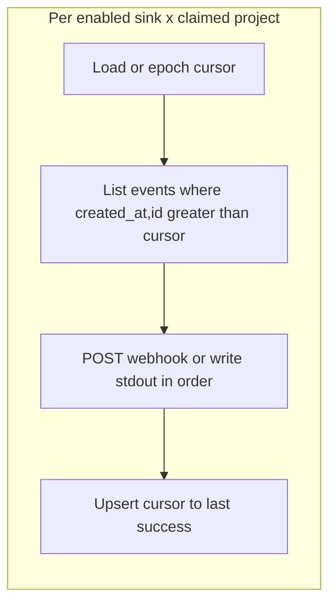

# ADR 049: Events API, Retention, and External Export

> **Status:** Proposed
> **Date:** 2026-07-03
> **Context:** Operator and integrator access to the wide event audit stream
> **Builds on:** [ADR 048](048-wide-events-internal-audit-primitive.md), [ADR 027](027-cursor-based-pagination.md), [ADR 033](033-internal-permission-management.md), [ADR 036](036-api-credential-planes.md), [ADR 046](046-claim-lifecycle-v2.md), [ADR 047](047-dialect-id-generation.md)
> **Related:** [resource-map](../design/api/resource-map.md)

## Context

[ADR 048](048-wide-events-internal-audit-primitive.md) defines the internal wide
event model: one `events` table, two Go emission paths, and deny-by-default PII
policy. Operators and external systems also need:

- A **query API** for incident response and regulatory review.
- **Reliable-enough export** to external sinks within the local retention window.

Classic ZITADEL exposes events via the Event API and supports SIEM streaming.
nextgen consolidates identity events and admin/configuration changes into a
**single `/events` endpoint** filtered by `category`, replacing the earlier
split between `/events` and `/audit_events` in the resource map sketch.

## Decision

### 1. Unified `/events` API

One list endpoint and one get-by-id endpoint cover all event categories.

```http
GET /events?project_id=…
         &category=…
         &event_type=…
         &actor_id=…
         &client_id=…
         &session_id=…
         &flow_id=…
         &request_id=…
         &fingerprint=…
         &entity_type=…
         &entity_id=…
         &team_id=…
         &created_after=…
         &created_before=…
         &page_token=…

GET /events/{id}?project_id=…   # project scope required (see below)
```

**Filter semantics:**

| Parameter | Type | Notes |
|-----------|------|-------|
| `project_id` | required (implicit from credential scope, or explicit when dual-scoped) | Tenancy boundary |
| `category` | enum, repeatable | `request`, `auth`, `session`, `admin`, `entity`, `signal` |
| `event_type` | string, repeatable | Exact match; prefix filter (`user.`) is a future extension |
| `actor_id` | string | Who triggered the event |
| `client_id` | string | Application or agent |
| `session_id` | string | Session correlation |
| `flow_id` | string | Login flow correlation |
| `request_id` | string | HTTP request correlation |
| `fingerprint` | string | Device correlation |
| `entity_type` | string | Resource type affected |
| `entity_id` | string | Resource ID affected |
| `team_id` | string | Filter by emit-time team scope |
| `created_after` | RFC 3339 timestamp | Inclusive lower bound on **`created_at`** |
| `created_before` | RFC 3339 timestamp | Exclusive upper bound on **`created_at`** |
| `page_token` | opaque string | [ADR 027](027-cursor-based-pagination.md) cursor |

`created_after` / `created_before` filter insert time. ADR 048 recommends
`occurred_at` for forensic "when did it happen"; with Path A batching the skew
is bounded by ~T (~1s). `occurred_after` / `occurred_before` are a **future
extension** (predicate filters only — keyset pagination stays on
`(created_at, id)`).

**Response shape** (list items):

```json
{
  "id": "evt_01HZY…",
  "project_id": "proj_abc",
  "team_id": "team_xyz",
  "event_type": "auth.token.issued",
  "category": "auth",
  "occurred_at": "2026-07-03T12:00:00Z",
  "created_at": "2026-07-03T12:00:00.050Z",
  "actor_id": "user_xyz",
  "actor_type": "human",
  "entity_type": "token",
  "entity_id": "tok_987",
  "client_id": "app_dashboard",
  "token_id": "tok_abc",
  "delegation_type": "direct",
  "delegation_id": "",
  "grantor": "",
  "fingerprint": "fp_device123",
  "request_id": "0af7651916cd43dd8448eb211c80319c",
  "session_id": "sess_456",
  "flow_id": "",
  "payload": { "scope": ["openid", "profile"] },
  "metadata": {}
}
```

`GET /events/{id}` may additionally include delivery status (RECOMMENDED):

```json
{
  "deliveries": [
    { "sink_id": "sink_01HZA…", "delivered_at": "2026-07-03T12:00:05Z" },
    { "sink_id": "sink_01HZB…", "delivered_at": "2026-07-03T12:00:05Z" }
  ]
}
```

- `payload` and `metadata` are returned **as stored** — already redacted at emit
  time per [ADR 048 §8](048-wide-events-internal-audit-primitive.md).
- List response wraps items in `{ "data": [...], "next_page_token": "..." }` per
  [ADR 027](027-cursor-based-pagination.md). No total count. List omits
  `deliveries` to keep payloads small.

**Pagination:** Keyset cursor on `(created_at, id)` within `project_id`,
consistent with [ADR 027](027-cursor-based-pagination.md) and v2 storage list
options. Index: `(project_id, created_at, id)`.

**Permissions and scope:**

- Callers require an `events.read` permission. Exact catalog entry is TBD; it
  will be a **system-catalog** permission
  ([ADR 032](032-permission-catalogs.md) / [ADR 033](033-internal-permission-management.md)),
  not a parallel ad-hoc RBAC. Design-doc drift: [system-permission-catalog.md](../design/api/system-permission-catalog.md)
  still lists separate `event.read` / `audit_event.read` and `/audit_events` —
  those split permissions are **retired** with the unified `/events` surface;
  align the catalog in a follow-up.
- `/events` is an **operator / confidential-plane** surface
  ([ADR 036](036-api-credential-planes.md)) — not public-plane.
- Authorization uses the **immutable emit-time scope** stored on the event
  (`project_id`, optional `team_id` from [ADR 048](048-wide-events-internal-audit-primitive.md)),
  not recomputed actor/resource membership.
- **Project-scoped** credentials see all events in the project (subject to
  `events.read` and the pre-claim visibility gate).
- **Team-scoped** credentials see only events where `events.team_id` equals the
  credential's team. Events are visible within the scope that created them
  unless a future admin override is defined.
- Filtering by current `actor_id` membership or resource team is **rejected** —
  users and resources can move teams; that must not leak or hide historical
  events.

**`GET /events/{id}` — project-scoped (no `resource_scope_index`):**

Events are **not** registered in `resource_scope_index` ([ADR 048](048-wide-events-internal-audit-primitive.md)).
That index stays for durable resources only.

1. Resolve `project_id` from the credential scope, or require an explicit
   `project_id` query/body field when the credential is not single-project.
2. Authorize `events.read` for that project (and team rules when applicable).
3. Load `WHERE project_id = $scope AND id = $path_id`.
4. Apply emit-time `team_id` filtering for team-scoped credentials.
5. Miss or deny → **404** (no existence leak across projects).

Authorize-after-fetch across projects (load by global id, then check) is
rejected. Flat-by-ID without project scope is rejected for events.

**OpenAPI:** A design sketch may live under `docs/design/api/` until the
endpoint is added to `api/openapi/`. Implementation is out of scope for this ADR.

**Removed:** `/audit_events` and `/audit_events/{id}`. Admin and configuration
events use `category=admin` on `/events`.

### 2. Retention and immutability

Events are append-only within their retention window.

**Application DB role:**

- `INSERT` and `SELECT` on `events` — no `UPDATE` or `DELETE` from application
  code during normal operation.
- `INSERT`/`UPDATE` on `event_sink_cursors` — shipper only.
- The retention background job uses a dedicated role with `DELETE` permission on
  `events`. Sink cursors are independent of event rows (no cascade from purge).

**Retention policy:**

- Configurable per deployment via server config (suggested default: **30 days**).
- Retention is **time-only**. An event is eligible when
  `created_at < now() - retention` — **not** gated on sink delivery.
- Background job deletes eligible `events` rows. Sink cursors remain as keyset
  bounds; `(created_at, id) > cursor` still works after the pointed-at event
  has been purged.
- When deleting rows that are still beyond a sink's cursor for one or more
  currently enabled sinks, increment metric `events_purged_undelivered` (no
  block, no extend). Export is best-effort within the retention window.
- Future optimization (not v1-mandatory): time-range partitioning on
  `created_at` so retention can drop partitions instead of large DELETEs.

Executable retention pattern (Postgres):

```sql
-- $1 = project_id, $2 = retention interval
DELETE FROM zitadel_nextgen.events
WHERE project_id = $1
  AND created_at < now() - $2;
```

Long-term compliance archive is the **operator's responsibility** once events
are exported to SIEM or another durable sink within the window.

**Immutability scope:** Event content is immutable for the duration rows remain
in the database. Retention purge is an explicit, scheduled operation — not an
application UPDATE that alters event content.

Link to [ADR 024](024-user-team-lifecycle-ownership.md): user/team lifecycle
purge policies are separate from event retention; this ADR does not define
user-data purge windows.

### 3. External export (per-sink delivery)

A background **shipper** delivers events to configured external sinks before
(and independently of) retention. Delivery progress is tracked per
`(sink_id, project_id)` with a keyset watermark on `(created_at, id)` —
not as a purge gate.

#### Sink resource (first-class CRUD)

Sinks are first-class rows with dialect-minted managed ids
([ADR 047](047-dialect-id-generation.md)), not fixed string names like
`"stdout"` / `"webhook"`.

```sql
CREATE TABLE zitadel_nextgen.event_sinks (
    id              TEXT        NOT NULL   -- sink_<opaque>
    , type            TEXT        NOT NULL   -- 'stdout' | 'webhook'
    , scope           TEXT        NOT NULL   -- 'deployment' | 'project'
    , project_id      TEXT                  -- NULL for deployment-scoped; set for project-scoped
    , url             TEXT                  -- required for type=webhook
    , enabled         BOOLEAN     NOT NULL DEFAULT TRUE
    , PRIMARY KEY (id)
);
```

v1 CRUD + cardinality caps:

| Cap | Rule |
|-----|------|
| Deployment stdout | At most **one** enabled `type=stdout`, `scope=deployment` |
| Deployment webhook | At most **one** enabled `type=webhook`, `scope=deployment` |
| Project webhook | At most **one** enabled `type=webhook`, `scope=project` per `project_id` |

Delivery is **additive**: when all three are enabled for a project, each event
advances up to **three** independent cursors (one per sink id). Deployment-wide
sinks still keep **one cursor row per claimed project** under the same
`sink_id`. Additional sink types and unbounded multi-webhook lists are out of
scope for v1.

#### Delivery tracking

```sql
CREATE TABLE zitadel_nextgen.event_sink_cursors (
    sink_id           TEXT        NOT NULL
        REFERENCES zitadel_nextgen.event_sinks (id)
    , project_id      TEXT        NOT NULL
        REFERENCES zitadel_nextgen.projects (id) ON DELETE CASCADE
    , last_created_at TIMESTAMPTZ NOT NULL
    , last_event_id   TEXT        NOT NULL
    , PRIMARY KEY (sink_id, project_id)
);
```

Missing cursor means epoch (ship from the start of retained history). Cursors
do not cascade from `events` purge; they are independent keyset bounds.



**Shipper behavior:**

- One shipper loop iterating enabled sinks × claimed projects (see §4).
- For each project, enabled sinks = deployment-scoped sinks that apply globally
  **plus** that project's project-scoped webhook (if any).
- Poll: `ORDER BY created_at, id` with keyset `(created_at, id) > cursor`.
- Deliver sequentially; on success upsert the cursor to that event.
- On failure: **head-of-line block** for that `(sink, project)` only — do not
  advance past the last success; other projects for the same sink keep moving.

**Delivery semantics:**

- At-least-once delivery within the retention window. Consumers must be
  **idempotent** on `event.id`.
- Shipper retries on transient failure without advancing the cursor.
- Duplicate external delivery is acceptable (crash between deliver and upsert);
  missing delivery after retention purge is accepted (metric
  `events_purged_undelivered`).

**Configuration sketch** (illustrative; real config is CRUD on `event_sinks`):

```yaml
# Deployment-scoped sinks (at most one stdout + one webhook)
event_sinks:
  - id: sink_01HZA…          # managed id from create
    type: stdout
    scope: deployment
  - id: sink_01HZB…
    type: webhook
    scope: deployment
    url: https://siem.example.com/zitadel/events
# Plus optional per-project webhook via project admin API:
# POST /projects/{id}/event_sinks { type: webhook, url: ... } → sink_01HZC…
```

### 4. Pre-claim visibility and export

Per [ADR 046](046-claim-lifecycle-v2.md) and
[ADR 048](048-wide-events-internal-audit-primitive.md):

- Events are **emitted and stored** for unclaimed projects (including
  `project.created` and pre-claim admin activity).
- Until claim succeeds, `GET /events`, `GET /events/{id}`, and the shipper
  treat the project as **not visible** (empty list / 404 / skip ship) — same
  gate for operators and export.
- After claim, stored history becomes readable and exportable; **no backfill
  job**.
- Retention remains **time-only** for unclaimed projects (same window); disk
  does not grow forever waiting for claim or sinks.

## Non-goals

- Event mutation API (corrections are new events, not updates).
- Real-time push subscriptions (webhook shipper is pull-based batching; SSE
  is a future extension).
- Cross-project event search (always scoped to `project_id`).
- Flat-by-ID `GET /events/{id}` without project scope / `resource_scope_index`
  for events.
- Unbounded multi-webhook lists or additional sink types in v1.
- Blocking retention on sink delivery.

## Consequences

### Positive

- Single API surface simplifies SDK and SIEM integration vs split
  `/events` + `/audit_events`.
- Per-`(sink, project)` watermark cursors support additive multi-sink delivery
  without a single `shipped_at` timestamp or a growing delivery-ack table.
- Time-only retention keeps disk bounded even when webhooks are down or
  misconfigured.
- Emit-time `team_id` + project-scoped get make list/get authorization safe
  under membership changes without bloating `resource_scope_index`.
- Category filter maps directly to compliance use cases (auth vs admin vs
  entity).
- Pre-claim store + visibility gate preserves forensic history for
  create-first-claim-later without exposing unclaimed projects.
- First-class sink CRUD with managed ids aligns with [ADR 047](047-dialect-id-generation.md).

### Negative / Risks

- **Best-effort export:** a slow or broken sink can miss events that age out;
  operators who need durable archive must consume within the retention window
  (or extend retention). Metric `events_purged_undelivered` surfaces the gap.
- **Webhook reliability:** at-least-once delivery requires consumer idempotency;
  document clearly. Head-of-line blocking means one poison event stalls that
  `(sink, project)` until retention drops it or ops intervenes.
- **Request event volume:** high-traffic projects generate large `/events`
  result sets when filtering `category=request`; operators should prefer SIEM
  export over repeated full scans.
- **Permissions TBD:** `events.read` system-catalog entry must be specified and
  the design catalog's `event.read` / `audit_event.read` split retired in a
  follow-up.

## Related ADRs

| ADR | Relationship |
|-----|--------------|
| [048 Wide Events Internal Model](048-wide-events-internal-audit-primitive.md) | Table schema, categories, emission, PII, emit-time scope |
| [027 Cursor-Based Pagination](027-cursor-based-pagination.md) | List pagination contract |
| [024 User/Team Lifecycle](024-user-team-lifecycle-ownership.md) | Lifecycle purge vs event retention |
| [028 Storage v2 Statements](028-storage-v2-statements-and-dialects.md) | `AllStatements` / `EventStatements` is the emission boundary |
| [033 Internal Permission Management](033-internal-permission-management.md) | System-catalog `events.read`; events **not** in `resource_scope_index` |
| [036 API Credential Planes](036-api-credential-planes.md) | `/events` is operator/confidential-plane |
| [046 Claim Lifecycle v2](046-claim-lifecycle-v2.md) | Pre-claim: store always; visibility/export gated until claim |
| [047 Dialect-Owned ID Generation](047-dialect-id-generation.md) | Event and sink managed ids |
