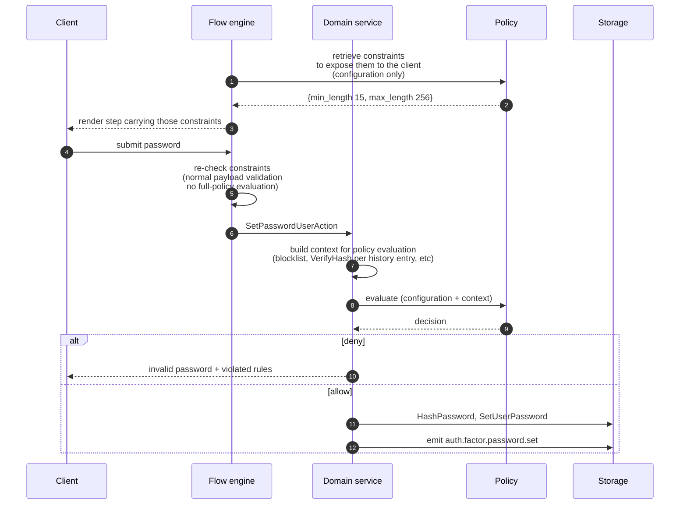

# ADR 059: Operation Policies

> **Status:** Draft
> **Date:** 2026-08-28
> **Context:** [#383](https://github.com/zitadel/nextgen/issues/383) asks for the
> settings-and-policies architecture; [#899](https://github.com/zitadel/nextgen/issues/899)
> defines the product model; [#898](https://github.com/zitadel/nextgen/issues/898)
> is the first consumer.
> **Related:** [ADR 020](020-credentials-out-of-user-schema.md),
> [ADR 035](035-configuration-environments.md),
> [ADR 042](042-scaffolded-file-ownership-and-drift-detection.md),
> [ADR 048](048-wide-events-internal-audit-primitive.md)

## Context

This ADR proposes the data model and enforcement mechanism for policies in nextgen.

## Status Quo

### Zitadel previous versions

There are many controls, but they are fragmented, inconsistently named, and mix capability configuration with security enforcement. 

Some work was planned as part of ([zitadel#11596](https://github.com/zitadel/zitadel/issues/11596)) to better organize and split settings and policies.

### Nextgen

No defined settings / policy model. Some configuration is hard-coded, for example:
- Password minimum length: [`MinLength: 8`](internal/domain/flow_field_resolver_schema.go)
- Passkey user verification is a fixed [`"preferred"`](internal/domain/flow_state_machine.go)
- Failed authentication attempts are recorded "for rate-limiting purposes" with no threshold reading them.

The first priority is to introduce proper password policies ([#898](https://github.com/zitadel/nextgen/issues/898)):

- Minimum password length
- Password history

#### The flow-engine and auth-attempt already assume a policy engine

Apart from the new password policy requirements, initial flow-engine design documents describe a policy engine as one of their five core concepts, for example in [`docs/design/flowengine/README.md`](../design/flowengine/README.md):
> *"Policy Engine — the sole decision maker. Evaluates session state + context and determines what's required. **Design TBD** — not covered in these documents"*

In the design documents, these are some of the capabilities expected from the policy engine:

1. **Flow-engine** - *Risk evaluation*: decide when a captcha is required, and inject the gate on any step — [`bot-detection.md`](../design/flowengine/bot-detection.md), [ADR 019](019-captcha-gate-and-bot-signals.md)
2. **Flow-engine** — *Input validation*: block a submission based on its input, and validate fields against rules the flow definition does not carry — [`flow-engine-external-auth-factors.md`](../design/flowengine/flow-engine-external-auth-factors.md)
3. **Auth-attempt** — *Assurance evaluation*: compare the factors verified so far against the requested ACR after each submission, and inject the missing factor as a step — [`flow-engine.md`](../design/flowengine/flow-engine.md), [`session-api.md`](../design/flowengine/session-api.md), [ADR 010](010-session-auth-attempt-check-model.md)

## Proposal

**A policy attaches to one domain operation.** The policy holds all the **configuration** needed at that **operation** and the **rule** that turns that configuration into a **decision**, always evaluated **before** the operation runs.

### Terminology

- **Operation**: a domain action that can carry a policy, such as `user.password.save` (static list defined by Zitadel)
- **Policy**: everything attached to one operation, the configuration and rule together
- **Policy configuration**: the values a developer authors (JSON, revisioned, in the release)
- **Policy rule**: the logic turning configuration + context into a decision (Go or OPA/Rego; project bootstrapped with defaults, a developer may override it)
- **Decision**: what a policy rule returns for one evaluation — `allow`, `deny`, or `require` (see [Decisions](#decisions))

### Data Model

Each policy guards one domain operation and carries its own configuration.

```json
// .zitadel/policies/user.password.save.json
{
  "kind": "policy",
  "operation": "user.password.save", // the domain operation this policy guards

  // configuration specific to this policy
  "min_length": 15,
  "max_length": 256,
  "history_depth": 5,
  "reject_current": true
}
```

```json
// .zitadel/policies/user.password.verify.json (illustrative)
{
  "kind": "policy",
  "operation": "user.password.verify",

  "max_attempts": 10,
  "lockout_duration": "30m"
}
```

#### Definition by JSON Schema

Each policy follows a JSON Schema, which is the source of truth for which settings that operation accepts and which values are legal.

Example of JSON Schema for policy definition for `user.password.save` operation, defined by Zitadel:

```json
{
  "title": "user.password.save",
  "type": "object",
  "additionalProperties": false,
  "properties": {
    "kind":       { "const": "policy" },
    "metaSchema": { "type": "string", "format": "uri" },
    "operation":  { "const": "user.password.save" },

    "min_length":     { "type": "integer", "minimum": 4,  "maximum": 256,  "default": 15 },
    "max_length":     { "type": "integer", "minimum": 64, "maximum": 4096, "default": 256 },
    "history_depth":  { "type": "integer", "minimum": 0,  "maximum": 24,   "default": 0 },
    "reject_current": { "type": "boolean", "default": true },

    "blocklist": {
      "type": "object",
      "additionalProperties": false,
      "properties": {
        "enabled": { "type": "boolean", "default": true },
        "source":  { "type": "string", "enum": ["zitadel-managed"], "default": "zitadel-managed" }
      }
    }
  }
}
```

### Policy catalog

The set of policy-guarded operations is **closed and server-defined**. A developer authors a policy configuration for any operation on the list and may replace its policy rule, but cannot add an operation to the list.

```json
{
  "$schema": "https://json-schema.org/draft/2020-12/schema",
  "$id": "${SERVER_URL}/policies/catalog-v1.json",
  "title": "PolicyDocument",
  "type": "object",
  "required": ["kind", "metaSchema", "operation"],
  "properties": {
    "kind":       { "const": "policy" },
    "metaSchema": { "type": "string", "format": "uri" },
    "operation":  { "type": "string" }
  },
  "oneOf": [
    { "$ref": "operations/user.password.save.json" },
    { "$ref": "operations/user.password.verify.json" }
    // list grows as more operations are added
  ]
}
```

### Policy evaluation trigger (relation to domain events)

A policy is evaluated **before** its operation, synchronously. Existing [wide events](048-wide-events-internal-audit-primitive.md) record what happened **after**, and cannot affect the outcome. 

| Operation — policy evaluated before | Wide event — emitted after |
|---|---|
| `user.password.save` | `user.password.saved` |
| `user.create` | `user.created` |

### Policy evaluation

Each policy is evaluated against its **configuration** and the **request context**. Configuration arrives as `data`; context arrives as `input`. The engine is **stateless**, it never fetches its own inputs.

```json
// data — the policy for this operation, resolved from the active release
{
  "kind": "policy",
  "operation": "user.password.save",

  "min_length": 15,
  "max_length": 256,
  "history_depth": 5,
  "reject_current": true
}
```

```json
// input — the request context, derived by Go for this one evaluation
{
  "operation": "user.password.save",
  "user":      { "id": "usr_…", "schema": "human-user", "created_at": "…" },
  "request":   { "ip": "…", "user_agent": "…", "origin": "…" },
  "candidate": { "length": 14, "in_blocklist": false },
  "history_matches": [false, false, true, false, false],
  "current_matches": false
}
```

The request context is fixed per operation, see [The context schema](#the-context-schema).

Resulting **Decision** based on policy and request context above:

```json
{
  "allow": false,
  "violations": [
    { "rule": "min_length", "limit": 15, "actual": 14 },
    { "rule": "history", "depth": 5, "position": 3 }
  ]
}
```


#### Decisions

A decision is the result produced after policy rule evaluation. It returns one of:

- `allow`: the operation may proceed
- `deny`: the operation is rejected, with machine-readable reasons
- `require`: the operation is not yet permissible; these requirements are unmet (not needed for allow/deny policies, but needed in cases such as injecting a step during the flow)

### End to end: a user enters their password during sign-up (via flow-engine)



1. **Render.** Flow-engine fills `FlowFieldValidation` based on policy configuration. Today that function hard-codes `MinLength: 8`. The client can perform frontend validation.

4. **Submit.** The client posts the new password as the reserved field `x-auth-methods#password`.

5. **Validation.** Flow-engine backend payload validation re-check constraints.

6. **Domain operation.** The flow engine calls `SetPasswordUserAction`. This is the guarded operation.

7. **Prepare context**, prepare policy evaluation context (this is per-policy-specific logic, see [The context schema](#the-context-schema)).

8. **Evaluate.** The rule runs over configuration plus context and returns a decision.

10. **Return error.**

11. **Proceed with operation.**

### The rule engine: OPA/Rego or Go

**This is an open decision.**

**Choosing Rego/OPA** means a policy is two files. Zitadel ships a `.rego` next to the `.json`, and the server embeds an evaluator to run it. The rule is also part of the release, a developer can modify it.

**Choosing Go** means a policy is one file. The rule is a function in the server, and the release carries only the configuration. A developer sets values and nothing else; changing what a rule *does* is a Zitadel code change and a server release.

| | Rego | Go |
|---|---|---|
| Extensibility | a developer can read and replace it **(best)** | every rule change is a code change and a server release |
| Policy as code | the rule is a reviewable artifact part of release **(best)** | the rule is compiled into the binary; the release carries only settings |
| Tooling | `opa test`, `opa fmt`, coverage, decision logs | existing Go test tooling |
| Failure surface | a rule can error or loop, so it needs a timeout and a failure posture | cannot fail independently of its caller **(best)** |
| Latency | microseconds per evaluation | a native function call **(best)** |
| Debugging | `--explain`, `print()`, decision logs | debugger, stack traces, profiler **(best)** |
| Familiarity, in-team | a second language in the codebase | what the team already writes **(best)** |
| Familiarity, industry | the de-facto policy-as-code language — CNCF-graduated OPA, Gatekeeper, Conftest — so an engineer who has written policy elsewhere reads ours on sight **(best)** | no authoring surface, so no transferable skill either way |
| Untrusted input | evaluates customer-authored logic, so it needs a sandbox | no customer code path exists **(best)** |

Full examples in OPA Playground:
- [`user.password.save`](https://play.openpolicyagent.org/p/g_YWQ0OGM4ZmYzMjYxZGM1ODQ2YTY3ZmZhYjc1NmIzZDFfczzcYv4Px-YXZQ6l6oBXbuWAIcI)
- [`user.password.verify`](https://play.openpolicyagent.org/p/g_NTc3ODFmOTliOGJkYmExODI3OWQxNjJiOGIwOGM4YTFfl6BaThO91b4YbCKPqgkrBpvj9DA)

## Relation to other domains

Where operation policies sit against the rest of the platform.

### Releases

Both the policy configuration and the policy rule are revisioned resources deployed as part of a release.

### Hooks and actions

Policies apply to a **static list of operations defined by Zitadel**. A developer configures what happens at an operation on that list; they cannot add one, and a policy only ever returns a decision.

Hooks/actions are the generic version of the same idea, developer-declared extension points, running arbitrary code, allowed side effects.

## Risks

**Plaintext reaching the evaluation path.** The obvious context for a password policy is the password, and decision logs capture the full input by default.
Mitigated by construction: the context carries derived values computed in Go.

**Duplication across operations.** A control relevant at two operations is configured at both.

**A replaceable rule can weaken policy.** A developer can modify a Rego rule and allow everything.

---

STOP READING (content below not ready for review)

---

## Advanced topics

Everything above is the proposal. What follows is detail for whoever
implements it, and questions that outlive the MVP.

### The context schema

The schema above says what a developer may **configure**. A second schema per operation says what the policy rule **receives**.

```json
// operations/user.password.save.context.json — Zitadel-defined, versioned with the server
{
  "title": "user.password.save context",
  "type": "object",
  "additionalProperties": false,
  "required": ["operation", "user", "request", "candidate"],
  "properties": {
    "operation": { "const": "user.password.save" },
    "user":      { "$ref": "context-common.json#/$defs/user" },
    "request":   { "$ref": "context-common.json#/$defs/request" },

    "candidate": {
      "type": "object",
      "additionalProperties": false,
      "required": ["length", "in_blocklist"],
      "properties": {
        "length":       { "type": "integer", "minimum": 0 },
        "in_blocklist": { "type": "boolean" }
      }
    },
    "history_matches": { "type": "array", "items": { "type": "boolean" } },
    "current_matches": { "type": "boolean" }
  }
}
```

`operation`, `user` and `request` are the envelope every operation shares; everything else is specific to this one. For example, only the `user.password.save` rule evaluation will receive `history_matches` which carries the information if the new password matches one of the previous ones.

### Exposing configuration to the frontend

A login form has to render "at least 15 characters" *before* anyone types, which
means part of the policy configuration has to reach an unauthenticated client.
Alongside `evaluate`, every policy therefore answers a second query:

- **`constraints`** — computed from configuration alone, with no context, so it
  resolves before the user has typed anything.

Today this already works for one value and one value only: `MinLength` is set in
`resolveAuthMethodField`, travels in the step payload as `FlowFieldValidation`,
and is re-checked server-side by `SchemaFieldResolver.Validate`. `constraints`
generalises that path rather than adding one.

**Delivery.** For flows, the flow engine embeds constraints in the step it
already sends — no new endpoint, and the client contract does not change:

```json
{ "type": "string", "minLength": 15, "maxLength": 256 }
```

For clients not driven by the flow engine — a custom login on the SDK, or a
self-service password change inside a customer application — the same projection
needs a read endpoint, unauthenticated because the login form is pre-auth.

```http
GET /policies/user.password.save/constraints
```
```json
{
  "operation": "user.password.save",
  "release": "rel_01KX3RG8A7F0N9WD3P2E4YM5C1",
  "constraints": {
    "min_length": { "limit": 15 },
    "history":    { "depth": 5 },
    "blocklist":  { "enabled": true }
  },
  "field_schema": { "type": "string", "minLength": 15, "maxLength": 256 }
}
```

Four properties of that endpoint are load-bearing rather than incidental:

- **The path names the projection, not the document.** `GET /policies/{operation}`
  would imply the policy configuration itself, and that includes settings marked
  private. Returning `constraints` under its own path makes it structurally
  impossible to serve the private half by accident, and stops a client author
  assuming the response is the configuration.
- **It never 404s for a catalogued operation.** With no policy authored the
  built-in defaults apply, so the endpoint still answers. A 404 means the
  operation is not in the catalogue — a client bug, not an unconfigured project.
- **It is cacheable on the release.** Constraints change only when a release is
  deployed, so the response carries its `release` id and that id is the `ETag`.
  A login form fetching this on every render costs one conditional request.
- **It is scoped like any other public read**, resolving the project the same way
  the rest of the unauthenticated surface does, and reading from that
  environment's active release rather than from the latest revision.

The endpoint takes an **operation**, not an event: `user.password.save` is
guarded, `user.password.saved` is emitted afterwards and has no constraints to
serve.

**Not every setting may be published.** `min_length` must be public; it is
rendered. `max_attempts` must not be, because publishing it tells an attacker
exactly how many tries they get, and the blocklist contents are not publishable
at any size. So visibility is a per-setting property and belongs in the
metaschema next to the bounds:

```json
"min_length":   { "type": "integer", "minimum": 4, "default": 15, "x-visibility": "public" },
"history_depth":{ "type": "integer", "minimum": 0, "default": 0,  "x-visibility": "public" },
"blocklist":    { "type": "object",  "x-visibility": "private" }
```

A setting with no marker is private. Publishing is then opt-in per setting and
reviewable when the catalogue changes, rather than a judgement made per endpoint.

**The invariant, and the line it does not cross.** Anything `evaluate` can deny
for must be discoverable in `constraints` — a rule found only by failing is a
rule the user cannot satisfy. Keycloak shipped without this projection and had to
retrofit it: password policies were unreachable from login themes, so users could
not see the requirements before submitting
([keycloak#32553](https://github.com/keycloak/keycloak/issues/32553)).

That invariant is about **rules being discoverable, not values being public**. A
user must be able to learn that a blocklist check exists; they must not be able
to download the blocklist. So `constraints` carries the *shape* of every rule and
the *value* of only the settings marked public:

```json
{ "min_length": { "limit": 15 }, "history": { "depth": 5 }, "blocklist": { "enabled": true } }
```

Where a requirement cannot be published up front without weakening it — lockout
being the clear case — it is disclosed after the fact instead, in the denial
("try again in 20 minutes"), never before.

**Client-side validation is UX, never enforcement.** The server re-checks
everything; steps 3 and 7 of the walkthrough below are the same check at
different costs, deliberately.

Because a developer may replace the policy rule, the invariant cannot be a
convention. It is checked at release construction:

```rego
undeclared contains rule if {
	some v in violations
	rule := v.rule
	not constraints[rule]      # denied for something never rendered
}
```

A release whose policy rule produces a non-empty `undeclared` for any context in
the operation's conformance suite is rejected.

### Error handling

Declared per operation. `user.password.save` fails closed: a policy rule that
errors or times out denies the save. An operation whose closed failure would lock
every user out of the login screen declares open and logs — #899 requires a
default that preserves at least one valid path.

A rule that loops is a denial-of-service on the login path, so evaluation runs
under a context deadline. A blown deadline is not a special case: it resolves
through the same declared posture as any other rule error.

### Working with Rego

Only relevant if Rego wins [the engine decision](#the-rule-engine-rego-or-go). The point is that a rule is an
artifact with a normal toolchain, not a blob of configuration.

| Step | Command | Where it runs |
|---|---|---|
| Format | `opa fmt -w policies/` | pre-commit, and `zitadel policies fmt` |
| Lint | `regal lint policies/` | CI; catches unused bindings, shadowed names, deprecated builtins |
| Test | `opa test policies/ -v` | CI, and the developer's machine |
| Coverage | `opa test policies/ --coverage --threshold 80` | CI |
| Type-check | `opa check --strict policies/` | publish, before the release is built |
| Build | `opa build -t wasm` or bundle | server startup, or at release construction |

Three of these do real work for this design specifically:

- **`opa check --strict`** turns a rule referencing something outside the
  context schema into a publish error rather than a silent `undefined` at
  authentication time. That is what makes the context schema a contract rather
  than documentation.
- **`opa test`** is where the conformance suite lives: the per-operation table of
  (configuration, context, expected decision) that any engine must satisfy. It is
  also what checks the `undeclared` invariant, since that is expressible as a
  test over generated contexts rather than a manual review.
- **Compilation** is the open sub-question. Rego can be interpreted from source,
  compiled to an internal IR at load, or built to Wasm ahead of time. Wasm gives
  the most predictable latency and the strongest sandbox, at the cost of a build
  step in release construction and losing `print()` debugging. Interpreting from
  source is simplest and almost certainly fast enough for a handful of scalar
  comparisons. Measure before choosing.


### Ownership

#383 requires one explicit owner and no automatic inheritance. Neither issue
defines "owner", and the word carries several jobs. This ADR pins it to one:

> **Owner is the resolution root — the resource whose configuration the runtime
> reads to obtain the effective value.**

The other jobs keep their existing homes: who may view and change it →
permission catalogs ([ADR 032](032-permission-catalogs.md),
[033](033-internal-permission-management.md),
[034](034-external-permission-management.md)); what it affects → applicability,
which #899 already separates from ownership; what happens when the owning
resource is deleted → explicit lifecycle policy in
[ADR 024](024-user-team-lifecycle-ownership.md)'s style, never a cascade; where
it is authored → the release (ADR 035).

In MVP the resolution root is always the Project, so no owner field is minted.
#383's future-compatibility requirement is met by the catalogue declaring
which owner kind each operation resolves from — a property of the catalogue, not
machinery to build now.

**Team-owned policies are out of scope, and not for scheduling reasons.** Per
[`hierarchy.md`](../design/api/hierarchy.md) a Team in a customer project is a
B2B end-customer tenant created at runtime, so a Team-owned policy would be
runtime state and fall outside the release boundary ADR 035 locked. Whether
Zitadel wants tenant-authored configuration at all is a separate decision.

### Policy hierarchy

**Not MVP.** #383 asks only that the architecture not foreclose it, and
[Ownership](#ownership) pins the resolution root to the Project. This section
records what the shape would have to be, so the MVP does not accidentally make it
unreachable.

The motivating case is B2B: in a customer project a Team is an end-customer
tenant, and one tenant wants a stricter password rule than the project default —
their own compliance regime, not the developer's.

A resolution order would look like: Application → Team → Project → built-in
default, first match wins for a whole policy, or per-setting if the appetite is
there. Two rules keep it honest:

- **Restrictive, not replacing.** A lower level may only strengthen. A Team
  raising `min_length` from 15 to 20 is allowed; lowering it to 8 is not. This
  is #899's "one policy cannot implicitly weaken another", and it needs a
  declared direction per setting — for `min_length` stricter is higher, for
  `max_attempts` stricter is lower. That direction is a property of the setting,
  so the metaschema is where it would live.
- **The effective value and its source are both visible.** #899 requires an
  administrator to see which level contributed what. That is a reporting
  requirement on whatever resolves the chain, and it is why "first match wins"
  has to record the match rather than just return it.

**The unresolved problem is not the merge — it is the release boundary.** Project
policies are release content: authored in `.zitadel/`, revisioned, promoted,
rolled back. A Team is created at runtime by a customer, so a Team-level override
cannot be in the developer's release without the developer authoring a document
per tenant. That leaves three options, none free:

1. **Tenant overrides are runtime state**, written through an API and outside the
   release. Honest about what they are, but it breaks ADR 035's guarantee that a
   release determines behaviour, and it means promoting a release no longer
   reproduces an environment exactly.
2. **Tenant overrides are release content**, with the developer authoring them.
   Preserves the boundary, and does not scale past a handful of tenants.
3. **The project authors the envelope, tenants pick within it.** The release
   defines which settings a tenant may strengthen and how far; the tenant's
   choice is runtime state but is bounded by release content. Behaviour stays
   determined by the release plus a value from a declared range.

Option 3 is the only one that keeps both properties, and it is the shape worth
preserving optionality for. Concretely that means a setting's metaschema entry
would need room for a `tenant_overridable` bound alongside its `minimum` and
`maximum` — nothing to build now, but a reason not to treat the metaschema as
closed.

Whether Zitadel wants tenant-authored configuration at all is a product decision
that has not been made, and it should be made before this is designed.

---

## External references

Each entry notes what it was used for, so a reviewer can check the claim rather
than the link.

### Naming and structure

- [Azure Policy — definition structure](https://learn.microsoft.com/en-us/azure/governance/policy/concepts/definition-structure) — a policy definition splits into `parameters` and `policyRule`, with assignments supplying values. The closest shipped match to this ADR's policy configuration / policy rule split.
- [Kyverno — ClusterPolicy overview](https://kyverno.io/docs/policy-types/cluster-policy/overview/) — a policy holds `rules[]`, each with `match` plus a `validate`/`mutate` block. Same containment.
- [XACML 3.0 core specification](http://docs.oasis-open.org/xacml/3.0/xacml-3.0-core-spec-os-en.html) — PolicySet → Policy → Rule, and the *deny-overrides* combining algorithm that composition would follow.
- [Cedar: a new language for expressive, fast, safe, and analyzable authorization](https://dl.acm.org/doi/10.1145/3649835) — forbid always overrides permit, and the grammar is deliberately not Turing-complete so policies stay statically analyzable. The argument for keeping a rule inspectable rather than opaque.

### Rule plus parameters plus selector, as shipped elsewhere

- [Kubernetes — ValidatingAdmissionPolicy](https://kubernetes.io/docs/reference/access-authn-authz/validating-admission-policy/) — CEL policy, `paramKind`/`paramRef` for configuration, a binding carrying `matchResources` and `validationActions: Deny | Warn | Audit`, plus `failurePolicy`. Also the precedent for replacing per-decision webhooks with in-process evaluation.
- [OPA Gatekeeper](https://open-policy-agent.github.io/gatekeeper/website/docs/howto/) — ConstraintTemplate holds the Rego and the parameter schema; Constraint holds the parameters and the match selector. `enforcementAction: deny | dryrun | warn`.
- [GitHub rulesets](https://docs.github.com/en/repositories/configuring-branches-and-merges-in-your-repository/managing-rulesets/about-rulesets) — target conditions, enforcement status, bypass actors, and "the most restrictive version of the rule applies" when several target the same branch. The shape a hierarchy would need.

### Why a policy is evaluated before, and an event is emitted after

- [Okta — inline hooks](https://developer.okta.com/docs/concepts/inline-hooks/) and [event hooks](https://developer.okta.com/docs/concepts/event-hooks/) — inline hooks are synchronous and pause the process; event hooks are asynchronous and explicitly "not to provide a way to affect the execution of the underlying Okta process flow". Two mechanisms, deliberately different names.
- [Auth0 — Actions triggers](https://auth0.com/docs/customize/actions/triggers) — every trigger labelled synchronous or asynchronous.
- [Google Identity Platform — blocking functions](https://cloud.google.com/identity-platform/docs/blocking-functions) — the blocking kind gets its own name rather than sharing one with background triggers.
- [Amazon Cognito — Lambda triggers](https://docs.aws.amazon.com/cognito/latest/developerguide/cognito-user-identity-pools-working-with-aws-lambda-triggers.html) — pre-sign-up and pre-authentication can reject the operation; post-* cannot.
- [Ory Kratos — hooks](https://www.ory.sh/docs/kratos/hooks/configure-hooks) — before/after per self-service flow.

### The rendering trap

- [keycloak#32553](https://github.com/keycloak/keycloak/issues/32553) — password policies were unreachable from login themes, so users could not see the requirements before submitting, and it needed a retrofit. The reason `constraints` exists as a first-class answer rather than a by-product of denial.

### Password specifics

- [NIST SP 800-63B — password verifier requirements](https://pages.nist.gov/800-63-4/sp800-63b.html#passwordver) — the source of #898's 15-character default, the at-least-64 maximum, NFC normalization before any length check, and the prohibition on composition rules.
- [Auth0 — flexible password policy](https://auth0.com/docs/authenticate/database-connections/flexible-password-policy) — new database connections default to a 15-character minimum with no required character types as of July 2026, which is where #898's defaults land independently.

### Tooling

- [Open Policy Agent documentation](https://www.openpolicyagent.org/docs) — Rego, `opa test`, `opa check --strict`, bundles.
- [Rego Playground](https://play.openpolicyagent.org) — the POLICY / DATA / INPUT panels referenced in Terminology.
- [Regal](https://github.com/StyraInc/regal) — the Rego linter named in *Working with Rego*.

## Alternatives rejected

- **One resource per control**, following #899's vocabulary literally — reproduces v2's fragmentation and needs composition machinery on day one to reassemble controls decided together.
- **Group by subject, as v2 does** — a `password` resource covering save, verify and expiry becomes a grab-bag like `LoginSettings` as soon as two of them need different context.
- **The policy itself as a JSON Schema, enforced by validating the context** — the most internally consistent option, and it cannot take a bound from another value in the document, so `history_depth` bakes into the schema's shape and a configuration change becomes a schema change.
- **A remote policy server queried per decision** a release cannot determine behaviour if the deciding logic lives somewhere we do not version.
- **Rules inline in the user schema** re-revisions every schema on a security change.
