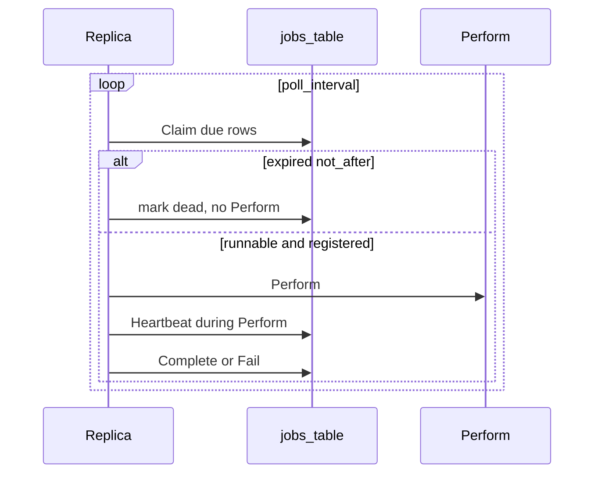

# ADR 061: SQL-Backed Background Jobs

> **Status:** Proposed
> **Date:** 2026-09-03
> **Context:** Periodic sweeps and queued work in the Go server across PostgreSQL, Spanner, and SQLite
> **Builds on:** [ADR 028](028-storage-v2-statements-and-dialects.md), [ADR 041](041-storage-statement-contract-tests.md), [ADR 047](047-dialect-id-generation.md), [ADR 048](048-wide-events-internal-audit-primitive.md), [ADR 049](049-events-api-retention-export.md)
> **Amends if accepted:** [ADR 046](046-claim-lifecycle-v2.md) (the “no scheduled-task infrastructure” non-goal)
> **Related:** [ADR 010](010-session-auth-attempt-check-model.md), [ADR 037](037-token-lifecycle.md), [ADR 039](039-signing-key-rotation-and-incident-response.md), [ADR 050](050-dev-inbox.md), [#881](https://github.com/zitadel/nextgen/issues/881)

## Context

Today each background sweeper has its own loop in the process:

- Event retention ([`internal/audit/retention.go`](../../internal/audit/retention.go)) is started from [`cmd/server/server.go`](../../cmd/server/server.go).
- The event shipper is a separate poller.
- Path A request events sit in an in-process buffer; [ADR 048](048-wide-events-internal-audit-primitive.md) defers a durable outbox.

We need the same kind of work for more than retention: expired-session cleanup that can write a `session.expired` event ([#881](https://github.com/zitadel/nextgen/issues/881)), auth-attempt TTL ([ADR 010](010-session-auth-attempt-check-model.md)), and later outbound mail ([ADR 050](050-dev-inbox.md)).

This ADR is **not** [ADR 046](046-claim-lifecycle-v2.md) project claim (the HTTP flow that assigns an owning team to a project). The word **Claim** below means “this server takes a **job row** from the `jobs` table to run it.” It does not look at `projects.created_at`. Deleting unclaimed projects stays an ADR 046 non-goal.

Storage is SQL on three dialects ([ADR 028](028-storage-v2-statements-and-dialects.md)): PostgreSQL, Spanner, and SQLite. A job system that exists only on Postgres (River) or only on GCP (Pub/Sub) does not cover that set.

## Decision

**First implementation** means what this ADR ships: the table, the in-process loop, and cutting event retention onto it. Later jobs (`sessions.gc`, mail) are called out as follow-ups, not as “v1.”

How a job runs:

1. Someone inserts a row (`Enqueue`) or, for a sweep, boot upserts one row (`UpsertPeriodic`).
2. A running server **Claims** that row: it takes a time-limited lease so other servers leave it alone.
3. **Perform** does the real work (delete old events, send mail, …) outside the claim transaction.
4. **Complete** or **Fail** writes the outcome back.

### Row model

One `jobs` table. Column types are dialect-owned; this is the logical shape:

| Column | Role |
|--------|------|
| `id` | dialect-minted `job_<opaque>` ([ADR 047](047-dialect-id-generation.md) §3). Not an HTTP resource. |
| `name` | which handler to run (`jobs.gc`, `email.send`, …). Not unique. Many queued rows share one `name`. |
| `payload` | opaque bytes. Empty for sweeps. |
| `unique_key` | optional. Stops two **live** rows (`pending` or `claimed`) from being the same logical job. Many nulls are allowed. Details below. |
| `run_at` | do not start **before** this time (database clock). |
| `not_after` | do not start **after** this time (database clock). Nullable. Same type as `run_at`. Periodic: always null. Queued: optional; copy the payload’s useful life (verification-code expiry, magic-link TTL). |
| `period` | how often a sweep should run. Set on periodic rows; null on queued rows. |
| `claimed_until`, `claimed_by` | the lease: who holds the row and until when. |
| `attempt`, `last_error` | retry bookkeeping. |
| `status` | `pending` (waiting to run), `claimed` (a server is working it), `done`, `dead`. Periodic rows are only `pending` or `claimed`. |
| `completed_at` | set when a queued row becomes `done` or `dead`. |

**`unique_key` in plain terms.** `name` says which handler. `unique_key` is a separate column so the database can reject a duplicate of the same logical job while that job is still waiting or running.

- Periodic: `unique_key` is required and equal to `name`. There is one `jobs.gc` row, forever.
- Queued: omit `unique_key` to insert a new row on every Enqueue. Set it (for example `email.send:{user_id}:welcome`) so a second Enqueue while the first is still `pending` or `claimed` keeps the existing row and does not insert another.
- After the row is `done` or `dead`, the same `unique_key` may be enqueued again (a verification-code resend is a new job).

`Claim` looks at rows that are waiting (`pending`) or whose lease has expired (`claimed` and `claimed_until < now()`). That includes rows whose `not_after` has already passed, so a crash mid-run is not stranded. It ignores `done` and `dead`. It does not look at projects.

### 1. Two kinds of row, one shared line

Periodic sweeps and queued work are both rows in the same table, ordered by `run_at`.

| Kind | How many rows are due at once | How many can run at once cluster-wide |
|------|-------------------------------|----------------------------------------|
| Unique periodic (`jobs.gc`, later `sessions.gc`) | one row (`unique_key` = `name`) | at most one of that name |
| Queued (`email.send`) | one per unit of work | as many as there are free workers |

How many jobs run at once: `number of processes × jobs.concurrency`. With three servers and `jobs.concurrency = 1`, three jobs run at a time.

There is no separate mail queue versus GC queue. Workers take the next due row, whatever `name` it has. If 10,000 `email.send` rows are due, `jobs.gc` waits its turn. We accept that for the first implementation. Per-name caps and fair mixing are later work.

### 2. Portability is `JobStatements`

The dialect adapter is [`service.AllStatements`](../../internal/service/statement.go). Dialects write the SQL. The methods do not start their own transaction: they use the pool or the open transaction the caller already holds, same as `CreateSession`.

- `Enqueue` — insert a queued job in the product transaction. If a live row already has this `unique_key`, keep that row.
- `Claim` — take a lease on a runnable row, or mark a past-`not_after` row `dead` without running it.
- `Complete` / `Fail` — §3 (queued and periodic differ).
- `UpsertPeriodic` — boot, not `Enqueue`. Insert sets the sweep row. If it already exists, update `period` from config only. Do not overwrite `claimed_until`, `claimed_by`, or `run_at` while another replica holds a live lease.
- `DeleteCompleted` — delete `done`/`dead` rows whose `completed_at` is older than the retain window.
- `Heartbeat` — extend `claimed_until` for the replica that holds the row.

The first implementation does not add a `Backend` interface, a memory backend, River, Pub/Sub, or Cloud Tasks.

`Enqueue` is lookup-then-insert inside the caller’s transaction. That matches [`internal/storage/dialect/spanner/auth_attempt.go`](../../internal/storage/dialect/spanner/auth_attempt.go): Spanner rejects a `NULL_FILTERED` unique index as an `ON CONFLICT` target. Postgres may still use a partial unique index on live `unique_key` values. `INSERT ... ON CONFLICT` is not the portable contract.

### 3. Lease, then work, then complete

1. **Claim** — pick a due row (waiting, or lease expired). Then:
   - If `not_after` is already in the past: mark `dead`, set `completed_at`, do not Perform. Any replica may do this. It does not need to know the handler. This is how a job that outlived its useful life is closed, including after a crash.
   - Else if this process registered that `name`: write the lease (`claimed_until = now() + lease_duration`), commit, Perform.
   - Else: leave the row. Do not Fail it. An old binary, or a process that did not register `events.retention`, must not burn retries on a job it cannot run.
2. **Perform** — do the handler work in its own transactions or I/O. Keep Heartbeat going so the lease does not expire under a long run.
3. **Complete** or **Fail**.

Complete:

- Queued success → `done` + `completed_at`. Reset `attempt`.
- Periodic success → keep the same row. Clear the lease. Set `run_at = now() + period` (skip missed beats; do not add `period` onto the old `run_at`). Reset `attempt`. Never `done`. No history row.

Fail:

- Queued: increment `attempt`. Clear the lease. Set `status = pending` and `run_at = now() + backoff`. Become `dead` (with `completed_at`) when `attempt` reaches `max_attempts`, or when the next `run_at` would be at or after `not_after`.
- Periodic: never `done` or `dead`. Clear the lease. Set `run_at = now() + period` (same skip-missed as Complete). Record `last_error`. Fail does not count toward death. The first implementation does not revive a `dead` periodic row because periodic rows never reach `dead`.

`not_after` only decides whether the engine starts the job. The handler still no-ops if the live entity is gone, used, or rotated.

If the lease expires (crash, or a missed Heartbeat), another replica may Claim the row. Delivery is at-least-once. Handlers must be safe to run twice: a crash after a side effect and before Complete retries the same row.

### 4. Database clock; dialect-owned duration columns

Due checks and reschedule use the database clock (`now()` / `CURRENT_TIMESTAMP`), not the Go wall clock ([ADR 048](048-wide-events-internal-audit-primitive.md)).

The Go API is `time.Duration`. Column types follow sessions: Postgres `INTERVAL`, Spanner `INT64` nanoseconds, SQLite `INTEGER` nanoseconds. Dialects bind `time.Duration` and implement `run_at = now() + period`. [`stmttest`](../../internal/storage/stmttest/) never sees the column type.

### 5. Periodic jobs are one unique row

Uniqueness is the `unique_key` column, not `name`. Periodic registration sets `unique_key = name` (for example both `jobs.gc`), a non-null `period`, and `not_after` null. Missed beats already skip via `run_at = now() + period`. Boot calls `UpsertPeriodic` on that key. Config remains the knob; replicas overwrite `period` from config. The row is the shared “when did this sweep last run,” not a second config store.

`period` lives on the row so Complete can reschedule in SQL without the completing replica’s in-memory catalog.

Handlers and boot-time period come from registration. The unique row owns `run_at` / `period` for Claim and Complete.

### 6. Queued work is inserted in the product transaction

A service calls `Enqueue` on the statements of the transaction that wrote the entity (create user + `email.send`). If that transaction rolls back, the job is gone. After commit, any replica can Claim the row.

Queued rows share `name` (`email.send`) and usually leave `unique_key` null, so each Enqueue inserts. If `unique_key` is set, a second Enqueue while the first is still live keeps the existing row. After `done`/`dead`, Enqueue inserts again.

Enqueue may set `not_after` from the entity TTL in the same transaction (do not send a verification mail after the code is dead).

### 7. Retain, then `jobs.gc`

`done` and `dead` stay in the table until unique periodic `jobs.gc` calls `DeleteCompleted`: delete rows whose `completed_at` is older than the retain window (time-only, same idea as [ADR 049](049-events-api-retention-export.md)). GC does not delete `pending` or `claimed` rows. Claim owns past-`not_after` expiry.

No dead-letter table. `dead` stays queryable until GC.

### 8. Observability (metrics, not an API)

Operators watch the engine. There is no job HTTP API and no dead-letter table.

Every series is labeled by handler `name` (`jobs.gc`, `email.send`, …). No other labels in the first implementation (`status`, replica, dialect). The outcome is the series name, not a `status` label. Increment one per row, not per batch.

Counters:

- `jobs_claimed` — Claim leased a row that will Perform.
- `jobs_completed` — Complete succeeded (queued → `done`, or periodic reschedule).
- `jobs_failed` — queued Fail with retry (`pending` + backoff).
- `jobs_dead` — queued Fail exhausted retries, or retry would next run at or after `not_after`.
- `jobs_expired_unrun` — Claim marked `dead` without Perform because `not_after` had passed.

`jobs_expired_unrun` does not also increment `jobs_dead`. `jobs_dead` is the queued Fail path; `jobs_expired_unrun` is never-started. Periodic Fail increments `jobs_failed` and never `jobs_dead`.

Histograms:

- `jobs_perform_duration` — handler wall time from Claim commit to Complete or Fail.
- `jobs_claim_lag` — `now() - run_at` at claim, same database clock as due checks (§4).

The first implementation does not emit a pending-depth gauge (`COUNT(*)` of due `pending` every poll). Operators infer backup from claim lag and `jobs_claimed`.

### 9. Every replica runs the loop; the lease is the lock

The engine starts with the HTTP server on `zitadel start`. No `zitadel worker` command, no leader election, no job HTTP API, not an OpenAPI resource.

Claim SQL is dialect-owned:

- Postgres: `FOR UPDATE SKIP LOCKED`
- Spanner: add jitter to the poll; try to take the lease on one row in the read-write transaction so other replicas abort instead of all locking the same head
- SQLite: single writer

Two clocks: `jobs.poll_interval` is how often a process asks the table for due work. `period` on a unique row is how often that sweep may run.

Defaults for the first implementation (config key names are an implementation detail; the numbers are the contract):

| Knob | Default | Role |
|------|---------|------|
| `jobs.concurrency` | `1` | How many Claim/`Perform` loops this process runs in parallel |
| `jobs.poll_interval` | ~1s | Idle wait between Claims |
| `jobs.claim_batch_size` | `1` | Rows one loop leases per Claim |
| `jobs.lease_duration` | 15m | Claim writes `claimed_until`; covers today’s retention 10m timeout ([`internal/audit/retention.go`](../../internal/audit/retention.go)) plus margin |
| `jobs.heartbeat_interval` | 5m | Heartbeat while Perform runs (lease/3) |
| `jobs.max_attempts` | 5 | Queued Fail ceiling |
| `jobs.backoff_cap` | 1h | Exponential backoff from `poll_interval` |
| `jobs.retain` | 7d | `DeleteCompleted` window; independent of ADR 049’s 30d event window |

SQLite stays at concurrency 1. Postgres/Spanner may raise concurrency when queued I/O exists. Keep the claim batch small so other nodes can take remaining rows. Deleting N expired sessions inside one `Perform` belongs in the handler, not in `claim_batch_size`.

A replica that has not registered a name (old binary, or `events.retention` off) never Claims that name for Perform. Marking expired-unrun `dead` does not use that filter. Old binaries must not delete unknown job types.

### 10. Background Path B uses `system` actor

Handlers that emit wide events ([ADR 048](048-wide-events-internal-audit-primitive.md)) stamp `EventActorTypeSystem`. A reaper `session.expired` must not look like a missing request `ActorContext`.

### 11. What we ship first

- Jobs table, `JobStatements`, in-process loop, unique periodic `jobs.gc`
- Cut [`RetentionJob`](../../internal/audit/retention.go) over to unique periodic `events.retention` that still calls `DeleteEventsOlderThan` ([ADR 049](049-events-api-retention-export.md))
- Unchanged: event shipper, Path A request buffer
- `email.send` is an example producer, not a deliverable of this first implementation
- Next job: `sessions.gc` / [#881](https://github.com/zitadel/nextgen/issues/881). Read-time session expiry stays; the reaper is the Path B producer (emit `session.expired` then delete or mark). One unique periodic row, not one job per session.

## Non-goals

- Unclaimed-project expiry ([ADR 046](046-claim-lifecycle-v2.md)). This ADR does not add `WHERE projects.created_at + interval` and does not delete unclaimed projects. A future sweeper would be its own periodic job on this loop.
- [ADR 049](049-events-api-retention-export.md)’s dedicated `DELETE` role on the jobs table
- Token-row GC, signing-key purge, and ADR 050 outbound as handlers in this first implementation

## Consequences

### Positive

- Sweeps and queued work share one runtime, one test seam, and one shutdown path.
- Enqueue joins the product transaction without a second API.
- Rolling deploys reschedule periodic jobs from the row’s `period`.
- SQLite, Postgres, and Spanner stay on the statements model used for sessions and events.

### Negative / Risks

- **At-least-once:** a handler that succeeds at a side effect and crashes before Complete will run again. The handler must tolerate that. A missed Heartbeat is the same: another replica may take the row.
- **Shared line:** `ORDER BY run_at` can let a pile of queued rows delay a due sweep until a worker is free.

### Testing

- [`stmttest`](../../internal/storage/stmttest/) owns, across dialects via `forEachDialect` ([ADR 041](041-storage-statement-contract-tests.md)): Claim of pending and lease-expired rows; Claim marking past-`not_after` `dead` without Perform (including a reclaimed lease); Fail returning queued rows to `pending` with backoff; queued Fail-to-dead at `max_attempts` and when retry would miss `not_after`; periodic Fail rescheduling `run_at = now() + period` without `dead`; Complete resetting `attempt`; live-row `unique_key` conflict vs insert after `done`/`dead`; `UpsertPeriodic` updating `period` without clobbering a live lease; `DeleteCompleted` ignoring `pending`/`claimed`; Spanner lookup-then-insert Enqueue (not `ON CONFLICT`).
- The engine loop is tested against a fake `JobStatements` (or sqlite only), not a second backend × three-dialect matrix: registered-name Claim filter, Heartbeat, unknown names left untouched.

## Alternatives considered

| Alternative | Why rejected |
|-------------|--------------|
| River as the portability layer | Postgres-only; SQLite and Spanner still need another runtime |
| Pub/Sub / Cloud Tasks as source of truth | No transactional enqueue with the entity write; no SQLite |
| Insert a tick row per period | Backlog of missed intervals; the unique row already remembers the next run |
| `INSERT ... ON CONFLICT` as the Enqueue contract | Spanner rejects a `NULL_FILTERED` unique index as an `ON CONFLICT` arbiter |
