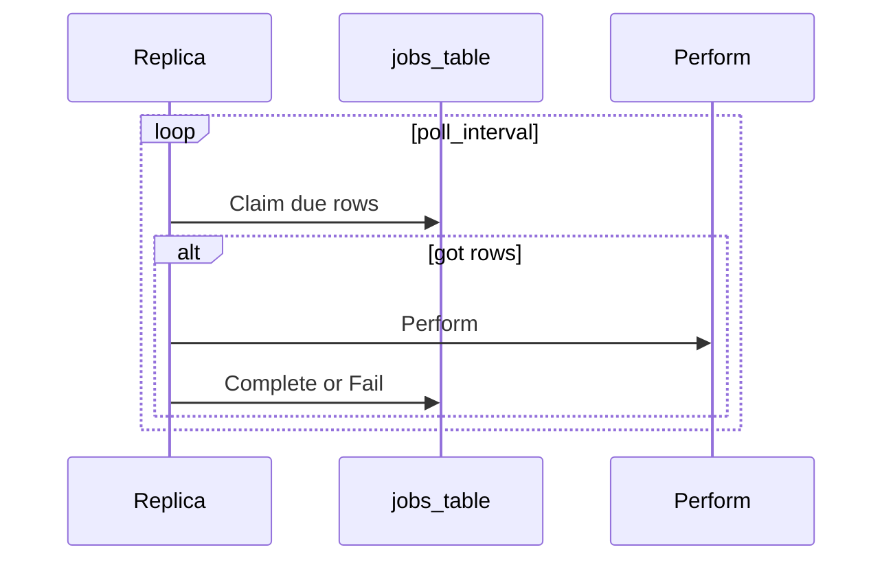

# ADR 061: Background Jobs — SQL-Backed Claim Loop

> **Status:** Proposed
> **Date:** 2026-09-03
> **Context:** Periodic sweeps and queued work in the Go server across PostgreSQL, Spanner, and SQLite
> **Builds on:** [ADR 028](028-storage-v2-statements-and-dialects.md), [ADR 041](041-storage-statement-contract-tests.md), [ADR 047](047-dialect-id-generation.md), [ADR 048](048-wide-events-internal-audit-primitive.md), [ADR 049](049-events-api-retention-export.md)
> **Amends:** [ADR 046](046-claim-lifecycle-v2.md) (the “no scheduled-task infrastructure” non-goal)
> **Related:** [ADR 010](010-session-auth-attempt-check-model.md) (attempt sweeper), [#881](https://github.com/zitadel/nextgen/issues/881) (`session.expired`)

## Context

The server already runs background work, but each piece owns its own ticker:

- Event retention ([`internal/audit/retention.go`](../../internal/audit/retention.go)) is a process-local loop started from [`cmd/server/server.go`](../../cmd/server/server.go).
- The event shipper is a separate poller over sink cursors.
- Path A request events use an in-process buffer; [ADR 048](048-wide-events-internal-audit-primitive.md) defers a durable outbox.

Expiry used for authorization is **read-time** (`expires_at < now()` on sessions). That is enough to reject an expired session and not enough to emit Path B `session.expired`, which needs a writer ([#881](https://github.com/zitadel/nextgen/issues/881)). Auth-attempt TTL cleanup ([ADR 010](010-session-auth-attempt-check-model.md)), claim-challenge GC, and later outbound mail (ADR 050) need the same kind of scheduled or enqueued work.

Storage is SQL-first on three dialects ([ADR 028](028-storage-v2-statements-and-dialects.md)). PostgreSQL and Spanner are production peers; SQLite is the zero-config local default. A job runtime that exists only on Postgres (River) or only on GCP (Pub/Sub) does not cover that matrix.

This ADR specifies one in-process claim loop over a jobs table so periodic sweeps and queued work share the same machine.

## Decision

### 1. One table, one loop type

There is a single `jobs` table. Periodic sweeps and queued work are both rows. `name` is a column, not a queue.

Parallelism is **in-flight `Perform`s** = `replicas × jobs.concurrency`. Claimers compete on due, unleased rows (`ORDER BY run_at`). Named queues, per-name concurrency caps, and fair mixing are **v1 non-goals**. A flood of queued rows (for example `email.send`) can delay a due periodic row; that starvation is an accepted v1 limit.

| Kind | Rows due at once | In flight cluster-wide |
|------|------------------|------------------------|
| Unique periodic (`jobs.gc`, later `sessions.gc`) | one row per name | **at most one** of that name |
| Queued (`email.send`) | one per unit of work | up to remaining claimers |

Two clocks stay distinct:

- **`jobs.poll_interval`** — how often a process asks the table for due work (~1s). This is the runtime loop.
- **`period` on a unique row** — how often that named sweep is allowed to run. This is not a Go `Ticker` per job name.

Queued rows have no `period`. They are due when `run_at <= now()`.

### 2. Portability is `JobStatements`

The dialect adapter is [`service.AllStatements`](../../internal/service/statement.go), same as every other entity. A `JobStatements` surface (tx-passive `Enqueue`, `Claim`, `Complete`, `Fail`) is the contract. Dialects hand-write the SQL.

v1 does **not** introduce a `Backend` interface, a memory backend, River, Pub/Sub, or Cloud Tasks. Those could implement the same statements later; they are not the portability layer.

Callers enqueue with **one** method on whatever statements they already hold: `pool.Statements()` or the open transaction’s statements. There is no `Enqueue` / `EnqueueTx` pair and no “set the transaction” option on the worker. That matches existing mutate paths (`CreateSession`, `CreateUser`).

### 3. Claim, then work, then complete

Every run is three phases:

1. **Claim** — lease due rows (`claimed_until`, `claimed_by`). Commit.
2. **Perform** — handler work in its own transactions or I/O. Not the claim transaction.
3. **Complete** or **Fail** — success or backoff / dead.

An expired lease makes the row claimable again. Delivery is **at-least-once**. Handlers must be idempotent (a crash after a side effect and before Complete retries the same row).

`Claim` ignores `done` and `dead` (predicate or partial index on pending/claimed).

### 4. Database clock; dialect-owned duration columns

Due checks and reschedule use the **database clock** (`now()` / `CURRENT_TIMESTAMP`), not the Go wall clock, same stance as [ADR 048](048-wide-events-internal-audit-primitive.md).

The Go API is `time.Duration`. Column types follow sessions, not a portable integer-for-everyone DDL:

- Postgres: `INTERVAL` (as `sessions.time_to_live`)
- Spanner: `INT64` nanoseconds
- SQLite: `INTEGER` nanoseconds

Dialects bind `time.Duration` and implement `run_at = now() + period` themselves. [`stmttest`](../../internal/storage/stmttest/) never sees the column type.

### 5. Periodic jobs are one unique row

A periodic job is **one row** keyed by unique name (for example `unique_key = 'jobs.gc'`), not a tick insert per interval.

- **`period` is stored on the row** so Complete can reschedule in SQL without the completing replica’s in-memory catalog (`run_at = now() + period`).
- **Boot upserts** name, period, and that the handler exists. Config (viper) remains the knob; replicas overwrite `period` from config so a file change moves the cadence. The row is the shared cursor, not a second config store.
- Missed beats **skip**, not catch up: `now() + period`, not `run_at + period`. A reaper that was down for an hour runs once.

Catalog / registration owns **handlers** and the **boot-time period**. The unique row owns `run_at` / `period` for Claim and Complete.

### 6. Queued work is inserted in the product transaction

A service that needs later work calls the same `Enqueue` on the statements of the transaction that wrote the entity (user create + `email.send`, and similar). If the transaction rolls back, there is no job. If it commits, any replica can Claim the row.

Unique key is optional (for example `email.send:{user_id}:welcome`) so a retried mutate does not insert a second row.

On success the row becomes `done` with `completed_at`. Periodic success does **not** leave a history row; it clears the lease and sets a new `run_at` on the same unique row. Cadence history is metrics and logs.

### 7. Retain, then `jobs.gc`; metrics instead of a dead-letter table

`done` and `dead` linger until a unique periodic job `jobs.gc` deletes them by `completed_at` older than a retain window (time-only, same idea as [ADR 049](049-events-api-retention-export.md) event retention).

There is **no** dead-letter table. Poisoned work is marked `dead`, stays queryable until GC, and must not block the unique periodic row of the same name (a dead `session` sweep cannot sit leased forever).

The engine emits at least: claimed, completed, failed, dead, perform duration, claim lag (`now() - run_at` at claim).

### 8. Every replica runs the loop; Claim is the lock

The engine starts with the HTTP server on `zitadel start`. There is no `zitadel worker` command, no leader election, and no job HTTP API. Jobs are not an OpenAPI resource.

Claim SQL is dialect-owned (idea only in this ADR):

- Postgres: `FOR UPDATE SKIP LOCKED`
- Spanner: read due rows and write a lease if still unclaimed (strong / RW)
- SQLite: single writer

v1 knobs (exact viper paths are an implementation detail):

| Knob | v1 default | Role |
|------|------------|------|
| `jobs.concurrency` | `1` | Parallel claim/`Perform` loops **per process** |
| `jobs.poll_interval` | ~1s | Idle wait between Claims |
| `jobs.claim_batch_size` | `1` | Rows one loop leases per Claim |

SQLite stays at concurrency 1. Postgres/Spanner may raise concurrency when queued I/O exists. `claim_batch_size` is how many leases one loop takes, not how many named queues exist. For I/O jobs, keep the batch small so other nodes can claim remaining rows; inner batching (delete N expired sessions per `Perform`) belongs in the handler, not in the claim batch.

### 9. Background Path B uses `system` actor

Handlers that emit wide events ([ADR 048](048-wide-events-internal-audit-primitive.md)) stamp `EventActorTypeSystem` (empty human actor). `session.expired` from a reaper must not look like a hole in request `ActorContext`.

### 10. Storage-only `job` prefix; unknown names backoff

Row PKs are dialect-minted `job_<opaque>` ([ADR 047](047-dialect-id-generation.md) §3: cryptic is OK for storage-only). HTTP create does not apply.

On a rolling deploy, a row whose `name` has no handler on this binary is left in place and retried with backoff. Old binaries must not delete unknown job types.

### 11. v1 scope

**In v1:**

- Jobs table and `JobStatements`
- One in-process claim loop
- Unique periodic `jobs.gc`
- Cut [`RetentionJob`](../../internal/audit/retention.go) over to a unique periodic `events.retention` that still calls `DeleteEventsOlderThan` ([ADR 049](049-events-api-retention-export.md))

**First follow-up (not v1-mandatory):** `sessions.gc` / [#881](https://github.com/zitadel/nextgen/issues/881). Read-time session expiry stays; the reaper is the Path B producer (emit `session.expired` then delete or mark, in short write transactions). One unique periodic row, not one job per session. Handler-internal `LIMIT` batching is an implementation choice.

**Unchanged in v1:** the event shipper (cursor walk, not claim-complete) and the Path A request buffer.

Queued `email.send` is an illustrative producer, not a v1 deliverable (SMTP and ADR 050 routing stay out of this ADR).

## Non-goals

- Memory, River, Pub/Sub, or Cloud Tasks backends
- `Enqueue` plus `EnqueueTx` (or a worker-level transaction option)
- Tick-insert periodic jobs; ticker-per-job (status quo)
- Leader election; separate worker process; job CRUD API
- Named queues, per-name fairness, or priority
- One job row per expired session or auth attempt
- History rows for successful periodic runs
- [ADR 049](049-events-api-retention-export.md)’s dedicated `DELETE` role on the jobs table
- Unclaimed-project expiry ([ADR 046](046-claim-lifecycle-v2.md) remains the product non-goal; this ADR only supplies instance scheduling)

## Consequences

### Positive

- Sweeps and queued work share one runtime, one test seam, and one shutdown path.
- Enqueue joins the product transaction without a second API.
- Rolling deploys reschedule periodic jobs from the row’s `period`, not from a stale in-memory ticker.
- SQLite local default, Postgres, and Spanner stay on the statements model already used for sessions and events.

### Negative / Risks

- **At-least-once:** a handler that succeeds at a side effect (mail) and crashes before Complete will run again; idempotency is the handler’s problem.
- **Starvation:** one table and `ORDER BY run_at` can let a queued flood delay a due unique periodic row until a claimer is free.
- **Unique periodic jobs serialize globally:** two replicas cannot run two `sessions.gc` Performs at once. Session row locking for the delete batch is the handler’s SQL, not the jobs lease.
- **Claim batch vs parallelism:** leasing `claim_batch_size > 1` with sequential `Perform` withholds rows from other nodes. v1 default 1 avoids that footgun.

### Testing

- [`stmttest`](../../internal/storage/stmttest/) owns Claim, unique keys, lease expiry, enqueue-in-tx, and periodic reschedule across dialects via `forEachDialect` ([ADR 041](041-storage-statement-contract-tests.md)).
- The engine loop is tested against a fake `JobStatements` (or a single sqlite bring-up), not a second backend × three-dialect matrix.

## Alternatives considered

| Alternative | Why rejected |
|-------------|--------------|
| Keep ticker-per-job (`RetentionJob` shape) | Does not give transactional enqueue, multi-replica Claim, or a single shutdown story |
| River (or similar) as the portability layer | Postgres-only; SQLite default and Spanner still need another runtime |
| Pub/Sub / Cloud Tasks as source of truth | No transactional enqueue with the entity write; no SQLite; cron is a second product |
| Memory backend plus SQL | N×N test matrix for no production path the sqlite dialect does not already cover |
| `Enqueue` and `EnqueueTx` | Duplicates the tx-passive statements pattern |
| Insert a tick row per period | Backlog of missed intervals; harder unique-key story for “run this sweep once” |
| Leader election | Unnecessary while Claim is a lock and sweeps are idempotent |

## Related ADRs

| ADR | Relationship |
|-----|--------------|
| [028 Storage v2](028-storage-v2-statements-and-dialects.md) | Statements / per-dialect SQL is the adapter |
| [041 Statement contract tests](041-storage-statement-contract-tests.md) | `stmttest` for `JobStatements` |
| [047 Dialect-owned IDs](047-dialect-id-generation.md) | `job_` prefix |
| [048 Wide events](048-wide-events-internal-audit-primitive.md) | Path B from handlers; `system` actor; DB clock |
| [049 Events API / retention](049-events-api-retention-export.md) | First cutover (`events.retention`); shipper stays a cursor poller |
| [010 Session / attempt model](010-session-auth-attempt-check-model.md) | Attempt sweeper is a later unique periodic job |
| [046 Claim lifecycle](046-claim-lifecycle-v2.md) | Unclaimed-project expiry still a 046 non-goal; scheduling lives here |
| [037 Token lifecycle](037-token-lifecycle.md) | Revoked tokens already delete in-line; not a v1 job |
| [039 Signing-key rotation](039-signing-key-rotation-and-incident-response.md) | Key purge sweep is a later unique periodic job |
| [050 Dev inbox](050-dev-inbox.md) | Future queued outbound; not v1 |
