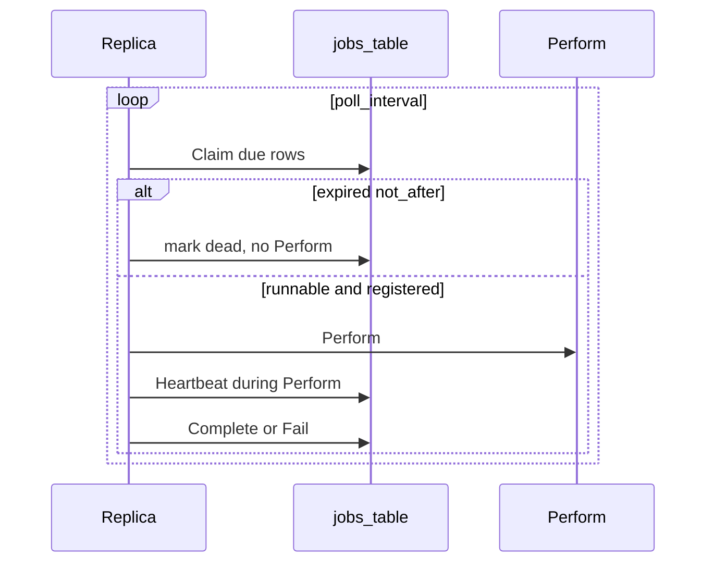

# ADR 061: SQL-Backed Background Jobs

> **Status:** Proposed
> **Date:** 2026-09-03
> **Context:** Periodic sweeps and queued work in the Go server across PostgreSQL, Spanner, and SQLite
> **Builds on:** [ADR 028](028-storage-v2-statements-and-dialects.md), [ADR 041](041-storage-statement-contract-tests.md), [ADR 047](047-dialect-id-generation.md), [ADR 048](048-wide-events-internal-audit-primitive.md), [ADR 049](049-events-api-retention-export.md)
> **Amends if accepted:** [ADR 046](046-claim-lifecycle-v2.md) (the “no scheduled-task infrastructure” non-goal)
> **Related:** [ADR 010](010-session-auth-attempt-check-model.md), [ADR 037](037-token-lifecycle.md), [ADR 039](039-signing-key-rotation-and-incident-response.md), [ADR 050](050-dev-inbox.md), [#881](https://github.com/zitadel/nextgen/issues/881)

## Context

The server already runs background work, but each piece owns its own ticker:

- Event retention ([`internal/audit/retention.go`](../../internal/audit/retention.go)) is a process-local loop started from [`cmd/server/server.go`](../../cmd/server/server.go).
- The event shipper is a separate poller over sink cursors.
- Path A request events use an in-process buffer; [ADR 048](048-wide-events-internal-audit-primitive.md) defers a durable outbox.

Authorization expiry is read-time (`expires_at < now()` on sessions). That rejects an expired session; it cannot emit Path B `session.expired`, which needs a writer ([#881](https://github.com/zitadel/nextgen/issues/881)). Auth-attempt TTL cleanup ([ADR 010](010-session-auth-attempt-check-model.md)), claim-challenge GC, and later outbound mail (ADR 050) need the same scheduled or enqueued work.

Storage is SQL-first on three dialects ([ADR 028](028-storage-v2-statements-and-dialects.md)). PostgreSQL and Spanner are production peers; SQLite is the zero-config local default. A job runtime that exists only on Postgres (River) or only on GCP (Pub/Sub) does not cover that matrix.

## Decision

### Row model

One `jobs` table. Columns (logical; DDL is dialect-owned):

| Column | Role |
|--------|------|
| `id` | dialect-minted `job_<opaque>` ([ADR 047](047-dialect-id-generation.md) §3). Not an HTTP resource. |
| `name` | handler to run. Not unique. Many queued rows share one `name`. |
| `payload` | opaque bytes; empty for sweeps. |
| `unique_key` | uniqueness among `pending`/`claimed` only, nullable. Multiple nulls allowed. Periodic: required, equal to `name`. Queued: optional (idempotent enqueue among live rows). A `done`/`dead` row does not block a later Enqueue with the same key. |
| `run_at` | do not start before (database clock). |
| `not_after` | do not start after (database clock). Nullable. Same type as `run_at`. Periodic: always null. Queued: optional; copy the payload’s useful life (verification-code expiry, magic-link TTL). |
| `period` | set on unique periodic rows; null on queued rows. |
| `claimed_until`, `claimed_by` | lease. |
| `attempt`, `last_error` | retry bookkeeping. |
| `status` | `pending`, `claimed`, `done`, `dead`. Periodic rows are only `pending` or `claimed`. |
| `completed_at` | set when moving to `done` or `dead`. |

`Claim` selects `pending` or lease-expired (`claimed` and `claimed_until < now()`) rows, including those whose `not_after` has already passed, ordered by `run_at`, and ignores `done`/`dead`.

### 1. Two row kinds, one `ORDER BY run_at`

Periodic sweeps and queued work are both rows.

| Kind | Rows due at once | In flight cluster-wide |
|------|------------------|------------------------|
| Unique periodic (`jobs.gc`, later `sessions.gc`) | one row (`unique_key` = `name`) | at most one of that name |
| Queued (`email.send`) | one per unit of work | up to remaining claimers |

Parallelism is in-flight `Perform`s: `replicas × jobs.concurrency`. Named queues, per-name concurrency caps, and fair mixing are out of v1. A flood of queued rows can delay a due periodic row; that starvation is accepted.

### 2. Portability is `JobStatements`

The dialect adapter is [`service.AllStatements`](../../internal/service/statement.go). `JobStatements` is tx-passive. Dialects hand-write the SQL.

- `Enqueue` — product transaction; among live rows, a `unique_key` conflict keeps the existing row.
- `Claim` — lease runnable rows; mark expired-unrun rows `dead` without Perform.
- `Complete` / `Fail` — §3 (queued vs periodic).
- `UpsertPeriodic` — boot; not `Enqueue`. Insert sets cursor fields. On conflict: update `period` from config only. Must not clobber `claimed_until`, `claimed_by`, or `run_at` of a live lease.
- `DeleteCompleted` — `done`/`dead` where `completed_at < now() - retain`.
- `Heartbeat` — `UPDATE claimed_until` where `id` and `claimed_by` are this replica.

v1 does not add a `Backend` interface, a memory backend, River, Pub/Sub, or Cloud Tasks.

Callers enqueue with one method on the statements they already hold: `pool.Statements()` or the open transaction’s statements. Same pattern as `CreateSession` and `CreateUser`.

The portable `Enqueue` contract is lookup-then-insert inside the caller’s transaction, the same shape [`internal/storage/dialect/spanner/auth_attempt.go`](../../internal/storage/dialect/spanner/auth_attempt.go) uses because Spanner rejects a `NULL_FILTERED` unique index as an `ON CONFLICT` arbiter. Postgres may still use a partial unique index on live `unique_key` values. `INSERT ... ON CONFLICT` is not the portable contract.

### 3. Lease, then work, then complete

1. **Claim** — select a due row (pending or lease-expired). Then:
   - If `not_after <= now()`: mark `dead` + `completed_at`, do not Perform. Any replica may do this; no handler-name filter.
   - Else if this binary registered `name`: write the lease (`claimed_until = now() + lease_duration`), commit, Perform.
   - Else: leave the row. Do not Fail it (old binary, or a handler this process did not register).
2. **Perform** — handler work in its own transactions or I/O, not the claim transaction. Heartbeat while it runs.
3. **Complete** or **Fail**.

Complete:

- Queued success → `done` + `completed_at`. Resets `attempt`.
- Periodic success → same unique row, lease cleared, `run_at = now() + period` (skip missed beats, not `run_at + period`), `attempt` reset. Never `done`. No history row.

Fail:

- Queued: increment `attempt`; clear the lease; `status = pending`; `run_at = now() + backoff`. `dead` + `completed_at` when `attempt` reaches `max_attempts`, or when the next `run_at` would be at or after `not_after`.
- Periodic: never `dead` or `done`. Clear the lease, set `run_at = now() + period` (same skip-missed as Complete), record `last_error`. Fail does not accumulate toward death. v1 does not revive a `dead` periodic row because periodic rows never reach `dead`.

`not_after` is an engine filter, not domain truth. Perform still no-ops if the live entity is gone, used, or rotated.

An expired lease makes the row claimable again, including after a crash mid-Perform and including when `not_after` has since passed (Claim then takes the expire path). Delivery is at-least-once. Handlers must be idempotent: a crash after a side effect and before Complete retries the same row. A missed Heartbeat makes the row stealable the same way.

### 4. Database clock; dialect-owned duration columns

Due checks and reschedule use the database clock (`now()` / `CURRENT_TIMESTAMP`), not the Go wall clock ([ADR 048](048-wide-events-internal-audit-primitive.md)).

The Go API is `time.Duration`. Column types follow sessions: Postgres `INTERVAL`, Spanner `INT64` nanoseconds, SQLite `INTEGER` nanoseconds. Dialects bind `time.Duration` and implement `run_at = now() + period`. [`stmttest`](../../internal/storage/stmttest/) never sees the column type.

### 5. Periodic jobs are one unique row

Uniqueness is the `unique_key` column, not `name`. Periodic registration sets `unique_key = name` (for example both `jobs.gc`), a non-null `period`, and `not_after` null. Missed beats already skip via `run_at = now() + period`. Boot calls `UpsertPeriodic` on that key. Config (viper) remains the knob; replicas overwrite `period` from config. The row is the shared cursor, not a second config store.

`period` lives on the row so Complete can reschedule in SQL without the completing replica’s in-memory catalog.

Handlers and boot-time period come from registration. The unique row owns `run_at` / `period` for Claim and Complete.

### 6. Queued work is inserted in the product transaction

A service calls `Enqueue` on the statements of the transaction that wrote the entity (user create + `email.send`). Rollback drops the job. After commit, any replica can Claim the row.

Queued rows share `name` (`email.send`) and usually leave `unique_key` null — each Enqueue inserts. If `unique_key` is set (for example `email.send:{user_id}:welcome`), Enqueue is idempotent among `pending`/`claimed` rows: a live conflict keeps the existing row. A later Enqueue after `done`/`dead` inserts (a verification-code resend inside the retain window is a new job).

Enqueue may set `not_after` from the entity TTL in the same transaction (do not send a verification mail after the code is dead).

### 7. Retain, then `jobs.gc`

`done` and `dead` linger until unique periodic `jobs.gc` calls `DeleteCompleted`: delete by `completed_at` older than the retain window (time-only, same idea as [ADR 049](049-events-api-retention-export.md)). GC does not delete `pending` or `claimed` rows. Claim owns past-`not_after` expiry.

No dead-letter table. `dead` stays queryable until GC.

### 8. Observability (metrics, not an API)

Operators watch the engine. There is no job HTTP API and no dead-letter table.

Every series is labeled by handler `name` (`jobs.gc`, `email.send`, …). No other v1 labels (`status`, replica, dialect). Outcome lives in the series name, not a `status` label. Increment one per row, not per batch.

Counters:

- `jobs_claimed` — Claim leased a row that will Perform.
- `jobs_completed` — Complete succeeded (queued → `done`, or periodic reschedule).
- `jobs_failed` — queued Fail with retry (`pending` + backoff).
- `jobs_dead` — queued Fail exhausted retries, or retry would next run at or after `not_after`.
- `jobs_expired_unrun` — Claim marked `dead` without Perform because `not_after` had passed.

`jobs_expired_unrun` does not also increment `jobs_dead`. `jobs_dead` is the queued Fail path; `jobs_expired_unrun` is never-started. Periodic Fail increments `jobs_failed` and never `jobs_dead`.

Histograms:

- `jobs_perform_duration` — handler wall time from Claim commit to Complete or Fail.
- `jobs_claim_lag` — `now() - run_at` at claim, same database clock as due checks (§4).

v1 does not emit a pending-depth gauge (`COUNT(*)` of due `pending` every poll). Operators infer backup from claim lag and `jobs_claimed`.

### 9. Every replica runs the loop; the lease is the lock

The engine starts with the HTTP server on `zitadel start`. No `zitadel worker` command, no leader election, no job HTTP API, not an OpenAPI resource.

Claim SQL is dialect-owned:

- Postgres: `FOR UPDATE SKIP LOCKED`
- Spanner: jitter the poll; compare-and-set the lease on one row in the read-write transaction so siblings abort instead of all locking the same head
- SQLite: single writer

Two clocks: `jobs.poll_interval` is how often a process asks the table for due work. `period` on a unique row is how often that sweep may run.

v1 knobs (viper paths are an implementation detail; defaults are the contract):

| Knob | v1 default | Role |
|------|------------|------|
| `jobs.concurrency` | `1` | Parallel Claim/`Perform` loops per process |
| `jobs.poll_interval` | ~1s | Idle wait between Claims |
| `jobs.claim_batch_size` | `1` | Rows one loop leases per Claim |
| `jobs.lease_duration` | 15m | Claim writes `claimed_until`; covers today’s retention 10m timeout ([`internal/audit/retention.go`](../../internal/audit/retention.go)) plus margin |
| `jobs.heartbeat_interval` | 5m | Heartbeat while Perform runs (lease/3) |
| `jobs.max_attempts` | 5 | Queued Fail ceiling |
| `jobs.backoff_cap` | 1h | Exponential backoff from `poll_interval` |
| `jobs.retain` | 7d | `DeleteCompleted` window; independent of ADR 049’s 30d event window |

SQLite stays at concurrency 1. Postgres/Spanner may raise concurrency when queued I/O exists. Keep the claim batch small so other nodes can take remaining rows. Inner batching (delete N expired sessions per `Perform`) belongs in the handler.

A replica that has not registered a name (old binary, or `events.retention` off) never Claims that name for Perform. Expired-unrun marking does not use that filter. Old binaries must not delete unknown job types.

### 10. Background Path B uses `system` actor

Handlers that emit wide events ([ADR 048](048-wide-events-internal-audit-primitive.md)) stamp `EventActorTypeSystem`. A reaper `session.expired` must not look like a missing request `ActorContext`.

### 11. v1 cutover

- Jobs table, `JobStatements`, in-process loop, unique periodic `jobs.gc`
- Cut [`RetentionJob`](../../internal/audit/retention.go) over to unique periodic `events.retention` that still calls `DeleteEventsOlderThan` ([ADR 049](049-events-api-retention-export.md))
- Unchanged: event shipper, Path A request buffer
- `email.send` is an example producer, not a v1 deliverable
- Next job: `sessions.gc` / [#881](https://github.com/zitadel/nextgen/issues/881). Read-time session expiry stays; the reaper is the Path B producer (emit `session.expired` then delete or mark). One unique periodic row, not one job per session.

## Non-goals

- Unclaimed-project expiry ([ADR 046](046-claim-lifecycle-v2.md); this ADR only supplies instance scheduling)
- [ADR 049](049-events-api-retention-export.md)’s dedicated `DELETE` role on the jobs table
- Token-row GC, signing-key purge, and ADR 050 outbound as v1 handlers

## Consequences

### Positive

- Sweeps and queued work share one runtime, one test seam, and one shutdown path.
- Enqueue joins the product transaction without a second API.
- Rolling deploys reschedule periodic jobs from the row’s `period`.
- SQLite, Postgres, and Spanner stay on the statements model used for sessions and events.

### Negative / Risks

- **At-least-once:** a handler that succeeds at a side effect and crashes before Complete will run again. Idempotency is the handler’s problem. A missed Heartbeat is the same class of steal.
- **Starvation:** `ORDER BY run_at` can let a queued flood delay a due unique periodic row until a claimer is free.

### Testing

- [`stmttest`](../../internal/storage/stmttest/) owns, across dialects via `forEachDialect` ([ADR 041](041-storage-statement-contract-tests.md)): Claim of pending and lease-expired rows; Claim marking past-`not_after` `dead` without Perform (including a reclaimed lease); Fail returning queued rows to `pending` with backoff; queued Fail-to-dead at `max_attempts` and when retry would miss `not_after`; periodic Fail rescheduling `run_at = now() + period` without `dead`; Complete resetting `attempt`; live-row `unique_key` conflict vs insert after `done`/`dead`; `UpsertPeriodic` updating `period` without clobbering a live lease; `DeleteCompleted` ignoring `pending`/`claimed`; Spanner lookup-then-insert Enqueue (not `ON CONFLICT`).
- The engine loop is tested against a fake `JobStatements` (or sqlite only), not a second backend × three-dialect matrix: registered-name Claim filter, Heartbeat, unknown names left untouched.

## Alternatives considered

| Alternative | Why rejected |
|-------------|--------------|
| River as the portability layer | Postgres-only; SQLite and Spanner still need another runtime |
| Pub/Sub / Cloud Tasks as source of truth | No transactional enqueue with the entity write; no SQLite |
| Insert a tick row per period | Backlog of missed intervals; the unique row already is the cursor |
| `INSERT ... ON CONFLICT` as the Enqueue contract | Spanner rejects a `NULL_FILTERED` unique index as an `ON CONFLICT` arbiter |
