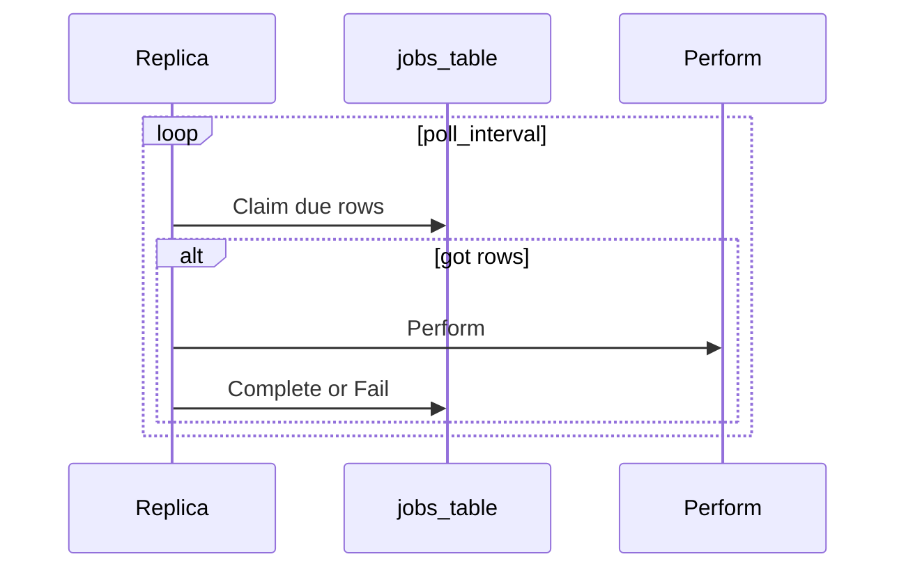

# ADR 061: SQL-Backed Background Jobs

> **Status:** Proposed
> **Date:** 2026-09-03
> **Context:** Periodic sweeps and queued work in the Go server across PostgreSQL, Spanner, and SQLite
> **Builds on:** [ADR 028](028-storage-v2-statements-and-dialects.md), [ADR 041](041-storage-statement-contract-tests.md), [ADR 047](047-dialect-id-generation.md), [ADR 048](048-wide-events-internal-audit-primitive.md), [ADR 049](049-events-api-retention-export.md)
> **Amends:** [ADR 046](046-claim-lifecycle-v2.md) (the “no scheduled-task infrastructure” non-goal)
> **Related:** [ADR 010](010-session-auth-attempt-check-model.md), [ADR 037](037-token-lifecycle.md), [ADR 039](039-signing-key-rotation-and-incident-response.md), [ADR 050](050-dev-inbox.md), [#881](https://github.com/zitadel/nextgen/issues/881)

## Context

The server already runs background work, but each piece owns its own ticker:

- Event retention ([`internal/audit/retention.go`](../../internal/audit/retention.go)) is a process-local loop started from [`cmd/server/server.go`](../../cmd/server/server.go).
- The event shipper is a separate poller over sink cursors.
- Path A request events use an in-process buffer; [ADR 048](048-wide-events-internal-audit-primitive.md) defers a durable outbox.

Authorization expiry is read-time (`expires_at < now()` on sessions). That rejects an expired session; it cannot emit Path B `session.expired`, which needs a writer ([#881](https://github.com/zitadel/nextgen/issues/881)). Auth-attempt TTL cleanup ([ADR 010](010-session-auth-attempt-check-model.md)), claim-challenge GC, and later outbound mail (ADR 050) need the same scheduled or enqueued work.

Storage is SQL-first on three dialects ([ADR 028](028-storage-v2-statements-and-dialects.md)). PostgreSQL and Spanner are production peers; SQLite is the zero-config local default. A job runtime that exists only on Postgres (River) or only on GCP (Pub/Sub) does not cover that matrix.

## Decision

### Row model

One `jobs` table. Columns (logical; DDL is dialect-owned):

| Column | Role |
|--------|------|
| `id` | dialect-minted `job_<opaque>` ([ADR 047](047-dialect-id-generation.md) §3). Not an HTTP resource. |
| `name` | handler key. A column, not a queue. |
| `payload` | opaque bytes; empty for sweeps. |
| `unique_key` | optional. Periodic rows use the job name. Queued rows may use e.g. `email.send:{user_id}:welcome`. |
| `run_at` | due instant (database clock). |
| `period` | set on unique periodic rows; null on queued rows. |
| `claimed_until`, `claimed_by` | lease. |
| `attempt`, `last_error` | retry bookkeeping. |
| `status` | `pending`, `claimed`, `done`, `dead`. |
| `completed_at` | set when moving to `done` or `dead`. |

`Claim` selects `pending` (or lease expired) with `run_at <= now()`, ordered by `run_at`, and ignores `done`/`dead`.

### 1. Two row kinds, one `ORDER BY run_at`

Periodic sweeps and queued work are both rows.

| Kind | Rows due at once | In flight cluster-wide |
|------|------------------|------------------------|
| Unique periodic (`jobs.gc`, later `sessions.gc`) | one row per name | at most one of that name |
| Queued (`email.send`) | one per unit of work | up to remaining claimers |

Parallelism is in-flight `Perform`s: `replicas × jobs.concurrency`. Named queues, per-name concurrency caps, and fair mixing are out of v1. A flood of queued rows can delay a due periodic row; that starvation is accepted.

### 2. Portability is `JobStatements`

The dialect adapter is [`service.AllStatements`](../../internal/service/statement.go). `JobStatements` is tx-passive `Enqueue`, `Claim`, `Complete`, `Fail`. Dialects hand-write the SQL.

v1 does not add a `Backend` interface, a memory backend, River, Pub/Sub, or Cloud Tasks.

Callers enqueue with one method on the statements they already hold: `pool.Statements()` or the open transaction’s statements. Same pattern as `CreateSession` and `CreateUser`.

### 3. Lease, then work, then complete

1. **Claim** — write the lease, commit.
2. **Perform** — handler work in its own transactions or I/O, not the claim transaction.
3. **Complete** or **Fail**.

Complete:

- Queued success → `done` + `completed_at`.
- Periodic success → same unique row, lease cleared, `run_at = now() + period` (skip missed beats, not `run_at + period`). No history row.

Fail: backoff then `dead`. A unique periodic row must not stay leased forever (otherwise that sweep never runs again).

An expired lease makes the row claimable again. Delivery is at-least-once. Handlers must be idempotent: a crash after a side effect and before Complete retries the same row.

### 4. Database clock; dialect-owned duration columns

Due checks and reschedule use the database clock (`now()` / `CURRENT_TIMESTAMP`), not the Go wall clock ([ADR 048](048-wide-events-internal-audit-primitive.md)).

The Go API is `time.Duration`. Column types follow sessions: Postgres `INTERVAL`, Spanner `INT64` nanoseconds, SQLite `INTEGER` nanoseconds. Dialects bind `time.Duration` and implement `run_at = now() + period`. [`stmttest`](../../internal/storage/stmttest/) never sees the column type.

### 5. Periodic jobs are one unique row

One row keyed by unique name (for example `unique_key = 'jobs.gc'`). `period` lives on the row so Complete can reschedule in SQL without the completing replica’s in-memory catalog.

Boot upserts name and period when the handler is registered. Config (viper) remains the knob; replicas overwrite `period` from config. The row is the shared cursor, not a second config store.

Handlers and boot-time period come from registration. The unique row owns `run_at` / `period` for Claim and Complete.

### 6. Queued work is inserted in the product transaction

A service calls `Enqueue` on the statements of the transaction that wrote the entity (user create + `email.send`). Rollback drops the job. After commit, any replica can Claim the row. Optional `unique_key` so a retried mutate does not insert a second row.

### 7. Retain, then `jobs.gc`; metrics instead of a dead-letter table

`done` and `dead` linger until unique periodic `jobs.gc` deletes them by `completed_at` older than a retain window (time-only, same idea as [ADR 049](049-events-api-retention-export.md)).

No dead-letter table. `dead` stays queryable until GC.

The engine emits at least: claimed, completed, failed, dead, perform duration, claim lag (`now() - run_at` at claim).

### 8. Every replica runs the loop; the lease is the lock

The engine starts with the HTTP server on `zitadel start`. No `zitadel worker` command, no leader election, no job HTTP API, not an OpenAPI resource.

Claim SQL is dialect-owned:

- Postgres: `FOR UPDATE SKIP LOCKED`
- Spanner: read due rows and write a lease if still unclaimed (strong / RW)
- SQLite: single writer

Two clocks: `jobs.poll_interval` is how often a process asks the table for due work. `period` on a unique row is how often that sweep may run.

v1 knobs (viper paths are an implementation detail):

| Knob | v1 default | Role |
|------|------------|------|
| `jobs.concurrency` | `1` | Parallel Claim/`Perform` loops per process |
| `jobs.poll_interval` | ~1s | Idle wait between Claims |
| `jobs.claim_batch_size` | `1` | Rows one loop leases per Claim |

SQLite stays at concurrency 1. Postgres/Spanner may raise concurrency when queued I/O exists. Keep the claim batch small so other nodes can take remaining rows. Inner batching (delete N expired sessions per `Perform`) belongs in the handler.

On a rolling deploy, a row whose `name` has no handler on this binary stays and retries with backoff. Old binaries must not delete unknown job types.

### 9. Background Path B uses `system` actor

Handlers that emit wide events ([ADR 048](048-wide-events-internal-audit-primitive.md)) stamp `EventActorTypeSystem`. A reaper `session.expired` must not look like a missing request `ActorContext`.

### 10. v1 cutover

- Jobs table, `JobStatements`, in-process loop, unique periodic `jobs.gc`
- Cut [`RetentionJob`](../../internal/audit/retention.go) over to unique periodic `events.retention` that still calls `DeleteEventsOlderThan` ([ADR 049](049-events-api-retention-export.md))
- Unchanged: event shipper, Path A request buffer
- `email.send` is an example producer, not a v1 deliverable
- Next job: `sessions.gc` / [#881](https://github.com/zitadel/nextgen/issues/881). Read-time session expiry stays; the reaper is the Path B producer (emit `session.expired` then delete or mark). One unique periodic row, not one job per session.

## Non-goals

- Unclaimed-project expiry ([ADR 046](046-claim-lifecycle-v2.md); this ADR only supplies instance scheduling)
- [ADR 049](049-events-api-retention-export.md)’s dedicated `DELETE` role on the jobs table
- Token-row GC, signing-key purge, and ADR 050 outbound as v1 handlers

## Consequences

### Positive

- Sweeps and queued work share one runtime, one test seam, and one shutdown path.
- Enqueue joins the product transaction without a second API.
- Rolling deploys reschedule periodic jobs from the row’s `period`.
- SQLite, Postgres, and Spanner stay on the statements model used for sessions and events.

### Negative / Risks

- **At-least-once:** a handler that succeeds at a side effect and crashes before Complete will run again. Idempotency is the handler’s problem.
- **Starvation:** `ORDER BY run_at` can let a queued flood delay a due unique periodic row until a claimer is free.

### Testing

- [`stmttest`](../../internal/storage/stmttest/) owns Claim, unique keys, lease expiry, enqueue-in-tx, and periodic reschedule across dialects via `forEachDialect` ([ADR 041](041-storage-statement-contract-tests.md)).
- The engine loop is tested against a fake `JobStatements` (or sqlite only), not a second backend × three-dialect matrix.

## Alternatives considered

| Alternative | Why rejected |
|-------------|--------------|
| River as the portability layer | Postgres-only; SQLite and Spanner still need another runtime |
| Pub/Sub / Cloud Tasks as source of truth | No transactional enqueue with the entity write; no SQLite |
| Insert a tick row per period | Backlog of missed intervals; the unique row already is the cursor |
