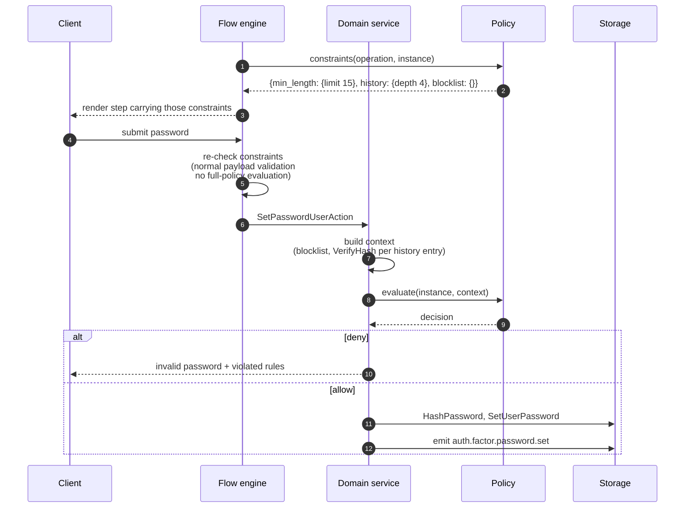

# ADR 066: Operation Policies

> **Status:** Draft
> **Date:** 2026-08-28 (revised 2026-09-21)
> **Context:** [#383](https://github.com/zitadel/nextgen/issues/383) asks for the
> settings-and-policies architecture; [#899](https://github.com/zitadel/nextgen/issues/899)
> defines the product model; [#898](https://github.com/zitadel/nextgen/issues/898)
> is the first consumer.
> **Related:** [ADR 020](020-credentials-out-of-user-schema.md),
> [ADR 035](035-configuration-environments.md),
> [ADR 042](042-scaffolded-file-ownership-and-drift-detection.md),
> [ADR 048](048-wide-events-internal-audit-primitive.md),
> [ADR 065](065-audience-scoped-configuration.md)

## Context

This ADR proposes the data model and enforcement mechanism for policies in nextgen.

## Status Quo

### Zitadel previous versions

There are many controls, but they are fragmented, inconsistently named, and mix capability configuration with security enforcement.

Some work was planned as part of ([zitadel#11596](https://github.com/zitadel/zitadel/issues/11596)) to better organize and split settings and policies.

### Nextgen

No defined settings / policy model. Some configuration is hard-coded, for example:
- Password minimum length: [`MinLength: 8`](../../internal/domain/flow_field_resolver_schema.go)
- Passkey user verification is a fixed [`"preferred"`](../../internal/domain/flow_state_machine.go)
- Failed authentication attempts are recorded "for rate-limiting purposes" with no threshold reading them.

The first priority is to introduce proper password policies ([#898](https://github.com/zitadel/nextgen/issues/898)):

- Minimum password length
- Password history

#### The flow-engine and auth-attempt already assume a policy engine

Apart from the new password policy requirements, initial flow-engine design documents describe a policy engine as one of their five core concepts, for example in [`docs/design/flowengine/README.md`](../design/flowengine/README.md):
> *"Policy Engine — the sole decision maker. Evaluates session state + context and determines what's required. **Design TBD** — not covered in these documents"*

In the design documents, these are some of the capabilities expected from the policy engine:

1. **Flow-engine** - *Risk evaluation*: decide when a captcha is required, and inject the gate on any step — [`bot-detection.md`](../design/flowengine/bot-detection.md), [ADR 019](019-captcha-gate-and-bot-signals.md)
2. **Flow-engine** — *Input validation*: block a submission based on its input, and validate fields against rules the flow definition does not carry — [`flow-engine-external-auth-factors.md`](../design/flowengine/flow-engine-external-auth-factors.md)
3. **Auth-attempt** — *Assurance evaluation*: compare the factors verified so far against the requested ACR after each submission, and inject the missing factor as a step — [`flow-engine.md`](../design/flowengine/flow-engine.md), [`session-api.md`](../design/flowengine/session-api.md), [ADR 010](010-session-auth-attempt-check-model.md)

## Proposal

**A policy attaches to one domain operation.** It is split in two, following the
template-and-instance shape that policy-as-code systems converge on (Gatekeeper's
`ConstraintTemplate`/`Constraint`, Kubernetes' `ValidatingAdmissionPolicy`/`Binding`,
Azure Policy's definition/assignment):

- The **template** is Zitadel-defined and ships with the server. It declares, for
  one operation, which configuration a developer may set, which request context
  the rules receive, and the **rules** themselves: a list of named boolean
  expressions in [CEL](https://cel.dev) over `config` and context.
- The **instance** is developer-authored and lives in the release. It carries the
  configuration values and the audience the policy applies to
  ([ADR 065](065-audience-scoped-configuration.md)).

A policy is always evaluated **before** its operation runs. Every rule must hold
for the operation to proceed.

### Terminology

- **Operation**: a domain action that can carry a policy, such as `user.password.save` (static list defined by Zitadel)
- **Template**: the Zitadel-defined half of a policy for one operation: config schema, context schema, rules
- **Instance** (or just *policy*): the developer-authored half: config values and audience; a revisioned resource in the release
- **Rule**: one named CEL expression in a template that must evaluate to `true`
- **Decision**: what evaluating an instance against a request context returns — `allow` or `deny` with the violated rules

### Data Model

#### Instance

Each instance guards one operation and carries its own configuration under `config`.
The envelope (`kind`, `operation`, `audience`) is the same for every operation;
`config` is what the operation's template defines, and `operation` is the
discriminator that says which template that is.

```json
// .zitadel/policies/user.password.save.json — the project default
{
  "kind": "policy",
  "operation": "user.password.save",
  "config": {
    "min_length": 15,
    "history_depth": 4
  }
}
```

```json
// .zitadel/policies/user.password.save.acme.json — a stricter override for one team
{
  "kind": "policy",
  "operation": "user.password.save",
  "audience": { "team_ids": ["team_01k…"] },
  "config": {
    "min_length": 20,
    "history_depth": 4
  }
}
```

- `audience` follows [ADR 065](065-audience-scoped-configuration.md): absent means
  project default, the most specific matching instance applies wholesale.
- `config` is validated against the template's config schema at write time.
  A key the template does not declare is rejected.
- The wire schema of the instance is a **discriminated union on `operation`**:
  one branch per catalogued operation, each with the `config` object that
  operation's template declares (its settings, bounds and defaults, no others).
  The union is what the OpenAPI component publishes, what the generated client
  types carry, and what the `policy.json` editor meta-schema is derived from,
  so an editor completes `min_length` for `user.password.save` and rejects a
  key that operation does not have. A test keeps every branch in parity with
  its template.

#### Template

One template per operation, defined by Zitadel and versioned with the server.

```json
// user.password.save — template
{
  "operation": "user.password.save",
  "config": {
    "min_length":    { "type": "integer", "minimum": 8, "maximum": 64, "default": 15, "recommended_minimum": 15, "public": true },
    "max_length":    { "type": "integer", "default": 64, "fixed": true, "public": true },
    "history_depth": { "type": "integer", "minimum": 0, "maximum": 4,  "default": 0,  "public": true }
  },
  "context": {
    "candidate":       { "length": "int", "in_blocklist": "bool" },
    "history_matches": "list<bool>"
  },
  "rules": [
    { "name": "min_length", "expression": "candidate.length >= config.min_length" },
    { "name": "max_length", "expression": "candidate.length <= config.max_length" },
    { "name": "history",    "expression": "config.history_depth == 0 || !history_matches.exists(m, m)" },
    { "name": "blocklist",  "expression": "!candidate.in_blocklist" }
  ]
}
```

- **`config`** is a JSON Schema fragment per setting: type, bounds, default. The
  bounds are the floor and ceiling a developer can move within; the built-in
  protections (`blocklist`) have no setting at all and therefore cannot be turned
  off. This is the boundary #898 asks for: Zitadel owns the secure baseline, the
  project chooses within it.
- **`fixed: true`** marks a setting that is part of the baseline: an instance
  may not set it, the default is the only value. It is still a setting rather
  than a literal in the rule so that clients learn it through `constraints`
  (`max_length` is 64 for everyone and every login form needs to know that).
- **`recommended_minimum`** marks a legal-but-discouraged range. A value below
  it is accepted and the authoring workflow warns (#898: 8 to 14 is allowed,
  15 is what NIST requires for a single-factor password). The warning comes
  from the catalog, so the CLI and the console never hardcode the threshold.
  There is no API-level warning channel; the floor is the protection, the
  warning is guidance.
- **A rule reads every setting it gates on.** A setting that only steers the
  Go context builder (say, how many history entries to compare) is invisible
  to `constraints`. `history` therefore reads `config.history_depth` even
  though the depth is applied in Go; that is what makes the depth renderable.
- **`public: true`** marks a setting the unauthenticated `constraints` projection
  may return (see [Exposing configuration to the frontend](#exposing-configuration-to-the-frontend)).
  Unmarked settings are private: `max_attempts` on a lockout policy would tell an
  attacker their budget.
- **`context`** is the schema of what the rules receive: derived values computed
  in Go for this one evaluation, never the raw input. It is the CEL type
  environment the rules are checked against.
- **`rules`** is an ordered list. Each rule is one boolean expression; its name is
  what a denial reports and what the `constraints` projection lists. Rules are
  atomic by construction: an expression must type-check to `bool`, stays under a
  length cap, and its statically estimated cost stays under a limit, all checked
  when the server starts. A rule that needs more than that is two rules.

The template is also published read-only (`GET /policies/catalog`), so the
console, the CLI and the `constraints` endpoint render from the same source.
It is not release content: a release pins the catalog version it was validated
against, and instances keep evaluating under that version after a server upgrade
(Kubernetes' "stored expressions" rule).

### Policy catalog

The set of policy-guarded operations is **closed and server-defined**: the list
of templates. A developer authors instances for any operation on the list and
cannot add an operation to it. Templates ship with the server; today's list:

| Operation | Rules | Context (derived in Go) |
|---|---|---|
| `user.password.save` | `min_length`, `history`, `blocklist` (lands with #898's blocklist) | candidate length, blocklist hit, per-history-entry match |
| `user.password.verify` (illustrative, not MVP) | `lockout` | recent failed attempts |

#### Where the catalog lives and how an operation is added

The catalog is the set of template files embedded in the server binary,
[`internal/policy/templates/*.json`](../../internal/policy/templates/), plus
the index that names each operation's evaluation point,
[`docs/design/policies/catalog.md`](../design/policies/catalog.md). The two
must agree; the index is what a reviewer reads, the files are what the
server runs.

Adding an operation is four things, and nothing else registers it:

1. a template file under `internal/policy/templates/`, compiled and checked
   at startup by `policy.New()`;
2. a row in the catalog index naming the template, the configurable and
   fixed settings, the rules, and the evaluating function;
3. a context builder in Go that derives the values the rules see for that
   operation, never the raw input;
4. one gate call in the operation's shared write path, so no API, SDK or
   journey can reach the operation without it.

For `user.password.save` the evaluating function is
`service.PasswordPolicy.Check`, called from `service.SetPasswordUserAction.Apply`,
the single function every password set goes through (admin API and
registration flow alike). The context builder is
`service.PasswordPolicy.buildContext`. Instances are resolved by
`service.PolicyService.Resolve`: newest stored revision per operation, most
specific audience wins, template defaults when the project authored nothing.

### Policy evaluation trigger (relation to domain events)

A policy is evaluated **before** its operation, synchronously. Existing [wide events](048-wide-events-internal-audit-primitive.md) record what happened **after**, and cannot affect the outcome.

| Operation — policy evaluated before | Wide event — emitted after |
|---|---|
| `user.password.save` | `user.password.saved` |
| `user.create` | `user.created` |

### Policy evaluation

Evaluation takes the resolved instance and the request context. The engine is
**stateless**: it never fetches its own inputs. Every rule runs; there is no
short-circuit, so a user sees every requirement they missed, not just the first.

```json
// config — from the instance resolved for this request (ADR 065), defaults filled from the template
{ "min_length": 15, "history_depth": 4 }
```

```json
// context — derived by Go for this one evaluation
{
  "candidate":       { "length": 14, "in_blocklist": false },
  "history_matches": [false, false, true, false]
}
```

```json
// decision
{
  "allow": false,
  "violations": [
    { "rule": "min_length", "config": { "min_length": 15 } },
    { "rule": "history",    "config": { "history_depth": 4 } }
  ]
}
```

A violation names the rule and echoes the public settings the rule reads, which
is what a client needs to render "at least 15 characters". Private settings are
never echoed.

#### Decisions

- `allow`: every rule held; the operation may proceed
- `deny`: at least one rule failed; the operation is rejected with the violated rules

A third outcome, `require` (the operation is not yet permissible, these
requirements are unmet, used to inject a step mid-flow), is not needed by any MVP
operation. It returns as a per-rule field when the first assurance consumer lands.

#### Evaluation errors

A rule cannot fail at runtime in the ways a program can: expressions are
type-checked against the context schema and cost-bounded before the server
serves traffic, and CEL has no I/O, no recursion and no unbounded loops. What
remains is Go failing to build the context (a storage error while loading
password history), which is an ordinary service error: the operation fails,
closed. There is no per-operation failure posture to declare. An operator who
needs a misbehaving policy out of the way publishes a revision with the
template defaults.

### End to end: a user enters their password during sign-up (via flow-engine)



1. **Render.** Flow-engine fills `FlowFieldValidation` from the `constraints` projection. Today that function hard-codes `MinLength: 8`. The client can perform frontend validation.
2. **Submit.** The client posts the new password as the reserved field `x-auth-methods#password`.
3. **Validation.** Flow-engine backend payload validation re-checks constraints.
4. **Domain operation.** The flow engine calls `SetPasswordUserAction`. This is the guarded operation.
5. **Prepare context.** Per-operation Go code derives the context (see [The context schema](#the-context-schema)).
6. **Evaluate.** Every rule runs over config plus context.
7. **Return error** or **proceed with operation**.

### The rule language: CEL

Rules are written in the [Common Expression Language](https://cel.dev). This was
an open decision between OPA/Rego and Go; reframing a policy from *one program
that returns a decision* to *a list of named boolean rules* settled it.

Once a policy is a rule list, the invariants #899 asks for stop being
conventions and become structure:

- **Discoverability.** The `constraints` projection *is* the rule list plus its
  public settings. A rule cannot exist that the client is not told about.
- **No silent weakening.** Rules live in the template, which the developer does
  not author. A future developer-authored template can only append rules.
- **`require`** is a field on a rule, not a program branch.

Each rule is then one boolean expression, and CEL is the fit for exactly that:

| | CEL (rule list) | Rego (one program) | Go (compiled) |
|---|---|---|---|
| Shape | list of named `bool` expressions | one module returning a decision document | a function per operation |
| Sandbox | no I/O, no recursion, static cost estimate, runtime cost limit **(best)** | needs builtins such as `http.send` disabled, right after [ADR 061](061-egress-policy-user-injectable-urls.md) locked egress down | no customer code path **(best)** |
| Latency | in-process, microseconds | in-process, microseconds; or a sidecar round-trip | native call **(best)** |
| Second language in the product | none: OpenFGA conditions are already CEL, so a widened FGA profile ([ADR 032](032-permission-catalogs.md)) reuses it **(best)** | Rego alongside CEL | none |
| Extensibility | developer-authored rules later, append-only, same evaluator | developer replaces the program | server release per change |
| Tooling | no `opa test` equivalent: covered by a release-side test file and a server-side dry-run (see [Testing](#testing)) | `opa test`, `opa fmt`, Regal, coverage **(best)** | Go tests |
| Precedent | Kubernetes embedded CEL for in-tree policy and kept OPA as an external webhook; Google IAM Conditions, Firebase Rules, OpenFGA, SpiceDB, Envoy RBAC | CNCF-graduated, Gatekeeper, Conftest | n/a |

The evaluator is [cel-go](https://github.com/cel-expr/cel-go), the same
implementation OpenFGA embeds. The environment is deliberately minimal: the CEL
standard library plus the `strings` and `lists` extensions, nothing else, and it
is pinned per catalog version.

Rego stays available as an external decision point if an enterprise customer
insists on OPA: the Kubernetes model, not an embedded second engine.

## Relation to other domains

Where operation policies sit against the rest of the platform.

### Releases

Instances are revisioned resources deployed as part of a release
([ADR 035](035-configuration-environments.md), ids per
[ADR 063](063-resource-revisions-fixed-id-and-revision-id.md)). ADR 035 already
reserved the names: the `policy` resource kind with a `name` handle, the `pol_`
id prefix, and the `policies` key in the release bundle. Instances occupy
them. The resource slice copies branding (create-only, versioned,
project-owned), not the user schema (URL identity and `$ref` handling a
policy does not need). Templates are not release content:
they ship with the server, and a release records the catalog version it was
validated against. Release validation checks every instance against its template
(unknown operation, unknown setting, out-of-bounds value) and rejects two
instances for the same operation whose audiences overlap at the same tier
(ADR 065 rule 6).

### Applicability

An instance's audience is the [ADR 065](065-audience-scoped-configuration.md)
mechanism, unchanged: `team_ids` today, closed parameter set, most specific match
wins wholesale, a request matching no instance gets the template defaults. A
policy never applies outside its audience. #898 scopes the MVP to one
project-wide password policy, so the MVP ships one unscoped instance per
project; audience-scoped instances are ADR 065 capability the model keeps
open, not #898 scope. There is no expression-based selector
on the instance: a free-form predicate would make same-tier overlap undecidable
at release validation and would break the pre-auth, release-cacheable
`constraints` projection. Context-dependent conditions belong inside a rule.

### Hooks and actions

Policies apply to a **static list of operations defined by Zitadel**. A developer configures what happens at an operation on that list; they cannot add one, and a policy only ever returns a decision.

Hooks/actions are the generic version of the same idea, developer-declared extension points, running arbitrary code, allowed side effects.

## Risks

**Plaintext reaching the evaluation path.** The obvious context for a password policy is the password, and a decision log captures its input by default.
Mitigated by construction: the context carries derived values computed in Go, and the context schema has no field that could hold the secret.

**Duplication across operations.** A control relevant at two operations is configured at both.

**Long expressions in JSON.** A rule list invites the temptation of one long expression. Mitigated by the caps (length, cost, `bool` result) and by the rule that a violation names one requirement.

**Expression language drift.** cel-go gains features per release. Mitigated by the pinned environment per catalog version and the release recording which version it was validated against.

---

STOP READING (content below not ready for review)

---

## Advanced topics

Everything above is the proposal. What follows is detail for whoever
implements it, and questions that outlive the MVP.

### The context schema

The template's `config` says what a developer may **configure**. Its `context` says what the rules **receive**, and doubles as the CEL type environment.

```json
// user.password.save — context, Zitadel-defined, versioned with the server
{
  "candidate": {
    "length":       "int",
    "in_blocklist": "bool"
  },
  "history_matches": "list<bool>"
}
```

Every field is a derived value. `history_matches[i]` says whether the candidate matched the i-th most recent previous password; the rule never sees a hash, let alone a password. A rule referencing a field outside the schema fails the type check at startup, which is what makes the context schema a contract rather than documentation.

The context builder is where #898's password handling lives, not the rules:
the candidate is NFC-normalized before anything else (`domain.NormalizePassword`,
applied on hashing and verification too), `candidate.length` counts Unicode
code points, and `history_matches` costs one slow hash verification per entry
(argon2id, per ADR 029), which is why `history_depth` is capped at 4 and why
stored history beyond the depth is pruned and deleted with the user.

Shared envelope fields (`user`, `request`) are added to the context once a rule needs them, not before: every field in the context is an attack surface for a decision log.

### Exposing configuration to the frontend

A login form has to render "at least 15 characters" *before* anyone types, which
means part of the policy has to reach an unauthenticated client. Alongside
`evaluate`, every policy therefore answers a second query:

- **`constraints`**: computed from the template and the instance's config alone,
  with no request context, so it resolves before the user has typed anything.

Today this already works for one value and one value only: `MinLength` is set in
`resolveAuthMethodField`, travels in the step payload as `FlowFieldValidation`,
and is re-checked server-side by `SchemaFieldResolver.Validate`. `constraints`
generalises that path rather than adding one.

**Delivery.** For flows, the flow engine embeds constraints in the step it
already sends; no new endpoint, and the client contract does not change:

```json
{ "type": "string", "minLength": 15, "maxLength": 64 }
```

For clients not driven by the flow engine, a custom login on the SDK or a
self-service password change inside a customer application, the same projection
needs a read endpoint, unauthenticated because the login form is pre-auth.

```http
GET /policies/user.password.save/constraints
```
```json
{
  "operation": "user.password.save",
  "release": "rel_01KX3RG8A7F0N9WD3P2E4YM5C1",
  "constraints": {
    "min_length": { "min_length": 15 },
    "history":    { "history_depth": 4 },
    "blocklist":  {}
  }
}
```

Four properties of that endpoint are load-bearing rather than incidental:

- **The path names the projection, not the document.** `GET /policies/{operation}`
  would imply the instance itself, and that includes private settings.
  Returning `constraints` under its own path makes it structurally
  impossible to serve the private half by accident.
- **It never 404s for a catalogued operation.** With no instance authored the
  template defaults apply, so the endpoint still answers. A 404 means the
  operation is not in the catalogue: a client bug, not an unconfigured project.
- **It is cacheable on the release.** Constraints change only when a release is
  deployed, so the response carries its `release` id and that id is the `ETag`.
- **It is scoped like any other public read**, resolving the project and the
  audience the same way the rest of the unauthenticated surface does, and reading
  from that environment's active release.

**The invariant, and the line it does not cross.** Anything `evaluate` can deny
for must be discoverable in `constraints`. A rule found only by failing is a
rule the user cannot satisfy. Keycloak shipped without this projection and had to
retrofit it: password policies were unreachable from login themes
([keycloak#32553](https://github.com/keycloak/keycloak/issues/32553)).

With a rule list the invariant holds by construction: `constraints` is the list
of rule names, each with the `public` settings it reads. A rule is in
`constraints` because it exists, not because a conformance suite proved it.
Which settings a rule reads is known statically from its checked expression, so
nothing is authored twice. The invariant is about **rules being discoverable, not
values being public**: a user learns that a blocklist check exists; they cannot
download the blocklist.

**Client-side validation is UX, never enforcement.** The server re-checks
everything; steps 3 and 6 of the walkthrough are the same check at different
costs, deliberately.

### Authoring: `.zitadel/policies/` and the CLI

Instances are files the developer owns: `.zitadel/policies/<operation>.json`,
one per guarded operation, with the editor `$schema` pointing at the
`policy.json` meta-schema generated from the OpenAPI component. `zitadel setup`
scaffolds the `user.password.save` instance from
`packages/config/defaults/default-password-policy.json` (the template
defaults, spelled out) and publishes it as revision 1. `zitadel plan` diffs
the file against the stored revision and `zitadel apply` publishes a new one
through `POST /policies`; both run the same sync engine as schemas, flows and
branding, with the `policy` kind registered next to them. `zitadel policies
list` and `zitadel policies get <id>` read revisions back (ADR 064: a
configuration resource gets `list` and `get` only, the file is the writer).

### Testing

CEL has no `opa test`. Two things replace it:

- **A test file next to the instance.** `.zitadel/policies/user.password.save.test.json`
  holds a table of `(config, context, expected decision)`. `zitadel policies test`
  runs it. The shape is the one every policy-as-code CLI converges on
  (`gator verify`, `kyverno test`, `sentinel test`, `fga model test`).
- **A server-side dry run.** `POST /policies/{operation}/evaluate` takes an
  explicit context and an optional instance, returns the decision, and has no
  side effects. The CLI test command calls it. The same endpoint answers "which
  instance wins for this audience and why", which a first-match resolution model
  needs (Okta ships a policy simulator for exactly this reason).

The CLI never evaluates CEL itself: it is TypeScript, there is no official CEL
implementation for JavaScript, and a second evaluator would drift.

Zitadel's own templates are covered by Go tests in the server: for every
template, a table of contexts with the expected violations.

### Limits

Checked once, at server start, for every rule in every template:

- the expression type-checks to `bool` against `config` plus `context`
- its length stays under a cap
- its statically estimated cost stays under a limit

At evaluation time the program additionally runs under a runtime cost limit and
the request's context deadline. Kubernetes enforces the same pair (a static
per-expression limit and a per-request runtime budget); OpenFGA caps condition
cost at 100 by default. The exact numbers are tuned once real templates exist.

### Ownership

#383 requires one explicit owner and no automatic inheritance. Neither issue
defines "owner", and the word carries several jobs. This ADR pins it to one:

> **Owner is the resolution root — the resource whose configuration the runtime
> reads to obtain the effective value.**

The other jobs keep their existing homes: who may view and change it →
permission catalogs ([ADR 032](032-permission-catalogs.md),
[033](033-internal-permission-management.md),
[034](034-external-permission-management.md)); what it affects → applicability
([ADR 065](065-audience-scoped-configuration.md)); what happens when the owning
resource is deleted → explicit lifecycle policy in
[ADR 024](024-user-team-lifecycle-ownership.md)'s style, never a cascade; where
it is authored → the release (ADR 035).

In MVP the resolution root is always the Project, so no owner field is minted.

### Change impact

#899 requires each policy to define how a promoted change affects existing state.
For the MVP operations the answer is fixed per operation and documented here
rather than configured:

- `user.password.save`: a stricter policy applies the next time a password is
  set. Existing passwords and sessions are untouched. This is the universal
  vendor behaviour (Okta, Auth0, Entra, Google, Keycloak). A later
  "validate at sign-in and force a change" switch is an instance setting, not a
  template property.

### Enforcement modes

Not MVP. Every policy-as-code system surveyed carries an enforcement tier on
the instance, not the logic (Kubernetes `validationActions: Deny | Warn |
Audit`, Gatekeeper `enforcementAction: deny | dryrun | warn`, Azure
`enforcementMode`), and the rollout it enables, deploy a stricter policy in
audit, read the decisions, switch to enforce, is the one thing a first-match
resolution model cannot offer any other way. The shape is fixed now so the MVP
does not foreclose it: an `enforcement` field on the instance, `enforce` by
default, and an `audit` mode in which the template defaults stay enforced and
only what the instance tightened beyond them is evaluated and recorded without
blocking. Audit can therefore never weaken the baseline, which is what keeps
#898's "secure defaults are not configurable by Projects" true. It needs the
audited decision to land as a wide event (ADR 048), which is why it waits for
the event type.

### Developer-authored rules

Not MVP. Every vendor surveyed keeps password policy as configuration values and
confines customer logic to event hooks; developer-authored rules are
differentiation, not table stakes. The shape is nevertheless fixed now so the
MVP does not foreclose it: a developer-authored template is release content,
names an operation on the catalogue, and may only **append** rules to the
Zitadel template. It runs in the same evaluator, under the same limits, and its
rules appear in `constraints` like any other. Elina's product constraint (#898:
custom rules add or strengthen, never remove built-in protections) is then a
property of the data model, not of review.

### Policy hierarchy

**Not MVP.** #383 asks only that the architecture not foreclose it, and
[Ownership](#ownership) pins the resolution root to the Project.
[ADR 065](065-audience-scoped-configuration.md) already gives one default and
one winning override per audience, wholesale. What it does not give is
*restrictive* inheritance: a team override may today be weaker than the project
default. When that is wanted, the template gains a per-setting strictness
direction (`min_length`: higher is stricter; `max_attempts`: lower is stricter)
and release validation rejects an override that weakens the default. The
setting-level metadata is the only new piece; the resolution model is unchanged.

The unresolved product question is tenant-authored configuration: a Team in a
customer project is a runtime resource, so a Team-level override cannot be in
the developer's release without the developer authoring a document per tenant.
The shape worth preserving optionality for is the envelope model: the release
declares which settings a tenant may strengthen and how far, and the tenant's
choice is runtime state bounded by release content. Whether Zitadel wants that
at all is a product decision that has not been made.

---

## External references

Each entry notes what it was used for, so a reviewer can check the claim rather
than the link.

### Template and instance

- [Kubernetes — ValidatingAdmissionPolicy](https://kubernetes.io/docs/reference/access-authn-authz/validating-admission-policy/) — CEL policy with `paramKind`, `matchConditions`, `validations[]`, `failurePolicy`; binding with `paramRef`, `matchResources`, `validationActions: Deny | Warn | Audit`. The closest shipped match to this ADR, and the precedent for embedding CEL in-process while keeping OPA as an external webhook.
- [Kubernetes — CEL in Kubernetes](https://kubernetes.io/docs/reference/using-api/cel/) — static estimated cost limits, runtime cost budget, and the "stored expressions keep evaluating after a rollback" compatibility rule the catalog version copies.
- [OPA Gatekeeper](https://open-policy-agent.github.io/gatekeeper/website/docs/howto/) — ConstraintTemplate holds the logic and the parameter schema; Constraint holds the parameters and the match selector. `enforcementAction: deny | dryrun | warn`.
- [Azure Policy — definition structure](https://learn.microsoft.com/en-us/azure/governance/policy/concepts/definition-structure) — `parameters` and `policyRule` in the definition, values and scope in the assignment, `enforcementMode: DoNotEnforce` for rollout.
- [GitHub rulesets](https://docs.github.com/en/repositories/configuring-branches-and-merges-in-your-repository/managing-rulesets/about-rulesets) — enforcement `Active | Evaluate`, and "the most restrictive version of the rule applies" when several target the same branch.

### CEL

- [CEL specification](https://github.com/google/cel-spec) and [cel-go](https://github.com/cel-expr/cel-go) — the language and the evaluator; cost estimation (`EstimateCost`), runtime `CostLimit`, environment extension.
- [OpenFGA — conditions](https://openfga.dev/docs/modeling/conditions) — conditions are CEL with a default evaluation cost limit of 100; the reason CEL is not a second policy language in the product.
- [Cedar: a new language for expressive, fast, safe, and analyzable authorization](https://dl.acm.org/doi/10.1145/3649835) — the argument for a deliberately non-Turing-complete rule language that stays statically analysable. Cedar itself competes with the OpenFGA choice, not with this.

### Why a policy is evaluated before, and an event is emitted after

- [Okta — inline hooks](https://developer.okta.com/docs/concepts/inline-hooks/) and [event hooks](https://developer.okta.com/docs/concepts/event-hooks/) — inline hooks are synchronous and pause the process; event hooks are asynchronous and explicitly "not to provide a way to affect the execution of the underlying Okta process flow".
- [Auth0 — Actions triggers](https://auth0.com/docs/customize/actions/triggers), [Google Identity Platform — blocking functions](https://cloud.google.com/identity-platform/docs/blocking-functions), [Amazon Cognito — Lambda triggers](https://docs.aws.amazon.com/cognito/latest/developerguide/cognito-user-identity-pools-working-with-aws-lambda-triggers.html), [Ory Kratos — hooks](https://www.ory.sh/docs/kratos/hooks/configure-hooks) — every vendor that put arbitrary code on the decision path ended up with hard timeouts, fail-closed semantics and size caps. The reason the decision here is declarative and code hooks are a separate mechanism.

### The rendering trap

- [keycloak#32553](https://github.com/keycloak/keycloak/issues/32553) — password policies were unreachable from login themes, so users could not see the requirements before submitting; retrofitted in 26.0. The reason `constraints` exists as a first-class answer rather than a by-product of denial.

### Password specifics

- [NIST SP 800-63B-4 — password verifier requirements](https://pages.nist.gov/800-63-4/sp800-63b.html#passwordver) — the source of #898's 15-character default, the at-least-64 maximum, the blocklist requirement, and the prohibition on composition rules.
- [Auth0 — flexible password policy](https://auth0.com/docs/authenticate/database-connections/flexible-password-policy) — new database connections default to a 15-character minimum with no required character types, which is where #898's defaults land independently.

## Alternatives rejected

- **OPA/Rego as the embedded engine.** A policy as one program is more than a rule needs, brings a second policy language next to OpenFGA's CEL, and ships builtins (`http.send`) that have to be disabled after ADR 061 locked egress down. Kept as a possible *external* decision point.
- **Rules in Go only.** No authoring surface, so the `constraints` projection has to be maintained by hand per operation and developer-authored rules need a different mechanism later. The evaluator is a small dependency for what it removes.
- **An expression-based selector on the instance** (`when: user.schema == 'human-user'`). Makes same-tier overlap undecidable at release validation and breaks the pre-auth, release-cacheable `constraints` projection. Conditions belong inside rules.
- **One resource per control**, following #899's vocabulary literally — reproduces v2's fragmentation and needs composition machinery on day one to reassemble controls decided together.
- **Group by subject, as v2 does** — a `password` resource covering save, verify and expiry becomes a grab-bag like `LoginSettings` as soon as two of them need different context.
- **The policy itself as a JSON Schema, enforced by validating the context** — the most internally consistent option, and it cannot take a bound from another value in the document, so `history_depth` bakes into the schema's shape and a configuration change becomes a schema change.
- **A remote policy server queried per decision** — a release cannot determine behaviour if the deciding logic lives somewhere we do not version.
- **Rules inline in the user schema** — re-revisions every schema on a security change.
