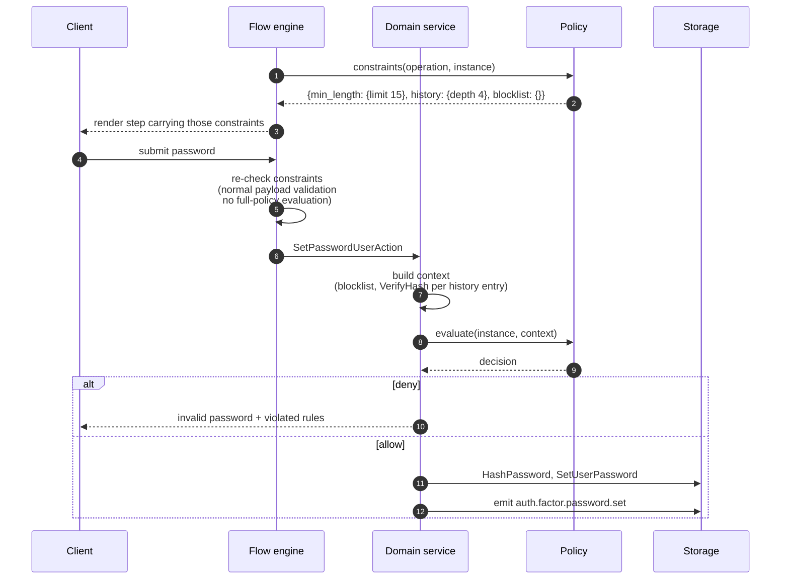

# ADR 066: Operation Policies

> **Status:** Draft
> **Date:** 2026-08-28 (revised 2026-09-28)
> **Context:** [#383](https://github.com/zitadel/nextgen/issues/383) asks for the
> settings-and-policies architecture; [#899](https://github.com/zitadel/nextgen/issues/899)
> defines the product model; [#898](https://github.com/zitadel/nextgen/issues/898)
> is the first consumer.
> **Related:** [ADR 020](020-credentials-out-of-user-schema.md),
> [ADR 035](035-configuration-environments.md),
> [ADR 042](042-scaffolded-file-ownership-and-drift-detection.md),
> [ADR 048](048-wide-events-internal-audit-primitive.md),
> audience-scoped configuration (draft, [#1264](https://github.com/zitadel/nextgen/pull/1264))

## Context

This ADR proposes the data model and enforcement mechanism for policies in nextgen.

## Status quo

### Zitadel previous versions

There are many controls, but they are fragmented, inconsistently named, and mix capability configuration with security enforcement.

Some work was planned as part of ([zitadel#11596](https://github.com/zitadel/zitadel/issues/11596)) to better organize and split settings and policies.

### Nextgen

No defined settings / policy model. Some configuration is hard-coded, for example:
- Password minimum length: [`MinLength: 8`](../../internal/domain/flow_field_resolver_schema.go)
- Passkey user verification is a fixed [`"preferred"`](../../internal/domain/flow_state_machine.go)
- Failed authentication attempts are recorded "for rate-limiting purposes" with no threshold reading them.

The first priority is to introduce proper password policies ([#898](https://github.com/zitadel/nextgen/issues/898)):

- Minimum password length
- Password history

#### The flow-engine and auth-attempt already assume a policy engine

Apart from the new password policy requirements, initial flow-engine design documents describe a policy engine as one of their five core concepts, for example in [`docs/design/flowengine/README.md`](../design/flowengine/README.md):
> *"Policy Engine — the sole decision maker. Evaluates session state + context and determines what's required. **Design TBD** — not covered in these documents"*

In the design documents, these are some of the capabilities expected from the policy engine:

1. Flow engine, risk evaluation: decide when a captcha is required, and inject the gate on any step ([`bot-detection.md`](../design/flowengine/bot-detection.md), [ADR 019](019-captcha-gate-and-bot-signals.md)).
2. Flow engine, input validation: block a submission based on its input, and validate fields against rules the flow definition does not carry ([`flow-engine-external-auth-factors.md`](../design/flowengine/flow-engine-external-auth-factors.md)).
3. Auth attempt, assurance evaluation: compare the factors verified so far against the requested ACR after each submission, and inject the missing factor as a step ([`flow-engine.md`](../design/flowengine/flow-engine.md), [`session-api.md`](../design/flowengine/session-api.md), [ADR 010](010-session-auth-attempt-check-model.md)).

## Proposal

A policy attaches to one domain operation. It is split in two, following the
template-and-instance shape that policy-as-code systems converge on (Gatekeeper's
`ConstraintTemplate`/`Constraint`, Kubernetes' `ValidatingAdmissionPolicy`/`Binding`,
Azure Policy's definition/assignment):

- The template is Zitadel-defined and ships with the server. It declares, for
  one operation, which configuration a developer may set, which request context
  the rules receive, and the rules themselves: a list of named boolean
  expressions in [CEL](https://cel.dev) over `config` and context.
- The instance is developer-authored and lives in the release. It carries the
  configuration values for the whole project.

A policy is always evaluated before its operation runs. Every rule must hold
for the operation to proceed.

### Terminology

- Operation: a domain action that can carry a policy, such as `user.password.save`. Zitadel defines the list.
- Template: the Zitadel-defined half of a policy for one operation: config schema, context schema, rules.
- Instance (or just policy): the developer-authored half, the config values. A revisioned resource in the release, one per operation per project.
- Rule: one named CEL expression in a template that must evaluate to `true`.
- Decision: what evaluating an instance against a request context returns, `allow` or `deny` with the violated rules.

### Data model

#### Template

One template per operation, defined by Zitadel and versioned with the server.

```json
// user.password.save — template
{
  "operation": "user.password.save",
  "config": {
    "min_length":    { "type": "integer", "minimum": 8, "maximum": 64, "default": 15, "recommended_minimum": 15, "public": true },
    "max_length":    { "type": "integer", "default": 64, "fixed": true, "public": true },
    "history_depth": { "type": "integer", "minimum": 0, "maximum": 4,  "default": 0,  "public": true }
  },
  "context": {
    "candidate":       { "length": "int", "in_blocklist": "bool" },
    "history_matches": "list<bool>"
  },
  "rules": [
    { "name": "min_length", "expression": "candidate.length >= config.min_length" },
    { "name": "max_length", "expression": "candidate.length <= config.max_length" },
    { "name": "history",    "expression": "config.history_depth == 0 || !history_matches.exists(m, m)" },
    { "name": "blocklist",  "expression": "!candidate.in_blocklist" }
  ]
}
```

`config` is a JSON Schema fragment per setting (type, bounds, default), the
range a developer may move within; `fixed` pins a setting to its default and
`public` allows the unauthenticated `constraints` projection to return it.
`context` is the schema of the derived values the rules receive (the raw input
stays out of it), and doubles as the CEL type environment. `rules` is an ordered list of
named boolean expressions; a name is what a denial reports and what
`constraints` lists. What each marker means and how a template is validated
is in [Template](../design/policies/1-template.md).

A template is not release content: templates ship with the server and evolve with it,
as the flow engine's step vocabulary does for flow definitions. How a server
upgrade treats deployed instances is the same question every configuration
resource has, and is not answered here.

#### Instance

Each instance guards one operation and carries its own configuration under `config`.
The envelope (`kind`, `operation`) is the same for every operation;
`config` is what the operation's template defines, and `operation` is the
discriminator that says which template that is.

```json
// .zitadel/policies/user.password.save.json
{
  "kind": "policy",
  "operation": "user.password.save",
  "config": {
    "min_length": 15,
    "history_depth": 4
  }
}
```

- An instance applies to its whole project: one instance per operation per
  project, and every request to that operation in the project is evaluated
  against it. Narrowing an instance to part of a project (a team, an app) is
  the audience mechanism of the audience-scoped configuration draft
  ([#1264](https://github.com/zitadel/nextgen/pull/1264)), which follows this
  ADR and adds an `audience` envelope field; see [Applicability](#applicability).
- `config` is validated against the template's config schema at write time.
  A key the template does not declare is rejected.
- A setting the instance omits takes the template's default, so evaluation
  always sees a complete config; a project with no instance at all runs on the
  template defaults. The example above therefore leaves `max_length` out (it
  is fixed) and could leave `history_depth` out to keep the default of 0.
- The wire schema of the instance is a discriminated union on `operation`:
  one branch per catalogued operation, each with the `config` object that
  operation's template declares (its settings, bounds and defaults, no others).
  The union is what the OpenAPI component publishes, what the generated client
  types carry, and what the `policy.json` editor meta-schema is derived from,
  so an editor completes `min_length` for `user.password.save` and rejects a
  key that operation does not have. A test keeps every branch in parity with
  its template.

### Policy catalog

The set of policy-guarded operations is closed and server-defined: the list
of templates. A developer authors instances for any operation on the list and
cannot add an operation to it. Templates ship with the server; today's list:

| Operation | Rules | Context (derived in Go) |
|---|---|---|
| `user.password.save` | `min_length`, `max_length`, `history`, `blocklist` (lands with #898's blocklist) | candidate length, blocklist hit, per-history-entry match |
| `user.password.verify` (illustrative, not MVP) | `lockout` | recent failed attempts |

#### Where the catalog lives and how an operation is added

The catalog is the set of template files embedded in the server binary,
[`internal/policy/templates/*.json`](../../internal/policy/templates/), plus
the index that names each operation's evaluation point,
[`docs/design/policies/catalog.md`](../design/policies/catalog.md). The two
must agree; the index is what a reviewer reads, the files are what the
server runs.

Adding an operation is four things, and nothing else registers it:

1. a template file under `internal/policy/templates/`, compiled and checked
   at startup by `policy.New()`;
2. a row in the catalog index naming the template, the configurable and
   fixed settings, the rules, and the evaluating function;
3. a context builder in Go that derives the values the rules see for that
   operation, keeping the raw input out;
4. one gate call in the operation's shared write path, so no API, SDK or
   journey can reach the operation without it.

For `user.password.save` the evaluating function is
`service.PasswordPolicy.Check`, called from `service.SetPasswordUserAction.Apply`,
the single function every password set goes through (admin API and
registration flow alike). The context builder is
`service.PasswordPolicy.buildContext`. Instances are resolved by
`service.PolicyService.Resolve`: newest stored revision of the project's
instance for the operation, template defaults when the project authored
nothing. That is a stand-in: ADR 035 says an environment sees only what its
active release pins, so resolution moves to the release's pinned policy
revision once release-pinned reads exist (scope table in
[`docs/design/policies/`](../design/policies/README.md)).

### Policy evaluation trigger (relation to domain events)

A policy is evaluated before its operation, synchronously. Existing [wide events](048-wide-events-internal-audit-primitive.md) record what happened after, and cannot affect the outcome.

| Operation (policy evaluated before) | Wide event (emitted after) |
|---|---|
| `user.password.save` | `auth.factor.password.set` |
| `user.create` | `user.created` |

### Policy evaluation

Evaluation takes the resolved instance and the request context. The engine is
stateless: it never fetches its own inputs. Every rule runs; there is no
short-circuit, so a user sees every requirement they missed, not just the first.

```json
// config — from the project's instance for this operation, defaults filled from the template
{ "min_length": 15, "history_depth": 4 }
```

```json
// context — derived by Go for this one evaluation
{
  "candidate":       { "length": 14, "in_blocklist": false },
  "history_matches": [false, false, true, false]
}
```

```json
// decision
{
  "allow": false,
  "violations": [
    { "rule": "min_length", "config": { "min_length": 15 } },
    { "rule": "history",    "config": { "history_depth": 4 } }
  ]
}
```

A violation names the rule and echoes the public settings the rule reads, which
is what a client needs to render "at least 15 characters". Private settings are
never echoed.

#### Decisions

- `allow`: every rule held; the operation may proceed
- `deny`: at least one rule failed; the operation is rejected with the violated rules

A third outcome, `require` (the operation is not yet permissible, these
requirements are unmet, used to inject a step mid-flow), is not needed by any MVP
operation. It returns as a per-rule field when the first assurance consumer lands.

#### Evaluation errors

A rule cannot fail at runtime in the ways a program can: expressions are
type-checked against the context schema and cost-bounded before the server
serves traffic, and CEL has no I/O, no recursion and no unbounded loops. What
remains is Go failing to build the context (a storage error while loading
password history), which is an ordinary service error: the operation fails,
closed. There is no per-operation failure posture to declare. An operator who
needs a misbehaving policy out of the way publishes a revision with the
template defaults.

### End to end: a user enters their password during sign-up (via flow-engine)


```mermaid
sequenceDiagram
    autonumber
    participant C as Client
    participant F as Flow engine
    participant S as Domain service
    participant P as Policy
    participant DB as Storage

    F->>P: constraints(operation, instance)
    P-->>F: {min_length: {limit 15}, history: {depth 4}, blocklist: {}}
    F-->>C: render step carrying those constraints
    C->>F: submit password
    F->>F: re-check constraints<br>(normal payload validation<br>no full-policy evaluation)
    F->>S: SetPasswordUserAction
    S->>S: build context<br>(blocklist, VerifyHash per history entry)
    S->>P: evaluate(instance, context)
    P-->>S: decision
    alt deny
        S-->>C: invalid password + violated rules
    else allow
        S->>DB: HashPassword, SetUserPassword
        S->>DB: emit auth.factor.password.set
    end
```

1. Render. Flow-engine fills `FlowFieldValidation` from the `constraints` projection (`service.PasswordPolicy.FieldValidation`). The client can perform frontend validation.
2. Submit. The client posts the new password as the reserved field `x-auth-methods#password`.
3. Validation. Flow-engine backend payload validation re-checks constraints.
4. Domain operation. The flow engine calls `SetPasswordUserAction`. This is the guarded operation.
5. Prepare context. Per-operation Go code derives the context (see [Evaluation](../design/policies/2-evaluation.md)).
6. Evaluate. Every rule runs over config plus context.
7. Return the error, or proceed with the operation.

### The rule language: CEL

Rules are written in the [Common Expression Language](https://cel.dev). This was
an open decision between OPA/Rego and Go; reframing a policy from one program
that returns a decision to a list of named boolean rules settled it.

Once a policy is a rule list, the invariants #899 asks for hold by structure
instead of by convention:

- Discoverability. The `constraints` projection is the rule list plus its
  public settings. A rule cannot exist that the client is not told about.
- No silent weakening. Rules live in the template, which the developer does
  not author. A future developer-authored template can only append rules.
- `require` is a field on a rule.

Each rule is then one boolean expression, and CEL is the fit for exactly that:

| | CEL (rule list) | Rego (one program) | Go (compiled) |
|---|---|---|---|
| Shape | list of named `bool` expressions | one module returning a decision document | a function per operation |
| Sandbox | no I/O, no recursion, static cost estimate, runtime cost limit (best) | needs builtins such as `http.send` disabled, right after [ADR 061](061-egress-policy-user-injectable-urls.md) locked egress down | no customer code path (best) |
| Latency | in-process, microseconds | in-process, microseconds; or a sidecar round-trip | native call (best) |
| Second language in the product | none: OpenFGA conditions are already CEL, so a widened FGA profile ([ADR 032](032-permission-catalogs.md)) reuses it (best) | Rego alongside CEL | none |
| Extensibility | developer-authored rules later, append-only, same evaluator | developer replaces the program | server release per change |
| Tooling | no `opa test` equivalent: covered by a release-side test file and a server-side dry-run (see [Authoring](../design/policies/4-authoring.md#testing-not-built-yet)) | `opa test`, `opa fmt`, Regal, coverage (best) | Go tests |
| Precedent | Kubernetes embedded CEL for in-tree policy and kept OPA as an external webhook; Google IAM Conditions, Firebase Rules, OpenFGA, SpiceDB, Envoy RBAC | CNCF-graduated, Gatekeeper, Conftest | n/a |

The evaluator is [cel-go](https://github.com/cel-expr/cel-go), the same
implementation OpenFGA embeds. The environment is deliberately minimal: the CEL
standard library plus the `strings` and `lists` extensions, nothing else.

Rego stays available as an external decision point if an enterprise customer
insists on OPA, the way Kubernetes keeps OPA as a webhook.

## Relation to other domains

### Releases

Instances are revisioned resources deployed as part of a release
([ADR 035](035-configuration-environments.md), ids per
[ADR 063](063-resource-revisions-fixed-id-and-revision-id.md)). ADR 035 already
reserved the `policy` resource kind, the `pol_` id prefix and the `policies`
key in the release bundle; instances occupy them. The handle is the
`operation`: it is what two revisions of the same instance share, so a
release cannot pin two revisions for one operation, and an instance carries
no `name`. When scoped instances land
([#1264](https://github.com/zitadel/nextgen/pull/1264)) the handle grows the
audience key next to the operation, still derived from the document, so a
project default and a team override of the same operation are two resources
without a naming field to keep in step with the audience. The resource slice
copies branding (create-only, versioned, project-owned), not the user schema
(URL identity and `$ref` handling a policy does not need). Templates are not
release content: they ship with the server, and a release records the catalog
version it was validated against. Release validation checks every instance
against its template (unknown operation, unknown setting, out-of-bounds value)
and rejects two instances for the same operation.

### Applicability

This ADR ships policies in project scope only: an instance applies to every
request to its operation in the project, and a project without an instance
gets the template defaults. That is what #898 asks for (one project-wide
password policy) and the whole of what is implemented.

Scoping an instance to part of a project is a follow-up, decided in the
audience-scoped configuration draft
([#1264](https://github.com/zitadel/nextgen/pull/1264)). That draft gives
release content a required `audience` (an explicit project default or a set
of scope parameters such as `team_ids`), release-time validation, and
most-specific-wins resolution; policies adopt it as-is when it lands, the
`audience` field joining the envelope next to `kind` and `operation`. The
model needs no change to take it: the engine evaluates one resolved instance,
and the resolver is the only piece that grows a request hint. That a scoped
instance must not weaken the project's policy is an open question decided
with that draft ([Policy hierarchy](#policy-hierarchy)).

### Hooks and actions

Policies apply to a static list of operations defined by Zitadel. A developer configures what happens at an operation on that list; they cannot add one, and a policy only ever returns a decision.

Hooks and actions are the generic version of the same idea: developer-declared extension points that run arbitrary code and may have side effects.

### Ownership

#383 requires one explicit owner and no automatic inheritance. Neither issue
defines "owner", and the word carries several jobs. This ADR pins it to one:

> Owner is the resolution root: the resource whose configuration the runtime
> reads to obtain the effective value.

The other jobs keep their existing homes. Who may view and change a policy is
the permission catalogs' job ([ADR 032](032-permission-catalogs.md),
[033](033-internal-permission-management.md),
[034](034-external-permission-management.md)). What it affects is
applicability ([#1264](https://github.com/zitadel/nextgen/pull/1264),
project-wide until then). What happens when the owning resource is deleted is
an explicit lifecycle policy in [ADR 024](024-user-team-lifecycle-ownership.md)'s
style, never a cascade. Where it is authored is the release (ADR 035).

In MVP the resolution root is always the Project, so no owner field is minted.

### Change impact

#899 requires each policy to define how a promoted change affects existing state.
For the MVP operations the answer is fixed per operation and documented here;
it is not configurable:

- `user.password.save`: a stricter policy applies the next time a password is
  set. Existing passwords and sessions are untouched. This is the universal
  vendor behaviour (Okta, Auth0, Entra, Google, Keycloak). A later
  "validate at sign-in and force a change" switch would be an instance setting.

## Risks

Plaintext reaching the evaluation path. The obvious context for a password policy is the password, and a decision log captures its input by default.
Mitigated by construction: the context carries derived values computed in Go, and the context schema has no field that could hold the secret.

Duplication across operations. A control relevant at two operations is configured at both.

Long expressions in JSON. A rule list invites the temptation of one long expression. Mitigated by the caps (length, cost, `bool` result) and by the rule that a violation names one requirement.

Expression language drift. cel-go gains features per release. Mitigated by the minimal environment: a rule uses the standard library and two extensions, and every template is compiled and checked when the server starts.

## Design documents

The detail an implementer needs lives next to the code, under
[`docs/design/policies/`](../design/policies/README.md), whose scope table says
what the policy stack ships and what follows:

- [Template](../design/policies/1-template.md): the settings markers, how an
  instance is validated against a template, how the catalog is published.
- [Evaluation](../design/policies/2-evaluation.md): the context schema, the
  Go context builder, the limits every rule runs under.
- [Constraints](../design/policies/3-constraints.md): the pre-auth projection,
  how it reaches the login form through the flow field validation today, and
  the read endpoint for clients the flow engine does not drive.
- [Authoring](../design/policies/4-authoring.md): `.zitadel/policies/`, the
  CLI commands, and how a policy is tested.
- [Catalog](../design/policies/catalog.md): every guarded operation, its
  template, and the function that evaluates it.

## Future work

### Enforcement modes

Every policy-as-code system surveyed carries an enforcement tier on
the instance, not the logic (Kubernetes `validationActions: Deny | Warn |
Audit`, Gatekeeper `enforcementAction: deny | dryrun | warn`, Azure
`enforcementMode`). The rollout it enables (deploy a stricter policy in
audit, read the decisions, switch to enforce) is the one thing a first-match
resolution model cannot offer any other way. The shape is fixed now so the MVP
does not foreclose it: an `enforcement` field on the instance, `enforce` by
default, and an `audit` mode in which the template defaults stay enforced and
only what the instance tightened beyond them is evaluated and recorded without
blocking. Audit can therefore never weaken the baseline, which is what keeps
#898's "secure defaults are not configurable by Projects" true. It needs the
audited decision to land as a wide event (ADR 048), which is why it waits for
the event type.

### Developer-authored rules

Every vendor surveyed keeps password policy as configuration values and
confines customer logic to event hooks, so no customer expects to author
rules. The shape is fixed now anyway so the MVP does not foreclose it: a
developer-authored template is release content, names an operation on the
catalogue, and may only append rules to the Zitadel template. It runs in the
same evaluator, under the same limits, and its rules appear in `constraints`
like any other. The data model then enforces Elina's product constraint from
#898 (custom rules add or strengthen, never remove built-in protections); no
review has to.

### Policy hierarchy

#383 asks only that the architecture not foreclose it, and
[Ownership](#ownership) pins the resolution root to the Project.

Scoped instances (a team, an app) come with the audience-scoped
configuration draft ([#1264](https://github.com/zitadel/nextgen/pull/1264)).
Two questions stay open until then:

- A scoped instance must not weaken the project's policy. How that is
  checked, and against what, is decided together with #1264.
- Tenant-authored configuration: a Team in a customer project is a runtime
  resource, so a Team-level override cannot live in the developer's release
  as it is. Whether Zitadel wants tenants to configure policies at all is a
  product decision that has not been made.

## External references

Each entry notes what it was used for, so a reviewer can check the claim rather
than the link.

### Template and instance

- [Kubernetes ValidatingAdmissionPolicy](https://kubernetes.io/docs/reference/access-authn-authz/validating-admission-policy/): CEL policy with `paramKind`, `matchConditions`, `validations[]`, `failurePolicy`; binding with `paramRef`, `matchResources`, `validationActions: Deny | Warn | Audit`. The closest shipped match to this ADR, and the precedent for embedding CEL in-process while keeping OPA as an external webhook.
- [CEL in Kubernetes](https://kubernetes.io/docs/reference/using-api/cel/): static estimated cost limits and the runtime cost budget.
- [OPA Gatekeeper](https://open-policy-agent.github.io/gatekeeper/website/docs/howto/): ConstraintTemplate holds the logic and the parameter schema; Constraint holds the parameters and the match selector. `enforcementAction: deny | dryrun | warn`.
- [Azure Policy definition structure](https://learn.microsoft.com/en-us/azure/governance/policy/concepts/definition-structure): `parameters` and `policyRule` in the definition, values and scope in the assignment, `enforcementMode: DoNotEnforce` for rollout.
- [GitHub rulesets](https://docs.github.com/en/repositories/configuring-branches-and-merges-in-your-repository/managing-rulesets/about-rulesets): enforcement `Active | Evaluate`, and "the most restrictive version of the rule applies" when several target the same branch.

### CEL

- [CEL specification](https://github.com/google/cel-spec) and [cel-go](https://github.com/cel-expr/cel-go): the language and the evaluator; cost estimation (`EstimateCost`), runtime `CostLimit`, environment extension.
- [OpenFGA conditions](https://openfga.dev/docs/modeling/conditions): conditions are CEL with a default evaluation cost limit of 100; the reason CEL is not a second policy language in the product.
- [Cedar: a new language for expressive, fast, safe, and analyzable authorization](https://dl.acm.org/doi/10.1145/3649835): the argument for a deliberately non-Turing-complete rule language that stays statically analysable. Cedar itself competes with the OpenFGA choice, not with this.

### Why a policy is evaluated before, and an event is emitted after

- [Okta inline hooks](https://developer.okta.com/docs/concepts/inline-hooks/) and [event hooks](https://developer.okta.com/docs/concepts/event-hooks/): inline hooks are synchronous and pause the process; event hooks are asynchronous and explicitly "not to provide a way to affect the execution of the underlying Okta process flow".
- [Auth0 Actions triggers](https://auth0.com/docs/customize/actions/triggers), [Google Identity Platform blocking functions](https://cloud.google.com/identity-platform/docs/blocking-functions), [Amazon Cognito Lambda triggers](https://docs.aws.amazon.com/cognito/latest/developerguide/cognito-user-identity-pools-working-with-aws-lambda-triggers.html), [Ory Kratos hooks](https://www.ory.sh/docs/kratos/hooks/configure-hooks): every vendor that put arbitrary code on the decision path ended up with hard timeouts, fail-closed semantics and size caps. The reason the decision here is declarative and code hooks are a separate mechanism.

### The rendering trap

- [keycloak#32553](https://github.com/keycloak/keycloak/issues/32553): password policies were unreachable from login themes, so users could not see the requirements before submitting; retrofitted in 26.0. The reason `constraints` is its own query.

### Password specifics

- [NIST SP 800-63B-4 password verifier requirements](https://pages.nist.gov/800-63-4/sp800-63b.html#passwordver): the source of #898's 15-character default, the at-least-64 maximum, the blocklist requirement, and the prohibition on composition rules.
- [Auth0 flexible password policy](https://auth0.com/docs/authenticate/database-connections/flexible-password-policy): new database connections default to a 15-character minimum with no required character types, which is where #898's defaults land independently.

## Alternatives rejected

- OPA/Rego as the embedded engine. A policy as one program is more than a rule needs, brings a second policy language next to OpenFGA's CEL, and ships builtins (`http.send`) that have to be disabled after ADR 061 locked egress down. Kept as a possible external decision point.
- Rules in Go only. No authoring surface, so the `constraints` projection has to be maintained by hand per operation and developer-authored rules need a different mechanism later. The evaluator is a small dependency for what it removes.
- An expression-based selector on the instance (`when: user.schema == 'human-user'`). A free-form predicate makes overlap undecidable at release validation and breaks the pre-auth, release-cacheable `constraints` projection. Context-dependent conditions belong inside a rule.
- One resource per control, following #899's vocabulary literally. Reproduces v2's fragmentation and needs composition machinery on day one to reassemble controls decided together.
- Group by subject, as v2 does. A `password` resource covering save, verify and expiry becomes a grab-bag like `LoginSettings` as soon as two of them need different context.
- The policy itself as a JSON Schema, enforced by validating the context. The most internally consistent option, and it cannot take a bound from another value in the document, so `history_depth` bakes into the schema's shape and a configuration change becomes a schema change.
- A remote policy server queried per decision. A release cannot determine behaviour if the deciding logic lives somewhere we do not version.
- Rules inline in the user schema. Re-revisions every schema on a security change.
