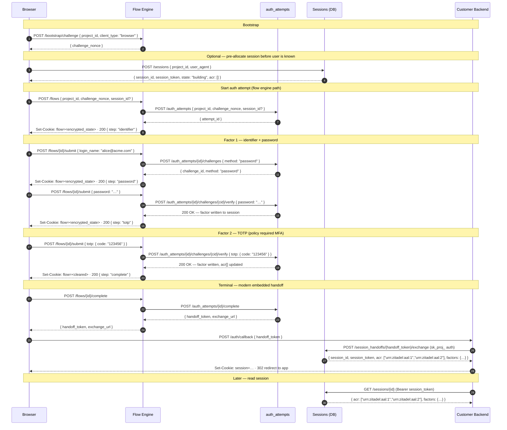
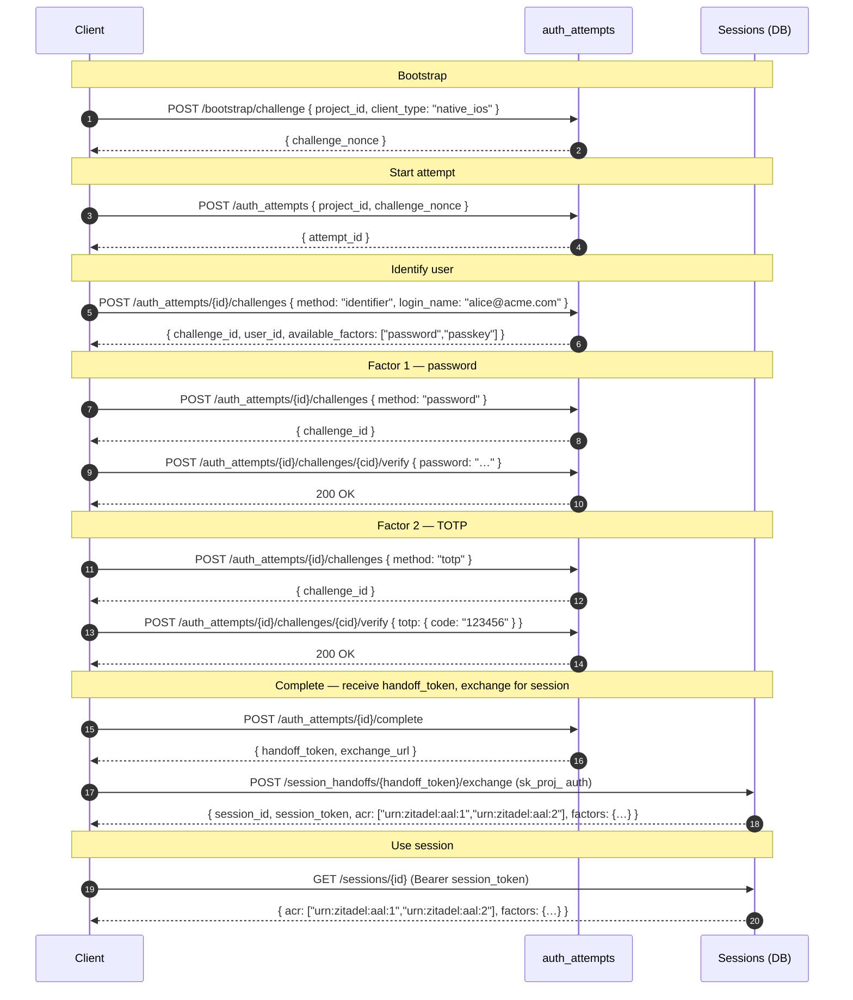
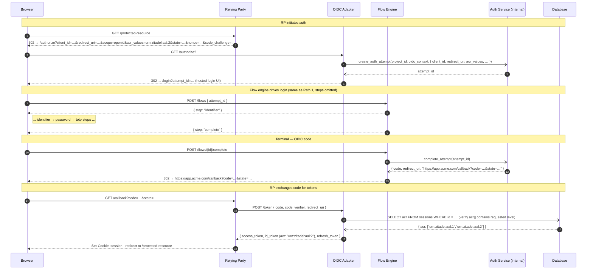
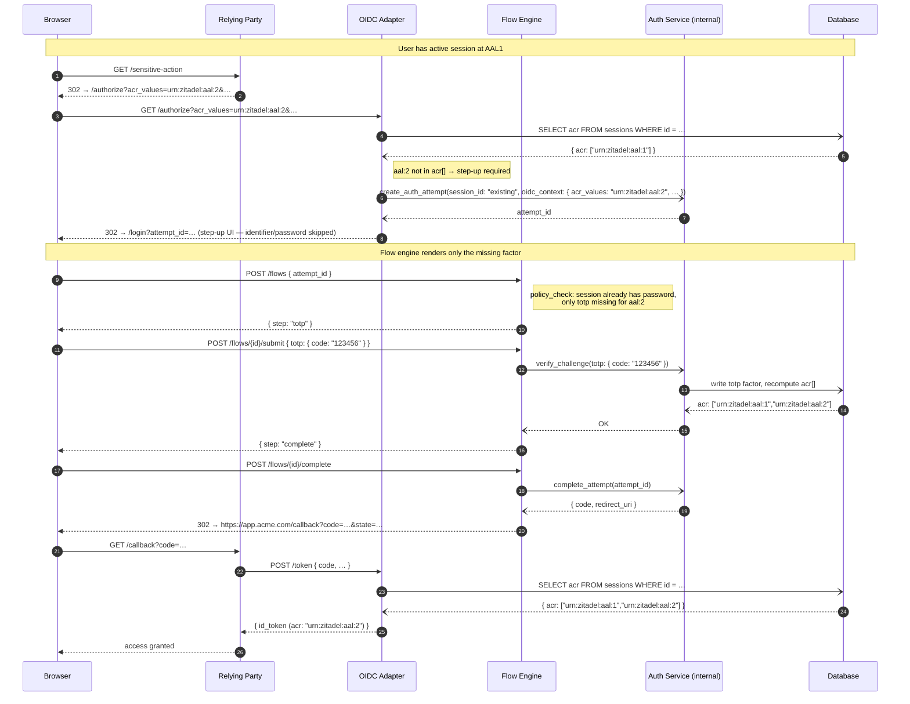

# Authentication and Auth Flows

> The `auth_attempts` state machine, the OIDC compatibility adapter, and how the embedded-component / SSR handoff hangs together. For vocabulary, [`../glossary.md`](../glossary.md). For credentials, [`credentials.md`](credentials.md).

## Separation of responsibilities

- **auth_attempts** — ephemeral state machine exposing the auth *primitives*: start an attempt, issue factor challenges, verify factor proofs, complete, mint handoff, mint OIDC code. Lives in `api/` because it's a core protocol surface.
- **flow engine** — orchestrates the *UI* around those primitives: which step renders when, which screen to show next, when to branch on policy. Does not hold primitives. See [`../flowengine/flow-engine.md`](../flowengine/flow-engine.md).
- **sessions** — durable post-auth container produced by a completed auth_attempt. Carries accumulated factors and assurance level. Detail in [`../flowengine/session-api.md`](../flowengine/session-api.md).

A flow runs on top of auth_attempt primitives without collapsing the resource model. A flow decides *what screen to draw*; an auth_attempt decides *what primitive to offer and what proof to accept*; a session is the durable post-auth outcome. The flow docs keep using `session_id` as the frontend handle for `/flows/*`, but that handle is not a blanket alias for `auth_attempt_id`.

## Pre-session concepts

| Term | Meaning |
|---|---|
| **Factor** | A verified credential: passkey, password, OTP, recovery code, federated assertion. |
| **Auth method** | The operation that acquires a factor: `password verify`, `passkey assert`, `otp enroll`, `federation redirect`. |
| **Challenge** | A single-factor prompt issued inside an auth_attempt. |
| **Session** | The post-auth container holding verified factors. Carries an assurance level (ACR). |
| **Step-up** | Adding factors to an existing session to raise assurance. |

## Bootstrap challenge

Every auth_attempt begins with a server-minted, origin-bound nonce. The client gets the nonce from `POST /bootstrap/challenge`:

```http
POST /bootstrap/challenge
{
  "project_id": "proj_…",
  "client_type": "browser" | "native_ios" | "native_android" | "server"
}
```

For `browser`, the server validates the `Origin` header against the project's `allowed_origins` before minting. The nonce is bound to `{project_id, origin, ttl≈60s, single_use}` and echoed on the subsequent `POST /auth_attempts`.

Detail in [`credentials.md`](credentials.md#origin-bound-browser-challenges). Disambiguation: this is **not** the same as `POST /projects` — that creates a whole project. This mints a per-session nonce. See [`../platform/claim-flow.md`](../platform/claim-flow.md) for project bootstrap.

## The auth_attempt state machine

```http
POST   /auth_attempts                              # create
GET    /auth_attempts/{id}                         # poll
POST   /auth_attempts/{id}/challenges              # issue a factor challenge
POST   /auth_attempts/{id}/challenges/{cid}/verify # submit proof
POST   /auth_attempts/{id}/complete                # terminal
POST   /auth_attempts/{id}/handoff                 # mint handoff_token (SSR)
```

An attempt can complete in one of two terminal shapes depending on whether it carries OIDC context:

- **Modern embedded**: `complete` yields a `handoff_token` that the customer's backend exchanges at `POST /session_handoffs/{id}/exchange` for a session payload.
- **Legacy OIDC RP**: `complete` yields an OAuth `code` + redirect URL back to the RP's `redirect_uri`.

Same state machine, two terminal behaviours.

### TTL — LOCKED at 15 minutes

Industry standard for OIDC `state` cookies and magic link lifespans. **Not configurable.** Configurability here creates an untested matrix and a footgun (a 24-hour TTL is an attacker's dream). Background GC cleans up abandoned attempts. If real use cases emerge for longer flows, we revisit with actual data.

> **Note:** 15-minute TTL means high churn on the table. Needs partitioning or efficient deletion strategy, not row-by-row cleanup.

## OIDC compatibility

Zitadel is fundamentally an OIDC provider: legacy relying parties redirect to `/authorize` with `client_id`, `redirect_uri`, `state`, `nonce`, `code_challenge`, etc., and expect an OAuth `code` back at the `redirect_uri`.

**LOCKED:** the auth_attempts state machine accepts OIDC context at initiation and adapts its completion behaviour accordingly.

```http
POST /auth_attempts
{
  "project_id": "proj_…",
  "challenge_nonce": "…",                   # from bootstrap
  "oidc_context": {                         # optional
    "request_uri": "urn:…",                 # PAR (RFC 9126), preferred
    // or individual params if not using PAR:
    "client_id": "app_…",
    "redirect_uri": "https://app.customer.com/callback",
    "response_type": "code",
    "scope": "openid profile email",
    "state": "…",
    "nonce": "…",
    "code_challenge": "…",
    "code_challenge_method": "S256"
  }
}
```

When `oidc_context` is present, `POST /auth_attempts/{id}/complete` yields an OAuth `code` + redirect URL instead of a `handoff_token`. When absent, the flow yields a `handoff_token`.

The `/authorize` OIDC endpoint becomes a thin adapter: it creates an `auth_attempt` with the appropriate `oidc_context` and redirects the user to the login UI (hosted or embedded) carrying the `auth_attempt_id`. The flow engine then orchestrates the UI on top of the same auth_attempt.

## SSR handoff

The embedded lit component completes auth in-browser and hands the customer's backend a short-lived `handoff_token` to exchange for a real session.

```http
POST /auth_attempts/{id}/handoff         → { handoff_token: "…", exchange_url: "…" }
POST /session_handoffs/{id}/exchange     → { session: {…} }
```

Exchange requirements (also documented in [`credentials.md`](credentials.md#handoff-token-hardening)):

- Single-use (atomic GETDEL).
- TTL ≤ 60 seconds.
- Audience-bound: exchange requires an `sk_proj_…` whose project ID matches the handoff's minted project.
- Idempotency-safe (Category B, 5-minute window — see [`conventions.md`](conventions.md#idempotency)). Packet loss on the success response must not lock out the user.

## Sessions

Once an auth_attempt completes (modern or OIDC), the result is a durable session. **Sessions are never mutated directly by a client** — all factor mutations happen through `auth_attempts`. The session is a read model that reflects the accumulated, verified state.

```http
POST   /sessions                         # pre-allocate anonymous session (optional, pre-auth)
GET    /sessions/{id}                    # read state, factors, acr[], amr
DELETE /sessions/{id}                    # revoke (logout), requires session_token
GET    /sessions                         # list (admin / management)
```

`POST /sessions` is optional — it creates an anonymous shell (no user, no factors) for cases where a `session_id` must be pre-allocated before the user is known. Most clients skip this; the flow engine and direct `auth_attempts` callers create the session implicitly on first completion.

Sessions carry `acr[]` — the list of all ACR levels the session's current factors satisfy — and `amr`. Detail in [`../flowengine/session-api.md`](../flowengine/session-api.md).

### Step-Up

Step-up re-authentication creates a new `auth_attempt` against the **same `session_id`**, adds factors, and raises the assurance level. No new session is created.

```http
POST /auth_attempts
{
  "project_id": "proj_…",
  "challenge_nonce": "…",
  "session_id": "sess_existing",          # references the live session
  "oidc_context": {
    "acr_values": "urn:zitadel:aal:2"    # target level
  }
}
```

The attempt proceeds normally (challenges → verify → complete). On completion, the session's `factors` and `acr` are updated in place.

## Flow engine integration

The flow engine is a separate concern from auth_attempts: it decides *which step renders* at each point. A flow step that says "collect password" internally calls `POST /auth_attempts/{id}/challenges` with `method: "password"` and presents the resulting challenge to the user; the submission calls `POST /auth_attempts/{id}/challenges/{cid}/verify`.

Integration details and the full state machine of the UI orchestration layer live in [`../flowengine/flow-engine.md`](../flowengine/flow-engine.md).

## Sequence Diagrams

Three flows share the same `auth_attempts` primitives. They differ in who drives the UI and what the terminal output is.

### Path 1 — Web client via Flow Engine (embedded component + SSR handoff)

The browser loads a Zitadel-hosted login component (or an embedded lit element). The flow engine drives all UI decisions server-side. The customer's backend exchanges the final `handoff_token` for a session.



---

### Path 2 — Direct API client (mobile app, CLI, backend service)

The client owns all UI. It drives `auth_attempts` directly without a flow engine.



---

### Path 3 — OIDC RP (legacy relying party via /authorize)

The RP redirects to `/authorize`. The OIDC Adapter is server-side code handling the request in-process — it creates an `auth_attempt` and reads sessions via the internal service layer, not over HTTP. Terminal output is an OAuth `code` at the `redirect_uri`.



---

### Step-Up — existing session, RP requests higher ACR


