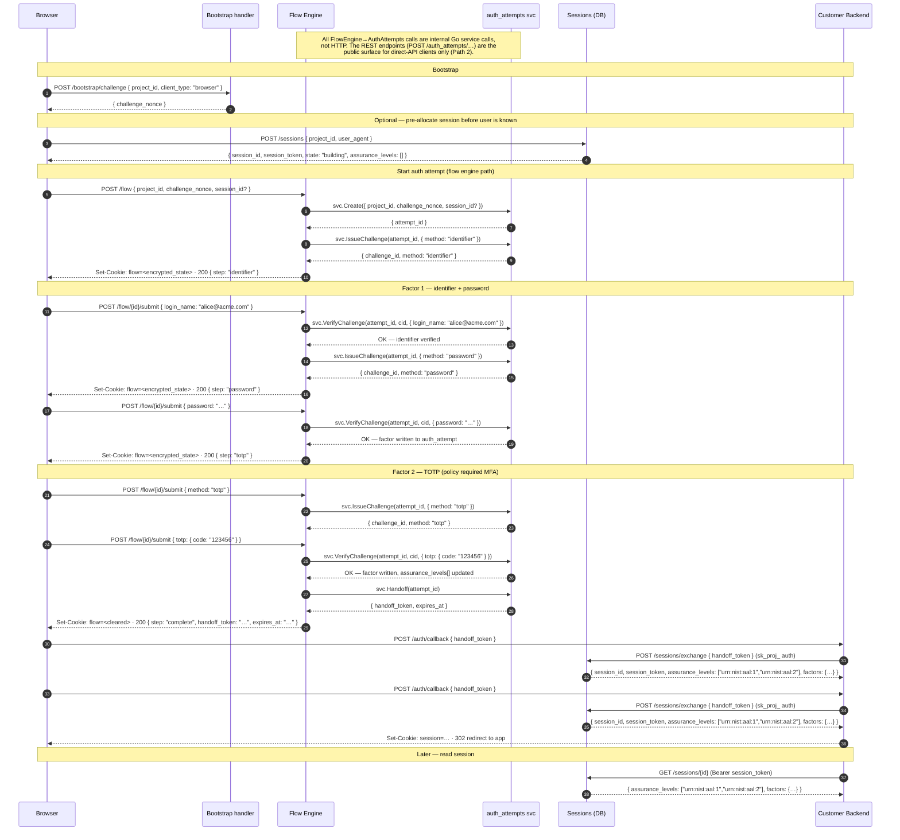
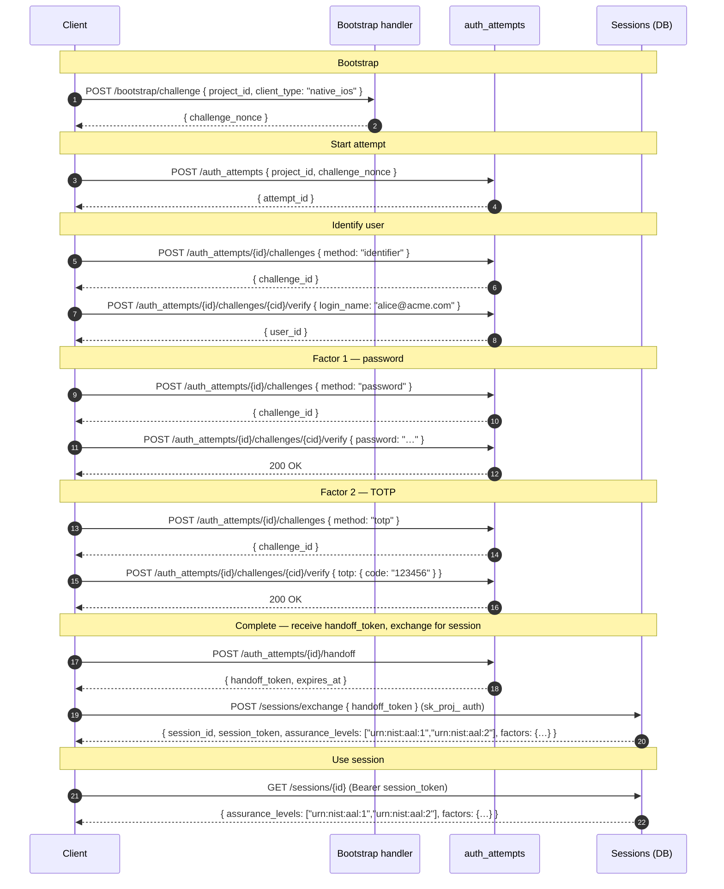
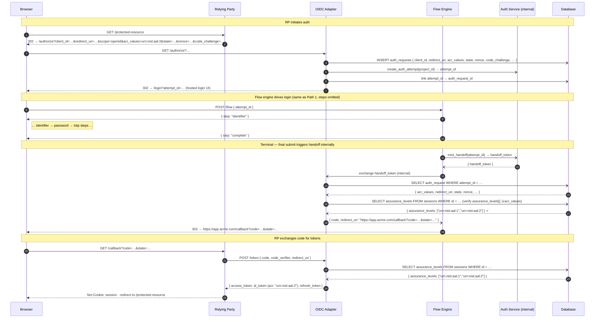
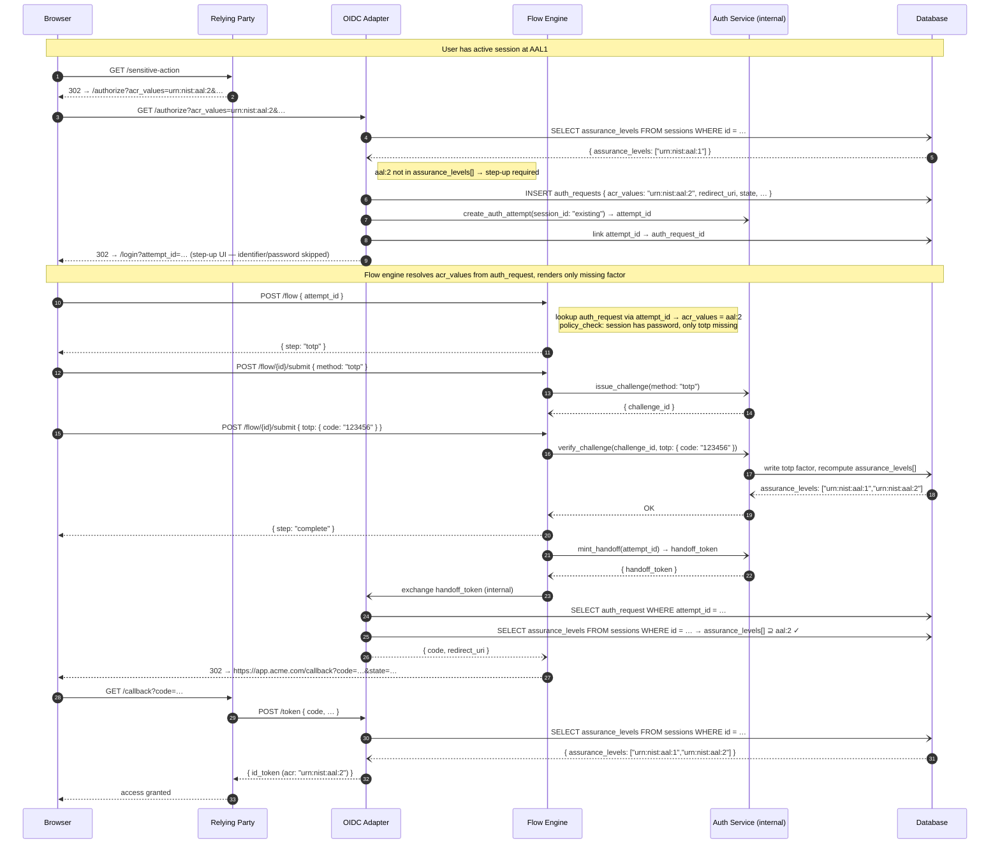

# Authentication and Auth Flows

> The `auth_attempts` state machine, the OIDC compatibility adapter, and how the embedded-component / SSR handoff hangs together. For vocabulary, [`../glossary.md`](../glossary.md). For credentials, [`credentials.md`](credentials.md).

## Separation of responsibilities

- **auth_attempts** — ephemeral state machine exposing the auth *primitives*: start an attempt, issue factor challenges, verify factor proofs, and mint handoff tokens. Lives in `api/` because it's a core protocol surface.
- **OIDC adapter** — server-side handler for `/authorize` and `/token`. Stores OIDC request context in its own `auth_requests` table and drives `auth_attempts` internally. The auth_attempt has no OIDC-specific payload.
- **flow engine** — orchestrates the *UI* around those primitives: which step renders when, which screen to show next, when to branch on policy. Does not hold primitives. See [`../flowengine/flow-engine.md`](../flowengine/flow-engine.md).
- **sessions** — durable post-auth container produced by a completed auth_attempt. Carries accumulated factors and `assurance_levels[]`. Detail in [`../flowengine/session-api.md`](../flowengine/session-api.md).

A flow runs on top of auth_attempt primitives without collapsing the resource model. A flow decides *what screen to draw*; an auth_attempt decides *what primitive to offer and what proof to accept*; a session is the durable post-auth outcome. The `/flow/{id}` handle is the flow's own `id` from the latest response — it is distinct from the stable underlying `session_id` and from `auth_attempt_id`, and it may change on pivot or pop.

## Pre-session concepts

| Term | Meaning |
|---|---|
| **Factor** | A verified credential: passkey, password, OTP, recovery code, federated assertion. |
| **Auth method** | The operation that acquires a factor: `password verify`, `passkey assert`, `otp enroll`, `federation redirect`. |
| **Challenge** | A single-factor prompt issued inside an auth_attempt. |
| **Session** | The post-auth container holding verified factors. Carries `assurance_levels[]`, the set of currently satisfied assurance profiles. |
| **Step-up** | Adding factors to an existing session to raise assurance. |

## Bootstrap challenge

Every auth_attempt begins with a server-minted, origin-bound nonce. The client gets the nonce from `POST /bootstrap/challenge` (direction: the `challenge_nonce` request field is shipped on `POST /auth_attempts`, but the `/bootstrap/challenge` endpoint that mints it is not yet in the OpenAPI spec):

```http
POST /bootstrap/challenge
{
  "project_id": "proj_01HEXAMPLE",
  "client_type": "browser" | "native_ios" | "native_android" | "server"
}
```

For `browser`, the server validates the `Origin` header against the project's `allowed_origins` before minting. The nonce is bound to `{project_id, origin, ttl≈60s, single_use}` and echoed on the subsequent `POST /auth_attempts`.

Detail in [`credentials.md`](credentials.md#origin-bound-browser-challenges). Disambiguation: this is **not** the same as `POST /projects` — that creates a whole project. This mints a per-session nonce. See [`../platform/claim-flow.md`](../platform/claim-flow.md) for project bootstrap.

## The auth_attempt state machine

```http
POST   /auth_attempts                              # create
GET    /auth_attempts/{id}                         # poll
POST   /auth_attempts/{id}/challenges              # issue a factor challenge
POST   /auth_attempts/{id}/challenges/{cid}/verify # submit proof
POST   /auth_attempts/{id}/handoff                 # terminal: mint handoff_token
```

`POST /auth_attempts` accepts only the project context, the bootstrap challenge
nonce, and an optional existing session for step-up:

```http
POST /auth_attempts
{
  "project_id": "proj_01HEXAMPLE",
  "challenge_nonce": "…",
  "session_id": "sess_existing"   // optional, for step-up
}
```

`handoff` always yields a `handoff_token`. Who calls it determines the next
step: direct clients and the flow engine exchange it through `POST /sessions/exchange`,
while the OIDC adapter consumes it internally to mint an OAuth code.

### TTL — LOCKED at 15 minutes

Industry standard for OIDC `state` cookies and magic link lifespans. **Not configurable.** Configurability here creates an untested matrix and a footgun (a 24-hour TTL is an attacker's dream). Background GC cleans up abandoned attempts. If real use cases emerge for longer flows, we revisit with actual data.

> **Note:** 15-minute TTL means high churn on the table. Needs partitioning or efficient deletion strategy, not row-by-row cleanup.

## OIDC compatibility

Zitadel is fundamentally an OIDC provider: legacy relying parties redirect to `/authorize` with `client_id`, `redirect_uri`, `state`, `nonce`, `code_challenge`, etc., and expect an OAuth `code` back at the `redirect_uri`.

**LOCKED:** the OIDC adapter handles OIDC context entirely server-side. When
`/authorize` is received, the adapter stores the full request parameters in
`auth_requests`, creates an auth_attempt through the internal service layer,
and links `attempt_id -> auth_request_id`. The auth_attempt remains a pure
authentication primitive.

When the final step calls `mint_handoff(attempt_id)`, the OIDC adapter resolves
the linked auth request, validates the session's `assurance_levels[]` against
the requested `acr_values`, and generates the OAuth `code` + redirect URL. For
step-up, the adapter creates a new auth_attempt against the same `session_id`;
the target ACR stays in `auth_requests`, not on the auth_attempt.

## SSR handoff

The embedded lit component completes auth in-browser and hands the customer's backend a short-lived `handoff_token` to exchange for a real session.

```http
POST /auth_attempts/{id}/handoff         → { handoff_token: "…", exchange_url: "…" , expires_at: "…"}
POST /sessions/exchange                  → { session: {…}, session_token: "…" }
```

Exchange requirements (also documented in [`credentials.md`](credentials.md#handoff-token-hardening)):

- Single-use (atomic GETDEL).
- TTL ≤ 60 seconds.
- Audience-bound: exchange requires an `sk_proj_…` whose project ID matches the handoff's minted project.
- Idempotency-safe via the optional `Idempotency-Key` header (see [`conventions.md`](conventions.md#idempotency-shipped)). Packet loss on the success response must not lock out the user.

## Sessions

Once an auth_attempt completes, the result is a durable session. Sessions are
never mutated directly by a client; all factor mutations happen through
auth_attempts. The session is a read model that reflects the accumulated,
verified state:

```http
POST   /sessions                         # pre-allocate anonymous session (optional, pre-auth)
GET    /sessions/me                      # read the caller's session (__nextgen_session cookie)
DELETE /sessions/me                      # end-user logout (__nextgen_session cookie)
GET    /sessions/{id}                    # read state, factors, assurance_levels[] (operator, session.read)
DELETE /sessions/{id}                    # operator revoke (session.delete; idempotent 204)
POST   /sessions/query                   # operator list — cursor-paginated, structured filters
```

`POST /sessions` is optional — it creates an anonymous shell (no user, no factors) for cases where a `session_id` must be pre-allocated before the user is known. Most clients skip this; the flow engine and direct `auth_attempts` callers create the session implicitly on first completion.

Sessions carry `assurance_levels[]` — every assurance level the current factors
satisfy. OIDC-specific `acr` and `amr` claims are projected by the OIDC adapter.
Detail in [`../flowengine/session-api.md`](../flowengine/session-api.md). Step-up
re-authentication creates a new auth_attempt against the same session, adds
factors, and expands `assurance_levels[]`.

### Step-Up

Step-up re-authentication creates a new `auth_attempt` against the **same `session_id`**, adds factors, and expands `assurance_levels[]`. No new session is created. No OIDC context on the attempt — when triggered by an OIDC flow, the `acr_values` target is in the OIDC Adapter's stored `auth_request`.

```http
POST /auth_attempts
{
  "project_id":      "proj_…",
  "challenge_nonce": "…",
  "session_id":      "sess_existing"
}
```

The attempt proceeds normally (challenges → verify → handoff). On handoff, the session's `factors` and `assurance_levels[]` are updated in place.

## Flow engine integration

The flow engine is a separate concern from auth_attempts: it decides *which step renders* at each point. A flow step that says "collect password" internally invokes the auth_attempt **Go service layer** (the same code that backs the `POST /auth_attempts/{id}/challenges` HTTP endpoint) with `method: "password"` and presents the resulting challenge to the user. The submission invokes the service-layer equivalent of `POST /auth_attempts/{id}/challenges/{cid}/verify`. **The flow engine never makes HTTP round-trips to its own REST endpoints** — it calls the underlying Go service directly, the same pattern as the OIDC adapter.

`auth_attempts` does not return an "available factors" menu for orchestration.
Step selection remains flow/policy-driven; auth_attempts enforces validity of
requested methods and proofs.

Integration details and the full state machine of the UI orchestration layer live in [`../flowengine/flow-engine.md`](../flowengine/flow-engine.md).

## Sequence Diagrams

Three flows share the same `auth_attempts` primitives. They differ in who drives the UI and what the terminal output is.

### Path 1 — Web client via Flow Engine (embedded component + SSR handoff)

The browser loads a Zitadel-hosted login component (or an embedded lit element). The flow engine drives all UI decisions server-side. The customer's backend exchanges the final `handoff_token` for a session.



---

### Path 2 — Direct API client (mobile app, CLI, backend service)

The client owns all UI. It drives `auth_attempts` directly without a flow engine.



---

### Path 3 — OIDC RP (legacy relying party via /authorize)

The RP redirects to `/authorize`. The OIDC Adapter is server-side code handling the request in-process — it stores OIDC context in `auth_requests`, creates an `auth_attempt` via the internal service layer, and links them. Terminal output is an OAuth `code` at the `redirect_uri`.



---

### Step-Up — existing session, RP requests higher ACR



## See also

- [`../glossary.md`](../glossary.md)
- [`credentials.md`](credentials.md) — bootstrap nonce, handoff token hardening
- [`authz.md`](authz.md) — who can create an auth_attempt
- [`conventions.md`](conventions.md#idempotency-shipped) — Category B retry semantics
- [`../flowengine/flow-engine.md`](../flowengine/flow-engine.md) — UI orchestration on top of these primitives
- [`../flowengine/session-api.md`](../flowengine/session-api.md) — durable sessions, ACR/AAL
