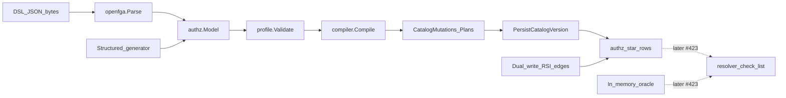

# Authz testing without an API

> **Status:** RECOMMENDED exploration (not locked)
> **Context:** Wave 1 storage ([#422](https://github.com/zitadel/nextgen/issues/422) /
> [PR #677](https://github.com/zitadel/nextgen/pull/677)) and the OpenFGA
> compiler ([#421](https://github.com/zitadel/nextgen/issues/421) /
> [PR #720](https://github.com/zitadel/nextgen/pull/720)) land before a public
> grants/check API and before the resolver ([#423](https://github.com/zitadel/nextgen/issues/423)).
> This note maps how to gain confidence in compiler + database behavior anyway.
>
> Sibling: [`permission-storage.md`](permission-storage.md),
> [`authz.md`](authz.md), [ADR 032 §2](../../adrs/032-permission-catalogs.md#2-openfga-parser-and-profile-compiler).

## Problem

The interesting surface for authorization is eventually:

```
credential × assignment × membership × catalog closure/edges → check/list
```

Today we have the left-hand pieces (parser → profile → compiler →
`PersistCatalogVersion`, dual-write RSI / membership edges) but not the
resolver or HTTP API. Waiting for those leaves schema and compile bugs to
surface late. Fuzzy / property testing can exercise the shipped layers now.

## What "fuzzy testing" means here

Three related techniques, not one tool:

| Technique | Input | Oracle | Fits |
| --- | --- | --- | --- |
| **Crash fuzz** | Arbitrary bytes (DSL/JSON) | No panic; bounded runtime | `openfga.Parse*` |
| **Property / generative fuzz** | Structured `authz.Model` (valid + near-valid) | Algebraic invariants on `CatalogMutations` / plans | `profile` + `compiler` |
| **Differential / sequence fuzz** | Random mutation sequences + same payload across dialects | Dialects agree; dual-write stays consistent | storage v2 / `stmttest` |

Go's built-in `testing.F` is enough for the first two. Prefer it over a new
property-testing dependency until generators outgrow a small byte decoder.

## Layered strategy



Do **not** duplicate upward: each property belongs at the lowest layer that
can falsify it (same rule as root `AGENTS.md` testing layers).

### L1 — Parser crash fuzz

**Target:** `internal/authz/openfga`

**Properties:**

- `ParseDSL` / `ParseJSON` never panic on any `[]byte`.
- When both succeed on equivalent encodings, normalized `authz.Model` is equal
  (already partly covered by unit round-trips; fuzz widens the corpus).

**Why first:** Upstream language package + our normalize path are the only
byte-level entry points; cheap and dependency-free.

### L2 — Compiler / profile property fuzz (ship now)

**Target:** `internal/authz/profile`, `internal/authz/compiler`

Generate models from a small alphabet (`user`, hierarchy types, a few
custom types). `authztest.GenerateModel` selects **named recipe tables** for
rewrites and type refs (valid profile shapes plus deliberate invalids:
wildcards, `and` / `but not`, bad TTU, empty / conditioned restrictions),
instead of nested `Intn` weight branches.

**On every input:**

1. `Compile` never panics and finishes quickly (no accidental recursion).
2. On profile error: output is empty and the error unwraps to
   `profile.Diagnostics` (no partial catalog).
3. On success, assert **storage-neutral invariants** (independent of SQL):

| Invariant | Why it matters |
| --- | --- |
| Deterministic: two `Compile` calls equal | Catalog diffs / versioning |
| Every relation has reflexive closure depth `0` | Resolver one-join path |
| Closure edges are same-object only | TTU must not leak into implication |
| Computed-userset edges appear in closure with shortest depth | Wrong depth → wrong grant expansion |
| Closure is transitively closed under computed-userset steps | Missed implication → false deny |
| Expression-edge positions are dense `0..n-1` per target | Persist / ordered OR terms |
| Plan terms match edges for the same target | Runtime vs storage drift |
| Relation-reference positions dense per relation | Assignment type checks |

Seeded random runs belong in ordinary `go test` (CI). `testing.F` entry points
reuse the same generator + oracle for longer local / overnight fuzzing.

**Out of L2:** semantic "would OpenFGA allow this tuple?" — that needs a check
oracle (L4).

### L3 — Database persistence & dual-write properties

**Target:** `PersistCatalogVersion`, `LoadCatalogMutations`, assignment / RSI /
membership statements across Postgres, Spanner, SQLite (`stmttest`).

Wave 1 already has golden persist + seed tests. Generative coverage:

1. **Compile → persist → readback (shipped).** `stmttest` generative suite
   (`TestPersistCatalogVersion_Generative`) uses `authztest.GenerateValidModel`
   (valid recipe tables only — no soft-skip on profile errors), persists via
   `PersistCatalogVersion`, and compares `compiler.PersistedCatalog` from
   `LoadCatalogMutations` (statement-level; no dialect SQL in stmttest).
   Assignment FK smoke proves relations are enforceable. `PersistedCatalog`
   is the subset Persist actually writes (relations, references, edges,
   closure) — not full `CatalogMutations`.
2. **Dialect differential.** Same mutations exercise every registered dialect
   through `forEachDialect` in the generative suite.
3. **Assignment / FK chaos (partial).** Generative run creates one valid
   assignment and rejects a bogus relation; broader revoke/recreate sequences
   remain future work.
4. **Dual-write sequences (deferred).** Random project / team / user /
   membership create / deactivate streams still to add.

`LoadCatalogMutations` exists for persist round-trip verification in tests;
product check/list paths are not callers yet (#423).

### L4 — Check / list oracle (with #423)

Once the resolver exists, the high-value fuzz becomes:

```
random model (L2) + random tuples (assignments, membership edges, RSI)
  → in-memory graph oracle
  → SQL/resolver Check / ListObjects
  → must agree
```

Oracle rules for the MVP profile (union, computed userset, bounded TTU):

- Direct: assignment row exists for `(principal, object, relation)`.
- Computed: principal has any relation that implies the target via closure.
- TTU: exists tupleset edge `object --tupleset--> intermediate` and
  principal satisfies `source` on `intermediate` (recursive within profile
  bounds).
- Team principal: expand via `authz_membership_edges` only.

Optional later: differential vs OpenFGA's check engine on the **supported**
subset only. Treat OpenFGA as a second opinion, not the source of truth —
Zitadel rejects constructs OpenFGA accepts, and storage shape differs
(ADR 032).

## What not to do

- **Do not wait for the grants HTTP API** to start L1–L3. The API will mostly
  marshal into the same statements; bugs here are compile/storage bugs.
- **Do not fuzz only raw DSL.** Hit rate for profile-valid models is low;
  structured IR generation is the primary knob, DSL crash fuzz is secondary.
- **Do not add Melange / external FGA services** as CI dependencies for MVP
  confidence.
- **Do not put resolver semantics into compiler unit tests.** Closure and
  edges are schema facts; object-bound expansion is resolver work.

## Recommended rollout

| Slice | Deliverable | Proves |
| --- | --- | --- |
| **A (shipped)** | Design note + L1/L2 harness under `internal/authz/...` | Compiler/profile invariants on random models; parse crash fuzz |
| **B (catalog path shipped)** | `stmttest` generative persist via `LoadCatalogMutations` | Compiler output ↔ dialect rows without HTTP; dual-write sequences still deferred |
| **C** | In-memory oracle + resolver differential (#423) | End-to-end check/list correctness |

Slice A is pure Go unit/fuzz — no containers. Slice B reuses existing
integration tags. Slice C is the long-term gate for authz behavior.

## Local commands

```sh
# Seeded property suite (CI-shaped)
go test ./internal/authz/...

# Generative persist round-trip (needs a dialect tag)
go test -tags sqlite_integration ./internal/storage/stmttest/ -run Generative -count=1

# Longer fuzz (local / overnight)
go test ./internal/authz/compiler/ -fuzz=FuzzCompileInvariants -fuzztime=30s
go test ./internal/authz/openfga/ -fuzz=FuzzParseDSL -fuzztime=30s
```

## Open questions

1. **Corpus sharing** — check in minimized `testdata/fuzz/` failures once L2/L3
   finds interesting cases?
2. **OpenFGA differential** — worth an optional, non-CI job after L4, or skip
   while the profile is a strict subset?
3. **Dual-write sequence fuzz** — next L3 follow-up after catalog persist
   generative coverage.

## See also

- [`permission-storage.md`](permission-storage.md) — Wave 1 schema + mapper
- [`system-permission-catalog.md`](system-permission-catalog.md) — system DSL
- Epic [#419](https://github.com/zitadel/nextgen/issues/419) · resolver [#423](https://github.com/zitadel/nextgen/issues/423)
