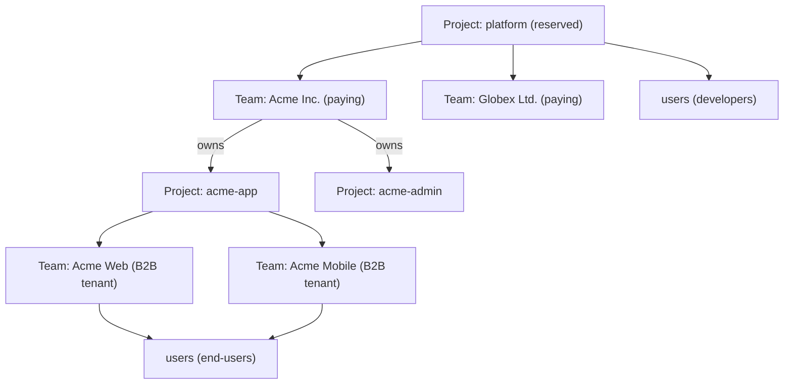

# Layer Hierarchy

> Three layers. Data hierarchy, not URL hierarchy. For how these map to URLs, see [`url-architecture.md`](url-architecture.md). For vocabulary, [`../glossary.md`](../glossary.md).

## The three layers

| Layer | What it is |
|---|---|
| **Project** | A tenant / deployment. Owns branding, IdPs, custom domain, feature flags, teams, users, apps, flows, sessions. |
| **Team** | A tenant-grouping inside any project. Carries billing (in the platform project), acts as a B2B end-customer boundary (in a customer project), and owns team-scoped collaboration/data state. |
| **User** | An identity inside any project. Memberships attach users to teams; lifecycle ownership is explicit policy, not implied by containment. |

## Platform is a reserved project

There is no separate "platform" resource kind. Zitadel's own control plane is just a **reserved project** inside the same model — the platform project. Its `project_id` is discoverable via the authenticated [`/capabilities`](conventions.md#capabilities) response under `defaults.project_id`. The SDK does not hardcode the value; it reads it on initialisation.

This means:

- A **developer** operating Zitadel is a user *in the platform project*.
- A **paying customer account** (what the concept doc called a "Team") is a team *in the platform project*.
- A **B2B end-customer tenant** (what used to be called an "organization") is a team *in a customer project*.
- **Claim** attaches a customer project to a team in the platform project via `team_id`.

Same resources, different project context. The SDK talks to `/users`, `/teams`, `/team_memberships` at both scales — the scope comes from the `project_id` resolved by the resource-scope index (see [`url-architecture.md`](url-architecture.md)).

## Self-hosted exposes the same API shape as cloud

**LOCKED.** Self-hosted returns a singleton platform project and a singleton default team with the identical JSON schema the cloud version returns. The SDK does not branch on deployment mode — it blindly works against both.

The self-hosted project ID is **discoverable via `/capabilities`**, never hardcoded. When self-hosted grows to multiple projects, restores from backup with a different `project_id`, or runs clustered, the SDK keeps working because it discovered its defaults from the server.

## Concrete shapes

**Degenerate case (solo developer, self-hosted):** one user + one team inside the singleton platform project. One customer project, maybe empty of teams.

**B2B SaaS case (cloud):** many users in the platform project, many teams (paying developer accounts), each owning many customer projects; each customer project contains many teams (their B2B tenants) with many users having N:N memberships.



## Ownership vs membership

**LOCKED by [ADR 022](../../adrs/022-user-team-lifecycle-ownership.md).**
Users are project-scoped identities. Teams are collaboration, data, and
lifecycle boundaries. A membership is the relationship that gives a user a role
inside a team.

These are separate ideas:

- A user can create and administer a team through a membership role such as
  `owner` without being lifecycle-owned by that team.
- A team can lifecycle-own a managed user when project/team/provisioning policy
  says so, for example enterprise invite, JIT provisioning, or SCIM-style
  tenant management.
- A user can have zero, one, or many team memberships while retaining one
  lifecycle owner.
- FGA consumes memberships, roles, grants, and resource hierarchy to answer
  access questions. It does not decide whether an identity should be
  deprovisioned or purged.

User lifecycle ownership is configurable:

| Owner | Default meaning |
|---|---|
| `project` | Self-serve/default signup. The user survives team deletion unless explicitly deleted. |
| `team` | Managed account. Team deletion or lifecycle-owner membership removal can deactivate the user according to policy. |
| `external` | Upstream IdP/directory owns the source identity. Zitadel enforces local access state. |

DB-facing lifecycle summary:

| Operation | Canonical effect |
|---|---|
| Delete team | Deactivate/tombstone team, revoke team-scoped API keys, deactivate/remove memberships, preserve project-owned users, and deactivate team-owned users according to policy. |
| Delete user | Deactivate/tombstone user, revoke sessions/tokens/credentials, deactivate memberships, preserve teams/resources unless a resource-specific cleanup policy applies. |
| Delete membership | Remove access to that team; only deprovision the user if that membership is the configured lifecycle-owner relationship and policy requires it. |

Status is also separate:

| Resource | Example statuses |
|---|---|
| User | `active`, `suspended`, `deactivated`, `pending_purge` |
| Team membership | `pending`, `active`, `inactive`, `removed` |

Transitional storage artifacts such as `users.team_id` or team-to-user
`ON DELETE CASCADE` must not be read as canonical product semantics. Database
follow-up should align storage with the N:N membership model in ADR 022.

## Memberships are first-class and unified

Every `team_membership` record binds a `user` to a `team` with roles and
membership status. That covers both:

- A developer's membership in their paying team in the platform project.
- An end-user's membership in a B2B tenant team in a customer project.

The resource is one surface — `/team_memberships` — with the same schema at both scales.

## Caller convenience

```http
GET /me                    # the calling principal
GET /me/memberships        # every team_membership the caller holds, across projects
```

`/me` dispatches on credential type: a user token returns the user object; an `sk_*` token returns a synthetic principal describing its scope.

## See also

- [`../glossary.md`](../glossary.md) — canonical terms
- [`url-architecture.md`](url-architecture.md) — flat-by-ID, resource-scope index, scope-bound DAL
- [`resource-map.md`](resource-map.md) — the full endpoint surface
- [`../platform/overview.md`](../platform/overview.md) — orthogonal axes (lifecycle / tier / environment / integration level)
