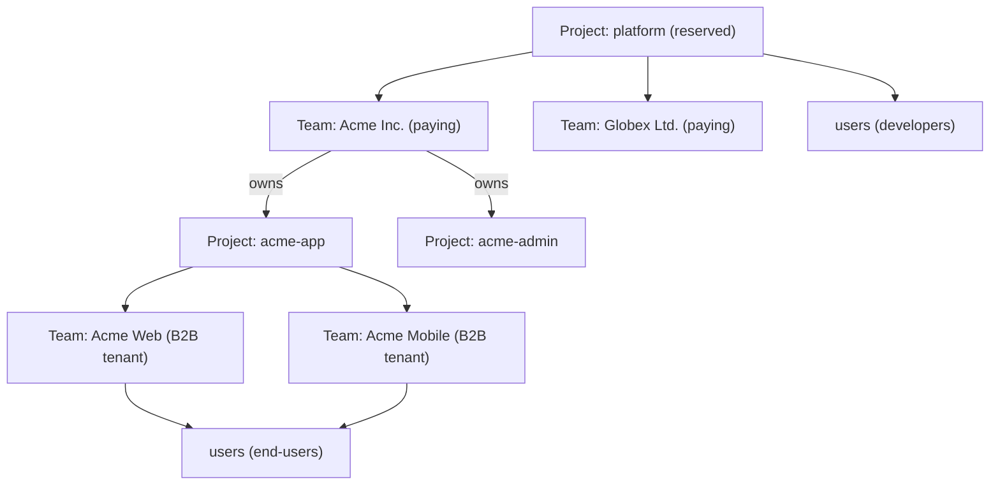

# Layer Hierarchy

> Three layers. Data hierarchy, not URL hierarchy. For how these map to URLs, see [`url-architecture.md`](url-architecture.md). For vocabulary, [`../glossary.md`](../glossary.md).

## The three layers

| Layer | What it is |
|---|---|
| **Project** | A tenant / deployment. Owns branding, IdPs, custom domain, feature flags, teams, users, apps, flows, sessions. |
| **Team** | A tenant-grouping inside any project. Carries billing (in the platform project), acts as a B2B end-customer boundary (in a customer project), and owns team-scoped collaboration/data state. |
| **User** | An identity inside any project. Memberships attach users to teams; lifecycle ownership is explicit policy, not implied by containment. |

## Platform is a reserved project

There is no separate "platform" resource kind. Zitadel's own control plane is just a **reserved project** inside the same model — the platform project. Discovering its `project_id` from the server (rather than hardcoding it) is target design: the planned [`/capabilities`](conventions.md#direction-not-shipped) endpoint would expose it under `defaults.project_id`, but no such endpoint is shipped today.

This means:

- A **developer** operating Zitadel is a user *in the platform project*.
- A **paying customer account** (what the concept doc called a "Team") is a team *in the platform project*.
- A **B2B end-customer tenant** (what used to be called an "organization") is a team *in a customer project*.
- **Claim** attaches a customer project to a team in the platform project via `team_id`.

Same resources, different project context. The SDK talks to `/users`, `/teams`, `/team_memberships` at both scales — the scope comes from the `project_id` resolved by the resource-scope index (see [`url-architecture.md`](url-architecture.md)).

## Self-hosted exposes the same API shape as cloud

**LOCKED.** A bootstrapped self-hosted deployment returns a singleton platform project and a singleton default team with the identical JSON schema the cloud version returns. The SDK does not branch on deployment mode — it blindly works against both. Before bootstrap completes there is no platform project to return; that is a deployment-lifecycle state, not a second API shape ([Console ADR 0004 §2](../../../apps/console/docs/adrs/0004-console-deployment-modes.md#2-bootstrap-is-explicit-desired-state)).

"Singleton" describes the platform project and the default team, not the deployment's project count. Customer projects are unbounded in both modes.

Not shipped yet: self-host today has **no platform project at all** — bootstrap creates one only once ADR 0004 §2's seed transport ships for self-hosted deployments. Until then every project created is a customer project, and the Console signs in against §2's transitional fallback (the first-created project, or the `platform.project_id` pin). Read this section as the contract bootstrap implements, not as current behavior.

The self-hosted project ID should be **discoverable from the server** ([direction](conventions.md#direction-not-shipped)), never hardcoded. When self-hosted grows to multiple projects, restores from backup with a different `project_id`, or runs clustered, the SDK keeps working because it discovered its defaults from the server.

## Concrete shapes

**Degenerate case (solo developer, self-hosted):** one user + one team inside the singleton platform project. One customer project, maybe empty of teams.

**B2B SaaS case (cloud):** many users in the platform project, many teams (paying developer accounts), each owning many customer projects; each customer project contains many teams (their B2B tenants) with many users having N:N memberships.



## Ownership vs membership

**LOCKED by [ADR 024](../../adrs/024-user-team-lifecycle-ownership.md).**
Users are project-scoped identities. Teams are collaboration, data, and
lifecycle boundaries. A membership is the team roster/status relationship. FGA
can consume or mirror that relationship as an authorization fact, but it does
not replace the membership resource.

These are separate ideas:

- A user can create and administer a team through a membership role such as
  `owner` without being lifecycle-owned by that team.
- A team can lifecycle-own a managed user when project/team/provisioning policy
  says so, for example enterprise invite, JIT provisioning, or SCIM-style
  tenant management.
- A user can have zero, one, or many team memberships while retaining one
  lifecycle owner: itself or one team inside the same project.
- FGA consumes memberships, roles, grants, and resource hierarchy to answer
  access questions. It does not decide whether an identity should be
  deprovisioned or purged.

Every user has exactly one lifecycle owner:

| Owner | Default meaning |
|---|---|
| `self` | Self-serve/default signup. The user survives team deletion unless explicitly deleted. The product may still auto-create a personal team/workspace for team-context UX. |
| `team` | Managed account. Team deletion or lifecycle-owner membership removal can deactivate the user according to policy. |

An auto-created personal team is a normal team resource. It gives a self-owned
user a default workspace, but it does not own the user's lifecycle.

External IdPs and directories are provisioning authorities, not lifecycle
owners. They feed into one of the two local ownership modes: self-owned for
project-wide identity sources, team-owned for tenant-managed sources such as
enterprise directory or SCIM provisioning.

Lifecycle ownership is not transitive. If a user owned by Team A creates Team B,
then deleting/deprovisioning the user through Team A removes that user's access
to Team B, but it does not delete Team B or any resources Team B owns. Team B
must have its own owner/team policy, transfer flow, or orphaned/needs-owner
state.

DB-facing lifecycle summary:

| Operation | Canonical effect |
|---|---|
| Delete team | Deactivate/tombstone team, revoke team-scoped API keys, deactivate/remove memberships, preserve self-owned users, and deactivate users lifecycle-owned by that team according to policy. |
| Delete user | Deactivate/tombstone user, revoke sessions/tokens/credentials, deactivate memberships, preserve teams/resources the user created or administered unless a resource-specific cleanup policy applies. |
| Delete membership | Remove access to that team; only deprovision the user if that membership is the configured lifecycle-owner relationship and policy requires it. |

Status is also separate:

| Resource | Example statuses |
|---|---|
| User | `active`, `suspended`, `deactivated`, `pending_purge` |
| Team membership | `pending`, `active`, `inactive`, `removed` |

Transitional storage artifacts such as `users.team_id` or team-to-user
`ON DELETE CASCADE` must not be read as canonical product semantics. Database
follow-up should align storage with the N:N membership model in ADR 024.

## Memberships are first-class and unified

Every `team_membership` record binds a `user` to a `team` with roles and
membership status. That covers both:

- A developer's membership in their paying team in the platform project.
- An end-user's membership in a B2B tenant team in a customer project.

The resource is one surface — `/team_memberships` — with the same schema at both scales.

Membership exists because teams need a roster/status/provisioning record even
when fine-grained resource authorization is handled by FGA. It is the source for
invitations, SCIM/JIT membership sync, billing seats, `/me/memberships`, and
team-scoped management views. FGA can use membership facts for decisions; it is
not the source of truth for the team's membership lifecycle.

## Caller convenience

```http
GET /me                    # the calling principal
GET /me/memberships        # every team_membership the caller holds, across projects
```

`/me` dispatches on credential type: a user token returns the user object; an `sk_*` token returns a synthetic principal describing its scope.

## See also

- [`../glossary.md`](../glossary.md) — canonical terms
- [`url-architecture.md`](url-architecture.md) — flat-by-ID, resource-scope index, scope-bound DAL
- [`resource-map.md`](resource-map.md) — the full endpoint surface
- [`../platform/overview.md`](../platform/overview.md) — orthogonal axes (lifecycle / tier / environment / integration level)
