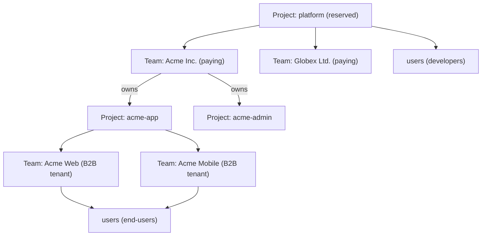

# Layer Hierarchy

> Three layers. Data hierarchy, not URL hierarchy. For how these map to URLs, see [`url-architecture.md`](url-architecture.md). For vocabulary, [`../glossary.md`](../glossary.md).

## The three layers

| Layer | What it is |
|---|---|
| **Project** | A tenant / deployment. Owns branding, IdPs, custom domain, feature flags, teams, users, apps, flows, sessions. |
| **Team** | A tenant-grouping inside any project. Carries billing (in the platform project) or acts as a B2B end-customer boundary (in a customer project). Members are users. |
| **User** | An identity inside any project. Memberships bind users to teams. |

## Platform is a reserved project

There is no separate "platform" resource kind. Zitadel's own control plane is just a **reserved project** inside the same model — the platform project. Its `project_id` is discoverable via the authenticated [`/capabilities`](conventions.md#capabilities) response under `defaults.project_id`. The SDK does not hardcode the value; it reads it on initialisation.

This means:

- A **developer** operating Zitadel is a user *in the platform project*.
- A **paying customer account** (what the concept doc called a "Team") is a team *in the platform project*.
- A **B2B end-customer tenant** (what used to be called an "organization") is a team *in a customer project*.
- **Claim** attaches a customer project to a team in the platform project via `team_id`.

Same resources, different project context. The SDK talks to `/users`, `/teams`, `/team_memberships` at both scales — the scope comes from the `project_id` resolved by the resource-scope index (see [`url-architecture.md`](url-architecture.md)).

## Self-hosted exposes the same API shape as cloud

**LOCKED.** Self-hosted returns a singleton platform project and a singleton default team with the identical JSON schema the cloud version returns. The SDK does not branch on deployment mode — it blindly works against both.

The self-hosted project ID is **discoverable via `/capabilities`**, never hardcoded. When self-hosted grows to multiple projects, restores from backup with a different `project_id`, or runs clustered, the SDK keeps working because it discovered its defaults from the server.

## Concrete shapes

**Degenerate case (solo developer, self-hosted):** one user + one team inside the singleton platform project. One customer project, maybe empty of teams.

**B2B SaaS case (cloud):** many users in the platform project, many teams (paying developer accounts), each owning many customer projects; each customer project contains many teams (their B2B tenants) with many users having N:N memberships.



## Memberships are first-class and unified

Every `team_membership` record binds a `user` to a `team` with roles. That covers both:

- A developer's membership in their paying team in the platform project.
- An end-user's membership in a B2B tenant team in a customer project.

The resource is one surface — `/team_memberships` — with the same schema at both scales.

## Caller convenience

```http
GET /me                    # the calling principal
GET /me/memberships        # every team_membership the caller holds, across projects
```

`/me` dispatches on credential type: a user token returns the user object; an `sk_*` token returns a synthetic principal describing its scope.

## See also

- [`../glossary.md`](../glossary.md) — canonical terms
- [`url-architecture.md`](url-architecture.md) — flat-by-ID, resource-scope index, RLS
- [`resource-map.md`](resource-map.md) — the full endpoint surface
- [`../platform/overview.md`](../platform/overview.md) — orthogonal axes (lifecycle / tier / environment / integration level)
