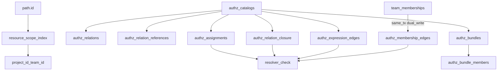

# Permission Storage

> **Status:** Wave 1 implemented (MVP storage)
> **Context:** Relational schema shape for the portable FGA core in
> [ADR 032](../../adrs/032-permission-catalogs.md) and
> [ADR 033](../../adrs/033-internal-permission-management.md). Feeds issue
> [#422](https://github.com/zitadel/nextgen/issues/422) (migrations) under epic
> [#419](https://github.com/zitadel/nextgen/issues/419).
>
> For the permission-check layer (credential × scope × permission), see
> [`authz.md`](authz.md). For `resource_scope_index` as a URL/scope invariant,
> see [`url-architecture.md`](url-architecture.md).

Wave 0 froze **tables, PKs, indexes, dual-write rules, and locked decisions**.
Wave 1 (#422) ships Goose migrations (Postgres `000015_authz_mvp`, Spanner
`000018_authz_mvp`, SQLite `000002_authz_mvp`), catalog tables aligned to #720 `CatalogMutations`
(typed relations, expression edges, relation references, closure with depth),
`PersistCatalogVersion` to save compiler output, hand-seeded system catalog
`cat_sys_1` (OpenFGA-style model pending #420 auto-compile), statement helpers,
same-tx dual-write hooks on project/team/user/membership mutations, and a
one-time backfill of `resource_scope_index` + active `authz_membership_edges`.
Resolver library (`internal/authz/resolver`) and L4 oracle tests land in
Wave 3 (#423). In-project HTTP management wiring (resolver gate + D10
403/404 mapping + `sk_proj` seed on `CreateProject`) is shipped. Leopard
remains later (**D11**). RSI dual-write now covers schema / branding /
flow_definition / session path ids in addition to project / team / user.
Fine-grained catalog relations (#420) remain a follow-up.

### Wave 1 vs OpenFGA compiler (#421 / PR #720)

| Layer | Owner | What it is |
| --- | --- | --- |
| Policy IR + compiler | [#421](https://github.com/zitadel/nextgen/issues/421) / `internal/authz` | OpenFGA DSL/JSON → profile → storage-neutral `CatalogMutations` + query plans |
| Runtime facts + DDL | Wave 1 (#422) / `internal/domain` + storage v2 | RSI, assignments, membership edges, catalog DDL |
| Persist compiled catalog | Wave 1 mapper / `PersistCatalogVersion` | Maps `CatalogMutations` → `authz_*` rows (relations, references, expression edges, closure); does **not** fill bundles |

Do **not** conflate `internal/domain` grant/scope/edge types with the compiler IR.
`cat_sys_1` is hand-seeded to match the sample OpenFGA model; #420 can later
compile the system catalog and call the same mapper.

### Domain roles (runtime facts)

| Type / table | Role |
| --- | --- |
| `ResourceScope` / `resource_scope_index` | **Where** — path.id → `project_id` / optional `team_id` |
| `AuthzAssignment` / `authz_assignments` | **Grant** — principal → `(object_type, relation)` at a scope |
| `AuthzMembershipEdge` / `authz_membership_edges` | **Set membership for authz** — resolver expands team grants here, not via `team_memberships` |
| Catalog / relations / references / expression edges / closure | **What relations mean** — seed or `PersistCatalogVersion` from compiler |
| Bundle tables | Present in DDL; v1 mapper does **not** fill them |

### Statement usage

Authz statement interfaces in `internal/service/statement.go` stay table-shaped
(Upsert/Get/Create/…). Intended callers:

- **Writers (dual-write):** entity statements construct tx-bound RSI/edge
  statements inside `withTransaction` and call Upsert/Sync/Delete directly.
  Multi-write user lifecycle helpers live in `internal/storage/v2/dialect/authz`.
  Membership status uses `service.SyncUserTeamMembershipEdge`;
  column-shaped edge deletes use `DeleteAuthzMembershipEdges(filter)`; team
  deactivate uses `DeleteAuthzMembershipEdgesForTeamDeactivate`.
- **Catalog publish:** `PersistCatalogVersion(meta, compiler.CatalogMutations)`
  after `compiler.Compile` — retires the previous active catalog for the same
  `(catalog_kind, owner_id)`. Expression-edge kinds are mapped via
  `dialect/authz.ExpressionEdgeKind` (not on the compiler IR).
- **Grants API (later):** `CreateAuthzAssignment` / `RevokeAuthzAssignment` /
  list-by-principal — not dual-write from CreateUser. `CreateProject` does
  seed one `sk_proj` ↔ `project.viewer` assignment so the returned project
  secret can pass the HTTP gate.
- **Resolver (#423 library):** `AuthzResolverStatements` (`CheckAuthz` returns
  allowed+foothold in one round-trip, `ListAuthzObjectIDs` as an L4/oracle
  materialization helper, foothold smoke helper, active system catalog) plus
  `internal/authz/resolver` orchestration (`sk_team_` allowlist, decision
  kinds). In-project management handlers call `resolver.Check` (coarse
  `project.{viewer,editor,admin}` until #420) after credential resolution;
  list endpoints Check then keep `project_id`-scoped queries. ADR 033 list
  **predicate injection** into resource queries remains later.

## Locked decisions

| ID | Decision |
|---|---|
| **D1** | System catalog `owner_id = 'system'` (not NULL). |
| **D2** | Delegation = columns on `authz_assignments` (not a sibling table). |
| **D3** | Dual-write membership: `team_memberships` remains roster/lifecycle; `authz_membership_edges` is the authz projection; the resolver does **not** read `team_memberships`. |
| **D4** | Bundle tables remain in DDL; v1 mapper does not fill them. Product bundle grants can still use a bundle relation name once populated. |
| **D5** | `authz_expression_edges` + `authz_relation_references` store compiled OR terms and direct-assignment type restrictions from #720. Relation identity is `(object_type, relation)` everywhere (including assignments). |
| **D6** | `resource_scope_index` PK = `(resource_id)` only. |
| **D7** | Assignment PK = `(project_id, id)`. |
| **D8** | Soft revoke via `revoked_at`; unique active-grant index ignores revoked rows. |
| **D9** | App-group / `app_grants` tables deferred (same physical catalog model later; [ADR 034](../../adrs/034-external-permission-management.md)). |
| **D10** | Library resolver returns **Allow** / **Forbidden** (foothold, wrong permission) / **NotFound** (no foothold). HTTP mapping at the API gate: **Forbidden → 403**, **NotFound → 404** ([ADR 033](../../adrs/033-internal-permission-management.md)). Preview/`project.read`-only secrets remain browser-plane and cannot call management APIs (operator ceiling still requires `project.write`). |
| **D11** | Dual-write membership **without** Leopard in Wave 1; Leopard remains an additive derived index later ([ADR 032 §3](../../adrs/032-permission-catalogs.md#3-canonical-relational-storage)). |
| **D12** | Hash-partitioning `resource_scope_index` (Postgres) **deferred until proven**; revisit only with vacuum/bloat/hot-spot measurements. |
| **D13** | Cross-project ([#333](https://github.com/zitadel/nextgen/issues/333)) depiction: same `authz_assignments` row on the **protected** `project_id`, with a **foreign** `user`/`team` principal (no `principal_type = project`); principal integrity by stable prefixed ids ([ADR 011](../../adrs/011-resource-identifiers.md)), not a composite FK to local `(project_id, user_id)`. |

## Entity picture



**Write vs check ([ADR 032 §3](../../adrs/032-permission-catalogs.md#3-canonical-relational-storage)):**

- Policy/schema change → new catalog version + recompute relation-implication closure.
- Ordinary grant → one `authz_assignments` row (no per-user fan-out).
- Team join/leave → same-tx dual-write of roster + `authz_membership_edges` only (not expanded permissions).

## Tables (DDL strawman)

Conventions match existing migrations: Postgres schema `zitadel_nextgen`,
`TEXT COLLATE "C"`, `TIMESTAMPTZ`; Spanner uses `STRING(MAX)` / `TIMESTAMP`,
no schema prefix, and often `ON DELETE NO ACTION` where Postgres uses
`RESTRICT` (see `team_memberships`). Where the Postgres strawman uses
`ON DELETE CASCADE` (including `authz_membership_edges` → teams), Spanner
matches with `CASCADE` — do not translate that to `NO ACTION`.

### `resource_scope_index`

Global lookup for flat-by-ID ([`url-architecture.md`](url-architecture.md)).

```sql
CREATE TABLE zitadel_nextgen.resource_scope_index (
    resource_id   TEXT COLLATE "C" NOT NULL CHECK (resource_id <> ''),
    resource_kind TEXT COLLATE "C" NOT NULL CHECK (resource_kind <> ''),
    project_id    TEXT COLLATE "C" NOT NULL
        REFERENCES zitadel_nextgen.projects (id) ON DELETE CASCADE,
    team_id       TEXT COLLATE "C",  -- NULL = project-scoped
    created_at    TIMESTAMPTZ NOT NULL DEFAULT now(),
    updated_at    TIMESTAMPTZ NOT NULL DEFAULT now(),

    PRIMARY KEY (resource_id),
    FOREIGN KEY (project_id, team_id)
        REFERENCES zitadel_nextgen.teams (project_id, id)
        ON DELETE CASCADE
);

CREATE INDEX idx_resource_scope_index_project
    ON zitadel_nextgen.resource_scope_index (project_id);

CREATE INDEX idx_resource_scope_index_kind_project
    ON zitadel_nextgen.resource_scope_index (resource_kind, project_id);
```

**Dual-write contract:** every globally addressable create/update/delete
(project, team, user, schema, branding, flow_definition, session, …) updates
this table in the **same transaction** as the resource. Covered kinds:
`project`, `team`, `user`, `schema`, `branding`, `flow_definition`, `session`.
For a project row: `resource_id = id`, `project_id = id`, `team_id NULL`.
Schema rows use `resource_id = url`. Branding has no delete API; RSI rows are
removed by the project FK cascade.

**Dialect note:** the composite FK to `teams (project_id, id)` uses Postgres
**MATCH SIMPLE**: when `team_id` is NULL, the FK is not enforced (project-scoped
rows are valid). Spanner migrations must preserve the same null-skip behavior.

**Delete note:** RSI uses `ON DELETE CASCADE` so flat-by-ID lookups cannot return
deleted resource ids. `team_memberships` stays `RESTRICT` / lifecycle-gated per
[ADR 024](../../adrs/024-user-team-lifecycle-ownership.md) — roster cleanup is
explicit, not an index cascade.

**D12:** do not hash-partition this table in Wave 1.

**Spanner:** same columns; PK `(resource_id)`; prefer matching existing FK
delete semantics on teams. Composite PK / interleave for locality is a separate
dialect decision, also deferred until measured.

### `authz_catalogs`

```sql
CREATE TABLE zitadel_nextgen.authz_catalogs (
    id           TEXT COLLATE "C" NOT NULL CHECK (id <> ''),
    catalog_kind TEXT COLLATE "C" NOT NULL
        CHECK (catalog_kind IN ('system', 'app_group')),
    owner_id     TEXT COLLATE "C" NOT NULL,  -- system: 'system' (D1)
    version      INT  NOT NULL CHECK (version >= 1),
    status       TEXT COLLATE "C" NOT NULL
        CHECK (status IN ('draft', 'active', 'retired')),
    source_hash  TEXT COLLATE "C",
    created_at   TIMESTAMPTZ NOT NULL DEFAULT now(),

    PRIMARY KEY (id),
    UNIQUE (catalog_kind, owner_id, version)
);

CREATE UNIQUE INDEX authz_catalogs_one_active
    ON zitadel_nextgen.authz_catalogs (catalog_kind, owner_id)
    WHERE status = 'active';
```

Compiled child rows are **immutable for a catalog version**. New schema ⇒ new
`authz_catalogs` row + new children (no in-place rewrite of active closure).

### `authz_relations`, references, expression edges, closure, bundles

Relation identity is **`(catalog_id, object_type, relation)`** so `team.member`
and a future `project.member` do not collide.

```sql
CREATE TABLE zitadel_nextgen.authz_relations (
    catalog_id  TEXT COLLATE "C" NOT NULL
        REFERENCES zitadel_nextgen.authz_catalogs (id) ON DELETE CASCADE,
    object_type TEXT COLLATE "C" NOT NULL CHECK (object_type <> ''),
    relation    TEXT COLLATE "C" NOT NULL CHECK (relation <> ''),
    kind        TEXT COLLATE "C" NOT NULL
        CHECK (kind IN ('permission', 'relation')),
    PRIMARY KEY (catalog_id, object_type, relation)
);

-- Assigning from_* also grants to_* (includes reflexive depth=0 rows).
CREATE TABLE zitadel_nextgen.authz_relation_closure (
    catalog_id       TEXT COLLATE "C" NOT NULL
        REFERENCES zitadel_nextgen.authz_catalogs (id) ON DELETE CASCADE,
    from_object_type TEXT COLLATE "C" NOT NULL,
    from_relation    TEXT COLLATE "C" NOT NULL,
    to_object_type   TEXT COLLATE "C" NOT NULL,
    to_relation      TEXT COLLATE "C" NOT NULL,
    depth            INT  NOT NULL CHECK (depth >= 0),
    PRIMARY KEY (catalog_id, from_object_type, from_relation, to_object_type, to_relation),
    FOREIGN KEY (catalog_id, from_object_type, from_relation)
        REFERENCES zitadel_nextgen.authz_relations (catalog_id, object_type, relation),
    FOREIGN KEY (catalog_id, to_object_type, to_relation)
        REFERENCES zitadel_nextgen.authz_relations (catalog_id, object_type, relation)
);

CREATE INDEX idx_authz_closure_to
    ON zitadel_nextgen.authz_relation_closure (catalog_id, to_object_type, to_relation);

CREATE TABLE zitadel_nextgen.authz_relation_references (
    catalog_id   TEXT COLLATE "C" NOT NULL
        REFERENCES zitadel_nextgen.authz_catalogs (id) ON DELETE CASCADE,
    object_type  TEXT COLLATE "C" NOT NULL,
    relation     TEXT COLLATE "C" NOT NULL,
    ref_type     TEXT COLLATE "C" NOT NULL,
    ref_relation TEXT COLLATE "C" NOT NULL DEFAULT '',
    wildcard     BOOLEAN NOT NULL DEFAULT FALSE,
    condition    TEXT COLLATE "C" NOT NULL DEFAULT '',
    position     INT  NOT NULL CHECK (position >= 0),
    PRIMARY KEY (catalog_id, object_type, relation, position),
    FOREIGN KEY (catalog_id, object_type, relation)
        REFERENCES zitadel_nextgen.authz_relations (catalog_id, object_type, relation)
        ON DELETE CASCADE
);

CREATE TABLE zitadel_nextgen.authz_expression_edges (
    catalog_id           TEXT COLLATE "C" NOT NULL
        REFERENCES zitadel_nextgen.authz_catalogs (id) ON DELETE CASCADE,
    object_type          TEXT COLLATE "C" NOT NULL,
    relation             TEXT COLLATE "C" NOT NULL,
    kind                 TEXT COLLATE "C" NOT NULL
        CHECK (kind IN ('direct', 'computed_userset', 'tuple_to_userset')),
    source_object_type   TEXT COLLATE "C",
    source_relation      TEXT COLLATE "C",
    tupleset_object_type TEXT COLLATE "C",
    tupleset_relation    TEXT COLLATE "C",
    position             INT  NOT NULL CHECK (position >= 0),
    PRIMARY KEY (catalog_id, object_type, relation, position),
    FOREIGN KEY (catalog_id, object_type, relation)
        REFERENCES zitadel_nextgen.authz_relations (catalog_id, object_type, relation)
        ON DELETE CASCADE
);

CREATE TABLE zitadel_nextgen.authz_bundles (
    catalog_id TEXT COLLATE "C" NOT NULL
        REFERENCES zitadel_nextgen.authz_catalogs (id) ON DELETE CASCADE,
    bundle     TEXT COLLATE "C" NOT NULL,
    PRIMARY KEY (catalog_id, bundle)
);

CREATE TABLE zitadel_nextgen.authz_bundle_members (
    catalog_id  TEXT COLLATE "C" NOT NULL,
    bundle      TEXT COLLATE "C" NOT NULL,
    object_type TEXT COLLATE "C" NOT NULL,
    relation    TEXT COLLATE "C" NOT NULL,
    PRIMARY KEY (catalog_id, bundle, object_type, relation),
    FOREIGN KEY (catalog_id, bundle)
        REFERENCES zitadel_nextgen.authz_bundles (catalog_id, bundle)
        ON DELETE CASCADE,
    FOREIGN KEY (catalog_id, object_type, relation)
        REFERENCES zitadel_nextgen.authz_relations (catalog_id, object_type, relation)
);
```

**D5:** expression edges + relation references are first-class. The v1 mapper
(`PersistCatalogVersion`) writes them from `compiler.CatalogMutations` and sets
`authz_relations.kind = 'relation'`. Bundle tables stay empty until a later
product path fills them.

### `authz_assignments`

Write-cheap grants. Always carry `project_id` (residency of the protected
resources). **No FK** requiring the principal to be a local user/team of
`project_id` (**D13**).

```sql
CREATE TABLE zitadel_nextgen.authz_assignments (
    id                TEXT COLLATE "C" NOT NULL CHECK (id <> ''),
    project_id        TEXT COLLATE "C" NOT NULL
        REFERENCES zitadel_nextgen.projects (id) ON DELETE CASCADE,
    catalog_id        TEXT COLLATE "C" NOT NULL
        REFERENCES zitadel_nextgen.authz_catalogs (id) ON DELETE RESTRICT,

    principal_type    TEXT COLLATE "C" NOT NULL
        CHECK (principal_type IN (
            'user', 'team', 'agent', 'sk_proj', 'sk_team'
        )),
    principal_id      TEXT COLLATE "C" NOT NULL,

    object_type       TEXT COLLATE "C" NOT NULL CHECK (object_type <> ''),
    relation          TEXT COLLATE "C" NOT NULL CHECK (relation <> ''),

    scope_kind        TEXT COLLATE "C" NOT NULL
        CHECK (scope_kind IN ('project', 'team', 'resource')),
    scope_team_id     TEXT COLLATE "C",
    scope_resource_id TEXT COLLATE "C",

    -- Delegation / provenance (NULL for normal grants) — D2
    grantor_type      TEXT COLLATE "C",
    grantor_id        TEXT COLLATE "C",
    delegation_id     TEXT COLLATE "C",
    expires_at        TIMESTAMPTZ,
    revoked_at        TIMESTAMPTZ,

    created_at        TIMESTAMPTZ NOT NULL DEFAULT now(),
    updated_at        TIMESTAMPTZ NOT NULL DEFAULT now(),

    PRIMARY KEY (project_id, id),

    FOREIGN KEY (catalog_id, object_type, relation)
        REFERENCES zitadel_nextgen.authz_relations (catalog_id, object_type, relation),
    FOREIGN KEY (project_id, scope_team_id)
        REFERENCES zitadel_nextgen.teams (project_id, id)
        ON DELETE CASCADE,

    CHECK (
        (scope_kind = 'project'
            AND scope_team_id IS NULL AND scope_resource_id IS NULL)
        OR (scope_kind = 'team'
            AND scope_team_id IS NOT NULL AND scope_resource_id IS NULL)
        OR (scope_kind = 'resource'
            AND scope_resource_id IS NOT NULL)
    ),
    CHECK (
        (delegation_id IS NULL AND grantor_id IS NULL)
        OR (delegation_id IS NOT NULL AND grantor_id IS NOT NULL)
    )
);

CREATE INDEX idx_authz_assignments_principal_project
    ON zitadel_nextgen.authz_assignments
        (project_id, principal_type, principal_id)
    WHERE revoked_at IS NULL;

CREATE INDEX idx_authz_assignments_delegation
    ON zitadel_nextgen.authz_assignments (project_id, delegation_id)
    WHERE delegation_id IS NOT NULL;

-- COALESCE so NULL scope columns participate in uniqueness (PG NULL ≠ NULL).
CREATE UNIQUE INDEX authz_assignments_unique_active
    ON zitadel_nextgen.authz_assignments (
        project_id, catalog_id, principal_type, principal_id,
        object_type, relation, scope_kind,
        (COALESCE(scope_team_id, '')),
        (COALESCE(scope_resource_id, ''))
    )
    WHERE revoked_at IS NULL AND delegation_id IS NULL;
```

**Relation identity:** grants store `(object_type, relation)` (e.g. `project` /
`viewer`), not a single `project#viewer` string. Spanner `active_unique_key`
includes `object_type`.

### `authz_membership_edges`

AuthZ projection of set membership (**D3**, **D11**). Not lifecycle; not
permission expansion.

```sql
CREATE TABLE zitadel_nextgen.authz_membership_edges (
    project_id  TEXT COLLATE "C" NOT NULL
        REFERENCES zitadel_nextgen.projects (id) ON DELETE CASCADE,
    member_type TEXT COLLATE "C" NOT NULL,  -- 'user' | 'team' (nested later)
    member_id   TEXT COLLATE "C" NOT NULL,
    set_type    TEXT COLLATE "C" NOT NULL,  -- 'team' for MVP
    set_id      TEXT COLLATE "C" NOT NULL,
    created_at  TIMESTAMPTZ NOT NULL DEFAULT now(),

    PRIMARY KEY (project_id, set_type, set_id, member_type, member_id),
    CHECK (member_type = 'user' AND set_type = 'team'),
    FOREIGN KEY (project_id, set_id)
        REFERENCES zitadel_nextgen.teams (project_id, id)
        ON DELETE CASCADE
);

CREATE INDEX idx_authz_membership_edges_member
    ON zitadel_nextgen.authz_membership_edges
        (project_id, member_type, member_id);
```

**Dual-write contract:** membership statements update `team_memberships` and,
in the same `withTransaction`, upsert/delete the corresponding edge when roster
status is authz-active (e.g. `active`). Transitions to `inactive` / `removed`
delete the edge. Authz never interprets lifecycle `status` itself.

Agency / cross-project team grants: membership edges live in the **principal
home** project (e.g. platform), not copied into the protected customer project.

## Check and list SQL (illustrative)

Authorization belongs **in SQL** (indexed semi-joins), not as an in-memory
walk or per-row app checks. Prefer **one round-trip** for both get and list:
fold the authz predicate into the resource query (same pattern as list). Under
[`url-architecture.md`](url-architecture.md) / [`authz.md`](authz.md), empty or
denied single-resource reads historically mapped to **404** (anti-oracle). The
library resolver (#423) distinguishes foothold (**Forbidden**) vs no foothold
(**NotFound**); HTTP status mapping remains for endpoint wiring (**D10**).

### Single-resource check

Logical shape (may be a standalone allow query or, preferably, a predicate on
the resource `SELECT` so get-by-id is one DB call):

Principal `user_alice`, required relation `project.viewer`, protected project
`proj_acme`. The resolver always supplies `$principal_home_project_id` for
membership-edge lookup: for a local team grant on Acme that value is
`proj_acme`; for a platform agency team it is the platform project id.

```sql
SELECT 1
FROM zitadel_nextgen.authz_assignments a
JOIN zitadel_nextgen.authz_relation_closure c
  ON  c.catalog_id       = a.catalog_id
  AND c.from_object_type = a.object_type
  AND c.from_relation    = a.relation
  AND c.to_object_type   = 'project'
  AND c.to_relation      = 'viewer'
WHERE a.project_id = 'proj_acme'
  AND a.catalog_id = $active_system_catalog_id
  AND a.revoked_at IS NULL
  AND (a.expires_at IS NULL OR a.expires_at > now())
  AND a.scope_kind = 'project'
  AND (
        (a.principal_type = 'user' AND a.principal_id = 'user_alice')
     OR (a.principal_type = 'team' AND EXISTS (
           SELECT 1
           FROM zitadel_nextgen.authz_membership_edges e
           WHERE e.project_id  = $principal_home_project_id
             AND e.set_type    = 'team'
             AND e.set_id      = a.principal_id
             AND e.member_type = 'user'
             AND e.member_id   = 'user_alice'
         ))
      )
LIMIT 1;
```

Same-object computed-userset implications use closure. Tuple-to-userset terms
(e.g. `member from team`) use `authz_expression_edges` in
`CheckAuthz` / `internal/authz/resolver` (#423).

For foreign team principals (#333), `$principal_home_project_id` is the **home**
`project_id` of that team (platform), not necessarily `a.project_id`. The
assignment row itself stays on the protected project.

### List predicate sketch

`GET /users?project_id=proj_acme`, required `project.viewer` (or a future
resource relation):

1. Derive authorized scopes for the caller (project and/or team).
2. If any project-scoped grant closes to the required `(object_type, relation)` →
   `WHERE project_id = $p` (full project list).
3. If only team-scoped grants → constrain users via membership edges for those
   teams (still one SQL round-trip; no per-row permission checks in app code).

Search filters (`name`, cursor, …) compose in the **same** query as the authz
predicate — never fetch a page then filter in application code.

## End-to-end narrative

Actors: project `proj_acme`, team `team_eng`, users `user_alice` /
`user_bob` / `user_carol`, active catalog `cat_sys_1`, relation
`project.viewer` (implies `project.editor` / `project.admin` via closure in the
seeded OpenFGA-style model).

```text
t0  Seed cat_sys_1 (typed relations + edges + closure)
t1  INSERT authz_assignments:
      team_eng → (project, viewer) @ scope_kind=project, project_id=proj_acme
t2  Alice joins eng (same tx):
      team_memberships (active) + authz_membership_edges
      (user_alice member team_eng)
t3  GET /users/user_bob
      preferably one SQL: users row + authz predicate
      (assignments ⋉ typed closure ⋉ edges); empty → 404
t4  GET /users?project_id=proj_acme
      one SQL: users WHERE project_id = proj_acme AND <search>
      AND <authz predicate> (project-scoped viewer → full project list)
t5  Remove Alice from eng:
      membership status=removed + DELETE edge
      assignment unchanged → next check/list denies
```

## Cross-project grants depiction (#333)

Wave 0 **documents** how [#333](https://github.com/zitadel/nextgen/issues/333)
fits this schema. It does **not** implement staff/agency product, credential
binding, or break-glass.

**LOCKED (D13):** the grant always resides on the **protected** project.
The principal may be a foreign `user` or `team` (typically in the platform
project). Do **not** use `principal_type = project`.

```text
-- Alice (platform user) gets support on customer project Acme
authz_assignments (
  id              = asgn_support_01,
  project_id      = proj_acme,
  catalog_id      = cat_sys_1,
  principal_type  = user,
  principal_id    = user_alice,
  object_type     = project,
  relation        = support,          -- final name/tier is #333
  scope_kind      = project,
  grantor_type    = user,
  grantor_id      = user_ops_lead,
  expires_at      = ...,
  revoked_at      = NULL
)

-- Agency team (platform) gets support on Acme; members resolve via
-- authz_membership_edges in the platform project, not copied into Acme
authz_assignments (
  id              = asgn_support_02,
  project_id      = proj_acme,
  catalog_id      = cat_sys_1,
  principal_type  = team,
  principal_id    = team_agency,
  object_type     = project,
  relation        = support,
  scope_kind      = project,
  ...
)
```

Check path: assignments on `proj_acme` ⋉ closure ⋉ (optional) membership edges
for team principals in the principal’s home project. How Alice’s
session/credential is allowed to *act* on Acme remains [#333](https://github.com/zitadel/nextgen/issues/333).

**Left open for #333:** relation/bundle names and tiers, break-glass, listing
“projects I can support” at scale, staff-specific audit fields beyond
grantor/expiry/revoke.

## Seed sketch (fixture-level)

Hand-seeded `cat_sys_1` matches the #720 sample OpenFGA model until #420
auto-compiles the system catalog through `PersistCatalogVersion`:

```text
authz_catalogs:
  id=cat_sys_1, kind=system, owner_id=system, version=1, status=active

relations (typed; kind=relation):
  (team, member), (project, team|viewer|editor|admin)

relation_references / expression_edges:
  from compiler shape (direct, computed_userset, tuple_to_userset)

closure (with depth):
  reflexive rows + viewer→editor→admin implications

bundles:
  tables empty (v1 mapper does not fill them)
```

## Non-goals (Wave 0 / Wave 1)

- Leopard flatten / reachability index tables (additive later; **D11**)
- Filling bundle tables from the compiler mapper
- App-group catalog upload product UI and `app_grants` (**D9** / ADR 034)
- Implementing #333 identity binding, staff tiers, or break-glass
- Hash-partitioning `resource_scope_index` (**D12**)
- Fine-grained system catalog relations / auto-compile (#420)
- SQL list-predicate injection into every repository
- Permission grants management API / product UI
- `#333` foreign home project, Leopard (**D11**)

## See also

- [ADR 032 — Permission Catalogs](../../adrs/032-permission-catalogs.md)
- [ADR 033 — Internal Permission Management](../../adrs/033-internal-permission-management.md)
- [ADR 034 — External Permission Management](../../adrs/034-external-permission-management.md)
- [ADR 024 — User/Team Lifecycle Ownership](../../adrs/024-user-team-lifecycle-ownership.md)
- [`authz.md`](authz.md) · [`authz-testing.md`](authz-testing.md) · [`url-architecture.md`](url-architecture.md) · [`system-permission-catalog.md`](system-permission-catalog.md) · [`../glossary.md`](../glossary.md)
- Epic [#419](https://github.com/zitadel/nextgen/issues/419) · schema [#422](https://github.com/zitadel/nextgen/issues/422) · cross-project [#333](https://github.com/zitadel/nextgen/issues/333)
