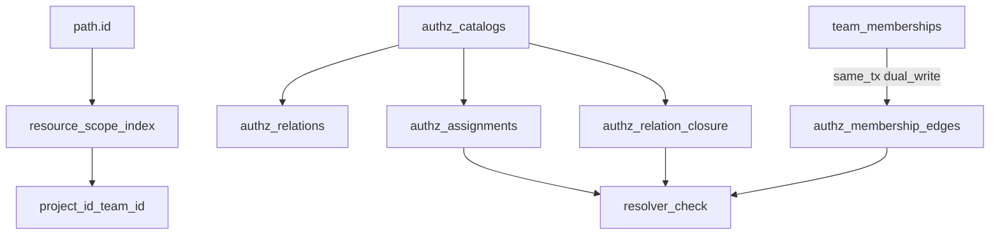

# Permission Storage (Wave 0 DDL Spike)

> **Status:** Draft / Wave 0
> **Context:** Relational schema shape for the portable FGA core in
> [ADR 032](../../adrs/032-permission-catalogs.md) and
> [ADR 033](../../adrs/033-internal-permission-management.md). Feeds issue
> [#422](https://github.com/zitadel/nextgen/issues/422) (migrations) under epic
> [#419](https://github.com/zitadel/nextgen/issues/419).
>
> For the permission-check layer (credential × scope × permission), see
> [`authz.md`](authz.md). For `resource_scope_index` as a URL/scope invariant,
> see [`url-architecture.md`](url-architecture.md).

Wave 0 freezes **tables, PKs, indexes, dual-write rules, and locked decisions**.
It does **not** ship Goose migrations, Go statements, or resolver wiring.

## Locked decisions

| ID | Decision |
|---|---|
| **D1** | System catalog `owner_id = 'system'` (not NULL). |
| **D2** | Delegation = columns on `authz_assignments` (not a sibling table). |
| **D3** | Dual-write membership: `team_memberships` remains roster/lifecycle; `authz_membership_edges` is the authz projection; the resolver does **not** read `team_memberships`. |
| **D4** | Bundle grants store the bundle relation; permissions are implied via `authz_relation_closure`. |
| **D5** | No `authz_expression_edges` until issue [#421](https://github.com/zitadel/nextgen/issues/421) IR exists; system catalog v1 seeds closure by hand. |
| **D6** | `resource_scope_index` PK = `(resource_id)` only. |
| **D7** | Assignment PK = `(project_id, id)`. |
| **D8** | Soft revoke via `revoked_at`; unique active-grant index ignores revoked rows. |
| **D9** | App-group / `app_grants` tables deferred (same physical catalog model later; [ADR 034](../../adrs/034-external-permission-management.md)). |
| **D10** | 403 vs 404 is **out of DDL scope** (resolver/API). Note tension: [ADR 033](../../adrs/033-internal-permission-management.md) uses 403 when in-scope but missing permission; [`url-architecture.md`](url-architecture.md) / [`authz.md`](authz.md) prefer 404 for anti-oracle. |
| **D11** | Dual-write membership **without** Leopard in Wave 1; Leopard remains an additive derived index later ([ADR 032 §3](../../adrs/032-permission-catalogs.md#3-canonical-relational-storage)). |
| **D12** | Hash-partitioning `resource_scope_index` (Postgres) **deferred until proven**; revisit only with vacuum/bloat/hot-spot measurements. |
| **D13** | Cross-project ([#333](https://github.com/zitadel/nextgen/issues/333)) depiction: same `authz_assignments` row on the **protected** `project_id`, with a **foreign** `user`/`team` principal (no `principal_type = project`); principal integrity by stable prefixed ids ([ADR 011](../../adrs/011-resource-identifiers.md)), not a composite FK to local `(project_id, user_id)`. |
| **D14** | Wave 1 live catalog tables are `authz_relations` + `authz_relation_closure` only. Bundles are **seed/fixture input** that compile into those tables — not separate live tables until [#421](https://github.com/zitadel/nextgen/issues/421) owns a compiler. |

## Entity picture



**Write vs check ([ADR 032 §3](../../adrs/032-permission-catalogs.md#3-canonical-relational-storage)):**

- Policy/schema change → new catalog version + recompute relation-implication closure.
- Ordinary grant → one `authz_assignments` row (no per-user fan-out).
- Team join/leave → same-tx dual-write of roster + `authz_membership_edges` only (not expanded permissions).

## Tables (DDL strawman)

Conventions match existing migrations: Postgres schema `zitadel_nextgen`,
`TEXT COLLATE "C"`, `TIMESTAMPTZ`; Spanner uses `STRING(MAX)` / `TIMESTAMP`,
no schema prefix, and often `ON DELETE NO ACTION` where Postgres uses
`RESTRICT` (see `team_memberships`).

### `resource_scope_index`

Global lookup for flat-by-ID ([`url-architecture.md`](url-architecture.md)).

```sql
CREATE TABLE zitadel_nextgen.resource_scope_index (
    resource_id   TEXT COLLATE "C" NOT NULL CHECK (resource_id <> ''),
    resource_kind TEXT COLLATE "C" NOT NULL CHECK (resource_kind <> ''),
    project_id    TEXT COLLATE "C" NOT NULL
        REFERENCES zitadel_nextgen.projects (id) ON DELETE CASCADE,
    team_id       TEXT COLLATE "C",  -- NULL = project-scoped
    created_at    TIMESTAMPTZ NOT NULL DEFAULT now(),
    updated_at    TIMESTAMPTZ NOT NULL DEFAULT now(),

    PRIMARY KEY (resource_id),
    FOREIGN KEY (project_id, team_id)
        REFERENCES zitadel_nextgen.teams (project_id, id)
        ON DELETE RESTRICT
);

CREATE INDEX idx_resource_scope_index_project
    ON zitadel_nextgen.resource_scope_index (project_id);

CREATE INDEX idx_resource_scope_index_kind_project
    ON zitadel_nextgen.resource_scope_index (resource_kind, project_id);
```

**Dual-write contract:** every globally addressable create/update/delete
(project, team, user, …) updates this table in the **same transaction** as
the resource. MVP kinds: `project`, `team`, `user`. For a project row:
`resource_id = id`, `project_id = id`, `team_id NULL`.

**D12:** do not hash-partition this table in Wave 1.

**Dialect note:** the composite FK to `teams (project_id, id)` uses Postgres
**MATCH SIMPLE**: when `team_id` is NULL, the FK is not enforced (project-scoped
rows are valid). Spanner migrations must preserve the same null-skip behavior.

**Delete note:** RSI uses `ON DELETE CASCADE` so flat-by-ID lookups cannot return
deleted resource ids. `team_memberships` stays `RESTRICT` / lifecycle-gated per
[ADR 024](../../adrs/024-user-team-lifecycle-ownership.md) — roster cleanup is
explicit, not an index cascade.

**Spanner:** same columns; PK `(resource_id)`. Composite PK / interleave for
locality is a separate dialect decision, deferred until measured.

### `authz_catalogs`

```sql
CREATE TABLE zitadel_nextgen.authz_catalogs (
    id           TEXT COLLATE "C" NOT NULL CHECK (id <> ''),
    catalog_kind TEXT COLLATE "C" NOT NULL
        CHECK (catalog_kind IN ('system', 'app_group')),
    owner_id     TEXT COLLATE "C" NOT NULL,  -- system: 'system' (D1)
    version      INT  NOT NULL CHECK (version >= 1),
    status       TEXT COLLATE "C" NOT NULL
        CHECK (status IN ('draft', 'active', 'retired')),
    source_hash  TEXT COLLATE "C",
    created_at   TIMESTAMPTZ NOT NULL DEFAULT now(),

    PRIMARY KEY (id),
    UNIQUE (catalog_kind, owner_id, version)
);

CREATE UNIQUE INDEX authz_catalogs_one_active
    ON zitadel_nextgen.authz_catalogs (catalog_kind, owner_id)
    WHERE status = 'active';
```

Compiled child rows are **immutable for a catalog version**. New schema ⇒ new
`authz_catalogs` row + new children (no in-place rewrite of active closure).

### `authz_relations` and `authz_relation_closure`

Live catalog tables for Wave 1 (**D14**). No separate `authz_bundles` /
`authz_bundle_members` tables — bundles exist only as seed/fixture input that
compile into relations + closure.

```sql
CREATE TABLE zitadel_nextgen.authz_relations (
    catalog_id  TEXT COLLATE "C" NOT NULL
        REFERENCES zitadel_nextgen.authz_catalogs (id) ON DELETE CASCADE,
    relation    TEXT COLLATE "C" NOT NULL CHECK (relation <> ''),
    object_type TEXT COLLATE "C" NOT NULL,
    kind        TEXT COLLATE "C" NOT NULL
        CHECK (kind IN ('permission', 'relation')),
    PRIMARY KEY (catalog_id, relation)
);

-- Holding from_relation implies to_relation (includes identity edges r ⇒ r).
CREATE TABLE zitadel_nextgen.authz_relation_closure (
    catalog_id    TEXT COLLATE "C" NOT NULL
        REFERENCES zitadel_nextgen.authz_catalogs (id) ON DELETE CASCADE,
    from_relation TEXT COLLATE "C" NOT NULL,
    to_relation   TEXT COLLATE "C" NOT NULL,
    PRIMARY KEY (catalog_id, from_relation, to_relation),
    FOREIGN KEY (catalog_id, from_relation)
        REFERENCES zitadel_nextgen.authz_relations (catalog_id, relation),
    FOREIGN KEY (catalog_id, to_relation)
        REFERENCES zitadel_nextgen.authz_relations (catalog_id, relation)
);

CREATE INDEX idx_authz_closure_to
    ON zitadel_nextgen.authz_relation_closure (catalog_id, to_relation);
```

**D5:** skip a full expression-edge AST table until the OpenFGA IR (#421) exists.
Wave 1 seeds closure from a checked-in fixture (bundle definitions compile into
closure rows; they are not independently editable tables).

### `authz_assignments`

Write-cheap grants. Always carry `project_id` (residency of the protected
resources). **No FK** requiring the principal to be a local user/team of
`project_id` (**D13**).

```sql
CREATE TABLE zitadel_nextgen.authz_assignments (
    id                TEXT COLLATE "C" NOT NULL CHECK (id <> ''),
    project_id        TEXT COLLATE "C" NOT NULL
        REFERENCES zitadel_nextgen.projects (id) ON DELETE CASCADE,
    catalog_id        TEXT COLLATE "C" NOT NULL
        REFERENCES zitadel_nextgen.authz_catalogs (id) ON DELETE RESTRICT,

    principal_type    TEXT COLLATE "C" NOT NULL
        CHECK (principal_type IN (
            'user', 'team', 'agent', 'sk_proj', 'sk_team'
        )),
    principal_id      TEXT COLLATE "C" NOT NULL,

    relation          TEXT COLLATE "C" NOT NULL,

    scope_kind        TEXT COLLATE "C" NOT NULL
        CHECK (scope_kind IN ('project', 'team', 'resource')),
    scope_team_id     TEXT COLLATE "C",
    scope_resource_id TEXT COLLATE "C",

    -- grantor_* = provenance for any grant; delegation_id set ⇒ agent delegation (D2)
    grantor_type      TEXT COLLATE "C",
    grantor_id        TEXT COLLATE "C",
    delegation_id     TEXT COLLATE "C",
    expires_at        TIMESTAMPTZ,
    revoked_at        TIMESTAMPTZ,

    created_at        TIMESTAMPTZ NOT NULL DEFAULT now(),
    updated_at        TIMESTAMPTZ NOT NULL DEFAULT now(),

    PRIMARY KEY (project_id, id),

    FOREIGN KEY (catalog_id, relation)
        REFERENCES zitadel_nextgen.authz_relations (catalog_id, relation),
    FOREIGN KEY (project_id, scope_team_id)
        REFERENCES zitadel_nextgen.teams (project_id, id)
        ON DELETE CASCADE,

    CHECK (
        (scope_kind = 'project'
            AND scope_team_id IS NULL AND scope_resource_id IS NULL)
        OR (scope_kind = 'team'
            AND scope_team_id IS NOT NULL AND scope_resource_id IS NULL)
        OR (scope_kind = 'resource'
            AND scope_team_id IS NULL AND scope_resource_id IS NOT NULL)
    ),
    CHECK (
        (grantor_id IS NULL) = (grantor_type IS NULL)
    ),
    CHECK (
        (delegation_id IS NULL AND grantor_id IS NULL)
        OR (delegation_id IS NOT NULL AND grantor_id IS NOT NULL)
    )
);

CREATE INDEX idx_authz_assignments_principal_project
    ON zitadel_nextgen.authz_assignments
        (project_id, principal_type, principal_id)
    WHERE revoked_at IS NULL;

CREATE INDEX idx_authz_assignments_delegation
    ON zitadel_nextgen.authz_assignments (project_id, delegation_id)
    WHERE delegation_id IS NOT NULL;

CREATE UNIQUE INDEX authz_assignments_unique_active
    ON zitadel_nextgen.authz_assignments (
        project_id, catalog_id, principal_type, principal_id,
        relation, scope_kind, scope_team_id, scope_resource_id
    )
    WHERE revoked_at IS NULL AND delegation_id IS NULL;
```

**D4:** grant `viewer` (bundle name) as `relation = 'viewer'`; that relation must
exist in `authz_relations`, and closure must include `viewer → user.read` etc.
(produced by seed). Checks for `user.read` use closure.

**Resource scope:** `scope_kind = 'resource'` stores only `scope_resource_id`.
Any team boundary for that resource comes from `resource_scope_index` at check
time, not from the assignment row. There is **no FK** from `scope_resource_id`
to `resource_scope_index`; writers dual-write RSI and the assignment in the same
transaction when granting at resource scope (same integrity story as foreign
principals under **D13**).

### `authz_membership_edges`

AuthZ projection of set membership (**D3**, **D11**). Not lifecycle; not
permission expansion. MVP shape is `user ∈ team` only; nested team sets need a
later migration.

```sql
CREATE TABLE zitadel_nextgen.authz_membership_edges (
    project_id  TEXT COLLATE "C" NOT NULL
        REFERENCES zitadel_nextgen.projects (id) ON DELETE CASCADE,
    member_type TEXT COLLATE "C" NOT NULL,
    member_id   TEXT COLLATE "C" NOT NULL,
    set_type    TEXT COLLATE "C" NOT NULL,
    set_id      TEXT COLLATE "C" NOT NULL,
    created_at  TIMESTAMPTZ NOT NULL DEFAULT now(),

    PRIMARY KEY (project_id, set_type, set_id, member_type, member_id),
    CHECK (member_type = 'user' AND set_type = 'team'),
    FOREIGN KEY (project_id, set_id)
        REFERENCES zitadel_nextgen.teams (project_id, id)
        ON DELETE CASCADE
);

CREATE INDEX idx_authz_membership_edges_member
    ON zitadel_nextgen.authz_membership_edges
        (project_id, member_type, member_id);
```

**Dual-write contract:** membership statements update `team_memberships` and,
in the same `withTransaction`, upsert/delete the corresponding edge when roster
status is authz-active (e.g. `active`). Transitions to `inactive` / `removed`
delete the edge. Authz never interprets lifecycle `status` itself.

Agency / cross-project team grants: membership edges live in the **principal
home** project (e.g. platform), not copied into the protected customer project.

## Check and list SQL (illustrative)

### Single-resource check

Principal `user_alice`, required permission `user.read`, protected project
`proj_acme`. The resolver always supplies `$principal_home_project_id` for
membership-edge lookup: for a local team grant on Acme that value is
`proj_acme`; for a platform agency team it is the platform project id.

```sql
SELECT 1
FROM zitadel_nextgen.authz_assignments a
JOIN zitadel_nextgen.authz_relation_closure c
  ON  c.catalog_id    = a.catalog_id
  AND c.from_relation = a.relation
  AND c.to_relation   = 'user.read'
WHERE a.project_id = 'proj_acme'
  AND a.catalog_id = $active_system_catalog_id
  AND a.revoked_at IS NULL
  AND (a.expires_at IS NULL OR a.expires_at > now())
  AND a.scope_kind = 'project'
  AND (
        (a.principal_type = 'user' AND a.principal_id = 'user_alice')
     OR (a.principal_type = 'team' AND EXISTS (
           SELECT 1
           FROM zitadel_nextgen.authz_membership_edges e
           WHERE e.project_id  = $principal_home_project_id
             AND e.set_type    = 'team'
             AND e.set_id      = a.principal_id
             AND e.member_type = 'user'
             AND e.member_id   = 'user_alice'
         ))
      )
LIMIT 1;
```

### List predicate sketch

`GET /users?project_id=proj_acme`, required `user.read`:

1. Derive authorized scopes for the caller (project and/or team).
2. If any project-scoped grant closes to `user.read` →
   `WHERE project_id = $p` (full project list).
3. If only team-scoped grants → constrain users via membership edges for those
   teams (still one SQL round-trip; no per-row permission checks in app code).

## End-to-end narrative

Actors: project `proj_acme`, team `team_eng`, users `user_alice` /
`user_bob` / `user_carol`, active catalog `cat_sys_1`, relation `viewer` with
closure `viewer ⇒ user.read`.

```text
t0  Seed cat_sys_1 (viewer ⇒ user.read, …)
t1  INSERT authz_assignments:
      team_eng → viewer @ scope_kind=project, project_id=proj_acme
t2  Alice joins eng (same tx):
      team_memberships (active) + authz_membership_edges
      (user_alice member team_eng)
t3  GET /users/user_bob
      resource_scope_index → proj_acme
      assignment ⋉ closure ⋉ edge → allow
      DAL: SELECT … FROM users WHERE project_id = proj_acme AND id = user_bob
t4  GET /users?project_id=proj_acme
      same gate → project-scoped user.read → list all users in proj_acme
t5  Remove Alice from eng:
      membership status=removed + DELETE edge
      assignment unchanged → next check/list denies
```

## Cross-project grants depiction (#333)

Wave 0 **documents** how [#333](https://github.com/zitadel/nextgen/issues/333)
fits this schema (**D13**). It does **not** implement staff/agency product,
credential binding, or break-glass.

Grant resides on the protected project; principal may be a foreign `user` or
`team` (typically platform). Do **not** use `principal_type = project`.

```text
-- Alice (platform user) gets support on customer project Acme
authz_assignments (
  id=asgn_support_01, project_id=proj_acme, catalog_id=cat_sys_1,
  principal_type=user, principal_id=user_alice,
  relation=support, scope_kind=project,
  grantor_type=user, grantor_id=user_ops_lead, ...
)
```

An agency **team** grant is the same shape with `principal_type=team` /
`principal_id=team_agency`; members resolve via `authz_membership_edges` in the
platform (home) project. Credential binding that lets Alice *act* on Acme, and
relation/tier names, remain [#333](https://github.com/zitadel/nextgen/issues/333).

## Seed sketch (fixture-level)

Permission **names** live in
[`system-permission-catalog.md`](system-permission-catalog.md). Wave 0 only
locks table shape (**D14**): a checked-in fixture compiles into
`authz_relations` + `authz_relation_closure` (no live bundle tables).

```text
authz_catalogs:
  id=cat_sys_1, kind=system, owner_id=system, version=1, status=active

authz_relations (examples — align with system-permission-catalog):
  viewer, admin          (kind=relation; grantable bundle names)
  user.read, …           (kind=permission)

authz_relation_closure (compiled from fixture):
  user.read ⇒ user.read
  viewer ⇒ viewer
  viewer ⇒ user.read
  …
```

## Non-goals (Wave 0 / Wave 1)

- Leopard flatten / reachability index tables (additive later; **D11**)
- Full OpenFGA expression AST storage (**D5** / #421)
- Live `authz_bundles` tables (**D14** — seed input only until #421)
- App-group catalog upload tables and `app_grants` (**D9** / ADR 034)
- Implementing #333 identity binding, staff tiers, or break-glass
- Hash-partitioning `resource_scope_index` (**D12**)
- Resolving 403 vs 404 (**D10**)

## See also

- [ADR 032 — Permission Catalogs](../../adrs/032-permission-catalogs.md)
- [ADR 033 — Internal Permission Management](../../adrs/033-internal-permission-management.md)
- [ADR 034 — External Permission Management](../../adrs/034-external-permission-management.md)
- [ADR 024 — User/Team Lifecycle Ownership](../../adrs/024-user-team-lifecycle-ownership.md)
- [`authz.md`](authz.md) · [`url-architecture.md`](url-architecture.md) · [`system-permission-catalog.md`](system-permission-catalog.md) · [`../glossary.md`](../glossary.md)
- Epic [#419](https://github.com/zitadel/nextgen/issues/419) · schema [#422](https://github.com/zitadel/nextgen/issues/422) · cross-project [#333](https://github.com/zitadel/nextgen/issues/333)
