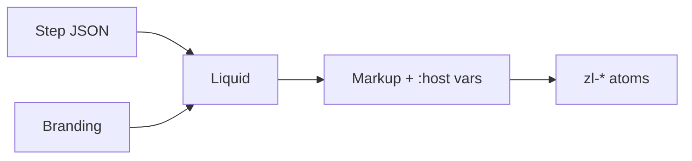

# Branding and Templates

Notes for how the login UI is themed and laid out relative to the step payload.

**Product strategy (where a customization lives):** [`customization-strategy.md`](customization-strategy.md) and [ADR 056](../../adrs/056-login-customization-categories.md). Read that first when the question is *page wrapper vs widget knob vs Liquid vs flow*.

**Contract (source of truth):** [`../flowengine/flow-engine-nodes.md`](../flowengine/flow-engine-nodes.md), the shipped Branding spec under [`api/openapi/endpoints/branding/`](../../../api/openapi/endpoints/branding/), [`../flowengine/template-security.md`](../flowengine/template-security.md).

**This folder:** optional extensions and working notes (extra branding fields, `--zl-*` tokens, Liquid layout checks). Details live in the files linked below.

## Responsibility split

1. **Step JSON** (`fields`, `actions`, `gates`, `messages`, `errors`, `identity`): capability data, stable keys, labels via `text_key`. No UI chrome in this layer.

2. **`branding.liquid_template`:** which `<zl-*>` elements appear and in what order. Pure structure — no `<style>` blocks or `:host` rules.

3. **Orchestrator:** reads the `Branding` object and generates `--zl-*` CSS tokens via `adoptedStyleSheets`. Templates never touch theming ([`tokens.md`](tokens.md)).

4. **`Branding` object:** layout preset, URLs, optional theme fields ([`schema.md`](schema.md)). Input to the orchestrator's token generation.

5. **`<zl-*>` atoms:** UI implementation; read CSS variables; overrides in [`override-ladder.md`](override-ladder.md).

## Invariants

Liquid output uses `<zl-*>` tags, not raw form controls. User-facing strings use `text_key` and `| t`. Templates must not emit `<style>` blocks — theming is orchestrator-owned. Liquid safety: [`../flowengine/template-security.md`](../flowengine/template-security.md). Required fields/gates: [`validator.md`](validator.md) plus ``.

## Rollout sketch

Built-ins and tokens shipped first; hand-written Liquid is live via the CLI eject workflow ([`templates.md`](templates.md), [ADR 040](../../adrs/040-tenant-login-templates-editable-config.md)); a block editor that emits Liquid layers on the same validator later.

## Open points

Dark mode; i18n source; powered-by line. Settled elsewhere: template attachment + grouping ([ADR 040](../../adrs/040-tenant-login-templates-editable-config.md)), extra designs via the catalog ([`templates.md`](templates.md)), untrusted CSS rejected ([`schema.md`](schema.md)).

## Files

[`customization-strategy.md`](customization-strategy.md), [`schema.md`](schema.md), [`tokens.md`](tokens.md), [`templates.md`](templates.md), [`component-capability-map.md`](component-capability-map.md), [`override-ladder.md`](override-ladder.md), [`validator.md`](validator.md), [`form-participation.md`](form-participation.md), [`branding.example.json`](branding.example.json)

## Related

[ADR-048](https://github.com/zitadel/oxidel/blob/main/docs/adr/048-capability-driven-login-payloads.md), [ADR-033](https://github.com/zitadel/oxidel/blob/main/docs/adr/033-customizable-login-layouts.md), [`../flowengine/README.md`](../flowengine/README.md), [poc/login-fast](https://github.com/zitadel/oxidel/tree/poc/login-fast).
