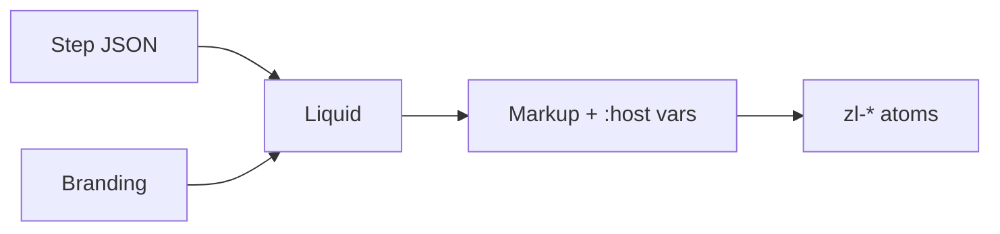

# Branding and Templates

Notes for how the login UI is themed and laid out relative to the step payload.

**Contract (source of truth):** [`../flowengine/flow-engine-nodes.md`](../flowengine/flow-engine-nodes.md), [`../flowengine/api/flow-api.yaml`](../flowengine/api/flow-api.yaml) (`Branding`), [`../flowengine/template-security.md`](../flowengine/template-security.md).

**This folder:** optional extensions and working notes (extra branding fields, `--zl-*` tokens, Liquid layout checks). Details live in the files linked below.

## Responsibility split

1. **Step JSON** (`fields`, `actions`, `gates`, messages, errors): capability data, stable keys, labels via `text_key`. No UI chrome in this layer.

2. **`branding.liquid_template`:** which `<zl-*>` elements appear and in what order. Can set `:host { --zl-* }` ([`tokens.md`](tokens.md)).

3. **`Branding` object:** layout preset, URLs, optional theme fields ([`schema.md`](schema.md)).

4. **`<zl-*>` atoms:** UI implementation; read CSS variables; overrides in [`override-ladder.md`](override-ladder.md).

## Invariants

Liquid output uses `<zl-*>` tags, not raw form controls. User-facing strings use `text_key` and `| t`. Liquid safety: [`../flowengine/template-security.md`](../flowengine/template-security.md). Required fields/gates: [`validator.md`](validator.md) plus ``.

## Rollout sketch

Built-ins and tokens first, then a block editor that emits Liquid, then a free-text editor with tighter static checks.

## Open points

How much theme state belongs in `Branding` vs only in Liquid; extra layout presets; how templates attach to flows; dark mode; optional untrusted CSS; i18n source; powered-by line.

## Files

[`schema.md`](schema.md), [`tokens.md`](tokens.md), [`templates.md`](templates.md), [`override-ladder.md`](override-ladder.md), [`validator.md`](validator.md), [`branding.example.json`](branding.example.json)

## Related

[ADR-048](https://github.com/zitadel/oxidel/blob/main/docs/adr/048-capability-driven-login-payloads.md), [ADR-033](https://github.com/zitadel/oxidel/blob/main/docs/adr/033-customizable-login-layouts.md), [`../flowengine/README.md`](../flowengine/README.md), [poc/login-fast](https://github.com/zitadel/oxidel/tree/poc/login-fast).
