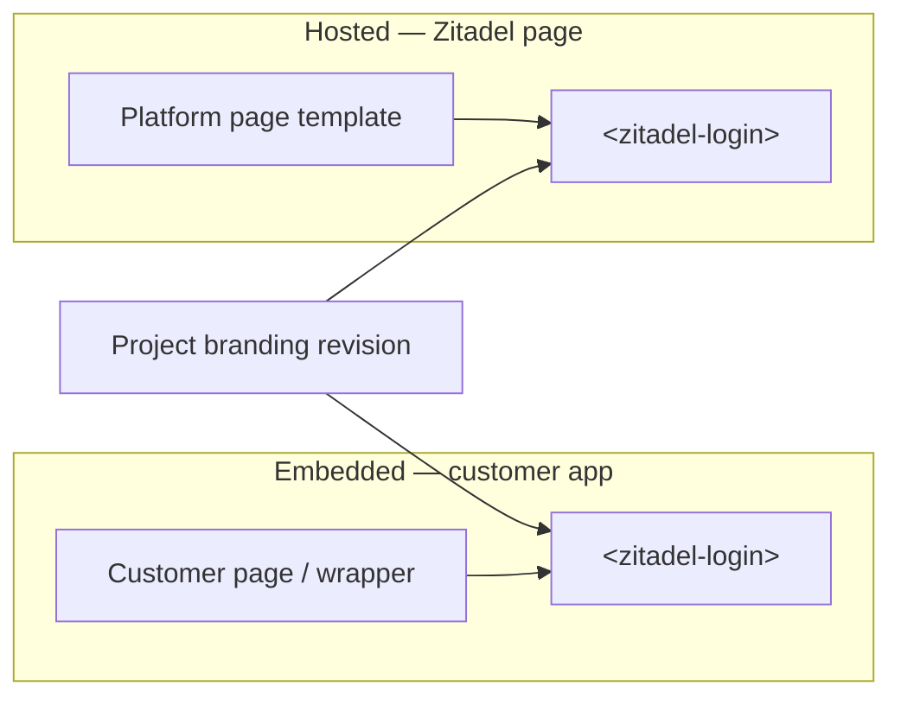
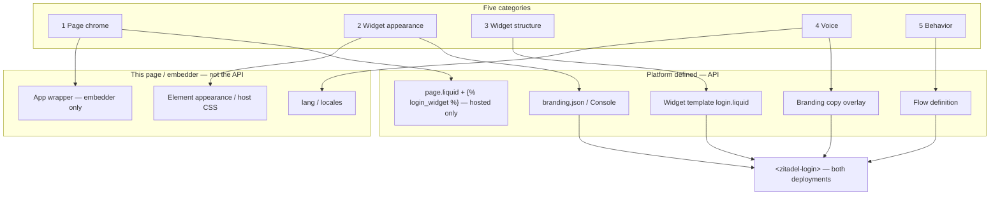
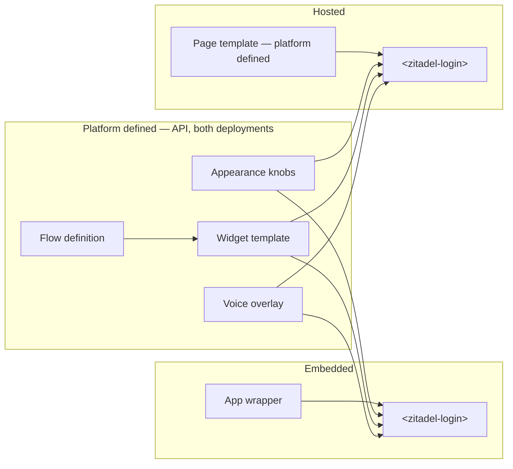
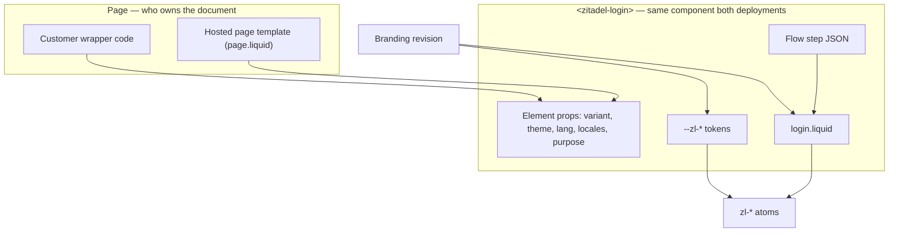
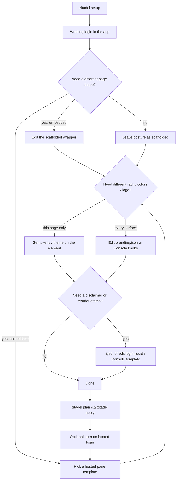

# Login Customization Strategy

> **Status:** Proposed
> **Date:** 2026-08-27
> **Audience:** Product, design, and engineering deciding *where* a login
> customization lives — not the token catalogue or Liquid grammar.
> **Decisions:** [ADR 056](../../adrs/056-login-customization-categories.md)
> **Implements:** [`templates.md`](templates.md), [`schema.md`](schema.md),
> [`tokens.md`](tokens.md), [`override-ladder.md`](override-ladder.md),
> [ADR 040](../../adrs/040-tenant-login-templates-editable-config.md),
> [ADR 044](../../adrs/044-scaffold-embedding-posture-defaults.md),
> [ADR 045](../../adrs/045-copy-overlays-as-branding-revisions.md)

Nextgen ships one login surface — `<zitadel-login>` plus the `<zl-*>` atoms —
and two ways to put it in front of a user. The product goal is **total
customizability** without dumping every kind of change into one editor, one
JSON blob, or one Liquid file. This document names the customization
categories, the surface each one is authored on, and the journey a customer
takes from first embed to hosted SSO.

## Thesis

Customizability is a placement problem, not a missing-knob problem.

A customer who wants a 1:1 split page with marketing copy on the left is
editing **their application**. A customer who wants rounder buttons is
turning a **convenience knob** on the widget. A customer who wants a legal
disclaimer between the password field and the submit button is editing the
**widget template**. Those three changes look similar in a screenshot and
are different products: different authors, different publish paths, different
failure modes.

The strategy is: **give every change exactly one home, then make the two
deployments (embedded and hosted) read the same project-scoped home whenever
the look must travel with the project.**

## Two orthogonal deployments

"Self-hosted" is overloaded in this repo. Keep these axes separate.

| Axis | Values | What it decides |
| --- | --- | --- |
| **Login placement** | **Embedded** in the customer application · **Hosted** by Zitadel | Who owns the HTML page around `<zitadel-login>` |
| **Zitadel runtime** | Cloud · customer-operated server | Where the API and (optionally) `/ui/login/` run |

This document is about **login placement**. A customer-operated Zitadel
server can still embed the widget in the app, and a cloud project can still
use hosted login later. The runtime axis does not move a knob from one
category to another.

### Embedded login (ships now)

The customer application renders `<zitadel-login>` on a route, in a modal, or
in a card. The CLI (`zitadel setup`) bootstraps the app, installs the SDK,
and drops the widget onto a generated auth page. The customer owns the
document, the layout around the widget, and the deploy of that page.

This is the default path and the only path that can offer *absolute*
page-level freedom: arbitrary React/Vue/HTML around the widget, the host
design system, and framework routing.

### Hosted login (later, SSO)

Zitadel serves the login page — today the bootstrap shell at `/ui/login/`,
later a first-class hosted login on a customer-chosen domain for OIDC/SAML
SSO. The same `<zitadel-login>` runs inside a **Zitadel-owned page**. There
is no customer application to wrap, so page chrome that embedders write in
code must be expressible as **platform settings**.

Hosted login is how a customer offers SSO to apps they do not embed the
widget in. It is not a second renderer and not a second branding model.



## Categories

Five categories. The first three are the ones a screenshot usually
conflates. The last two are adjacent and must stay out of the appearance
editors.

| # | Category | What the customer is changing | One-line home |
| --- | --- | --- | --- |
| 1 | **Page chrome** | How the login sits on the *page*: split, centered, left-pane content | Embedder: app wrapper. Hosted: **page template** |
| 2 | **Widget appearance** | Convenience look *inside* the widget: radii, colors, density, theme, logo | Tokens / branding knobs / element `appearance` |
| 3 | **Widget structure** | What sits *between the atoms*: disclaimer, grouping | **Widget template** (`login.liquid`) — both deployments |
| 4 | **Voice** | Wording, locale overlays | Branding copy + `locales` / `lang` |
| 5 | **Behavior** | Which steps, fields, factors exist | Flow definition — not an appearance surface |

**Why the paired names.** Call them **widget template** and **page
template** — parallel nouns, different scope. The widget template is
strict (atoms, step payload, no page chrome) and applies to **both**
deployments because the same widget runs in the app and on hosted login.
The page template exists only because hosted login has no application to
wrap: it is the document around ``. One unqualified
"template" would either loosen the shared file or leave hosted login
with nowhere to put a left pane. Embedder wrappers are application code,
not page templates.

Page-local knobs (host CSS, `lang` / `locales`, the embedder wrapper) never
enter the API. Everything else is **platform defined**: the same resources
the Branding API, Flow API, and (later) hosted page-template API expose,
whether the customer authors them as `.zitadel/` files, Console settings,
or HTTP.





## What would change

Nothing in this table is implemented by this PR. It is the delta from
**what ships today** to the destination above.

| Surface | Today | Destination |
| --- | --- | --- |
| `zitadel setup --design split` | Writes `.zitadel/branding/login.liquid` (split chrome + copied form) and publishes branding revision 1. Generated auth page is still a bare `<zitadel-login>`. | Writes an **app wrapper** (grid + left pane + `variant="widget"`). Writes **no** Liquid, publishes **no** branding revision. |
| `zitadel branding eject --design` | Catalog of five Liquid files that mix page chrome with the form card. | Ejects the **widget template** only — bundled default card. No split/hero in this catalog. |
| One Liquid file | `login.liquid` is the only template noun; split/hero live inside it. | Two nouns: **widget template** (`login.liquid`, both deployments) and **page template** (`page.liquid` + ``, hosted-only). |
| Widget look | Host CSS + proposed branding JSON; no first-class `appearance` object. | Same shape three ways: `el.appearance`, host CSS `--zl-*`, Console / `branding.json`. `chrome: card \| plain` replaces `minimal` as a design. |
| Hosted `/ui/login/` | `variant="page"` shell; any split comes from a widget-internal design. | Hosted **page template**. Widget stays the default card (or an ejected widget template). |
| Embedder who wants a left pane | Ejects Liquid and edits marketing copy inside the sanitiser. | Edits the scaffolded wrapper as app code. |
| Shared widget structure (disclaimer) | Same eject path, but the starting files are page layouts. | Same eject path, starting from the default card. Applies to **both** deployments. |
| Already-ejected split/hero revisions | Render today. | Keep rendering. Legacy path, not the setup path. |

### 1. Page chrome

Page chrome is everything **outside** `<zitadel-login>`.

The running example: a 1:1 split layout, login on the right, customer content
on the left (product screenshot, value prop, legal, a campaign). That left
pane is not a Zitadel atom and must not be authored as Liquid inside the
widget. It is a wrapping element the customer owns:

```tsx
<section className="grid min-h-svh grid-cols-2">
  <aside>{/* their content — copy, image, nav */}</aside>
  <zitadel-login variant="widget" purpose="login" />
</section>
```

`variant="widget"` is the contract that makes this honest: the widget is
content-sized and does not paint page chrome of its own
([ADR 044](../../adrs/044-scaffold-embedding-posture-defaults.md)).
`variant="page"` is the other posture — a dedicated login route that *is*
the page, used by fresh scaffolds and by today's hosted shell.

**Embedded.** Authored in the customer's application. The CLI may scaffold a
*wrapper* (centered full page, split-left, split-right, modal host) as
ordinary framework files the customer then edits. Those files are
presentation-owned ([ADR 042](../../adrs/042-scaffolded-file-ownership-and-drift-detection.md)).
They are not page templates.

**Hosted.** There is no application file, so this is the only place a
**page template** exists: a Liquid document with a required
`` hole. The rest of the file is the customer's page —
split grid, left-pane copy, nav — under the same sanitiser family as
widget Liquid (no `<script>`, no `on*`). The hosted shell renders that
file and injects `<zitadel-login variant="widget">` at the tag. Catalog
starting points (`centered`, `split`, `split-right`, `hero`) are page
templates, not `login.liquid`.

```liquid
<main class="page">
  <aside>
    
    <h1>Ship faster with a real session.</h1>
  </aside>
  <section>
    
  </section>
</main>
```

`` is opaque. A page template must not emit `<zl-field>`;
a (widget) template must not emit a marketing column.

Embedders never author `page.liquid`. Offering it to them would fight the
app the CLI just generated. Until hosted login ships, `/ui/login/` stays a
`variant="page"` shell — do not grow new widget-internal splits as a
stand-in.

### 2. Widget appearance

Convenience knobs that restyle the atoms without reordering them: button
and input radius, palette, density, light/dark, logo, typography scale.

These are `--zl-*` tokens plus a small structured branding shape
([`schema.md`](schema.md) `palette` / `shape` / `typography` / `theme`,
[`tokens.md`](tokens.md)). Customers should never have to write Liquid to
round a corner.

Two authoring surfaces, same tokens:

| Author | Surface | When to use it |
| --- | --- | --- |
| Embedder, this page only | JS/CSS on `<zitadel-login>` — `theme`, `variant`, host CSS `--zl-radius-md`, `::part()` | Match the host app *right now*, no publish |
| Project (every surface) | Branding revision — `.zitadel/branding/branding.json` via CLI, or Console settings | Hosted login, a second app, or a designer who should not touch the repo |

Host-page tokens beat server-side branding
([`override-ladder.md`](override-ladder.md)). That is intentional: an
embedded login should be able to inherit the app's design system without a
round-trip. Leave the host tokens unset and the project branding applies
unchanged — which is what hosted login does, because the hosted shell is
not a design system of its own.

The same object, three doors — all compile to `--zl-*`:

```html
<zitadel-login
  variant="widget"
  theme="light"
  appearance='{
    "logo_url": "https://cdn.acme.com/logo.svg",
    "palette": { "primary": "#4F46E5", "on_primary": "#FFFFFF" },
    "shape": { "radius": "lg", "density": "comfortable" },
    "typography": { "font_family": "Inter, ui-sans-serif, sans-serif" },
    "chrome": "card"
  }'
></zitadel-login>
```

```css
zitadel-login {
  --zl-radius-md: 0.75rem;
  --zl-radius-xl: 1.25rem;
  --zl-color-primary: #4F46E5;
  --zl-font-family: Inter, ui-sans-serif, sans-serif;
}
```

```json
{
  "logo_url": "https://cdn.acme.com/logo.svg",
  "palette": { "primary": "#4F46E5", "on_primary": "#FFFFFF" },
  "shape": { "radius": "lg", "density": "regular" },
  "typography": { "font_family": "Inter, ui-sans-serif, sans-serif" },
  "theme": { "mode": "dark" }
}
```

| Knob | Values | Effect |
| --- | --- | --- |
| `palette.primary` / `on_primary` | CSS color | CTA, focus ring |
| `palette.background` / `surface` / `text` / `border` | CSS color | page vs card |
| `shape.radius` | `none` \| `sm` \| `md` \| `lg` \| `full` | `--zl-radius-*` scale |
| `shape.density` | `compact` \| `regular` \| `comfortable` | control height + gaps |
| `typography.font_family` | CSS stack | type (optional heading/mono) |
| `theme.mode` | `light` \| `dark` \| `auto` | `data-theme` |
| `logo_url` | HTTPS URL | mark in the widget header |
| `chrome` | `card` \| `plain` | card on/off (`minimal` without a template) |

A typed `appearance` property on the element is sugar over this shape, not
a third vocabulary. `theme`, `variant`, `lang`, `locales`, `purpose` stay
page-local element facts. Host CSS still beats the project object.

### 3. Widget structure

Everything that lives **between the atoms** and is still *inside* the
widget: field order and grouping, a disclaimer under the password field, a
"or continue with" divider, footer legal links, a compact header.

That is the **widget template** — `branding.liquid_template`, authored as
`.zitadel/branding/login.liquid`. Scope is stricter than a page template
and **the same on both deployments**: compose `<zl-*>` against the step
payload; do not set colors; do not wrap the page
([`templates.md`](templates.md)). Because the widget is shared, loosening
this file for a hosted left pane would also loosen every embed.

A disclaimer belongs here because it is step-aware (show it on `password`,
not on `mfa_totp`), must survive hosted login, and is not host-page
content. A marketing essay on the left of a split does **not**.

**Both deployments.** Opt-in. `zitadel branding eject` copies the bundled
default card into `login.liquid`; `plan` / `apply` publishes a revision
([ADR 040](../../adrs/040-tenant-login-templates-editable-config.md)).
Setup does not write this file because the customer picked a split.
Hosted Console later grows a block editor that emits the same validator.
There is no hosted picker that reintroduces split/hero as a (widget)
template.

### 4. Voice

User-facing strings. Built-in dictionaries plus overlays.

- **Project voice** — copy overlays on the branding revision
  ([ADR 045](../../adrs/045-copy-overlays-as-branding-revisions.md)). CLI
  and Console write the same resource; the flow response delivers the
  effective overlay.
- **This page only** — `lang` and `locales` on `<zitadel-login>`
  ([ADR 018](../../adrs/018-widget-owned-locale-resolution.md)). Highest
  precedence; for embedders who need a one-off override.

Templates keep using `text_key` and `| t`. Hard-coded copy in Liquid is a
smell except for chrome the dictionary has no key for yet.

### 5. Behavior

Which identifier the user types, whether passkey is offered, what happens
after register — that is the **flow definition**
(`.zitadel/flows/`, Console flow editor). Appearance surfaces must not grow
"hide the SSO row" or "add a phone field" switches. Those are flow edits.
The template renders whatever the step payload contains; it does not decide
the payload.

## Where each category lives

The same change, two deployments.

| Category | Embedded (customer application) | Hosted login (platform) | Shared source of truth |
| --- | --- | --- | --- |
| **Page chrome** | App wrapper (CLI scaffold). Not a page template. | **Page template** (`page.liquid` + ``). Hosted-only. | *None shared.* Different documents. |
| **Widget appearance** | `appearance` / host CSS / `theme`. Optional `branding.json` via `apply`. | Same object in Console / `branding.json`. | Branding revision when the look must follow the project. |
| **Widget structure** | Opt-in **widget template** (`login.liquid`) from the bundled default. | Same `login.liquid` / later block editor. | `branding.liquid_template` — both deployments, strict scope. |
| **Voice** | `lang` / `locales` on the element; branding copy overlays via CLI. | Console copy editor. | Branding copy overlay; element `locales` remains the embedder override. |
| **Behavior** | `.zitadel/flows/*.json` via plan/apply. | Console flow editor. | Flow definition (release-pinned per [ADR 035](../../adrs/035-configuration-environments.md)). |


### Self-hosters of the widget, in practice

"JS configuration of `zitadel-login`" means the **element API** plus the
host stylesheet, not a second configuration file format:

- **Properties / attributes** — `variant`, `theme`, `purpose`, `lang`,
  `locales`, `post-sign-in-url`, project handle. Page-local.
- **CSS custom properties** on `zitadel-login` — the appearance knobs for
  this page.
- **`::part()`** — surgical restyle of an atom interior
  ([`override-ladder.md`](override-ladder.md) tier 2).
- **Project branding** — still the path that hosted login and other apps
  will see. Embedders who only set host CSS have customized *this page*;
  they have not customized the project.

### Operators of hosted login, in practice

"Settings within the platform" means Console (and the Branding API) for
every category that is project-scoped, plus a **page template** editor
that only the hosted shell reads (`page.liquid`). Embedders never see
that editor. Hosted operators never eject a Next.js file to get a split.

## The journey

One golden path. Appearance and structure fork only when the customer needs
them; page chrome forks immediately because the two deployments own
different documents.



### 1. Bootstrap

`zitadel setup` detects the framework, creates the project, installs the
SDK, and embeds `<zitadel-login>`.

- Fresh app → `variant="page"` unless the customer picked a split-family
  **page** template, in which case the generated route is a wrapper around
  `variant="widget"`.
- Existing app, route-based frameworks → `variant="widget"` in a
  layout-neutral wrapper
  ([ADR 044](../../adrs/044-scaffold-embedding-posture-defaults.md)).
- Optional look pick (wizard) writes **application wrapper files**. It
  does **not** write `login.liquid`, `page.liquid`, or a branding
  revision. Today's `--design` that ejects widget Liquid is the behavior
  this strategy retires; see
  [What the shipped designs really are](#what-the-shipped-designs-really-are).

The setup summary points at the generated auth file for page chrome and at
`.zitadel/` for schema, flow, and (only after a later eject) structure.

### 2. Verify

Sign in once. `zitadel status` withholds customize/publish guidance until
login works. Customizing a template you have never seen succeed hides
whether the failure is chrome or the flow.

### 3. Customize, cheapest first

1. **Page** — edit the app wrapper, or (hosted only) the page template.
   Do not eject the widget template for this.
2. **Appearance** — host tokens for "match my app"; branding knobs for
   "match my brand everywhere."
3. **Structure** — eject the widget template when something must sit
   *between* atoms or the shipped grouping is wrong.
4. **Voice** — overlay copy; keep `text_key` in the widget template.
5. **Behavior** — edit the flow definition when the *step* is wrong.

### 4. Publish

`zitadel plan` then `zitadel apply` uploads the project-scoped artifacts
(branding revision, flow, schema). The embedder wrapper is an app deploy,
not an `apply`. A hosted page template is a platform write (`page.liquid`)
until a GitOps home is added (open question below).

Under [ADR 035](../../adrs/035-configuration-environments.md), branding and
flows become release-pinned. The inner loop stays ceremony-free on
dev-class environments (local preview of Liquid; release-per-save). This
strategy does not change that boundary.

### 5. Grow into hosted login

Turning on hosted login for SSO must **not** ask the customer to restyle
the widget. Categories 2–5 already live on project resources. The only
new choice is category 1: pick or edit a hosted page template (or accept
centered chrome). Appearance, template, copy, and flow already apply.

Embedders who already built a rich wrapper keep it for the in-app login.
Hosted SSO gets the constrained page template. Both render the same
widget against the same branding revision.

### 6. Escape hatches (embedded only)

When knobs, parts, and Liquid are not enough:

- Compose `<zl-*>` atoms by hand (lose the orchestrator, keep the design
  system).
- Eject an atom (`npx zitadel add zl-field`) and own the source
  ([`override-ladder.md`](override-ladder.md) tier 4).

Hosted login does not offer eject: there is no customer repo to land
source in. Customers who need that level move the SSO-facing login back
to an embedded page or wait for a richer template/part.

## What the shipped designs really are

ADR 040 shipped five named Liquid files under
`packages/config/defaults/branding/*/login.liquid`. `setup --design` and
`branding eject --design` copy one of them into `.zitadel/branding/` and
publish it as branding revision 1. The generated auth page is still just
`<zitadel-login>` — the "design" never becomes a wrapper. An audit of
those files:

| Design | What differs from the bundled `default.liquid` | Category it actually is |
| --- | --- | --- |
| `centered` | Nothing. Drift-tested copy of the bundled default. | The widget itself. Ejecting it only materializes a file the customer did not need yet. |
| `minimal` | Same field/action/passkey/gates loop; drops `<zl-card>` and the logo slot; wraps in `.zl-minimal`. | A thin widget-chrome variant (card off). Could be a host class or a future `chrome` knob; it is not a page layout. |
| `split` | Same card, wrapped in `.zl-split` with a brand `<aside>` (`logo_url` / `hero_url` / gradient placeholder), a compact mark for narrow containers, and an attribution anchor. | **Page chrome.** A 1:1 split whose left pane is an asset, not product UI. |
| `split-right` | `split` plus `zl-split--right`. | The same page chrome, mirrored. |
| `hero` | Same card, plus a landing-page left pane (nav, headline, bullets, footnote) whose own comment says "YOUR LANDING CONTENT — everything inside this aside is yours." | **Page chrome**, and the loudest proof: the template invites you to edit marketing copy inside a sandboxed Liquid string. |

The form wiring (~160 lines) is copy-pasted five times. The only real
payload of `split` / `split-right` / `hero` is a grid and a left pane.
The CSS that paints that grid (`layout-chrome.css`: `.zl-split*`,
`.zl-hero*`) lives in the orchestrator shadow root *because* the chrome
was stuffed into Liquid.

**They are not worth keeping as widget templates for embedders.** An
embedder who wants a split already has a better tool — their application.
Saving the split as `login.liquid` costs them a branding revision, a
sanitiser, a five-way template fork, and a left pane they cannot fill
with real React/Vue. The CLI should still *offer* the look at setup; it
should write a wrapper file and leave the widget on the bundled default.

`minimal` is the one catalog entry that is not page chrome. Keep the
idea (card-less widget) as a future appearance/chrome knob or as the
starting point of an opt-in eject. Do not keep it as a reason to ship
four page layouts as Liquid.

Already-ejected revisions keep rendering. This is direction, not a
runtime break.

### Hosted page templates are hosted-only

The paired names keep the **widget template** strict. A page template is
Liquid around ``. A widget template is Liquid inside
the widget. Only hosted login needs the former.

| Who | How they get a split / hero / centered page |
| --- | --- |
| Embedder | CLI scaffolds an app wrapper. Widget stays the default card. No `page.liquid`. |
| Hosted login | Page template (`page.liquid` + ``). Widget stays the default card unless a (widget) template was ejected. |

Catalog *names* (`centered`, `split`, `split-right`, `hero`) can match so
SSO looks familiar. The artifacts do not: app source vs `page.liquid`.
Neither is `login.liquid`.

### Vocabulary after this shift

| Term | Meaning |
| --- | --- |
| **Widget template** | Widget structure (`login.liquid`). Strict scope: `<zl-*>` + step payload. **Both deployments.** |
| **Page template** | Hosted-only document Liquid (`page.liquid`) with ``. Parallel name, different scope: it does not apply to embeds. |
| **Wrapper** | Embedder application code around the widget. Not a page template. |
| **Design** | Retired as the setup noun. Historical Liquid starting points; no longer the path to a look. |
| **Layout** | Wire degrade enum `centered \| split` for an invalid/missing *template*. Not how you get a split page. |
| **Branding** | Project resource for appearance, optional (widget) template, assets, and copy. Not page chrome. |

## What we will not do

- **One mega-editor** that paints the page wrapper, the tokens, and the
  atom order as a single artifact. The publish paths and trust boundaries
  differ.
- **`advanced.custom_css` as the customization surface.** Rejected in
  [`schema.md`](schema.md); the override ladder covers CSS.
- **Page chrome inside the (widget) template.** Templates stay strict so
  they apply to both deployments. Hosted page chrome lives in
  `page.liquid`; embedder page chrome lives in the app.
- **Appearance switches that change the flow** ("add phone", "hide SSO").
  Those are flow-definition edits.
- **A second branding model for hosted login.** Same revision, same
  widget, different page owner.
- **Requiring `apply` to restyle one embedded page.** Host CSS and element
  properties exist so embedders can match an app without a config release.
- **Keep shipping split/hero as Liquid so embedders can skip writing a
  wrapper.** The audit above is that those files *are* wrappers, poorly
  placed. The CLI already writes the auth page; it can write a better one.
- **A hosted page-template setting for embedders.** They have an app.
  That setting exists only because hosted login does not.

## Rollout

| Stage | What customers can do | Notes |
| --- | --- | --- |
| **Now (shipped)** | `setup --design` still ejects widget Liquid; `/ui/login/` is a `page`-variant shell | Documented here as the behavior to retire, not the destination. |
| **Next** | Setup scaffolds an app **wrapper**; does not write `login.liquid`. `branding eject` copies the bundled default only. | Move `.zl-split` / `.zl-hero` CSS out of the orchestrator into the scaffold (and later page templates). |
| **Hosted login** | **Page templates** (`page.liquid` + ``) on the hosted shell only. Console appearance knobs. | Same widget card / same (widget) template. |
| **Later** | Block editor that emits *widget* Liquid; structured branding knobs; optional GitOps for `page.liquid` | Editor stages in [`templates.md`](templates.md). |

## Open questions

1. **GitOps for hosted page templates.** Embedder wrappers live in the app
   repo. `page.liquid` is hosted-shell config. Should it grow a
   `.zitadel/` dialect so `plan`/`apply` can pin it in a release, or is
   Console-only enough?
2. **Page-template sanitiser vs widget-template sanitiser.** Same family
   (no script, no handlers). Page templates additionally allow a document
   shell and a scoped `<style>`; they forbid `<zl-*>`. Widget templates
   the inverse. Exact allowlists TBD.
3. **`minimal` as a knob vs an eject starting point.** Card-less chrome is
   the one shipped design that is not a page layout. Appearance knob
   (`chrome: card \| plain`) is simpler for embedders; eject still covers
   anyone who wants to delete more than the card.
4. **Attribution / powered-by** — still open in [`README.md`](README.md).
   Treat it as widget chrome (category 3 or a policy flag), not page
   chrome.
5. **Migration of already-ejected split/hero revisions.** They keep
   working. Do we later offer a one-shot "move this left pane into your
   app wrapper" helper, or leave them as a supported legacy render path?

## See also

- [ADR 056](../../adrs/056-login-customization-categories.md) — the
  decision record for these categories
- [`templates.md`](templates.md) — Liquid scope, shipped designs, eject
  workflow
- [`schema.md`](schema.md) / [`tokens.md`](tokens.md) — appearance knobs
- [`override-ladder.md`](override-ladder.md) — tokens → parts → slots →
  eject
- [ADR 040](../../adrs/040-tenant-login-templates-editable-config.md) —
  branding as editable config
- [ADR 044](../../adrs/044-scaffold-embedding-posture-defaults.md) —
  `page` vs `widget` posture
- [`../platform/README.md`](../platform/README.md) — integration levels
  (embedded MVP, hosted login deferred)
- [`../../quick-start/login-ui.md`](../../quick-start/login-ui.md) —
  today's hosted shell
