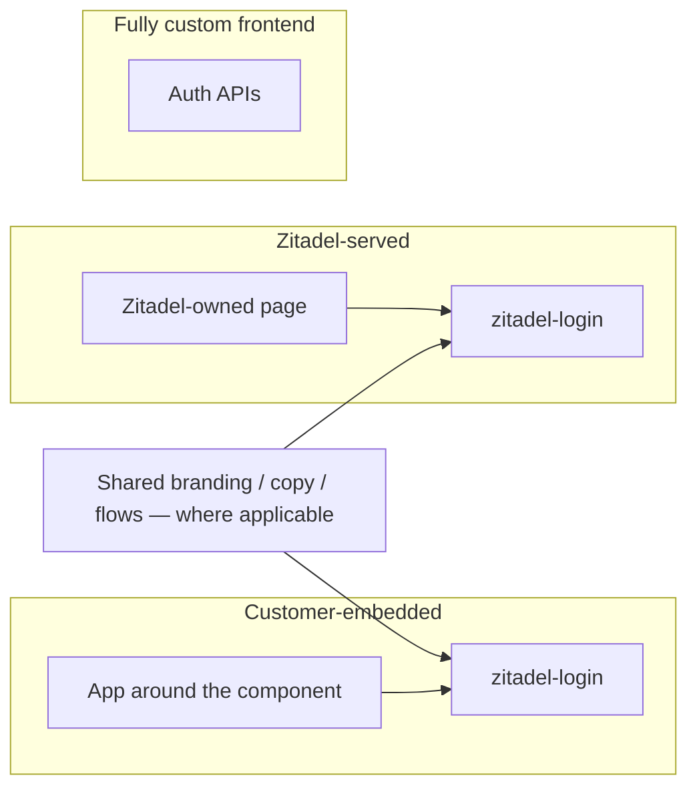
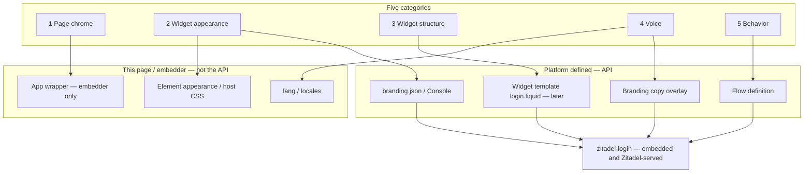
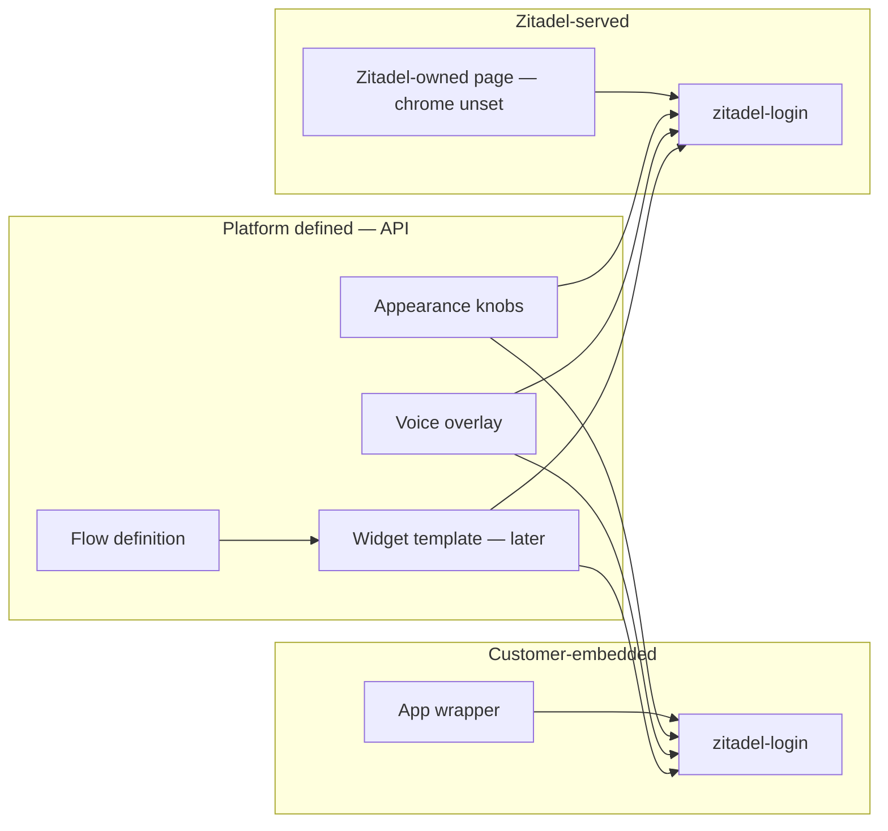
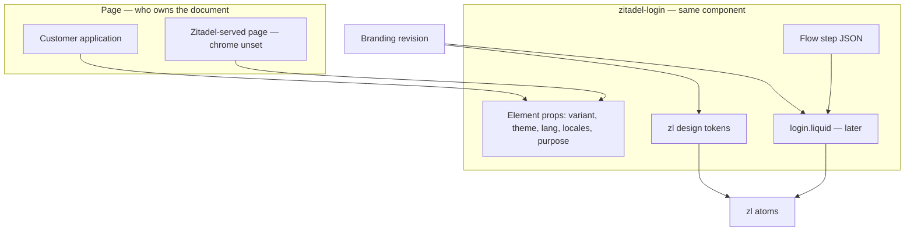

# Login Customization Strategy

> **Status:** Proposed
> **Date:** 2026-08-28
> **Audience:** Product, design, and engineering deciding *where* a login
> customization lives — not the token catalogue or Liquid grammar.
> **Product context:** [#678](https://github.com/zitadel/nextgen/issues/678)
> (vision), [#936](https://github.com/zitadel/nextgen/issues/936) (first
> iteration), vision doc landing in
> [#1034](https://github.com/zitadel/nextgen/pull/1034)
> **Decisions:** [ADR 056](../../adrs/056-login-customization-categories.md)
> **Implements:** [`templates.md`](templates.md), [`schema.md`](schema.md),
> [`tokens.md`](tokens.md), [`override-ladder.md`](override-ladder.md),
> [ADR 040](../../adrs/040-tenant-login-templates-editable-config.md),
> [ADR 044](../../adrs/044-scaffold-embedding-posture-defaults.md),
> [ADR 045](../../adrs/045-copy-overlays-as-branding-revisions.md)

This is the engineering **placement map** under the product vision in #678.
It does not define a required journey from embedded login to Zitadel-served
login. Customers pick a presentation model; they can change it later; they
do not have to.

Nextgen ships one login component — `<zitadel-login>` plus the `<zl-*>`
atoms — and three ways to put authentication in front of a user. The
product goal is **total customizability** without dumping every kind of
change into one editor, one JSON blob, or one Liquid file. This document
names the customization categories, the surface each one is authored on,
what the first iteration ships, and what stays later or unset.

## Thesis

Customizability is a placement problem, not a missing-knob problem.

A customer who wants a 1:1 split page with marketing copy on the left is
editing **their application**. A customer who wants rounder buttons is
turning a **convenience knob** on the widget. A customer who wants a legal
disclaimer between the password field and the submit button is editing the
**widget template**. Those three changes look similar in a screenshot and
are different products: different authors, different publish paths, different
failure modes.

The strategy is: **give every change exactly one home.** Where a look must
travel with the project, embedded and Zitadel-served login read the same
project-scoped resource (branding, copy, flows, and later widget structure).
That reuse is optional sharing, not a ladder one model must climb to reach
the next.

## Three presentation models

From [#678](https://github.com/zitadel/nextgen/issues/678). These are
**choices**, not stages.

| Model | Zitadel provides | Customer controls |
| --- | --- | --- |
| **Customer-embedded login** | `<zitadel-login>`, journeys, security controls | The application around the component, and supported component customisation |
| **Zitadel-served login** | A complete standalone login (today `/ui/login/`) | Supported branding, content, and authentication configuration. Page-level customisation is **not defined yet** |
| **Fully custom frontend** | Authentication APIs, policies, backend enforcement | The complete frontend |

"Self-hosted" is overloaded. Keep this axis separate from the models:

| Axis | Values | What it decides |
| --- | --- | --- |
| **Presentation model** | Embedded · Zitadel-served · Fully custom | Who presents the login UI |
| **Zitadel runtime** | Cloud · customer-operated server | Where the API and (optionally) `/ui/login/` run |

A customer-operated Zitadel server can still embed the widget. A cloud
project can still use Zitadel-served login. The runtime axis does not move
a knob from one category to another. “Zitadel-served” means who presents
the page, not who operates the server.



Fully custom does not render `<zitadel-login>`. Shared branding does not
apply there.

### First iteration vs later

[#936](https://github.com/zitadel/nextgen/issues/936) is the first
**branding** milestone: project appearance settings for working embedded
components. It is **not** this whole map, and it is **not** the voice
setting.

Voice is a different setting (copy overlays, [ADR 045](../../adrs/045-copy-overlays-as-branding-revisions.md)).
It must not live in the appearance editor. #936's write-up currently lists
"authentication content" in the same ticket; this strategy treats that as
a separate setting and a separate follow-up under #678.

| Area | First iteration | Later / unset |
| --- | --- | --- |
| **Appearance (branding settings)** | Supported brand assets, colours, typography inside the embedded components. Console in #936 | More knobs; typed `appearance` sugar |
| **Voice** | Out of this iteration. Different setting | Copy overlays for supported keys; then full localisation |
| **Surrounding application** | Customer-owned. Not customised in #936 | CLI may stop applying a template at setup (follow-up) |
| **Structure** (`login.liquid`) | Out of scope | Advanced, opt-in, shared with Zitadel-served |
| **Behaviour** | Login flows; not edited in branding settings | Unchanged ownership |
| **Zitadel-served login** | Separate milestone | First served ship is a polished default + reused branding. Advanced page chrome unset |
| **Fully custom frontend** | Not included | Supported APIs and responsibility split |
| **Branding door** | Console appearance settings (#936). Host CSS remains the page-local path | Code-based `branding.json` remains valid; CLI-to-Console handoff is out of #936 |

Do not lock branding to a CLI `setup → apply → hosted` path. Setup gets
authentication working. #936 is where a customer opens **branding
settings** for already working embedded components.

## Categories

Five categories. The first three are the ones a screenshot usually
conflates. Voice and behaviour must stay out of the appearance
(branding) settings.

| # | Category | What the customer is changing | One-line home | Horizon |
| --- | --- | --- | --- | --- |
| 1 | **Page chrome** | How the login sits on the *page*: split, centered, left-pane content | Embedder: app wrapper. Zitadel-served: **unset** (a `page.liquid` + `login_widget` hole is one proposed later direction) | Embedder: now (their app). Served page chrome: later |
| 2 | **Widget appearance** | Convenience look *inside* the widget: radii, colors, density, theme, logo | **Branding settings** — tokens / `branding.json` / element `appearance` | **First iteration (#936)** |
| 3 | **Widget structure** | What sits *between the atoms*: disclaimer, grouping | **Widget template** (`login.liquid`) — embedded and Zitadel-served | **Later** |
| 4 | **Voice** | Wording, locale overlays | **Voice setting** — copy overlays; element `locales` / `lang` | **Separate setting**, not #936 |
| 5 | **Behavior** | Which steps, fields, factors exist | Flow definition — not an appearance surface | Already owned by flows |

**Why "widget template" at all.** The Liquid file inside the widget is
**advanced structure**: `<zl-*>` against the step payload, no page chrome.
It is shared by embedded and Zitadel-served login because they render the
same component. It is not a setup default and not part of #936.

**"Page template" is not a decision.** Zitadel-served page chrome has no
chosen artifact yet. `page.liquid` with a `login_widget` hole is a
*proposal* for a later milestone, after the first Zitadel-served login
ships as a polished standalone page. Embedder wrappers are application
code, never that file.

Page-local knobs (host CSS, `lang` / `locales`, the embedder wrapper) never
enter the API. Project appearance, voice, flows, and later widget structure
are **platform defined**: the same resources the Branding API and Flow API
expose, whether the customer authors them as `.zitadel/` files, Console
settings, or HTTP.





## What would change

Nothing in these tables is implemented by this PR. Follow-up issues will
own the CLI and structure work; #936 owns the first visual loop.

### First iteration — branding settings (#936)

| Surface | Today | First iteration |
| --- | --- | --- |
| Branding settings | Host CSS + proposed branding JSON; no Console appearance loop | Console: logo, colours, typography, theme on working embedded components. Preview, validate, publish, restore |
| Project look | Optional `branding.json` via CLI | Same branding resource. One appearance customisation applies project-wide across the journeys #936 lists |
| Surrounding application | Customer-owned | Still customer-owned. Not edited here |
| Voice | Built-in dictionaries; optional element `locales` | **Different setting.** Not this iteration |

### Follow-up — stop setup from applying a template

File separately under #678. Not part of #936 (onboarding is out of scope there).

| Surface | Today | Follow-up |
| --- | --- | --- |
| `zitadel setup --design` / wizard | Writes `.zitadel/branding/login.liquid` and publishes branding revision 1. Generated auth page is still a bare `<zitadel-login>` | Setup embeds the maintained component only. Writes **no** Liquid, publishes **no** branding revision. Optional look pick, if kept, writes **app files** only |
| Embedder who wants a left pane | Ejects Liquid and edits marketing copy inside the sanitiser | Edits their application |

### Later — widget structure

| Surface | Today | Later |
| --- | --- | --- |
| `zitadel branding eject --design` | Catalog of five Liquid files that mix page chrome with the form card | Ejects the **widget template** only — bundled default card. No split/hero in this catalog |
| Shared widget structure (disclaimer) | Same eject path, starting files are page layouts | Opt-in `login.liquid` from the default card. Embedded **and** Zitadel-served |

### Proposed / unset — Zitadel-served page chrome

| Surface | Today | Status |
| --- | --- | --- |
| `/ui/login/` | `variant="page"` shell; any split comes from a widget-internal design | First Zitadel-served ship: polished default + reused appearance/voice. Advanced page chrome **unset**. `page.liquid` + `login_widget` is a proposal, not a requirement |
| Already-ejected split/hero revisions | Render today | Keep rendering. Legacy path |

### 1. Page chrome

Page chrome is everything **outside** `<zitadel-login>`.

The running example: a 1:1 split layout, login on the right, customer content
on the left (product screenshot, value prop, legal, a campaign). That left
pane is not a Zitadel atom and must not be authored as Liquid inside the
widget. It is a wrapping element the customer owns:

```tsx
<section className="grid min-h-svh grid-cols-2">
  <aside>{/* their content — copy, image, nav */}</aside>
  <zitadel-login variant="widget" purpose="login" />
</section>
```

`variant="widget"` is the contract that makes this honest: the widget is
content-sized and does not paint page chrome of its own
([ADR 044](../../adrs/044-scaffold-embedding-posture-defaults.md)).
`variant="page"` is the other posture — a dedicated login route that *is*
the page, used by fresh scaffolds and by today's hosted shell.

**Embedded.** Authored in the customer's application. New-app setup may
leave a starting page the customer then edits; existing apps place the
component in their layout
([ADR 042](../../adrs/042-scaffolded-file-ownership-and-drift-detection.md)).
Those files are not Zitadel templates.

**Zitadel-served.** There is no customer application file. The first
Zitadel-served milestone is a polished standalone page plus reused
branding and content — not advanced page-level customisation
([#678](https://github.com/zitadel/nextgen/issues/678)). How customers
later customise that page is **unset**.

One later proposal (not a requirement): a Liquid document with a
`login_widget` hole, so the rest of the file can be the customer's page
under the same sanitiser family as widget Liquid. If that lands, catalog
*names* (`centered`, `split`, `hero`) could match embedder wrappers; the
artifact would still not be `login.liquid`. Embedders would never author
it.

```liquid
<main class="page">
  <aside>
    
    <h1>Ship faster with a real session.</h1>
  </aside>
  <section>
    
  </section>
</main>
```

Until that is decided, `/ui/login/` stays a `variant="page"` shell. Do
not grow new widget-internal splits as a stand-in.

### 2. Widget appearance

Convenience knobs that restyle the atoms without reordering them: button
and input radius, palette, density, light/dark, logo, typography scale.

These are `--zl-*` tokens plus a small structured branding shape
([`schema.md`](schema.md) `palette` / `shape` / `typography` / `theme`,
[`tokens.md`](tokens.md)). Customers should never have to write Liquid to
round a corner.

Two authoring surfaces, same tokens:

| Author | Surface | When to use it |
| --- | --- | --- |
| Embedder, this page only | JS/CSS on `<zitadel-login>` — `theme`, `variant`, host CSS `--zl-radius-md`, `::part()` | Match the host app *right now*, no publish |
| Project (every surface) | Branding revision — `.zitadel/branding/branding.json` via CLI, or Console settings | Zitadel-served login, a second app, or a designer who should not touch the repo |

Host-page tokens beat server-side branding
([`override-ladder.md`](override-ladder.md)). That is intentional: an
embedded login should be able to inherit the app's design system without a
round-trip. Leave the host tokens unset and the project branding applies
unchanged — which is what Zitadel-served login does, because that page is
not a customer design system of its own.

The same object, three doors — all compile to `--zl-*`:

```html
<zitadel-login
  variant="widget"
  theme="light"
  appearance='{
    "logo_url": "https://cdn.acme.com/logo.svg",
    "palette": { "primary": "#4F46E5", "on_primary": "#FFFFFF" },
    "shape": { "radius": "lg", "density": "comfortable" },
    "typography": { "font_family": "Inter, ui-sans-serif, sans-serif" },
    "chrome": "card"
  }'
></zitadel-login>
```

```css
zitadel-login {
  --zl-radius-md: 0.75rem;
  --zl-radius-xl: 1.25rem;
  --zl-color-primary: #4F46E5;
  --zl-font-family: Inter, ui-sans-serif, sans-serif;
}
```

```json
{
  "logo_url": "https://cdn.acme.com/logo.svg",
  "palette": { "primary": "#4F46E5", "on_primary": "#FFFFFF" },
  "shape": { "radius": "lg", "density": "regular" },
  "typography": { "font_family": "Inter, ui-sans-serif, sans-serif" },
  "theme": { "mode": "dark" }
}
```

| Knob | Values | Effect |
| --- | --- | --- |
| `palette.primary` / `on_primary` | CSS color | CTA, focus ring |
| `palette.background` / `surface` / `text` / `border` | CSS color | page vs card |
| `shape.radius` | `none` \| `sm` \| `md` \| `lg` \| `full` | `--zl-radius-*` scale |
| `shape.density` | `compact` \| `regular` \| `comfortable` | control height + gaps |
| `typography.font_family` | CSS stack | type (optional heading/mono) |
| `theme.mode` | `light` \| `dark` \| `auto` | `data-theme` |
| `logo_url` | HTTPS URL | mark in the widget header |
| `chrome` | `card` \| `plain` | card on/off (`minimal` without a template) |

A typed `appearance` property on the element is sugar over this shape, not
a third vocabulary. `theme`, `variant`, `lang`, `locales`, `purpose` stay
page-local element facts. Host CSS still beats the project object.

### 3. Widget structure

Everything that lives **between the atoms** and is still *inside* the
widget: field order and grouping, a disclaimer under the password field, a
"or continue with" divider, footer legal links, a compact header.

That is the **widget template** — `branding.liquid_template`, authored as
`.zitadel/branding/login.liquid`. Scope is **structure only**: compose
`<zl-*>` against the step payload; do not set colors; do not wrap the
page ([`templates.md`](templates.md)). Because the same widget runs in
the customer app and on Zitadel-served login, this file is shared — and
must stay strict. Loosening it for a served left pane would also loosen
every embed.

A disclaimer belongs here because it is step-aware (show it on `password`,
not on `mfa_totp`), should survive Zitadel-served login, and is not
host-page content. A marketing essay on the left of a split does **not**.

**Later, not setup, not #936.** Opt-in when it ships. `zitadel branding
eject` copies the bundled default card into `login.liquid`; `plan` /
`apply` publishes a revision
([ADR 040](../../adrs/040-tenant-login-templates-editable-config.md)).
Setup must not write this file. Console may later grow a block editor
that emits the same validator. Split/hero must not re-enter this catalog.

### 4. Voice

User-facing strings. A **different setting** from branding appearance —
not fields on the #936 branding screen, even if copy later travels on the
same branding revision for publish
([ADR 045](../../adrs/045-copy-overlays-as-branding-revisions.md)).

- **Project voice** — copy overlays. CLI and Console write this setting;
  the flow response delivers the effective overlay.
- **This page only** — `lang` and `locales` on `<zitadel-login>`
  ([ADR 018](../../adrs/018-widget-owned-locale-resolution.md)). Highest
  precedence; for embedders who need a one-off override.

Templates keep using `text_key` and `| t`. Hard-coded copy in Liquid is a
smell except for chrome the dictionary has no key for yet.

### 5. Behavior

Which identifier the user types, whether passkey is offered, what happens
after register — that is the **flow definition**
(`.zitadel/flows/`, Console flow editor). Appearance surfaces must not grow
"hide the SSO row" or "add a phone field" switches. Those are flow edits.
The template renders whatever the step payload contains; it does not decide
the payload.

## Where each category lives

Same component, two presentation models that render it. Fully custom is
out of this table.

| Category | Customer-embedded | Zitadel-served | Shared source of truth |
| --- | --- | --- | --- |
| **Page chrome** | App around the component. Not a Zitadel template. | Unset. First served ship is a polished default. `page.liquid` is a later proposal only. | *None shared.* Different documents. |
| **Widget appearance** | Branding settings: `appearance` / host CSS / `theme`. Optional `branding.json`. Console in #936. | Same object when that milestone reuses branding. | Branding revision when the look must follow the project. |
| **Widget structure** | Later: opt-in **widget template** from the bundled default. | Same file / later block editor. | `branding.liquid_template` — both models, strict scope, **later**. |
| **Voice** | `lang` / `locales` on the element. Copy overlays later (ADR 045). | Same voice setting when it ships. | Copy overlay resource; element `locales` remains the embedder override. Not the branding-settings screen. |
| **Behavior** | `.zitadel/flows/*.json` via plan/apply. | Console flow editor. | Flow definition (release-pinned per [ADR 035](../../adrs/035-configuration-environments.md)). |



### Self-hosters of the widget, in practice

"JS configuration of `zitadel-login`" means the **element API** plus the
host stylesheet, not a second configuration file format:

- **Properties / attributes** — `variant`, `theme`, `purpose`, `lang`,
  `locales`, `post-sign-in-url`, project handle. Page-local.
- **CSS custom properties** on `zitadel-login` — the appearance knobs for
  this page.
- **`::part()`** — surgical restyle of an atom interior
  ([`override-ladder.md`](override-ladder.md) tier 2).
-   **Project branding** — still the path that Zitadel-served login and
  other apps will see. Embedders who only set host CSS have customized
  *this page*; they have not customized the project.

### Operators of Zitadel-served login, in practice

"Settings within the platform" means Console (and the Branding API) for
project-scoped appearance, voice, and flows. The first served milestone
does not add a page-chrome editor. If a later page-chrome artifact exists,
embedders never see it — they have an application.

## How customers customise (not a ladder)

Three doors. A customer picks one model and can change later. None of
these paths is a prerequisite for the others.

### Customer-embedded

1. Get authentication working — new app starting page, or drop the
   component into an existing layout
   ([ADR 044](../../adrs/044-scaffold-embedding-posture-defaults.md)).
2. **First iteration (#936):** open **branding settings** for those
   working components. Appearance only — preview, publish, restore.
   Voice is a different setting.
3. Page chrome stays in the application. Host CSS / element props remain
   the no-publish path for "match this page."
4. **Later:** opt-in widget structure (`login.liquid`) if something must
   sit between atoms.
5. Behaviour stays on the flow definition.

Setup is only step 1. Today's `setup --design` that ejects Liquid and
publishes branding revision 1 is the behavior a **follow-up issue**
retires; see
[What the shipped designs really are](#what-the-shipped-designs-really-are).

### Zitadel-served

A separate choice: SSO, third-party or legacy apps, or a centrally
operated login. First ship: polished standalone page, configure journeys,
apply supported branding and content, reuse compatible embedded
configuration where applicable. Advanced page customisation is a later
capability and is not required for that ship.

### Fully custom frontend

APIs, policies, backend enforcement. The customer owns the UI. This is a
presentation model, not an eject footnote at the end of the embed path.

When knobs, parts, and (later) Liquid are not enough *inside* an embed,
customers can still compose `<zl-*>` by hand or eject an atom
([`override-ladder.md`](override-ladder.md) tier 4). That is embedded
escape, not the fully custom model.

Under [ADR 035](../../adrs/035-configuration-environments.md), branding and
flows become release-pinned. This strategy does not change that boundary.

## What the shipped designs really are

ADR 040 shipped five named Liquid files under
`packages/config/defaults/branding/*/login.liquid`. `setup --design` and
`branding eject --design` copy one of them into `.zitadel/branding/` and
publish it as branding revision 1. The generated auth page is still just
`<zitadel-login>` — the "design" never becomes a wrapper. An audit of
those files:

| Design | What differs from the bundled `default.liquid` | Category it actually is |
| --- | --- | --- |
| `centered` | Nothing. Drift-tested copy of the bundled default. | The widget itself. Ejecting it only materializes a file the customer did not need yet. |
| `minimal` | Same field/action/passkey/gates loop; drops `<zl-card>` and the logo slot; wraps in `.zl-minimal`. | A thin widget-chrome variant (card off). Could be a host class or a future `chrome` knob; it is not a page layout. |
| `split` | Same card, wrapped in `.zl-split` with a brand `<aside>` (`logo_url` / `hero_url` / gradient placeholder), a compact mark for narrow containers, and an attribution anchor. | **Page chrome.** A 1:1 split whose left pane is an asset, not product UI. |
| `split-right` | `split` plus `zl-split--right`. | The same page chrome, mirrored. |
| `hero` | Same card, plus a landing-page left pane (nav, headline, bullets, footnote) whose own comment says "YOUR LANDING CONTENT — everything inside this aside is yours." | **Page chrome**, and the loudest proof: the template invites you to edit marketing copy inside a sandboxed Liquid string. |

The form wiring (~160 lines) is copy-pasted five times. The only real
payload of `split` / `split-right` / `hero` is a grid and a left pane.
The CSS that paints that grid (`layout-chrome.css`: `.zl-split*`,
`.zl-hero*`) lives in the orchestrator shadow root *because* the chrome
was stuffed into Liquid.

**They are not worth keeping as widget templates for embedders.** An
embedder who wants a split already has a better tool — their application.
Saving the split as `login.liquid` costs them a branding revision, a
sanitiser, a five-way template fork, and a left pane they cannot fill
with real React/Vue. Setup should leave the widget on the bundled default
and must not publish those files. A follow-up may still offer a look pick
that writes **application** files only.

`minimal` is the one catalog entry that is not page chrome. Keep the
idea (card-less widget) as a future appearance/chrome knob or as the
starting point of an opt-in eject. Do not keep it as a reason to ship
four page layouts as Liquid.

Already-ejected revisions keep rendering. This is direction, not a
runtime break.

### Zitadel-served page chrome is unset

The widget template stays strict so it can be shared later. Page chrome
for Zitadel-served login is a **separate, later** question. A Liquid page
around a `login_widget` hole is one proposal; it is not the first served
milestone and not a product requirement yet.

| Who | How they get a split / hero / centered page |
| --- | --- |
| Embedder | Their application. Widget stays the default card. |
| Zitadel-served | First ship: polished default. Advanced page chrome TBD. |

### Vocabulary after this shift

| Term | Meaning |
| --- | --- |
| **Widget template** | Advanced widget structure (`login.liquid`). Strict scope: `<zl-*>` + step payload. Shared by embedded and Zitadel-served. **Later**, not setup, not #936. |
| **Page template** | Proposed later Liquid document (`page.liquid`) with a `login_widget` hole for Zitadel-served page chrome. **Unset.** Not a requirement. |
| **Wrapper** | Embedder application code around the widget. Not a Zitadel template. |
| **Design** | Retired as the setup noun. Historical Liquid starting points; no longer the path to a look. |
| **Layout** | Wire degrade enum `centered \| split` for an invalid/missing *template*. Not how you get a split page. |
| **Branding** | Project resource for appearance, optional (later) widget template, assets, and copy. Not page chrome. |
| **Zitadel-served login** | Zitadel presents the page (`/ui/login/` today). Alias: hosted login. Independent of Cloud vs customer-operated server. |

## What we will not do

- **One mega-editor** that paints the page wrapper, the tokens, and the
  atom order as a single artifact. The publish paths and trust boundaries
  differ.
- **`advanced.custom_css` as the customization surface.** Rejected in
  [`schema.md`](schema.md); the override ladder covers CSS.
- **Treat the three models as a ladder.** Embedded, Zitadel-served, and
  fully custom are choices. There is no required "grow into hosted" path.
- **Lock branding settings to a CLI-led journey.** #936 is Console
  appearance settings for working embedded components. Setup only gets
  login working.
- **Put voice in the branding-settings editor.** Copy is a different
  setting. #936 lists "authentication content" today; do not take that as
  one combined first-iteration screen.
- **Page chrome inside the widget template.** That file is shared later
  and must stay structure-only. Embedder page chrome lives in the app.
  Zitadel-served page chrome is unset.
- **Appearance switches that change the flow** ("add phone", "hide SSO").
  Those are flow-definition edits.
- **A second branding model for Zitadel-served login.** Same revision,
  same widget, where reuse applies. Different page owner.
- **Requiring `apply` to restyle one embedded page.** Host CSS and element
  properties exist so embedders can match an app without a config release.
- **Keep shipping split/hero as Liquid so embedders can skip writing a
  wrapper.** Those files *are* wrappers, poorly placed.
- **Decide `page.liquid` in this PR.** First Zitadel-served login does not
  need advanced page customisation. That artifact stays a proposal.
- **Put structure or setup-template work in #936.** Onboarding and
  CLI-to-Console handoff are out of scope there.

## Rollout

Matches #678's delivery direction, with #936 as the first visual ticket.

| Stage | What customers can do | Ticket |
| --- | --- | --- |
| **Now (shipped)** | `setup --design` still ejects widget Liquid; `/ui/login/` is a `page`-variant shell | Behavior to retire from setup, not the destination |
| **First iteration** | Console **branding settings** (appearance) on working embedded components; preview / publish / restore | [#936](https://github.com/zitadel/nextgen/issues/936) |
| **Voice setting** | Copy overlays for supported keys. Different Console setting from branding | Follow-up under #678. #936 currently lists content in the same ticket; this map splits it |
| **Follow-up** | Setup embeds the maintained component only. No Liquid, no branding revision 1. `branding eject` stays opt-in for later structure | New issue under #678 (not filed in this PR) |
| **Later** | Widget structure (`login.liquid`) from the default card; shared with Zitadel-served | New issue under #678 |
| **Zitadel-served login** | Polished standalone page; branding/content reuse; no advanced page chrome required | #678 follow-up |
| **Zitadel-served customisation** | Define and deliver served-page customisation | #678 follow-up; `page.liquid` only if that work chooses it |

## Open questions

1. **Zitadel-served page chrome artifact.** Unset. If a later milestone
   wants Liquid around the widget, does `page.liquid` grow a `.zitadel/`
   dialect so `plan`/`apply` can pin it, or is Console-only enough?
2. **Page-chrome sanitiser vs widget-template sanitiser** — only if a
   page-chrome artifact is chosen. Same family (no script, no handlers)
   is the starting assumption; allowlists TBD.
3. **`minimal` as a knob vs an eject starting point.** Card-less chrome is
   the one shipped design that is not a page layout. Appearance knob
   (`chrome: card \| plain`) is simpler for embedders; eject still covers
   anyone who wants to delete more than the card.
4. **Attribution / powered-by** — still open in [`README.md`](README.md).
   Treat it as widget chrome (category 3 or a policy flag), not page
   chrome.
5. **Migration of already-ejected split/hero revisions.** They keep
   working. Do we later offer a one-shot "move this left pane into your
   app wrapper" helper, or leave them as a supported legacy render path?

## See also

- [#678 Customise the authentication experience](https://github.com/zitadel/nextgen/issues/678) —
  product vision and presentation models
- [#936 Visually customise and preview the embedded login components](https://github.com/zitadel/nextgen/issues/936) —
  first iteration
- [#1034 vision doc](https://github.com/zitadel/nextgen/pull/1034) —
  landing `authentication-experience-vision.md`
- [ADR 056](../../adrs/056-login-customization-categories.md) — the
  decision record for these categories
- [`templates.md`](templates.md) — Liquid scope, shipped designs, eject
  workflow
- [`schema.md`](schema.md) / [`tokens.md`](tokens.md) — appearance knobs
- [`override-ladder.md`](override-ladder.md) — tokens → parts → slots →
  eject
- [ADR 040](../../adrs/040-tenant-login-templates-editable-config.md) —
  branding as editable config
- [ADR 044](../../adrs/044-scaffold-embedding-posture-defaults.md) —
  `page` vs `widget` posture
- [`../platform/README.md`](../platform/README.md) — integration levels
- [`../../quick-start/login-ui.md`](../../quick-start/login-ui.md) —
  today's `/ui/login/` shell
