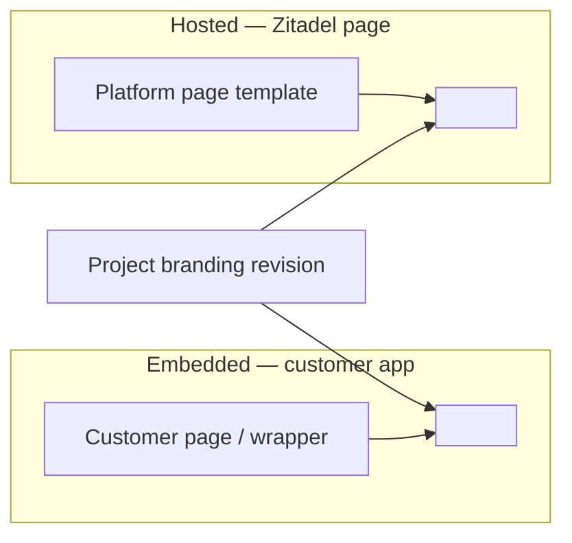
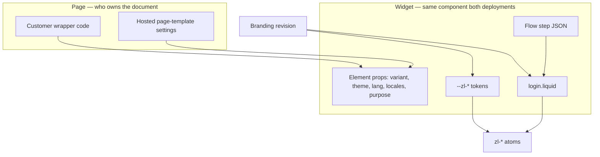
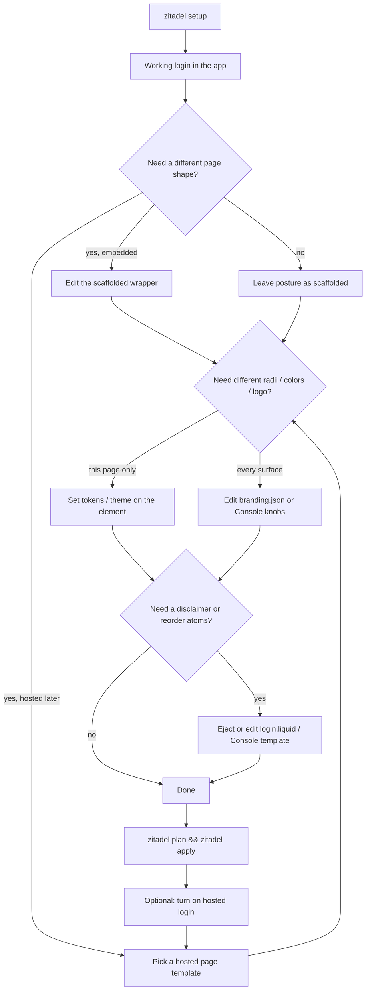

# Login Customization Strategy

> **Status:** Proposed
> **Date:** 2026-08-27
> **Audience:** Product, design, and engineering deciding *where* a login
> customization lives — not the token catalogue or Liquid grammar.
> **Decisions:** [ADR 056](../../adrs/056-login-customization-categories.md)
> **Implements:** [`templates.md`](templates.md), [`schema.md`](schema.md),
> [`tokens.md`](tokens.md), [`override-ladder.md`](override-ladder.md),
> [ADR 040](../../adrs/040-tenant-login-templates-editable-config.md),
> [ADR 044](../../adrs/044-scaffold-embedding-posture-defaults.md),
> [ADR 045](../../adrs/045-copy-overlays-as-branding-revisions.md)

Nextgen ships one login surface — `<zitadel-login>` plus the `<zl-*>` atoms —
and two ways to put it in front of a user. The product goal is **total
customizability** without dumping every kind of change into one editor, one
JSON blob, or one Liquid file. This document names the customization
categories, the surface each one is authored on, and the journey a customer
takes from first embed to hosted SSO.

## Thesis

Customizability is a placement problem, not a missing-knob problem.

A customer who wants a 1:1 split page with marketing copy on the left is
editing **their application**. A customer who wants rounder buttons is
turning a **convenience knob** on the widget. A customer who wants a legal
disclaimer between the password field and the submit button is editing the
**widget template**. Those three changes look similar in a screenshot and
are different products: different authors, different publish paths, different
failure modes.

The strategy is: **give every change exactly one home, then make the two
deployments (embedded and hosted) read the same project-scoped home whenever
the look must travel with the project.**

## Two orthogonal deployments

"Self-hosted" is overloaded in this repo. Keep these axes separate.

| Axis | Values | What it decides |
| --- | --- | --- |
| **Login placement** | **Embedded** in the customer application · **Hosted** by Zitadel | Who owns the HTML page around `<zitadel-login>` |
| **Zitadel runtime** | Cloud · customer-operated server | Where the API and (optionally) `/ui/login/` run |

This document is about **login placement**. A customer-operated Zitadel
server can still embed the widget in the app, and a cloud project can still
use hosted login later. The runtime axis does not move a knob from one
category to another.

### Embedded login (ships now)

The customer application renders `<zitadel-login>` on a route, in a modal, or
in a card. The CLI (`zitadel setup`) bootstraps the app, installs the SDK,
and drops the widget onto a generated auth page. The customer owns the
document, the layout around the widget, and the deploy of that page.

This is the default path and the only path that can offer *absolute*
page-level freedom: arbitrary React/Vue/HTML around the widget, the host
design system, and framework routing.

### Hosted login (later, SSO)

Zitadel serves the login page — today the bootstrap shell at `/ui/login/`,
later a first-class hosted login on a customer-chosen domain for OIDC/SAML
SSO. The same `<zitadel-login>` runs inside a **Zitadel-owned page**. There
is no customer application to wrap, so page chrome that embedders write in
code must be expressible as **platform settings**.

Hosted login is how a customer offers SSO to apps they do not embed the
widget in. It is not a second renderer and not a second branding model.



## Categories

Five categories. The first three are the ones a screenshot usually
conflates. The last two are adjacent and must stay out of the appearance
editors.

| # | Category | What the customer is changing | One-line home |
| --- | --- | --- | --- |
| 1 | **Page chrome** | How the login sits on the *page*: split, centered, modal, left-pane content | Customer app code, or a hosted page template |
| 2 | **Widget appearance** | Convenience look *inside* the widget: radii, colors, density, theme, logo | Tokens / branding knobs / element properties |
| 3 | **Widget structure** | What sits *between the atoms*: disclaimer, grouping, extra chrome | Liquid template (`login.liquid`) |
| 4 | **Voice** | Wording, locale overlays | Branding copy + `locales` / `lang` |
| 5 | **Behavior** | Which steps, fields, factors exist | Flow definition — not an appearance surface |

### 1. Page chrome

Page chrome is everything **outside** `<zitadel-login>`.

The running example: a 1:1 split layout, login on the right, customer content
on the left (product screenshot, value prop, legal, a campaign). That left
pane is not a Zitadel atom and must not be authored as Liquid inside the
widget. It is a wrapping element the customer owns:

```tsx
<section className="grid min-h-svh grid-cols-2">
  <aside>{/* their content — copy, image, nav */}</aside>
  <zitadel-login variant="widget" purpose="login" />
</section>
```

`variant="widget"` is the contract that makes this honest: the widget is
content-sized and does not paint page chrome of its own
([ADR 044](../../adrs/044-scaffold-embedding-posture-defaults.md)).
`variant="page"` is the other posture — a dedicated login route that *is*
the page, used by fresh scaffolds and by today's hosted shell.

**Embedded.** Authored in the customer's application. The CLI may scaffold a
*page template* (centered full page, split-left, split-right, modal host) as
ordinary framework files the customer then edits. Those files are
presentation-owned ([ADR 042](../../adrs/042-scaffolded-file-ownership-and-drift-detection.md)):
once edited, they stay the customer's.

**Hosted.** There is no application file to edit. The platform offers the
same page-template catalog as **settings**: pick `split`, put markdown/HTML
(or an image URL) in the left slot, set the split ratio. The hosted shell
renders that wrapper and drops `<zitadel-login variant="widget">` into the
form pane. Until that catalog ships, `/ui/login/` is a `variant="page"`
shell and any split comes from a widget-internal design (see
[Coexistence with shipped designs](#coexistence-with-shipped-designs)).

Page chrome is the only category that is **not** stored on the branding
revision for embedders. Promoting a wrapper into branding would either
sandbox customer HTML (too weak) or execute it on every hosted request (too
dangerous). Hosted page templates are a *constrained* equivalent of the
wrapper, not a dump of the customer's React tree.

### 2. Widget appearance

Convenience knobs that restyle the atoms without reordering them: button
and input radius, palette, density, light/dark, logo, typography scale.

These are `--zl-*` tokens plus a small structured branding shape
([`schema.md`](schema.md) `palette` / `shape` / `typography` / `theme`,
[`tokens.md`](tokens.md)). Customers should never have to write Liquid to
round a corner.

Two authoring surfaces, same tokens:

| Author | Surface | When to use it |
| --- | --- | --- |
| Embedder, this page only | JS/CSS on `<zitadel-login>` — `theme`, `variant`, host CSS `--zl-radius-md`, `::part()` | Match the host app *right now*, no publish |
| Project (every surface) | Branding revision — `.zitadel/branding/branding.json` via CLI, or Console settings | Hosted login, a second app, or a designer who should not touch the repo |

Host-page tokens beat server-side branding
([`override-ladder.md`](override-ladder.md)). That is intentional: an
embedded login should be able to inherit the app's design system without a
round-trip. Leave the host tokens unset and the project branding applies
unchanged — which is what hosted login does, because the hosted shell is
not a design system of its own.

Do **not** grow a parallel "widget options" JSON on the element for
everything `branding.json` already names. Element properties stay for
*page-local* facts the host knows better than the project (`theme`,
`variant`, `lang`, `locales`, `purpose`). Project-wide appearance stays on
the branding resource.

### 3. Widget structure

Everything that lives **between the atoms** and is still *inside* the
widget: field order and grouping, a disclaimer under the password field, a
"or continue with" divider, footer legal links, a compact header.

That is the Liquid template (`branding.liquid_template`, authored as
`.zitadel/branding/login.liquid`). Templates compose `<zl-*>` tags against
the step payload; they do not set colors and they do not wrap the page
([`templates.md`](templates.md)).

A disclaimer belongs here because it is step-aware (show it on `password`,
not on `mfa_totp`), must survive hosted login, and is not host-page
content. A marketing essay on the left of a split does **not** belong here.

**Embedded.** `zitadel branding eject --design <name>` (or `setup --design`)
writes the files; the customer edits Liquid; `zitadel plan` / `zitadel apply`
publishes an immutable revision ([ADR 040](../../adrs/040-tenant-login-templates-editable-config.md)).

**Hosted.** The same revision. Console grows a design picker and, later, a
block editor that emits Liquid through the same validator. There is no
second template dialect for hosted login.

### 4. Voice

User-facing strings. Built-in dictionaries plus overlays.

- **Project voice** — copy overlays on the branding revision
  ([ADR 045](../../adrs/045-copy-overlays-as-branding-revisions.md)). CLI
  and Console write the same resource; the flow response delivers the
  effective overlay.
- **This page only** — `lang` and `locales` on `<zitadel-login>`
  ([ADR 018](../../adrs/018-widget-owned-locale-resolution.md)). Highest
  precedence; for embedders who need a one-off override.

Templates keep using `text_key` and `| t`. Hard-coded copy in Liquid is a
smell except for chrome the dictionary has no key for yet.

### 5. Behavior

Which identifier the user types, whether passkey is offered, what happens
after register — that is the **flow definition**
(`.zitadel/flows/`, Console flow editor). Appearance surfaces must not grow
"hide the SSO row" or "add a phone field" switches. Those are flow edits.
The template renders whatever the step payload contains; it does not decide
the payload.

## Where each category lives

The same change, two deployments.

| Category | Embedded (customer application) | Hosted login (platform) | Shared source of truth |
| --- | --- | --- | --- |
| **Page chrome** | Wrapper / route in the app. CLI scaffolds a page template; the customer edits it as code. | Page-template setting + content slots (split pane, hero image, markdown). Rendered by the hosted shell. | *None for embedders.* Hosted settings are the hosted shell's config, not branding. |
| **Widget appearance** | (a) Host CSS / `theme` / `variant` on the element. (b) `.zitadel/branding/branding.json` published with `apply`. | Console branding settings (radius, palette, logo, density, theme). | Branding revision — used whenever the look must follow the project. |
| **Widget structure** | `.zitadel/branding/login.liquid` via eject → edit → apply. | Console design picker / later block editor. | `branding.liquid_template` on the same revision. |
| **Voice** | `lang` / `locales` on the element; branding copy overlays via CLI. | Console copy editor. | Branding copy overlay; element `locales` remains the embedder override. |
| **Behavior** | `.zitadel/flows/*.json` via plan/apply. | Console flow editor. | Flow definition (release-pinned per [ADR 035](../../adrs/035-configuration-environments.md)). |



### Self-hosters of the widget, in practice

"JS configuration of `zitadel-login`" means the **element API** plus the
host stylesheet, not a second configuration file format:

- **Properties / attributes** — `variant`, `theme`, `purpose`, `lang`,
  `locales`, `post-sign-in-url`, project handle. Page-local.
- **CSS custom properties** on `zitadel-login` — the appearance knobs for
  this page.
- **`::part()`** — surgical restyle of an atom interior
  ([`override-ladder.md`](override-ladder.md) tier 2).
- **Project branding** — still the path that hosted login and other apps
  will see. Embedders who only set host CSS have customized *this page*;
  they have not customized the project.

A later typed `appearance` property on the element (radius, density) is
welcome as sugar over the same tokens. It must serialize to `--zl-*` / the
branding shape, not introduce a third vocabulary.

### Operators of hosted login, in practice

"Settings within the platform" means Console (and the Branding API behind
it) for every category that is project-scoped, plus a **page-template**
panel that only the hosted shell reads. Embedders never need that panel.
Hosted operators never need to eject a Next.js file to get a split page.

## The journey

One golden path. Appearance and structure fork only when the customer needs
them; page chrome forks immediately because the two deployments own
different documents.



### 1. Bootstrap

`zitadel setup` detects the framework, creates the project, installs the
SDK, and embeds `<zitadel-login>`.

- Fresh app → `variant="page"` (the generated route *is* the login page).
- Existing app, route-based frameworks → `variant="widget"` in a
  layout-neutral wrapper ([ADR 044](../../adrs/044-scaffold-embedding-posture-defaults.md)).
- Optional `--design` / wizard pick ejects a **widget** design into
  `.zitadel/branding/` and publishes revision 1. That pick is category 3
  (and the shipped convenience chrome in
  [Coexistence with shipped designs](#coexistence-with-shipped-designs)),
  not a substitute for editing the wrapper.

The setup summary already points at the `.zitadel/` entry points (schema,
flow, branding). Page chrome is pointed at by the generated auth file
itself — that is the file to wrap.

### 2. Verify

Sign in once. `zitadel status` withholds customize/publish guidance until
login works. Customizing a template you have never seen succeed hides
whether the failure is chrome or the flow.

### 3. Customize, cheapest first

1. **Page** — change the wrapper (or, later, the hosted page template).
   Put the campaign on the left. Do not eject Liquid for this.
2. **Appearance** — host tokens for "match my app"; branding knobs for
   "match my brand everywhere."
3. **Structure** — eject the template when something must sit *between*
   atoms or the shipped grouping is wrong.
4. **Voice** — overlay copy; keep `text_key` in the template.
5. **Behavior** — edit the flow definition when the *step* is wrong.

### 4. Publish

`zitadel plan` then `zitadel apply` uploads the project-scoped artifacts
(branding revision, flow, schema). The wrapper is an app deploy, not an
`apply`. Hosted page-template settings are a platform write, not a repo
file, until a GitOps home is added for them (open question below).

Under [ADR 035](../../adrs/035-configuration-environments.md), branding and
flows become release-pinned. The inner loop stays ceremony-free on
dev-class environments (local preview of Liquid; release-per-save). This
strategy does not change that boundary.

### 5. Grow into hosted login

Turning on hosted login for SSO must **not** ask the customer to restyle
the widget. Categories 2–5 already live on project resources. The only
new choice is category 1: pick a hosted page template and fill its slots
(or accept `variant="page"` centered chrome).

Embedders who already built a rich wrapper keep it for the in-app login.
Hosted SSO gets the constrained page template. Both render the same
widget against the same branding revision.

### 6. Escape hatches (embedded only)

When knobs, parts, and Liquid are not enough:

- Compose `<zl-*>` atoms by hand (lose the orchestrator, keep the design
  system).
- Eject an atom (`npx zitadel add zl-field`) and own the source
  ([`override-ladder.md`](override-ladder.md) tier 4).

Hosted login does not offer eject: there is no customer repo to land
source in. Customers who need that level move the SSO-facing login back
to an embedded page or wait for a richer template/part.

## Coexistence with shipped designs

Today `centered`, `split`, `split-right`, `hero`, and `minimal` are
**widget designs**: full Liquid files whose `layout` degrade target is
`centered | split` ([ADR 040](../../adrs/040-tenant-login-templates-editable-config.md),
[`templates.md`](templates.md)). `hero`'s left pane is token-styled
template chrome, not a customer React tree.

That catalog stays. It is the right answer when:

- the customer wants a split *without* writing a wrapper (fresh
  `variant="page"` scaffold, hosted login before page-template settings
  exist);
- the left pane is brand furniture (logo, `hero_url`, short headline), not
  application content.

It is the **wrong** answer when the left pane is arbitrary product UI.
Those customers use page chrome (category 1) and a compact widget design
(`centered` / `minimal`) on the right.

Vocabulary, aligned with [`../glossary.md`](../glossary.md) § 6:

| Term | Meaning after this strategy |
| --- | --- |
| **Page template** | Catalog starting point for *page chrome* — a wrapper in the app, or a hosted shell layout. |
| **Design** | Catalog starting point that produces a *widget* Liquid template. Unchanged. |
| **Layout** | Wire degrade enum `centered \| split` for invalid/missing templates. Unchanged. |
| **Template** | The Liquid artifact inside the widget. Unchanged. |
| **Branding** | The project resource that carries appearance, template, assets, and copy. Unchanged. |

The CLI may later ask two questions at setup — page template and widget
design — instead of one. Until then, `--design split` remains a
widget-internal split, which is still the fastest way to get that look on
a `variant="page"` route.

## What we will not do

- **One mega-editor** that paints the page wrapper, the tokens, and the
  atom order as a single artifact. The publish paths and trust boundaries
  differ.
- **`advanced.custom_css` as the customization surface.** Rejected in
  [`schema.md`](schema.md); the override ladder covers CSS.
- **Customer HTML inside Liquid for page chrome.** Templates are sandboxed
  on purpose ([`../flowengine/template-security.md`](../flowengine/template-security.md)).
  Page-level content stays in the app or in a hosted slot with its own
  allowlist.
- **Appearance switches that change the flow** ("add phone", "hide SSO").
  Those are flow-definition edits.
- **A second branding model for hosted login.** Same revision, same
  widget, different page owner.
- **Requiring `apply` to restyle one embedded page.** Host CSS and element
  properties exist so embedders can match an app without a config release.

## Rollout

| Stage | What customers can do | Notes |
| --- | --- | --- |
| **Now** | Embed via CLI; host CSS / element props; branding eject for designs and Liquid; `variant` postures; `/ui/login/` as a `page`-variant shell | Categories 2–5 have a path. Category 1 is "edit the generated page." |
| **Next** | Document and scaffold explicit *page templates* as wrapper files (split-left, split-right, centered, modal) distinct from `--design` | Unblocks the "content on the left" story without overloading Liquid. |
| **Hosted login** | Page-template settings + content slots on the hosted shell; Console knobs for appearance, design picker, copy | Categories 2–5 already apply. Category 1 gets a platform home. |
| **Later** | Block editor that emits Liquid (same validator); structured branding knobs in Console; GitOps for hosted page-template settings if wanted | Editor stages in [`templates.md`](templates.md). |

## Open questions

1. **GitOps for hosted page templates.** Embedder wrappers live in the app
   repo. Hosted slots are platform settings. Should they also grow a
   `.zitadel/` dialect so `plan`/`apply` can pin them in a release, or is
   Console-only enough because they are hosted-shell config?
2. **How much HTML a hosted left pane accepts.** Markdown + image URL is
   the safe default. A small allowlisted HTML subset is the next step.
   Arbitrary scripts are out.
3. **Whether `--design split` eventually scaffolds a page wrapper** instead
   of (or as well as) a widget-internal split, once page templates exist.
   Recommendation: keep `--design` on the widget; add `--page-template`
   (or a second wizard question) for the wrapper.
4. **Attribution / powered-by** — still open in [`README.md`](README.md).
   Treat it as widget chrome (category 3 or a policy flag), not page
   chrome.

## See also

- [ADR 056](../../adrs/056-login-customization-categories.md) — the
  decision record for these categories
- [`templates.md`](templates.md) — Liquid scope, shipped designs, eject
  workflow
- [`schema.md`](schema.md) / [`tokens.md`](tokens.md) — appearance knobs
- [`override-ladder.md`](override-ladder.md) — tokens → parts → slots →
  eject
- [ADR 040](../../adrs/040-tenant-login-templates-editable-config.md) —
  branding as editable config
- [ADR 044](../../adrs/044-scaffold-embedding-posture-defaults.md) —
  `page` vs `widget` posture
- [`../platform/README.md`](../platform/README.md) — integration levels
  (embedded MVP, hosted login deferred)
- [`../../quick-start/login-ui.md`](../../quick-start/login-ui.md) —
  today's hosted shell
